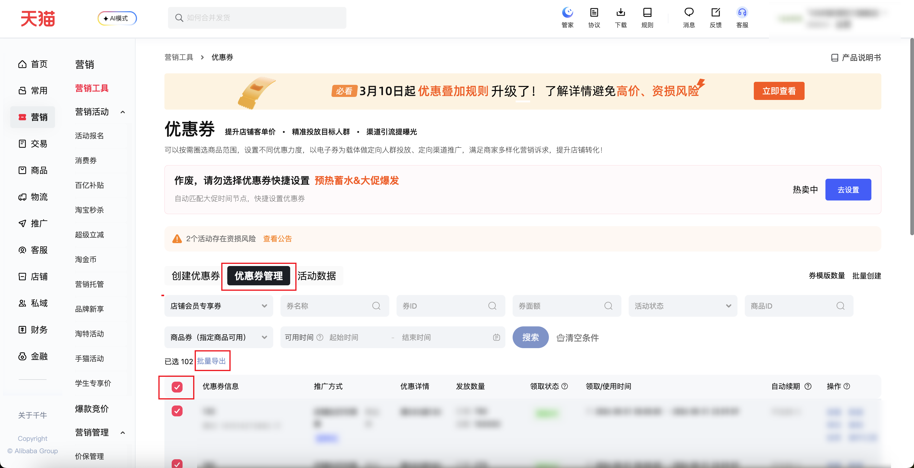

| 属性             | 值                                                                                         |
| ---------------- | ------------------------------------------------------------------------------------------ |
| **连接器类型**   | `RPA 连接器`                                                                               |
| **连接器名称**   | `ODS_营销优惠券商品明细报表(千牛RPA)`                                                      |
| **连接器代码**   | `rpa.conn.qianniu.marketing.coupon.item.report`                                            |
| **操作类型**     | `文件导出`                                                                                 |
| **目标网页**     | `https://qn.taobao.com/home.htm/coupon?isFirst=true&isNew=true&defaultTab=itemCouponList`   |
| **适用场景**     | 按推广方式、商品生效范围、可用时间等条件，从优惠券管理批量导出商品明细报表                 |
| **数据表名**     | `ods_rpa_qianniu_marketing_coupon_item_report_du`                                          |
| **业务表名**     | `ODS_营销优惠券商品明细报表(千牛RPA)`                                                      |

### 目标页面

> **取数路径**：千牛后台—营销—营销工具—优惠券—优惠券管理
>
> **取数链接**：[https://qn.taobao.com/home.htm/coupon?isFirst=true&isNew=true&defaultTab=itemCouponList](https://qn.taobao.com/home.htm/coupon?isFirst=true&isNew=true&defaultTab=itemCouponList)



### 业务入参

| 字段 | 中文释义 | 数据类型 | 必填 | 默认值 | 说明 |
| ---- | -------- | -------- | ---- | ------ | ---- |
| `promote_type` | 推广方式 | `String` | 否 | `SHOP_MEMBER` | 英文 code；可选值：`ALL`（全部）、`AUTO_PROMOTE`（全网自动推广）、`GENERAL_LINK`（通用领券链接）、`LIVE_CHANNEL`（淘宝直播渠道优惠券）、`SHOP_MEMBER`（店铺会员专享券）、`RETURN_CUSTOMER`（回头客券）、`RIGHTS_PLATFORM`（权益营销平台券）、`FOLLOW_SHOP`（关注店铺优惠券）。连接器会映射为页面中文文案后精确匹配；页面无对应选项时失败软退出（`reason=promote_type_not_found`），并通过 `available_promote_types` 返回页面全部可选推广方式 |
| `item_scope` | 商品生效范围 | `String` | 否 | `ITEM_COUPON` | 可选值：`ITEM_COUPON`（商品券（指定商品可用））、`SHOP_COUPON`（店铺券（全店可用）） |
| `custom_start_date` | 可用开始日期 | `String` | 否 | —（不限） | 格式：`YYYYMMDD` 或 `YYYY-MM-DD`；与 `custom_end_date` 均未传时不填页面可用时间筛选；起止须同时传入 |
| `custom_end_date` | 可用结束日期 | `String` | 否 | —（不限） | 格式：`YYYYMMDD` 或 `YYYY-MM-DD`；与 `custom_start_date` 均未传时不填页面可用时间筛选；起止须同时传入；不能早于可用开始日期 |
| `coupon_name` | 券名称 | `String` | 否 | 空字符串 | 按券名称筛选 |
| `coupon_id` | 券 ID | `String` | 否 | 空字符串 | 按券 ID 筛选；有值时须为纯数字 |
| `coupon_amount` | 券面额 | `String` | 否 | 空字符串 | 按券面额筛选 |
| `item_id` | 商品 ID | `String` | 否 | 空字符串 | 按商品 ID 筛选；有值时须为纯数字 |

### 入参样例

使用全部默认条件（推广方式默认 `SHOP_MEMBER`、商品生效范围默认 `ITEM_COUPON`、可用时间不限）：

```json
{}
```

指定推广方式与可用时间范围：

```json
{
  "promote_type": "SHOP_MEMBER",
  "item_scope": "ITEM_COUPON",
  "custom_start_date": "20260801",
  "custom_end_date": "20260831"
}
```

按券 ID、券名称等文本条件精确筛选：

```json
{
  "promote_type": "SHOP_MEMBER",
  "item_scope": "ITEM_COUPON",
  "custom_start_date": "20260801",
  "custom_end_date": "20260831",
  "coupon_id": "141505776476",
  "coupon_name": "10",
  "coupon_amount": "10",
  "item_id": ""
}
```

### 入参校验

```json-schema collapsed
{
  "$schema": "https://json-schema.org/draft/2020-12/schema",
  "title": "千牛-营销优惠券管理商品明细报表 - 查询入参",
  "description": "按推广方式、商品生效范围、可用时间等条件，从优惠券管理批量导出商品明细报表",
  "type": "object",
  "properties": {
    "promote_type": {
      "type": "string",
      "description": "推广方式英文 code，映射为页面中文后精确匹配；页面无对应选项时失败软退出，并返回 available_promote_types",
      "enum": [
        "ALL",
        "AUTO_PROMOTE",
        "GENERAL_LINK",
        "LIVE_CHANNEL",
        "SHOP_MEMBER",
        "RETURN_CUSTOMER",
        "RIGHTS_PLATFORM",
        "FOLLOW_SHOP"
      ],
      "default": "SHOP_MEMBER"
    },
    "item_scope": {
      "type": "string",
      "description": "商品生效范围",
      "enum": [
        "ITEM_COUPON",
        "SHOP_COUPON"
      ],
      "default": "ITEM_COUPON"
    },
    "custom_start_date": {
      "type": "string",
      "description": "可用开始日期，格式 YYYYMMDD 或 YYYY-MM-DD；与结束日期均未传时不填页面；须与 custom_end_date 成对传入",
      "pattern": "^(?:\\d{8}|\\d{4}-\\d{2}-\\d{2})$"
    },
    "custom_end_date": {
      "type": "string",
      "description": "可用结束日期，格式 YYYYMMDD 或 YYYY-MM-DD；与开始日期均未传时不填页面；须与 custom_start_date 成对传入，且不能早于开始日期",
      "pattern": "^(?:\\d{8}|\\d{4}-\\d{2}-\\d{2})$"
    },
    "coupon_name": {
      "type": "string",
      "description": "用于筛选的券名称",
      "default": ""
    },
    "coupon_id": {
      "type": "string",
      "description": "用于筛选的券 ID；有值时须为纯数字",
      "pattern": "^\\d*$",
      "default": ""
    },
    "coupon_amount": {
      "type": "string",
      "description": "用于筛选的券面额",
      "default": ""
    },
    "item_id": {
      "type": "string",
      "description": "用于筛选的商品 ID；有值时须为纯数字",
      "pattern": "^\\d*$",
      "default": ""
    }
  },
  "required": [],
  "dependentRequired": {
    "custom_start_date": ["custom_end_date"],
    "custom_end_date": ["custom_start_date"]
  },
  "additionalProperties": false
}
```

### 数据字段

| 字段 | 中文释义 | 数据类型 | 可为空 | 取数路径 | 示例 |
| ---- | -------- | -------- | ------ | -------- | ---- |
| `seqNo` | 序号 | `String` | 否 | `XLSX.0.序号` | `1` |
| `couponName` | 券名称 | `String` | 否 | `XLSX.0.券名称` | `10` |
| `couponTemplateId` | 券模版 ID | `String` | 否 | `XLSX.0.券模版ID` | `141****476` (已脱敏) |
| `promoteType` | 推广方式 | `String` | 否 | `XLSX.0.推广方式` | `店铺会员专享券` |
| `status` | 状态 | `String` | 否 | `XLSX.0.状态` | `领取中` |
| `discountAmount` | 优惠金额 | `String` | 否 | `XLSX.0.优惠金额` | `满100减10` |
| `applyCount` | 领取量 | `String` | 否 | `XLSX.0.领取量` | `436` |
| `totalCount` | 发放量 | `String` | 否 | `XLSX.0.发放量` | `100000` |
| `personLimit` | 每人限领 | `String` | 否 | `XLSX.0.每人限领` | `5` |
| `exposeTime` | 透出时间 | `String` | 是 | `XLSX.0.透出时间` | `--` |
| `useTime` | 使用时间 | `String` | 否 | `XLSX.0.使用时间` | `起：2026-08-01 00:00:00 止：2026-08-31 23:59:59` |
| `itemIds` | 圈品 ID | `String` | 是 | `XLSX.0.圈品ID` | `871****490;880****827;104****718` (已脱敏) |
| `itemIdsCont1` | 圈品 ID（续 1） | `String` | 是 | `XLSX.0.圈品ID(续1)` | `null` |
| `itemIdsCont2` | 圈品 ID（续 2） | `String` | 是 | `XLSX.0.圈品ID(续2)` | `null` |
| `itemIdsCont3` | 圈品 ID（续 3） | `String` | 是 | `XLSX.0.圈品ID(续3)` | `null` |
| `taskId` | 任务 ID | `String` | 否 | 附加 | `dev****2a1` (已脱敏) |
| `bizDate` | 业务日期 | `String` | 否 | 附加 | `20260820` |
| `accountId` | 授权 ID | `String` | 否 | 附加 | `1****6` (已脱敏) |

### 数据样例

```json
[
  {
    "seqNo": "1",
    "couponName": "10",
    "couponTemplateId": "141****476",
    "promoteType": "店铺会员专享券",
    "status": "领取中",
    "discountAmount": "满100减10",
    "applyCount": "436",
    "totalCount": "100000",
    "personLimit": "5",
    "exposeTime": "--",
    "useTime": "起：2026-08-01 00:00:00\n止：2026-08-31 23:59:59",
    "itemIds": "871****490;880****827;104****718;871****504;887****187;888****546;104****218;106****027;870****329;106****603;871****701;891****870;881****675;880****460;888****267;841****832;820****104;860****715;104****601;870****581;871****725;759****145;103****825;887****519;881****859;105****928;890****833",
    "itemIdsCont1": null,
    "itemIdsCont2": null,
    "itemIdsCont3": null,
    "bizDate": "20260820",
    "accountId": "1****6",
    "taskId": "dev****2a1"
  }
]
```

---
