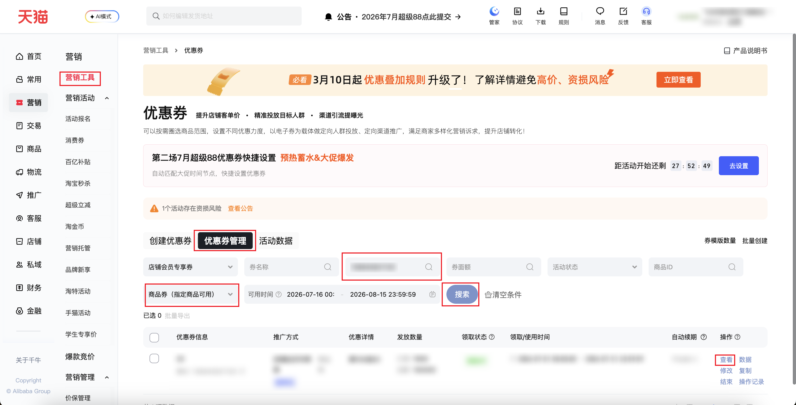
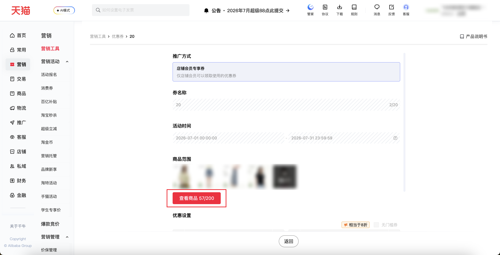

| 属性             | 值                                                                                              |
| ---------------- | ----------------------------------------------------------------------------------------------- |
| **连接器类型**   | `RPA 连接器`                                                                                    |
| **连接器名称**   | `ODS_营销优惠券已选商品列表(千牛RPA)`                                                           |
| **连接器代码**   | `rpa.conn.qianniu.marketing.coupon.item.selected.list`                                          |
| **操作类型**     | `页面解析`                                                                                      |
| **目标网页**     | `https://qn.taobao.com/home.htm/coupon?isFirst=true&isNew=true&defaultTab=itemCouponList`        |
| **适用场景**     | 按券 ID 定位优惠券并采集券详情中的已选商品列表，适用于核对优惠券适用商品及商品状态              |
| **数据表名**     | `ods_rpa_qianniu_marketing_coupon_item_selected_list_du`                                        |
| **业务表名**     | `ODS_营销优惠券已选商品列表(千牛RPA)`                                                           |

### 目标页面

> **取数路径**：千牛后台—营销—营销工具—优惠券—优惠券管理—券详情—查看商品—已选商品
>
> **取数链接**：[https://qn.taobao.com/home.htm/coupon?isFirst=true&isNew=true&defaultTab=itemCouponList](https://qn.taobao.com/home.htm/coupon?isFirst=true&isNew=true&defaultTab=itemCouponList)





### 业务入参

| 字段 | 中文释义 | 数据类型 | 必填 | 默认值 | 说明 |
| ---- | -------- | -------- | ---- | ------ | ---- |
| `coupon_id` | 券 ID | `String` | 是 | — | 用于搜索并定位目标优惠券，不可为空 |
| `promote_type` | 推广方式 | `String` | 否 | `店铺会员专享券` | 按页面推广方式名称进行包含匹配，且须唯一匹配；没有匹配项或匹配到多个选项时任务失败软退出 |
| `item_scope` | 商品生效范围 | `String` | 否 | `ITEM_COUPON` | 可选值：`ITEM_COUPON`（商品券，指定商品可用）、`SHOP_COUPON`（店铺券，全店可用） |
| `custom_start_date` | 可用开始日期 | `String` | 否 | 当天 | 格式：`YYYYMMDD` 或 `YYYY-MM-DD` |
| `custom_end_date` | 可用结束日期 | `String` | 否 | 开始日期后 30 日 | 格式：`YYYYMMDD` 或 `YYYY-MM-DD`；不能早于可用开始日期 |
| `coupon_name` | 券名称 | `String` | 否 | 空字符串 | 按券名称筛选 |
| `coupon_amount` | 券面额 | `String` | 否 | 空字符串 | 按券面额筛选 |
| `item_id` | 商品 ID | `String` | 否 | 空字符串 | 按商品 ID 筛选 |

### 入参样例

仅传必填券 ID（其余筛选项走默认）：

```json
{
  "coupon_id": "138940200949"
}
```

指定推广方式、商品生效范围与可用时间：

```json
{
  "coupon_id": "138940200949",
  "promote_type": "店铺会员专享券",
  "item_scope": "ITEM_COUPON",
  "custom_start_date": "20260701",
  "custom_end_date": "20260731"
}
```

叠加券名称、券面额、商品 ID 等文本筛选：

```json
{
  "coupon_id": "138940200949",
  "promote_type": "店铺会员专享券",
  "item_scope": "ITEM_COUPON",
  "custom_start_date": "20260701",
  "custom_end_date": "20260731",
  "coupon_name": "220",
  "coupon_amount": "220",
  "item_id": "1034567890123"
}
```

### 入参校验

```json-schema collapsed
{
  "$schema": "https://json-schema.org/draft/2020-12/schema",
  "title": "千牛-营销优惠券已选商品列表 - 查询入参",
  "description": "按券 ID 定位优惠券并采集券详情中的已选商品列表，适用于核对优惠券适用商品及商品状态",
  "type": "object",
  "properties": {
    "coupon_id": {
      "type": "string",
      "description": "用于搜索并定位目标优惠券，不可为空",
      "minLength": 1
    },
    "promote_type": {
      "type": "string",
      "description": "推广方式，按页面推广方式名称进行包含匹配且须唯一匹配",
      "default": "店铺会员专享券"
    },
    "item_scope": {
      "type": "string",
      "description": "商品生效范围",
      "enum": [
        "ITEM_COUPON",
        "SHOP_COUPON"
      ],
      "default": "ITEM_COUPON"
    },
    "custom_start_date": {
      "type": "string",
      "description": "可用开始日期，未提供时默认为任务执行当天，格式为 YYYYMMDD 或 YYYY-MM-DD",
      "pattern": "^(?:\\d{8}|\\d{4}-\\d{2}-\\d{2})$"
    },
    "custom_end_date": {
      "type": "string",
      "description": "可用结束日期，未提供时默认为开始日期后 30 日，格式为 YYYYMMDD 或 YYYY-MM-DD，且不能早于开始日期",
      "pattern": "^(?:\\d{8}|\\d{4}-\\d{2}-\\d{2})$"
    },
    "coupon_name": {
      "type": "string",
      "description": "用于筛选的券名称",
      "default": ""
    },
    "coupon_amount": {
      "type": "string",
      "description": "用于筛选的券面额",
      "default": ""
    },
    "item_id": {
      "type": "string",
      "description": "用于筛选的商品 ID",
      "default": ""
    }
  },
  "required": [
    "coupon_id"
  ],
  "additionalProperties": false
}
```

### 数据字段

| 字段 | 中文释义 | 数据类型 | 可为空 | 取数路径 | 示例 |
| ---- | -------- | -------- | ------ | -------- | ---- |
| `sellerId` | 卖家 ID | `Number` | 否 | 页面解析 | `215****896` (已脱敏) |
| `itemId` | 商品 ID | `Number` | 否 | 页面解析 | `103****446` (已脱敏) |
| `storeId` | 店铺 ID | `Number` | 是 | 页面解析 | `null` |
| `itemCode` | 商品编码 | `String` | 否 | 页面解析 | `FD6****054` (已脱敏) |
| `title` | 商品标题 | `String` | 否 | 页面解析 | 飞鸟和****闲上衣 (已脱敏) |
| `categoryId` | 商品类目 ID | `Number` | 否 | 页面解析 | `500****671` (已脱敏) |
| `detailUrl` | 商品详情链接 | `String` | 否 | 页面解析 | `//item.taobao.com/****` (已脱敏) |
| `showPrice` | 页面展示价格（元） | `String` | 否 | 页面解析 | `429.00` |
| `itemPictureUrl` | 商品图片链接 | `String` | 否 | 页面解析 | `//img.alicdn.com/****` (已脱敏) |
| `price` | 商品价格（分） | `Number` | 否 | 页面解析 | `42900` |
| `priceYuan` | 商品价格（元） | `Number` | 否 | 页面解析 | `429.0` |
| `quantity` | 商品数量 | `Number` | 否 | 页面解析 | `1` |
| `salesIn30Days` | 近 30 天销量 | `Number` | 否 | 页面解析 | `0` |
| `selected` | 是否已选 | `Boolean` | 否 | 页面解析 | `true` |
| `invalid` | 是否失效 | `Boolean` | 是 | 页面解析 | `null` |
| `invalidReason` | 失效原因 | `String` | 是 | 页面解析 | `null` |
| `disabled` | 是否不可选 | `Boolean` | 否 | 页面解析 | `false` |
| `disabledReason` | 不可选原因 | `String` | 是 | 页面解析 | `null` |
| `modifiedTime` | 商品修改时间戳 | `Number` | 否 | 页面解析 | `1783614609000` |
| `status` | 商品状态代码 | `Number` | 否 | 页面解析 | `0` |
| `description` | 商品描述 | `String` | 是 | 页面解析 | `null` |
| `mainItemTotalSoldQuantity` | 主商品累计销量 | `Number` | 是 | 页面解析 | `null` |
| `starts` | 活动开始时间戳 | `Number` | 否 | 页面解析 | `1775051706000` |
| `ends` | 活动结束时间戳 | `Number` | 否 | 页面解析 | `1776261306000` |
| `subTitle` | 商品副标题 | `String` | 是 | 页面解析 | `null` |
| `couponPriceYuan` | 券后价格（元） | `Number` | 是 | 页面解析 | `null` |
| `lightShopItemUrl` | 轻店商品链接 | `String` | 是 | 页面解析 | `null` |
| `hasRisk` | 是否存在商品风险 | `Boolean` | 否 | 页面解析 | `false` |
| `itemRiskDTO` | 商品风险信息 | `Dict` | 是 | 页面解析 | `null` |
| `taskId` | 任务 ID | `String` | 否 | 附加 | `dev****466` (已脱敏) |
| `bizDate` | 业务日期 | `String` | 否 | 附加 | `20260716` |
| `accountId` | 授权 ID | `String` | 否 | 附加 | `1****6` (已脱敏) |

### 数据样例

```json
[
  {
    "sellerId": "215****896",
    "itemId": "103****446",
    "storeId": null,
    "itemCode": "FD6****054",
    "title": "飞鸟和****闲上衣",
    "categoryId": "500****671",
    "detailUrl": "//item.taobao.com/****",
    "showPrice": "429.00",
    "itemPictureUrl": "//img.alicdn.com/****",
    "price": 42900,
    "priceYuan": 429.0,
    "quantity": 1,
    "salesIn30Days": 0,
    "selected": true,
    "invalid": null,
    "invalidReason": null,
    "disabled": false,
    "disabledReason": null,
    "modifiedTime": 1783614609000,
    "status": 0,
    "description": null,
    "mainItemTotalSoldQuantity": null,
    "starts": 1775051706000,
    "ends": 1776261306000,
    "subTitle": null,
    "couponPriceYuan": null,
    "lightShopItemUrl": null,
    "hasRisk": false,
    "itemRiskDTO": null,
    "taskId": "dev****466",
    "bizDate": "20260716",
    "accountId": "1****6"
  }
]
```

---
