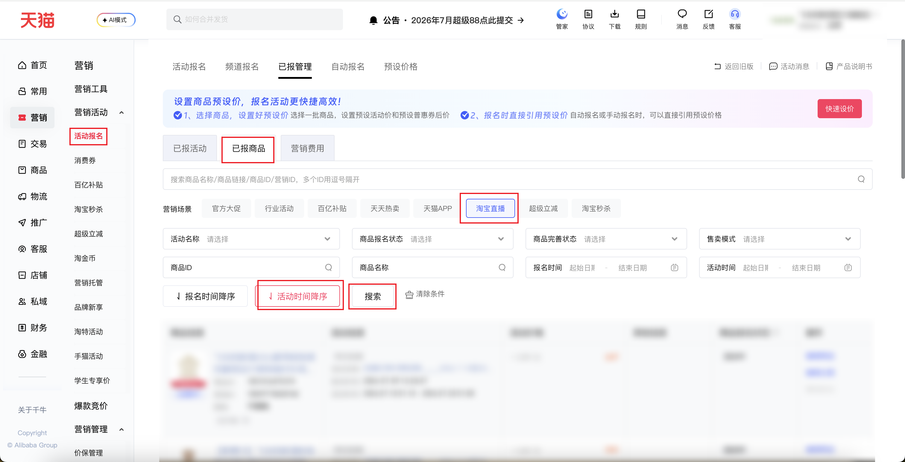

| 属性             | 值                                                                                                      |
| ---------------- | ------------------------------------------------------------------------------------------------------- |
| **连接器类型**   | `RPA 连接器`                                                                                            |
| **连接器名称**   | `ODS_营销活动报名已报商品列表(千牛RPA)`                                                                 |
| **连接器代码**   | `rpa.conn.qianniu.marketing.tmc.registered.item.list`                                                   |
| **操作类型**     | `页面解析`                                                                                              |
| **目标网页**     | `https://qn.taobao.com/home.htm/starb/tmc-next/sale/seller/homepage.htm?tab=item`                       |
| **适用场景**     | 按筛选条件采集千牛活动报名「已报商品」列表，营销场景固定淘宝直播；支持商品报名状态、完善状态、售卖模式及活动/报名时间等筛选，最多翻页 100 页 |
| **数据表名**     | `ods_rpa_qianniu_marketing_tmc_registered_item_list_du`                                                 |
| **业务表名**     | `ODS_营销活动报名已报商品列表(千牛RPA)`                                                                 |

### 目标页面

> **取数路径**：千牛后台—营销—活动报名—已报管理—已报商品
>
> **取数链接**：[https://qn.taobao.com/home.htm/starb/tmc-next/sale/seller/homepage.htm?tab=item](https://qn.taobao.com/home.htm/starb/tmc-next/sale/seller/homepage.htm?tab=item)



### 业务入参

| 字段 | 中文释义 | 数据类型 | 必填 | 默认值 | 说明 |
| ---- | -------- | -------- | ---- | ------ | ---- |
| `registration_status` | 商品报名状态 | `String` | 否 | — | 可选值：`DRAFT`（草稿）、`PENDING_REVIEW`（待审核）、`UNDER_REVIEW`（审核中）、`REVIEW_REJECTED`（审核不通过）、`REVIEW_PASSED`（审核通过(初审通过)）、`CANCELLED`（撤销报名）、`SCHEDULE_PENDING`（排期待确认）、`SCHEDULED`（已排期待发布(终审通过)）、`ABNORMAL`（异常）、`PUBLISHED`（已发布设定）、`IN_ACTIVITY`（活动中）、`ACTIVITY_ENDED`（活动结束）、`REMOVED`（清退） |
| `completion_status` | 商品完善状态 | `String` | 否 | — | 可选值：`COMPLETED`（已完善）、`INCOMPLETE`（待完善） |
| `sales_mode` | 售卖模式 | `String` | 否 | — | 可选值：`DEFAULT`（默认）、`PLAY`（玩法）、`MATERIAL`（素材）、`SHOP`（店铺）、`SPOT`（现货商品）、`PRESALE`（预售商品） |
| `item_id` | 商品 ID | `String` | 否 | — | 精确匹配商品 ID |
| `item_name` | 商品名称 | `String` | 否 | — | 模糊匹配商品名称 |
| `custom_activity_start_date` | 活动开始日期 | `String` | 否 | 当日 | 格式 `YYYYMMDD` 或 `YYYY-MM-DD`；与 `custom_activity_end_date` 均未传时，默认当日 |
| `custom_activity_end_date` | 活动结束日期 | `String` | 否 | 当日起未来 30 日 | 格式 `YYYYMMDD` 或 `YYYY-MM-DD`；与 `custom_activity_start_date` 均未传时，默认当日起未来 30 日 |
| `custom_sign_start_date` | 报名开始日期 | `String` | 否 | 当日 | 格式 `YYYYMMDD` 或 `YYYY-MM-DD`；与 `custom_sign_end_date` 均未传时，默认当日 |
| `custom_sign_end_date` | 报名结束日期 | `String` | 否 | 当日起未来 30 日 | 格式 `YYYYMMDD` 或 `YYYY-MM-DD`；与 `custom_sign_start_date` 均未传时，默认当日起未来 30 日 |

### 入参样例

> **通用说明**
>
> - 所有入参均为**可选**；不传任何筛选项时，连接器仍会固定选择营销场景「淘宝直播」、排序「活动时间降序」，并将活动时间、报名时间默认填为**当日 ~ 未来 30 日**后搜索。
> - `item_id`、`item_name` 传空字符串 `""` 或不传，效果相同，均表示不按该条件筛选。
> - 日期字段支持 `YYYYMMDD`（如 `20260714`）或 `YYYY-MM-DD`（如 `2026-07-14`）两种格式；仅传开始或结束日期之一时，另一端沿用对应默认值。
> - 营销场景「淘宝直播」为页面固定选项，**不可**通过入参修改。

**场景 1：常用组合筛选（枚举各取第一项，商品 ID 留空）**

适用于日常巡检：已发布设定 + 已完善 + 默认售卖模式，不限定具体商品。

```json
{
  "registration_status": "PUBLISHED",
  "completion_status": "COMPLETED",
  "sales_mode": "DEFAULT"
}
```

**场景 2：按商品 ID 精准查询**

仅查单个已报商品；其它筛选项不传，日期走默认范围。

```json
{
  "item_id": "908269******"
}
```

**场景 3：活动中且待完善的商品**

排查活动进行中但素材/信息尚未完善的报名记录。

```json
{
  "registration_status": "IN_ACTIVITY",
  "completion_status": "INCOMPLETE"
}
```

**场景 4：按商品名称模糊搜索**

名称含有关键词时使用；可与状态类入参组合。

```json
{
  "item_name": "示例短袖T恤",
  "registration_status": "IN_ACTIVITY"
}
```

**场景 5：自定义活动与报名时间范围**

限定某一活动周期内的已报商品；报名与活动时间可独立配置。

```json
{
  "registration_status": "ACTIVITY_ENDED",
  "custom_activity_start_date": "2026-06-01",
  "custom_activity_end_date": "2026-06-30",
  "custom_sign_start_date": "20260501",
  "custom_sign_end_date": "20260630"
}
```

**场景 6：不传任何入参（全量默认筛选）**

extensions 为空对象 `{}` 或不配置 extensions 均可；连接器按默认日期范围与固定场景采集列表。

```json
{}
```

### 入参校验

```json-schema collapsed
{
  "$schema": "https://json-schema.org/draft/2020-12/schema",
  "title": "千牛-活动报名已报商品列表 - 查询入参",
  "description": "按筛选条件采集千牛活动报名「已报商品」列表，营销场景固定淘宝直播；支持商品报名状态、完善状态、售卖模式及活动/报名时间等筛选，最多翻页 100 页",
  "type": "object",
  "properties": {
    "registration_status": {
      "type": "string",
      "description": "商品报名状态",
      "enum": [
        "DRAFT",
        "PENDING_REVIEW",
        "UNDER_REVIEW",
        "REVIEW_REJECTED",
        "REVIEW_PASSED",
        "CANCELLED",
        "SCHEDULE_PENDING",
        "SCHEDULED",
        "ABNORMAL",
        "PUBLISHED",
        "IN_ACTIVITY",
        "ACTIVITY_ENDED",
        "REMOVED"
      ]
    },
    "completion_status": {
      "type": "string",
      "description": "商品完善状态",
      "enum": ["COMPLETED", "INCOMPLETE"]
    },
    "sales_mode": {
      "type": "string",
      "description": "售卖模式",
      "enum": ["DEFAULT", "PLAY", "MATERIAL", "SHOP", "SPOT", "PRESALE"]
    },
    "item_id": {
      "type": "string",
      "description": "商品 ID"
    },
    "item_name": {
      "type": "string",
      "description": "商品名称"
    },
    "custom_activity_start_date": {
      "type": "string",
      "description": "活动开始日期，格式 YYYYMMDD 或 YYYY-MM-DD",
      "pattern": "^(\\d{8}|\\d{4}-\\d{2}-\\d{2})$"
    },
    "custom_activity_end_date": {
      "type": "string",
      "description": "活动结束日期，格式 YYYYMMDD 或 YYYY-MM-DD",
      "pattern": "^(\\d{8}|\\d{4}-\\d{2}-\\d{2})$"
    },
    "custom_sign_start_date": {
      "type": "string",
      "description": "报名开始日期，格式 YYYYMMDD 或 YYYY-MM-DD",
      "pattern": "^(\\d{8}|\\d{4}-\\d{2}-\\d{2})$"
    },
    "custom_sign_end_date": {
      "type": "string",
      "description": "报名结束日期，格式 YYYYMMDD 或 YYYY-MM-DD",
      "pattern": "^(\\d{8}|\\d{4}-\\d{2}-\\d{2})$"
    }
  },
  "required": [],
  "additionalProperties": false
}
```

### 数据字段

:::field-tree
@define 域信息
| `domainCode` | 域代码 | `String` | 是 | 页面解析 | `item` |
| `domainId` | 域 ID | `Number` | 否 | 页面解析 | `1002957*******` (已脱敏) |
| `parentDomainCode` | 父域代码 | `String` | 是 | 页面解析 | `act` |
| `parentDomainId` | 父域 ID | `Number` | 否 | 页面解析 | `683590******` (已脱敏) |
| `parentIdMap` | 父域 ID 映射 | `Dict` | 是 | 页面解析 | 见数据样例 |
| `themisTemplateId` | 模板 ID | `Number` | 否 | 页面解析 | `2**` (已脱敏) |

@define 活动标签项
| `color` | 标签颜色 | `String` | 是 | 页面解析 | `gray` |
| `text` | 标签文案 | `String` | 是 | 页面解析 | `淘宝直播` |

@define 操作按钮项
| `disabled` | 是否禁用 | `Boolean` | 否 | 页面解析 | `false` |
| `id` | 按钮 ID | `Number` | 否 | 页面解析 | `12**` (已脱敏) |
| `name` | 按钮名称 | `String` | 否 | 页面解析 | `查看商品` |
| `simpleName` | 按钮简称 | `String` | 否 | 页面解析 | `查看` |
| `required` | 是否必选 | `Boolean` | 否 | 页面解析 | `false` |
| `disableMessage` | 禁用原因 | `String` | 是 | 页面解析 | `当前不允许撤销报名` |
| `url` | 操作链接 | `String` | 是 | 页面解析 | `/item/json/itemCommonCancel.do?juId=1002957*******` (已脱敏) |
| `meta` | 按钮元数据 | `Dict` | 是 | 页面解析 | 见数据样例 |

| 字段 | 中文释义 | 数据类型 | 可为空 | 取数路径 | 示例 |
| ---- | -------- | -------- | ------ | -------- | ---- |
| `limitNum` | 限购 | `String` | 是 | 页面解析 | `不限购` |
| `themisInfo` @域信息 | 域信息 | `Dict` | 是 | 页面解析 | 见数据样例 |
| `commonActivityTags` @活动标签项 | 活动标签 | `List[Dict]` | 是 | 页面解析 | 见数据样例 |
| `newItemPicMarkingStatusTips` | 主图打标提示 | `String` | 是 | 页面解析 | `商品主图已使用官方主图模板…` |
| `signTime` | 报名时间戳 | `Number` | 是 | 页面解析 | `178176*******` (已脱敏) |
| `originalPrice` | 原价/一口价 | `String` | 是 | 页面解析 | `4**` (已脱敏) |
| `onlineStartTime` | 活动开始时间戳 | `Number` | 是 | 页面解析 | `178205*******` (已脱敏) |
| `onlineEndTime` | 活动结束时间戳 | `Number` | 是 | 页面解析 | `178283*******` (已脱敏) |
| `itemLink` | 商品链接 | `String` | 是 | 页面解析 | `//item.taobao.com/item.htm?id=908269******` (已脱敏) |
| `activityName` | 活动名称 | `String` | 是 | 页面解析 | `店播日常闪降招商…` |
| `buttonList` @操作按钮项 | 操作按钮 | `List[Dict]` | 是 | 页面解析 | 见数据样例 |
| `itemId` | 商品 ID | `String` | 是 | 页面解析 | `908269******` (已脱敏) |
| `itemName` | 商品名称 | `String` | 是 | 页面解析 | `示例品牌示例短袖T恤` (已脱敏) |
| `icStatusName` | 商品状态 | `String` | 是 | 页面解析 | `出售中` |
| `activityUrl` | 活动详情链接 | `String` | 是 | 页面解析 | `/sale/seller/activity_detail.htm?activityId=683590******` (已脱敏) |
| `newItemPicMarkingStatusName` | 主图打标状态 | `String` | 是 | 页面解析 | `已打标` |
| `itemPic` | 商品主图 | `String` | 是 | 页面解析 | `https://img.alicdn.com/...` (已脱敏) |
| `juId` | 营销 ID | `String` | 是 | 页面解析 | `1002957*******` (已脱敏) |
| `statusName` | 商品报名状态 | `String` | 是 | 页面解析 | `活动结束` |
| `enableStructErrorMessage` | 结构错误提示开关 | `Boolean` | 是 | 页面解析 | `false` |
| `icStatus` | 商品状态码 | `Number` | 是 | 页面解析 | `0` |
| `newItemPicMarkingStatus` | 主图打标状态码 | `Number` | 是 | 页面解析 | `9` |
| `status` | 报名状态码 | `Number` | 是 | 页面解析 | `8` |
| `lowestMarketPrice` | 最低市场价 | `String` | 是 | 页面解析 | — |
| `gpSubsidyStatus` | 补贴状态 | `String` | 是 | 页面解析 | — |
| `bybtGatherInfo` | 百亿补贴汇总 | `Dict` | 是 | 页面解析 | — |
| `gpQztgInfo` | 全站推广信息 | `Dict` | 是 | 页面解析 | — |
| `itemChannelName` | 渠道名称 | `String` | 是 | 页面解析 | — |
| `activityApplySalePrice` | 报名活动价 | `String` | 是 | 页面解析 | — |
| `hostingApplyTagName` | 托管报名标签 | `String` | 是 | 页面解析 | — |
| `lowestMarketPriceTips` | 最低价提示 | `String` | 是 | 页面解析 | — |
| `soldCount` | 销量 | `Number` | 是 | 页面解析 | — |
| `circulateIcon` | 流转图标 | `String` | 是 | 页面解析 | — |
| `activityPrice` | 活动价 | `String` | 是 | 页面解析 | — |
| `playDiscount` | 玩法折扣 | `String` | 是 | 页面解析 | — |
| `circulateSchedule` | 流转排期 | `String` | 是 | 页面解析 | — |
| `playDiscountInactive` | 玩法折扣未生效 | `String` | 是 | 页面解析 | — |
| `playSignInfo` | 玩法报名信息 | `Dict` | 是 | 页面解析 | — |
| `xianshiPlayStatus` | 限时玩法状态 | `String` | 是 | 页面解析 | — |
| `supplyPriceName` | 供货价名称 | `String` | 是 | 页面解析 | — |
| `blockInfo` | 阻断信息 | `Dict` | 是 | 页面解析 | — |
| `hostingApplyTagTips` | 托管标签提示 | `String` | 是 | 页面解析 | — |
| `taxFree` | 免税 | `String` | 是 | 页面解析 | — |
| `materialStatusName` | 素材状态 | `String` | 是 | 页面解析 | — |
| `presaleDiscountPerItem` | 预售单品折扣 | `String` | 是 | 页面解析 | — |
| `gpAdjustExt` | 调价扩展 | `Dict` | 是 | 页面解析 | — |
| `bybtRiskInfo` | 百亿补贴风险 | `Dict` | 是 | 页面解析 | — |
| `bybtSupplyPrice` | 百亿补贴供货价 | `String` | 是 | 页面解析 | — |
| `activitySalePrice` | 活动售价 | `String` | 是 | 页面解析 | — |
| `statusPreheat` | 预热状态 | `String` | 是 | 页面解析 | — |
| `secKillSubsidyStatus` | 秒杀补贴状态 | `String` | 是 | 页面解析 | — |
| `deliveryTime` | 发货时间 | `String` | 是 | 页面解析 | — |
| `statusExceptionMessage` | 异常信息 | `String` | 是 | 页面解析 | — |
| `lowestSalePriceWithDiscountTips` | 折后最低价提示 | `String` | 是 | 页面解析 | — |
| `inventory` | 库存 | `Number` | 是 | 页面解析 | — |
| `bybtExcellentItemGuide` | 百亿优品引导 | `String` | 是 | 页面解析 | — |
| `hasHostingApplyTag` | 是否有托管标签 | `Boolean` | 是 | 页面解析 | — |
| `depositPrice` | 定金 | `String` | 是 | 页面解析 | — |
| `playDiscountTip` | 玩法折扣提示 | `String` | 是 | 页面解析 | — |
| `activityPriceName` | 活动价名称 | `String` | 是 | 页面解析 | — |
| `activityApplySalePriceTips` | 报名价提示 | `String` | 是 | 页面解析 | — |
| `supplyPrice` | 供货价 | `String` | 是 | 页面解析 | — |
| `lowestSalePrice` | 最低售价 | `String` | 是 | 页面解析 | — |
| `tmcBasicMaterialStatusName` | 基础素材状态 | `String` | 是 | 页面解析 | — |
| `newItemPicMarkingErrorMessage` | 主图打标错误 | `String` | 是 | 页面解析 | — |
| `activitySalePriceName` | 活动售价名称 | `String` | 是 | 页面解析 | — |
| `mainRecommendStatusName` | 主推状态 | `String` | 是 | 页面解析 | — |
| `gpQztgTodo` | 全站推广待办 | `Dict` | 是 | 页面解析 | — |
| `gpNotifyAdjustTodo` | 调价通知待办 | `Dict` | 是 | 页面解析 | — |
| `playReduceMoney` | 玩法立减 | `String` | 是 | 页面解析 | — |
| `taxPrice` | 含税价 | `String` | 是 | 页面解析 | — |
| `circulationNextOnlineTime` | 下次上线时间 | `Number` | 是 | 页面解析 | — |
| `playCompensateSourceTips` | 玩法补偿提示 | `String` | 是 | 页面解析 | — |
| `gpAdjustExpireTime` | 调价过期时间 | `Number` | 是 | 页面解析 | — |
| `playDiscountActiveStatusTips` | 玩法折扣生效提示 | `String` | 是 | 页面解析 | — |
| `itemLevel` | 商品层级 | `Number` | 是 | 页面解析 | `1` |
| `bizDate` | 业务日期 | `String` | 否 | 附加 | `20260714` |
| `accountId` | 授权 ID | `String` | 否 | 附加 | `1**` (已脱敏) |
| `taskId` | 任务 ID | `String` | 否 | 附加 | `dev-0-b1cb****` (已脱敏) |
:::

### 数据样例

> 以下样例已对商品 ID、营销 ID、账号、时间戳、价格等敏感信息脱敏。

```json
[
  {
    "limitNum": "不限购",
    "themisInfo": {
      "domainCode": "item",
      "domainId": "1002957*******",
      "parentDomainCode": "act",
      "parentDomainId": "683590******",
      "parentIdMap": {
        "act": "683590******",
        "icItem": "908269******"
      },
      "themisTemplateId": "2**"
    },
    "commonActivityTags": [
      {
        "color": "gray",
        "text": "淘宝直播"
      }
    ],
    "newItemPicMarkingStatusTips": "商品主图已使用官方主图模板，可点击《编辑主图》进行修改。",
    "signTime": "178176*******",
    "originalPrice": "4**",
    "onlineStartTime": "178205*******",
    "onlineEndTime": "178283*******",
    "itemLink": "//item.taobao.com/item.htm?id=908269******",
    "activityName": "店播日常闪降招商5.1*至5.1*（不锁库存）",
    "buttonList": [
      {
        "disabled": false,
        "id": "12**",
        "meta": {
          "itemId": "908269******",
          "itemName": "示例品牌示例短袖T恤女202*夏新款",
          "juId": "1002957*******",
          "querier": "juItemCompositeQuerier",
          "status": 8
        },
        "name": "查看商品",
        "required": false,
        "simpleName": "查看"
      },
      {
        "disabled": false,
        "id": "11**",
        "meta": {
          "materialKey": "itemMainPic1",
          "bizType": "2*",
          "domainType": "10**",
          "dimList": [
            {
              "dimId": "1002957*******",
              "dimType": 1
            }
          ],
          "bizId": "4*",
          "domainId": "1002957*******"
        },
        "name": "编辑主图",
        "required": false,
        "simpleName": "主图打标"
      },
      {
        "disableMessage": "当前不允许撤销报名",
        "disabled": true,
        "id": "11**",
        "name": "撤销报名",
        "required": false,
        "simpleName": "撤销",
        "url": "/item/json/itemCommonCancel.do?juId=1002957*******"
      }
    ],
    "itemId": "908269******",
    "itemName": "示例品牌示例短袖T恤女202*夏新款",
    "icStatusName": "出售中",
    "activityUrl": "/sale/seller/activity_detail.htm?activityId=683590******",
    "newItemPicMarkingStatusName": "已打标",
    "itemPic": "https://img.alicdn.com/imgextra/i3/2208857269***/O1CN01WqJ8xL1YqJ8xL_!!2208857269545-0-tbb.jpg_80x80.jpg",
    "juId": "1002957*******",
    "statusName": "活动结束",
    "enableStructErrorMessage": false,
    "icStatus": 0,
    "newItemPicMarkingStatus": 9,
    "status": 8,
    "itemLevel": 1,
    "bizDate": "20260714",
    "accountId": "1**",
    "taskId": "dev-0-b1cb****-ec5e-4789-9b44-8f3c2a1d0e9f"
  }
]
```

---
