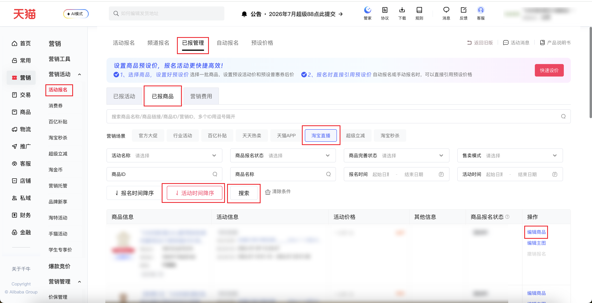
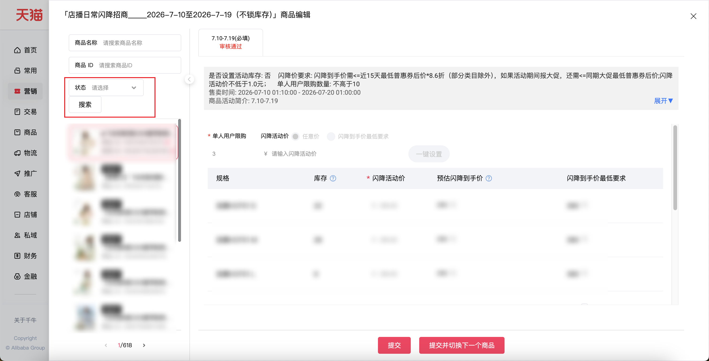

| 属性             | 值                                                                                                            |
| ---------------- | ------------------------------------------------------------------------------------------------------------- |
| **连接器类型**   | `RPA 连接器`                                                                                                  |
| **连接器名称**   | `ODS_营销活动报名已报商品SKU闪降明细(千牛RPA)`                                                               |
| **连接器代码**   | `rpa.conn.qianniu.marketing.tmc.registered.item.sku.list`                                                     |
| **操作类型**     | `页面解析`                                                                                                    |
| **目标网页**     | `https://qn.taobao.com/home.htm/starb/tmc-next/sale/seller/homepage.htm?tab=item`                             |
| **适用场景**     | 按筛选条件采集千牛活动报名「已报商品」编辑页中的 SKU 闪降明细，单次最多采集商品侧栏前 10 个商品               |
| **数据表名**     | `ods_rpa_qianniu_marketing_tmc_registered_item_sku_list_du`                                                   |
| **业务表名**     | `ODS_营销活动报名已报商品SKU闪降明细(千牛RPA)`                                                               |

### 目标页面

> **取数路径**：千牛后台—营销—活动报名—已报管理—已报商品—编辑商品
>
> **取数链接**：[https://qn.taobao.com/home.htm/starb/tmc-next/sale/seller/homepage.htm?tab=item](https://qn.taobao.com/home.htm/starb/tmc-next/sale/seller/homepage.htm?tab=item)





### 业务入参

| 字段 | 中文释义 | 数据类型 | 必填 | 默认值 | 说明 |
| ---- | -------- | -------- | ---- | ------ | ---- |
| `registration_status` | 商品报名状态 | `String` | 否 | — | 可选值：`DRAFT`（草稿）、`PENDING_REVIEW`（待审核）、`UNDER_REVIEW`（审核中）、`REVIEW_REJECTED`（审核不通过）、`REVIEW_PASSED`（审核通过/初审通过）、`CANCELLED`（撤销报名）、`SCHEDULE_PENDING`（排期待确认）、`SCHEDULED`（已排期待发布/终审通过）、`ABNORMAL`（异常）、`PUBLISHED`（已发布设定）、`IN_ACTIVITY`（活动中）、`ACTIVITY_ENDED`（活动结束）、`REMOVED`（清退） |
| `completion_status` | 商品完善状态 | `String` | 否 | — | 可选值：`COMPLETED`（已完善）、`INCOMPLETE`（待完善） |
| `sales_mode` | 售卖模式 | `String` | 否 | — | 可选值：`DEFAULT`（默认）、`PLAY`（玩法）、`MATERIAL`（素材）、`SHOP`（店铺）、`SPOT`（现货商品）、`PRESALE`（预售商品） |
| `activity_name` | 活动名称 | `String` | 否 | — | 输入活动名称关键字，连接器选择首个匹配项 |
| `item_id` | 商品 ID | `String` | 否 | — | 精确匹配商品 ID |
| `item_name` | 商品名称 | `String` | 否 | — | 模糊匹配商品名称 |
| `custom_activity_start_date` | 活动开始日期 | `String` | 否 | 当日 | 格式 `YYYYMMDD` 或 `YYYY-MM-DD`；与结束日期均未传时使用默认日期范围 |
| `custom_activity_end_date` | 活动结束日期 | `String` | 否 | 当日起未来 30 日 | 格式 `YYYYMMDD` 或 `YYYY-MM-DD`；与开始日期均未传时使用默认日期范围 |
| `custom_sign_start_date` | 报名开始日期 | `String` | 否 | 当日 | 格式 `YYYYMMDD` 或 `YYYY-MM-DD`；与结束日期均未传时使用默认日期范围 |
| `custom_sign_end_date` | 报名结束日期 | `String` | 否 | 当日起未来 30 日 | 格式 `YYYYMMDD` 或 `YYYY-MM-DD`；与开始日期均未传时使用默认日期范围 |

### 入参样例

> 所有入参均为可选。不传日期时，活动时间和报名时间默认使用当日至未来 30 日；营销场景固定为「淘宝直播」。

```json
{
  "registration_status": "PUBLISHED",
  "activity_name": "店播日常",
  "custom_activity_start_date": "20260630",
  "custom_activity_end_date": "20260714",
  "custom_sign_start_date": "20260630",
  "custom_sign_end_date": "20260714",
  "item_name": "示例品牌"
}
```

### 入参校验

```json-schema collapsed
{
  "$schema": "https://json-schema.org/draft/2020-12/schema",
  "title": "千牛-活动报名已报商品SKU闪降明细 - 查询入参",
  "description": "按筛选条件采集千牛活动报名「已报商品」编辑页中的 SKU 闪降明细，单次最多采集商品侧栏前 10 个商品",
  "type": "object",
  "properties": {
    "registration_status": {
      "type": "string",
      "description": "商品报名状态",
      "enum": [
        "DRAFT",
        "PENDING_REVIEW",
        "UNDER_REVIEW",
        "REVIEW_REJECTED",
        "REVIEW_PASSED",
        "CANCELLED",
        "SCHEDULE_PENDING",
        "SCHEDULED",
        "ABNORMAL",
        "PUBLISHED",
        "IN_ACTIVITY",
        "ACTIVITY_ENDED",
        "REMOVED"
      ]
    },
    "completion_status": {
      "type": "string",
      "description": "商品完善状态",
      "enum": ["COMPLETED", "INCOMPLETE"]
    },
    "sales_mode": {
      "type": "string",
      "description": "售卖模式",
      "enum": ["DEFAULT", "PLAY", "MATERIAL", "SHOP", "SPOT", "PRESALE"]
    },
    "activity_name": {
      "type": "string",
      "description": "活动名称关键字，选择首个匹配项"
    },
    "item_id": {
      "type": "string",
      "description": "商品 ID"
    },
    "item_name": {
      "type": "string",
      "description": "商品名称"
    },
    "custom_activity_start_date": {
      "type": "string",
      "description": "活动开始日期，格式 YYYYMMDD 或 YYYY-MM-DD",
      "pattern": "^(\\d{8}|\\d{4}-\\d{2}-\\d{2})$"
    },
    "custom_activity_end_date": {
      "type": "string",
      "description": "活动结束日期，格式 YYYYMMDD 或 YYYY-MM-DD",
      "pattern": "^(\\d{8}|\\d{4}-\\d{2}-\\d{2})$"
    },
    "custom_sign_start_date": {
      "type": "string",
      "description": "报名开始日期，格式 YYYYMMDD 或 YYYY-MM-DD",
      "pattern": "^(\\d{8}|\\d{4}-\\d{2}-\\d{2})$"
    },
    "custom_sign_end_date": {
      "type": "string",
      "description": "报名结束日期，格式 YYYYMMDD 或 YYYY-MM-DD",
      "pattern": "^(\\d{8}|\\d{4}-\\d{2}-\\d{2})$"
    }
  },
  "required": [],
  "additionalProperties": false
}
```

### 数据字段

| 字段 | 中文释义 | 数据类型 | 可为空 | 取数路径 | 示例 |
| ---- | -------- | -------- | ------ | -------- | ---- |
| `itemId` | 商品 ID | `String` | 否 | 页面解析 | `1051056******` |
| `itemName` | 商品名称 | `String` | 是 | 页面解析 | `示例品牌202*夏季新款休闲裤女` |
| `juId` | 营销 ID | `String` | 是 | 页面解析 | `1002976*******` |
| `activityName` | 活动名称 | `String` | 是 | 页面解析 | `店播日常闪降招商_____2026-7-10至2026-7-19（不锁库存）` |
| `skuSpec` | SKU 规格 | `String` | 是 | 页面解析 | `藏蓝HCH** S` |
| `inventory` | 库存 | `String` | 是 | 页面解析 | `0` |
| `flashActivityPrice` | 闪降活动价 | `String` | 是 | 页面解析 | — |
| `estimatedFinalPrice` | 预估闪降到手价 | `String` | 是 | 页面解析 | — |
| `minFinalPriceRequirement` | 闪降到手价最低要求 | `String` | 是 | 页面解析 | `3**` |
| `taskId` | 任务 ID | `String` | 否 | 附加 | `dev-0-a994****` |
| `bizDate` | 业务日期 | `String` | 否 | 附加 | `20260714` |
| `accountId` | 授权 ID | `String` | 否 | 附加 | `1**` |

### 数据样例

> 以下样例来自 2026-07-14 的真实运行输出，商品、营销、账号、任务及规格信息均已脱敏（如 `123456` → `123***`）。

```json
[
  {
    "itemId": "1051056******",
    "itemName": "示例品牌202*夏季新款时尚直筒宽松显瘦高腰阔腿休闲裤女",
    "juId": "1002976*******",
    "activityName": "店播日常闪降招商_____2026-7-10至2026-7-19（不锁库存）",
    "skuSpec": "藏蓝HCH** S",
    "inventory": "0",
    "flashActivityPrice": null,
    "estimatedFinalPrice": null,
    "minFinalPriceRequirement": "3**",
    "bizDate": "20260714",
    "accountId": "1**",
    "taskId": "dev-0-a994****"
  }
]
```

---
