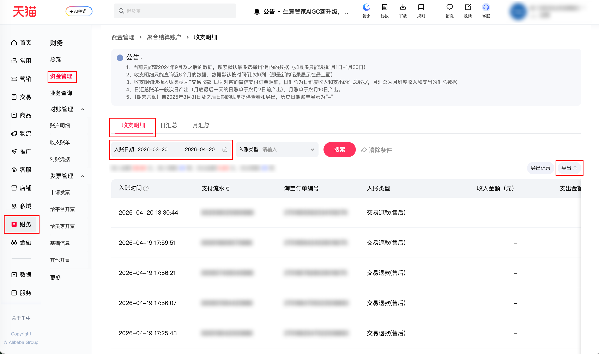

| 属性             | 值                                                                                          |
| ---------------- | ------------------------------------------------------------------------------------------- |
| **连接器类型**   | `RPA 连接器`|
| **连接器名称**   | `ODS_财务聚合账单明细表(千牛RPA)`|
| **连接器代码**   | `rpa.conn.qianniu.shop.aggregated.fund.bill.detail`|
| **操作类型**     | `文件导出`|
| **目标网页**     | `https://myseller.taobao.com/home.htm/whale-accountant/pay/capital/home?active=fund_detail`|
| **适用场景**     | 导出「财务-聚合结算-收支明细」明细数据，支持按入账日区间拉取（起止日期遵循平台规则限制）|
| **数据表名**     | `ods_rpa_qianniu_aggregated_fund_bill_du`|
| **业务表名**     | `ODS_财务聚合账单明细表(千牛RPA)`|

### 目标页面

> **取数路径**：千牛—财务—资金管理—聚合结算账户—收支明细
>
> **取数链接**：[https://myseller.taobao.com/home.htm/whale-accountant/pay/capital/home?active=fund_detail](https://myseller.taobao.com/home.htm/whale-accountant/pay/capital/home?active=fund_detail)



### 业务入参

| 字段 | 中文释义 | 数据类型 | 必填 | 默认值 | 说明 |
| ---- | -------- | -------- | ---- | ------ | ---- |
| `entry_start_date` | 入账开始日期 | `String` | 是 | `-` | 格式 `YYYYMMDD` 或 `YYYY-MM-DD`；不得早于 2024-09-01；最早约 6 个月前；不得晚于今天 |
| `entry_end_date` | 入账结束日期 | `String` | 是 | `-` | 格式 `YYYYMMDD` 或 `YYYY-MM-DD`；不得晚于今天；与开始日期含首尾跨度不超过 31 天 |

### 入参样例

```json
{
  "entry_start_date": "20260901",
  "entry_end_date": "2026-09-08"
}
```

### 入参校验

```json-schema collapsed
{
  "$schema": "https://json-schema.org/draft/2020-12/schema",
  "title": "千牛-财务-聚合结算账户(收支记录)-收支明细 - 查询入参",
  "description": "entry_start_date / entry_end_date 必填；格式 YYYYMMDD 或 YYYY-MM-DD；不得早于 2024-09-01；最早约 6 个月前；不得晚于今天；含首尾跨度不超过 31 天",
  "type": "object",
  "additionalProperties": false,
  "required": ["entry_start_date", "entry_end_date"],
  "properties": {
    "entry_start_date": {
      "type": "string",
      "description": "入账开始日期；格式 YYYYMMDD 或 YYYY-MM-DD；不得早于 2024-09-01；最早约 6 个月前；不得晚于今天",
      "pattern": "^(?:\\d{8}|\\d{4}-\\d{2}-\\d{2})$"
    },
    "entry_end_date": {
      "type": "string",
      "description": "入账结束日期；格式 YYYYMMDD 或 YYYY-MM-DD；不得晚于今天；与开始日期含首尾跨度不超过 31 天",
      "pattern": "^(?:\\d{8}|\\d{4}-\\d{2}-\\d{2})$"
    }
  }
}
```

### 数据字段

| 字段         | 中文释义       | 数据类型 | 可为空 | 取数路径                | 示例 |
| ------------ | -------------- | -------- | ------ | ----------------------- | ---- |
| `billTime`   | 入账时间       | `string` | 否     | `XLSX.0.入账时间`       | 2026-04-20 13:30:44 |
| `payFlowId`  | 支付流水号     | `string` | 否     | `XLSX.0.支付流水号`     | 832936025990888 |
| `tradeId`    | 淘宝订单编号   | `string` | 否     | `XLSX.0.淘宝订单编号`   | 2701855562034109276 |
| `billType`   | 入账类型       | `string` | 否     | `XLSX.0.入账类型`       | 交易退款(售后) |
| `incomeAmt`  | 收入金额（元） | `string` | 是     | `XLSX.0.收入金额（元）` | — |
| `outflowAmt` | 支出金额       | `string` | 是     | `XLSX.0.支出金额`       | 1.0 |
| `bizDesc`    | 业务描述       | `string` | 是     | `XLSX.0.业务描述`       | — |
| `remark`     | 备注           | `string` | 是     | `XLSX.0.备注`           | 订单{2701855562034109276}退款 |
| `bizDate`    | 业务日期       | `string` | 否     | 附加                    |      |
| `accountId`  | 授权 ID        | `string` | 否     | 附加                    |      |

### 数据样例

```json
[
    {
        "billTime": "2026-04-20 13:30:44",
        "payFlowId": 832936025990888,
        "tradeId": 2701855562034109276,
        "billType": "交易退款(售后)",
        "incomeAmt": null,
        "outflowAmt": 1.0,
        "bizDesc": null,
        "remark": "订单{2701855562034109276}退款",
        "bizDate": "2026-04-19T16:00:00.000Z",
        "accountId": "101"
    }
]
```

---
