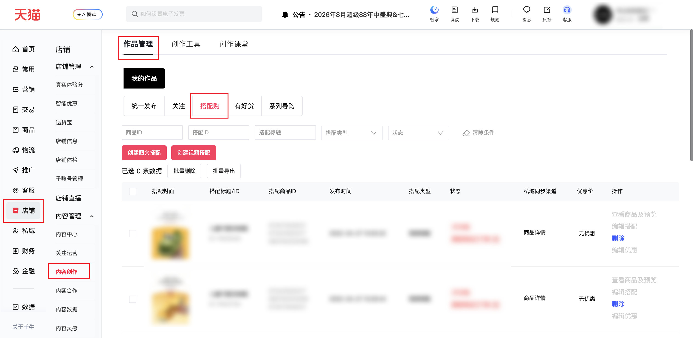

| 属性             | 值                                                                                                                                      |
| ---------------- | --------------------------------------------------------------------------------------------------------------------------------------- |
| **连接器类型**   | `RPA 连接器`                                                                                                                            |
| **连接器名称**   | `ODS_店铺内容创作搭配购明细表(千牛RPA)`                                                                                                    |
| **连接器代码**   | `rpa.conn.qianniu.shop.content.creation.collocation`                                                                                    |
| **操作类型**     | `页面解析`                                                                                                                              |
| **目标网页**     | `https://myseller.taobao.com/home.htm/content-center/list?tab=qianniu_dress_collocation%2Fexamine`                                       |
| **适用场景**     | 采集千牛内容创作「搭配购」作品列表，支持按商品ID、搭配ID、搭配标题筛选，完整保留平台返回的搭配字段及嵌套商品明细                         |
| **数据表名**     | `ods_rpa_qianniu_shop_content_creation_collocation_du`                                                                                  |
| **业务表名**     | `ODS_店铺内容创作搭配购明细表(千牛RPA)`                                                                                                    |

### 目标页面

> **取数路径**：千牛后台—内容创作—作品管理—搭配购
>
> **取数链接**：[https://myseller.taobao.com/home.htm/content-center/list?tab=qianniu_dress_collocation%2Fexamine](https://myseller.taobao.com/home.htm/content-center/list?tab=qianniu_dress_collocation%2Fexamine)



### 业务入参

| 字段 | 中文释义 | 数据类型 | 必填 | 默认值 | 说明 |
| ---- | -------- | -------- | ---- | ------ | ---- |
| `item_id` | 商品 ID | `String` | 否 | — | 单值纯数字字符串，最长 16 位；禁止多值粘连或 `+` 分隔 |
| `collocation_id` | 搭配 ID | `String` | 否 | — | 单值纯数字字符串，最长 16 位；对应页面「搭配ID」筛选项 |
| `collocation_title` | 搭配标题 | `String` | 否 | — | 模糊匹配，可含 emoji，最长 200 字符 |

### 入参样例

不传筛选条件，采集全量搭配购列表：

```json
{}
```

按商品 ID 筛选：

```json
{
  "item_id": "678264636662"
}
```

按搭配 ID 筛选：

```json
{
  "collocation_id": "406149726865"
}
```

按搭配标题模糊筛选：

```json
{
  "collocation_title": "儿童可爱凉拖鞋"
}
```

多条件组合（AND）：

```json
{
  "item_id": "678264636662",
  "collocation_id": "406149726865",
  "collocation_title": "儿童可爱凉拖鞋"
}
```

### 入参校验

```json-schema collapsed
{
  "$schema": "https://json-schema.org/draft/2020-12/schema",
  "title": "千牛-店铺内容创作搭配购列表 - 查询入参",
  "description": "采集千牛内容创作「搭配购」作品列表，支持按商品ID、搭配ID、搭配标题筛选，完整保留平台返回的搭配字段及嵌套商品明细",
  "type": "object",
  "properties": {
    "item_id": {
      "type": "string",
      "description": "商品 ID，单值纯数字字符串，最长 16 位；禁止多值粘连或 + 分隔",
      "pattern": "^\\d{1,16}$"
    },
    "collocation_id": {
      "type": "string",
      "description": "搭配 ID，单值纯数字字符串，最长 16 位；对应页面「搭配ID」筛选项",
      "pattern": "^\\d{1,16}$"
    },
    "collocation_title": {
      "type": "string",
      "description": "搭配标题，模糊匹配，可含 emoji，最长 200 字符",
      "maxLength": 200
    }
  },
  "required": [],
  "additionalProperties": false
}
```

### 数据字段

:::field-tree
@define 搭配商品明细
| `itemUrl` | 商品链接 | `String` | 是 | 页面解析 | `null` |
| `title` | 商品标题 | `String` | 是 | 页面解析 | `儿童拖****凉拖鞋` (已脱敏) |
| `rawTitle` | 原始标题 | `String` | 是 | 页面解析 | `null` |
| `itemId` | 商品 ID | `Number` | 是 | 页面解析 | `673****217` (已脱敏) |

| `coverUrl` | 封面图 URL | `String` | 是 | 页面解析 | `//img.alicdn.com/****` (已脱敏) |
| `images` | 图片列表 | `List` | 是 | 页面解析 | `null` |
| `price` | 商品价格 | `String` | 是 | 页面解析 | `26.9` |
| `count` | 数量 | `Number` | 是 | 页面解析 | `null` |
| `mainItem` | 是否主商品 | `Boolean` | 是 | 页面解析 | `null` |
| `list` | 子列表 | `List` | 是 | 页面解析 | `null` |
| `itemStatus` | 商品状态 | `Number` | 是 | 页面解析 | `null` |
| `skuId` | SKU ID | `Number` | 是 | 页面解析 | `null` |
| `skuText` | SKU 文案 | `String` | 是 | 页面解析 | `null` |
| `skuPrice` | SKU 价格 | `String` | 是 | 页面解析 | `null` |
| `upshelf` | 是否上架 | `Boolean` | 是 | 页面解析 | `null` |

| 字段 | 中文释义 | 数据类型 | 可为空 | 取数路径 | 示例 |
| ---- | -------- | -------- | ------ | -------- | ---- |
| `scuId` | 搭配 ID | `Number` | 否 | 页面解析 | `115****442` (已脱敏) |
| `bizCode` | 业务码 | `String` | 是 | 页面解析 | `qin****shi` (已脱敏) |
| `gmtCreate` | 创建时间戳 | `Number` | 是 | 页面解析 | `1651028132000` |
| `gmtModified` | 修改时间戳 | `Number` | 是 | 页面解析 | `1651028132000` |
| `createMode` | 创建模式 | `Number` | 是 | 页面解析 | `1` |
| `name` | 名称 | `String` | 是 | 页面解析 | `儿童可****凉拖鞋` (已脱敏) |
| `title` | 搭配标题 | `String` | 是 | 页面解析 | `儿童可****凉拖鞋` (已脱敏) |
| `integrity` | 状态码 / 完整度 | `Number` | 是 | 页面解析 | `3` |
| `integrityReason` | 状态原因 | `String` | 是 | 页面解析 | 当前搭配所关联的视频正在发布中，请稍后查看 |
| `mainPic` | 封面图 URL | `String` | 是 | 页面解析 | `//img.alicdn.com/****` (已脱敏) |
| `compositionUrl` | 合成图 URL 列表 | `List[String]` | 是 | 页面解析 | `[]` |
| `category` | 类目列表 | `List[String]` | 是 | 页面解析 | `["拖鞋"]` |
| `displayChannels` | 展示渠道 | `List[Number]` | 是 | 页面解析 | `[1]` |
| `discountStatus` | 优惠状态 | `Number` | 是 | 页面解析 | `2` |
| `guideItemCount` | 导购商品数 | `Number` | 是 | 页面解析 | `0` |
| `editable` | 是否可编辑 | `Boolean` | 是 | 页面解析 | `false` |
| `unEditableReason` | 不可编辑原因 | `String` | 是 | 页面解析 | 2025年1月1日之前的视频类型搭配，暂时无法操作 |
| `viewable` | 是否可查看 | `Boolean` | 是 | 页面解析 | `false` |
| `unViewableReason` | 不可查看原因 | `String` | 是 | 页面解析 | 2025年1月1日之前的视频类型搭配，暂时无法查看 |
| `editDiscountable` | 是否可编辑优惠 | `Boolean` | 是 | 页面解析 | `true` |
| `unEditDiscountableReason` | 不可编辑优惠原因 | `String` | 是 | 页面解析 | `null` |
| `itemDTOS` @搭配商品明细 | 商品明细列表 | `List[Dict]` | 是 | 页面解析 | 见数据样例 |
| `itemIdList` | 商品 ID 列表 | `List[Number]` | 是 | 页面解析 | `[673****121, 673****217, 669****096]` (已脱敏) |
| `discountId` | 优惠 ID | `Number` | 是 | 页面解析 | `0` |
| `hasVideo` | 是否含视频 | `Number` | 是 | 页面解析 | `1` |
| `displayType` | 展示类型 | `Number` | 是 | 页面解析 | `2` |
| `shopName` | 店铺名 | `String` | 是 | 页面解析 | `利****店` (已脱敏) |
| `userNick` | 用户昵称 | `String` | 是 | 页面解析 | `利****店` (已脱敏) |
| `userId` | 用户 ID | `Number` | 是 | 页面解析 | `null` |
| `shopId` | 店铺 ID | `Number` | 是 | 页面解析 | `null` |
| `avgClkPv` | 平均点击 PV | `Number` | 是 | 页面解析 | `0.0` |
| `clkRate` | 点击率 | `Number` | 是 | 页面解析 | `0.0` |
| `avgClkPvOk` | 平均点击 PV 是否达标 | `Number` | 是 | 页面解析 | `0` |
| `clkRateOk` | 点击率是否达标 | `Number` | 是 | 页面解析 | `0` |
| `isFavorable` | 是否有优惠 | `Number` | 是 | 页面解析 | `0` |
| `needSyncLaunch` | 是否需同步投放 | `Number` | 是 | 页面解析 | `0` |
| `needRecommend` | 是否需推荐 | `Number` | 是 | 页面解析 | `0` |
| `hasFlow` | 是否有流量 | `Number` | 是 | 页面解析 | `0` |
| `hasNew` | 是否新品 | `Number` | 是 | 页面解析 | `0` |
| `hasTrade` | 是否有成交 | `Number` | 是 | 页面解析 | `0` |
| `isHighQuality` | 是否高质量 | `Number` | 是 | 页面解析 | `0` |
| `hasLaunch` | 是否已投放 | `Number` | 是 | 页面解析 | `null` |
| `videoId` | 视频 ID | `Number` | 是 | 页面解析 | `357****825` (已脱敏) |
| `interactiveId` | 互动 ID | `Number` | 是 | 页面解析 | `null` |
| `bindStatus` | 绑定状态 | `Number` | 是 | 页面解析 | `null` |
| `shopAuditStatus` | 店铺审核状态 | `Number` | 是 | 页面解析 | `0` |
| `shopAuditReason` | 店铺审核原因 | `String` | 是 | 页面解析 | `null` |
| `publicAuditStatus` | 公域审核状态 | `Number` | 是 | 页面解析 | `0` |
| `publicAuditReason` | 公域审核原因 | `String` | 是 | 页面解析 | `null` |
| `downshelfItemList` | 下架商品 ID 列表 | `List[Number]` | 是 | 页面解析 | `[673****217, 673****121, 669****096]` (已脱敏) |
| `scuItemStatus` | 搭配商品状态 | `Number` | 是 | 页面解析 | `-2` |
| `scuSource` | 搭配来源 | `Number` | 是 | 页面解析 | `0` |
| `scuStatus` | 搭配状态 | `Number` | 是 | 页面解析 | `3` |
| `normalImgList` | 普通图 URL 列表 | `List[String]` | 是 | 页面解析 | `["//img.alicdn.com/****"]` (已脱敏) |
| `contentQualityLevel` | 内容质量等级 | `Number` | 是 | 页面解析 | `null` |
| `description` | 描述文案 | `String` | 是 | 页面解析 | `儿童可****凉拖鞋` (已脱敏) |
| `bizDate` | 业务日期 | `String` | 否 | 附加 | `20260730` |
| `accountId` | 授权 ID | `String` | 否 | 附加 | `1****7` (已脱敏) |
:::

### 数据样例

```json
[
  {
    "scuId": "115****442",
    "bizCode": "qin****shi",
    "gmtCreate": 1651028132000,
    "gmtModified": 1651028132000,
    "createMode": 1,
    "name": "儿童可****凉拖鞋",
    "title": "儿童可****凉拖鞋",
    "integrity": 3,
    "integrityReason": "当前搭配所关联的视频正在发布中，请稍后查看",
    "mainPic": "//img.alicdn.com/****",
    "compositionUrl": [],
    "category": ["拖鞋"],
    "displayChannels": [1],
    "discountStatus": 2,
    "guideItemCount": 0,
    "editable": false,
    "unEditableReason": "2025年1月1日之前的视频类型搭配，暂时无法操作",
    "viewable": false,
    "unViewableReason": "2025年1月1日之前的视频类型搭配，暂时无法查看",
    "editDiscountable": true,
    "unEditDiscountableReason": null,
    "itemDTOS": [
      {
        "itemUrl": null,
        "title": "儿童拖****凉拖鞋",
        "rawTitle": null,
        "itemId": "673****217",
        "coverUrl": "//img.alicdn.com/****",
        "images": null,
        "price": "26.9",
        "count": null,
        "mainItem": null,
        "list": null,
        "itemStatus": null,
        "skuId": null,
        "skuText": null,
        "skuPrice": null,
        "upshelf": null
      },
      {
        "itemUrl": null,
        "title": "亲子儿****鞋zd",
        "rawTitle": null,
        "itemId": "669****096",
        "coverUrl": "//img.alicdn.com/****",
        "images": null,
        "price": "39.8",
        "count": null,
        "mainItem": null,
        "list": null,
        "itemStatus": null,
        "skuId": null,
        "skuText": null,
        "skuPrice": null,
        "upshelf": null
      }
    ],
    "itemIdList": ["673****121", "673****217", "669****096"],
    "discountId": 0,
    "hasVideo": 1,
    "displayType": 2,
    "shopName": "利****店",
    "userNick": "利****店",
    "userId": null,
    "shopId": null,
    "avgClkPv": 0.0,
    "clkRate": 0.0,
    "avgClkPvOk": 0,
    "clkRateOk": 0,
    "isFavorable": 0,
    "needSyncLaunch": 0,
    "needRecommend": 0,
    "hasFlow": 0,
    "hasNew": 0,
    "hasTrade": 0,
    "isHighQuality": 0,
    "hasLaunch": null,
    "videoId": "357****825",
    "interactiveId": null,
    "bindStatus": null,
    "shopAuditStatus": 0,
    "shopAuditReason": null,
    "publicAuditStatus": 0,
    "publicAuditReason": null,
    "downshelfItemList": ["673****217", "673****121", "669****096"],
    "scuItemStatus": -2,
    "scuSource": 0,
    "scuStatus": 3,
    "normalImgList": ["//img.alicdn.com/****"],
    "contentQualityLevel": null,
    "description": "儿童可****凉拖鞋",
    "bizDate": "20260730",
    "accountId": "1****7"
  }
]
```

---
