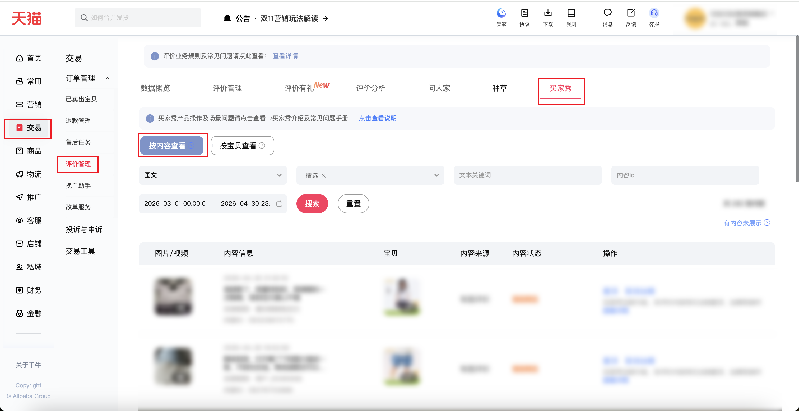

| 属性             | 值                                                                                      |
| ---------------- | --------------------------------------------------------------------------------------- |
| **连接器类型**   | `RPA 连接器`                                                                            |
| **连接器名称**   | `ODS_交易评价买家秀内容明细(千牛RPA)`                                                   |
| **连接器代码**   | `rpa.conn.qianniu.transaction.comment.buyer.content`                                    |
| **操作类型**     | `页面解析`                                                                              |
| **目标网页**     | `https://qn.taobao.com/home.htm/comment-manage/buyer-show`                              |
| **适用场景**     | 按内容类型、内容状态、文本关键词、内容id及起止日期采集买家秀内容明细                    |
| **数据表名**     | `ods_rpa_qianniu_transaction_comment_buyer_content_du`                                  |
| **业务表名**     | `ODS_交易评价买家秀内容明细(千牛RPA)`                                                   |

### 目标页面

> **取数路径**：千牛后台—交易—评价管理—买家秀—按内容查看
>
> **取数链接**：[https://qn.taobao.com/home.htm/comment-manage/buyer-show](https://qn.taobao.com/home.htm/comment-manage/buyer-show)



### 业务入参

| 字段 | 中文释义 | 数据类型 | 必填 | 默认值 | 说明 |
| ---- | -------- | -------- | ---- | ------ | ---- |
| `content_type` | 内容类型 | `String` | 否 | `-` | 不传不筛选。允许值：`ARTICLE`（图文）/ `VIDEO`（视频） |
| `content_states` | 内容状态 | `String` / `List[String]` | 否 | `-` | 英文逗号分隔或 JSON 数组。不传不选。允许值：`TOP`（置顶）/ `FEATURED`（精选） |
| `keyword` | 文本关键词 | `String` | 否 | `-` | 按买家秀文字内容筛选。不传不填 |
| `content_id` | 内容id | `String` | 否 | `-` | 单个内容 ID。不传不填 |
| `custom_start_date` | 起始日期 | `String` | 否 | `-` | 格式 `YYYY-MM-DD HH:mm:ss`，也支持 `YYYY-MM-DD`、`YYYYMMDD`。不含时分秒时补 `00:00:00`。可只填开始或只填结束。均未传则不填时间筛选。起始不得晚于结束 |
| `custom_end_date` | 结束日期 | `String` | 否 | `-` | 格式 `YYYY-MM-DD HH:mm:ss`，也支持 `YYYY-MM-DD`、`YYYYMMDD`。不含时分秒时补 `23:59:59`。可只填开始或只填结束。均未传则不填时间筛选 |
| `collect_limit` | 采集条数上限 | `String` | 否 | `-` | 正整数 `1`～`1000`。不传按总数翻完，最多 100 页。传入只采集前 N 条；实际条数不足时仍成功 |

### 入参样例

图文 + 精选 + 文本关键词 + 起止时间：

```json
{
  "content_type": "ARTICLE",
  "content_states": ["FEATURED"],
  "keyword": "舒适",
  "custom_start_date": "2026-03-01 00:00:00",
  "custom_end_date": "2026-04-30 23:59:59",
  "collect_limit": "12"
}
```

视频 + 置顶，日期用 `YYYYMMDD`：

```json
{
  "content_type": "VIDEO",
  "content_states": ["TOP"],
  "custom_start_date": "20260301",
  "custom_end_date": "20260430",
  "collect_limit": "5"
}
```

内容状态用逗号串：

```json
{
  "content_states": "TOP,FEATURED",
  "collect_limit": "5"
}
```

按单个内容 ID：

```json
{
  "content_id": "2194671436353517"
}
```

只填起始日期：

```json
{
  "custom_start_date": "2026-03-01 00:00:00",
  "collect_limit": "10"
}
```

不传筛选，只限制条数：

```json
{
  "collect_limit": "10"
}
```

### 入参校验

```json-schema collapsed
{
  "$schema": "https://json-schema.org/draft/2020-12/schema",
  "title": "千牛-交易-评价管理-买家秀内容明细 - 查询入参",
  "description": "按内容类型、内容状态、文本关键词、内容id及起止日期采集买家秀内容明细",
  "type": "object",
  "properties": {
    "content_type": {
      "type": "string",
      "description": "内容类型。不传不筛选。允许值：ARTICLE（图文）/ VIDEO（视频）",
      "enum": ["ARTICLE", "VIDEO"]
    },
    "content_states": {
      "description": "内容状态。英文逗号分隔或 JSON 数组。不传不选。允许值：TOP（置顶）/ FEATURED（精选）",
      "anyOf": [
        { "type": "string" },
        {
          "type": "array",
          "items": { "type": "string", "enum": ["TOP", "FEATURED"] }
        }
      ]
    },
    "keyword": {
      "type": "string",
      "description": "文本关键词。按买家秀文字内容筛选。不传不填"
    },
    "content_id": {
      "type": "string",
      "description": "内容id。单个内容 ID。不传不填"
    },
    "custom_start_date": {
      "type": "string",
      "description": "起始日期。格式 YYYY-MM-DD HH:mm:ss，也支持 YYYY-MM-DD、YYYYMMDD。不含时分秒时补 00:00:00。可只填开始或只填结束。均未传则不填时间筛选。起始不得晚于结束",
      "pattern": "^(?:\\d{8}|\\d{4}-\\d{2}-\\d{2}(?: \\d{2}:\\d{2}:\\d{2})?)$"
    },
    "custom_end_date": {
      "type": "string",
      "description": "结束日期。格式 YYYY-MM-DD HH:mm:ss，也支持 YYYY-MM-DD、YYYYMMDD。不含时分秒时补 23:59:59。可只填开始或只填结束。均未传则不填时间筛选",
      "pattern": "^(?:\\d{8}|\\d{4}-\\d{2}-\\d{2}(?: \\d{2}:\\d{2}:\\d{2})?)$"
    },
    "collect_limit": {
      "type": "string",
      "description": "采集条数上限。正整数 1～1000。不传按总数翻完，最多 100 页。传入只采集前 N 条；实际条数不足时仍成功",
      "pattern": "^(?:[1-9]\\d{0,2}|1000)$"
    }
  },
  "required": [],
  "additionalProperties": false
}
```

### 数据字段

:::field-tree
@define 内容素材
| `height` | 高度 | `Number` | 是 | 页面解析 | `1440` |
| `type` | 素材类型 | `String` | 是 | 页面解析 | `pic` |
| `url` | 素材地址 | `String` | 是 | 页面解析 | `https://gw.alicdn.com/****` (已脱敏) |
| `width` | 宽度 | `Number` | 是 | 页面解析 | `1080` |

@define 关联宝贝
| `cover` | 宝贝封面 | `String` | 是 | 页面解析 | `https://gw.alicdn.com/****` (已脱敏) |
| `itemId` | 宝贝 ID | `Number` | 是 | 页面解析 | `770****491` (已脱敏) |
| `title` | 宝贝标题 | `String` | 是 | 页面解析 | `****` (已脱敏) |
| `type` | 宝贝类型 | `String` | 是 | 页面解析 | `item` |
| `url` | 宝贝链接 | `String` | 是 | 页面解析 | `https://item.taobao.com/****` (已脱敏) |

@define 买家
| `avatar` | 头像 | `String` | 是 | 页面解析 | `https://img.alicdn.com/****` (已脱敏) |
| `displayName` | 买家昵称 | `String` | 是 | 页面解析 | `****` (已脱敏) |

| 字段 | 中文释义 | 数据类型 | 可为空 | 取数路径 | 示例 |
| ---- | -------- | -------- | ------ | -------- | ---- |
| `anonymous` | 是否匿名 | `Boolean` | 否 | 页面解析 | `false` |
| `canEliteOrTop` | 是否允许加精或置顶 | `Boolean` | 否 | 页面解析 | `true` |
| `contentId` | 内容 ID | `Number` | 否 | 页面解析 | `563****775` (已脱敏) |
| `contentType` | 内容类型 | `String` | 否 | 页面解析 | `article` |
| `elements` @内容素材 | 图片/视频 | `List[Dict]` | 是 | 页面解析 | 见数据样例 |
| `elite` | 是否精选 | `Boolean` | 否 | 页面解析 | `true` |
| `eliteDesc` | 精选说明 | `Boolean` | 是 | 页面解析 | `true` |
| `items` @关联宝贝 | 宝贝 | `List[Dict]` | 是 | 页面解析 | 见数据样例 |
| `publishTime` | 发布时间 | `String` | 是 | 页面解析 | `2026-04-30 21:30:19` |
| `source` | 内容来源 | `String` | 是 | 页面解析 | `有图评价` |
| `status` | 状态码 | `Number` | 是 | 页面解析 | `0` |
| `title` | 文字内容 | `String` | 是 | 页面解析 | 老顾客了，质量特别好，很满意的一次购物，收到宝贝真心不错 |
| `top` | 是否置顶 | `Boolean` | 否 | 页面解析 | `false` |
| `user` @买家 | 买家 | `Dict` | 是 | 页面解析 | 见数据样例 |
| `bizDate` | 业务日期 | `String` | 否 | 附加 |  |
| `accountId` | 授权 ID | `String` | 否 | 附加 |  |
:::

### 数据样例

```json
{
  "anonymous": false,
  "canEliteOrTop": true,
  "contentId": "563****775",
  "contentType": "article",
  "elements": [
    {
      "height": 1440,
      "type": "pic",
      "url": "https://gw.alicdn.com/****",
      "width": 1080
    }
  ],
  "elite": true,
  "eliteDesc": true,
  "items": [
    {
      "cover": "https://gw.alicdn.com/****",
      "itemId": "770****491",
      "title": "****",
      "type": "item",
      "url": "https://item.taobao.com/****"
    }
  ],
  "publishTime": "2026-04-30 21:30:19",
  "source": "有图评价",
  "status": 0,
  "title": "老顾客了，质量特别好，很满意的一次购物，收到宝贝真心不错",
  "top": false,
  "user": {
    "avatar": "https://img.alicdn.com/****",
    "displayName": "****"
  },
  "bizDate": "20260923",
  "accountId": "1****8"
}
```
