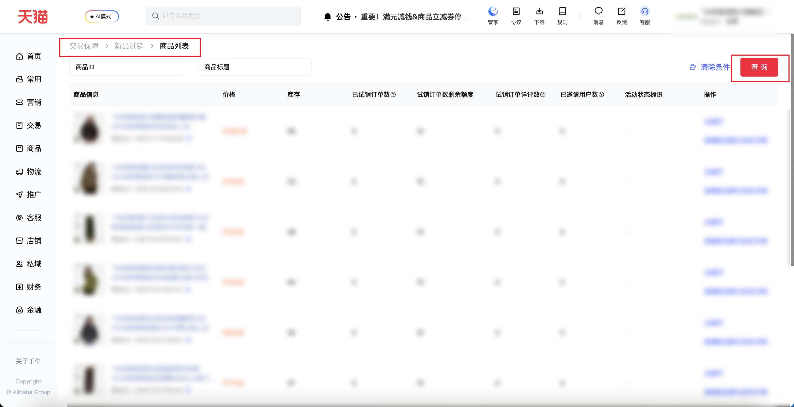

| 属性             | 值                                                         |
| ---------------- | ---------------------------------------------------------- |
| **连接器类型**   | `RPA 连接器`                                               |
| **连接器名称**   | `ODS_交易新品明细表(千牛RPA)`                              |
| **连接器代码**   | `rpa.conn.qianniu.transaction.new.product.list`            |
| **操作类型**     | `页面解析`                                                 |
| **目标网页**     | `https://qn.taobao.com/home.htm/trade-try-buy/merchList`  |
| **适用场景**     | 按商品ID、商品标题采集千牛新品试销商品列表，可限制采集条数 |
| **数据表名**     | `ods_rpa_qianniu_transaction_new_product_list_du`          |
| **业务表名**     | `ODS_交易新品明细表(千牛RPA)`                              |

### 目标页面

> **取数路径**：千牛后台—交易保障—新品试销—商品列表
>
> **取数链接**：[https://qn.taobao.com/home.htm/trade-try-buy/merchList](https://qn.taobao.com/home.htm/trade-try-buy/merchList)



### 业务入参

| 字段 | 中文释义 | 数据类型 | 必填 | 默认值 | 说明 |
| ---- | -------- | -------- | ---- | ------ | ---- |
| `item_ids` | 商品ID | `String` / `List[String]` | 否 | `-` | 英文逗号分隔或 JSON 数组。最多 50 个。不传不填 |
| `item_title` | 商品标题 | `String` | 否 | `-` | 不传不填 |
| `collect_limit` | 采集条数上限 | `String` | 否 | `-` | 正整数 `1`～`1000`。不传按总数翻完，最多 100 页。传入只采集前 N 条；实际条数不足时仍成功 |

### 入参样例

按商品标题，限制 12 条：

```json
{
  "item_title": "翻领外套",
  "collect_limit": "12"
}
```

多个商品 ID，英文逗号：

```json
{
  "item_ids": "1085777764948,1085754084152"
}
```

商品 ID 用 JSON 数组：

```json
{
  "item_ids": ["1085777764948", "1085754084152"]
}
```

### 入参校验

```json-schema collapsed
{
  "$schema": "https://json-schema.org/draft/2020-12/schema",
  "title": "千牛-交易-新品试销-商品列表 - 查询入参",
  "description": "按商品ID、商品标题采集千牛新品试销商品列表，可限制采集条数",
  "type": "object",
  "properties": {
    "item_ids": {
      "description": "商品ID。英文逗号分隔或 JSON 数组。最多 50 个。不传不填",
      "anyOf": [
        { "type": "string" },
        {
          "type": "array",
          "items": { "type": "string" },
          "maxItems": 50
        }
      ]
    },
    "item_title": {
      "type": "string",
      "description": "商品标题。不传不填"
    },
    "collect_limit": {
      "type": "string",
      "description": "采集条数上限。正整数 1～1000。不传按总数翻完，最多 100 页。传入只采集前 N 条；实际条数不足时仍成功",
      "pattern": "^(?:[1-9]\\d{0,2}|1000)$"
    }
  },
  "required": [],
  "additionalProperties": false
}
```

### 数据字段

:::field-tree
@define 统计明细
| `details` | 明细 | `List` | 否 | 页面解析 | `[]` |
| `showDetail` | 是否展示明细 | `Boolean` | 否 | 页面解析 | `true` |
| `total` | 合计 | `Number` | 否 | 页面解析 | `0` |

@define 文案数值
| `text` | 文案 | `String` | 否 | 页面解析 | `0` |

@define 商品信息
| `detailUrl` | 商品链接 | `String` | 否 | 页面解析 | `https://detail.tmall.com/****` (已脱敏) |
| `id` | 商品ID | `String` | 否 | 页面解析 | `108****948` (已脱敏) |
| `img` | 商品图片 | `String` | 否 | 页面解析 | `https://img.alicdn.com/****` (已脱敏) |
| `title` | 商品标题 | `String` | 否 | 页面解析 | `****` (已脱敏) |

@define 行操作
| `disabled` | 是否禁用 | `Boolean` | 否 | 页面解析 | `false` |
| `text` | 操作文案 | `String` | 否 | 页面解析 | `去邀评` |
| `type` | 操作类型 | `String` | 否 | 页面解析 | `invite` |
| `url` | 跳转链接 | `String` | 是 | 页面解析 | `https://myseller.taobao.com/****` (已脱敏) |

| 字段 | 中文释义 | 数据类型 | 可为空 | 取数路径 | 示例 |
| ---- | -------- | -------- | ------ | -------- | ---- |
| `activityTypes` | 活动状态标识 | `List` | 否 | 页面解析 | `[]` |
| `evalStats` @统计明细 | 评价统计 | `Dict` | 否 | 页面解析 | 见数据样例 |
| `evaluateOrderNum` @文案数值 | 试销订单详评数 | `Dict` | 否 | 页面解析 | 见数据样例 |
| `goodsInfo` @商品信息 | 商品信息 | `Dict` | 否 | 页面解析 | 见数据样例 |
| `inventory` @文案数值 | 库存 | `Dict` | 否 | 页面解析 | 见数据样例 |
| `key` | 行键 | `String` | 否 | 页面解析 | `108****948` (已脱敏) |
| `options` @行操作 | 操作 | `List[Dict]` | 否 | 页面解析 | 见数据样例 |
| `orderStats` @统计明细 | 订单统计 | `Dict` | 否 | 页面解析 | 见数据样例 |
| `price` @文案数值 | 价格 | `Dict` | 否 | 页面解析 | 见数据样例 |
| `remainingOrderNum` @文案数值 | 试销订单数剩余额度 | `Dict` | 否 | 页面解析 | 见数据样例 |
| `sales` @文案数值 | 已试销订单数 | `Dict` | 否 | 页面解析 | 见数据样例 |
| `userNum` @文案数值 | 已邀请用户数 | `Dict` | 否 | 页面解析 | 见数据样例 |
| `bizDate` | 业务日期 | `String` | 否 | 附加 | `20260924` |
| `accountId` | 授权 ID | `String` | 否 | 附加 | `1****6` (已脱敏) |
:::

### 数据样例

```json
{
  "activityTypes": [],
  "evalStats": {
    "details": [],
    "showDetail": true,
    "total": 0
  },
  "evaluateOrderNum": {
    "text": "0"
  },
  "goodsInfo": {
    "detailUrl": "https://detail.tmall.com/****",
    "id": "108****948",
    "img": "https://img.alicdn.com/****",
    "title": "****"
  },
  "inventory": {
    "text": "56"
  },
  "key": "108****948",
  "options": [
    {
      "disabled": false,
      "text": "去邀评",
      "type": "invite"
    },
    {
      "disabled": false,
      "text": "查看新品孵化报名详情",
      "type": "openUrl",
      "url": "https://myseller.taobao.com/****"
    }
  ],
  "orderStats": {
    "details": [],
    "showDetail": true,
    "total": 0
  },
  "price": {
    "text": "1069.00"
  },
  "remainingOrderNum": {
    "text": "10"
  },
  "sales": {
    "text": "0"
  },
  "userNum": {
    "text": "0"
  },
  "bizDate": "20260924",
  "accountId": "1****6"
}
```
