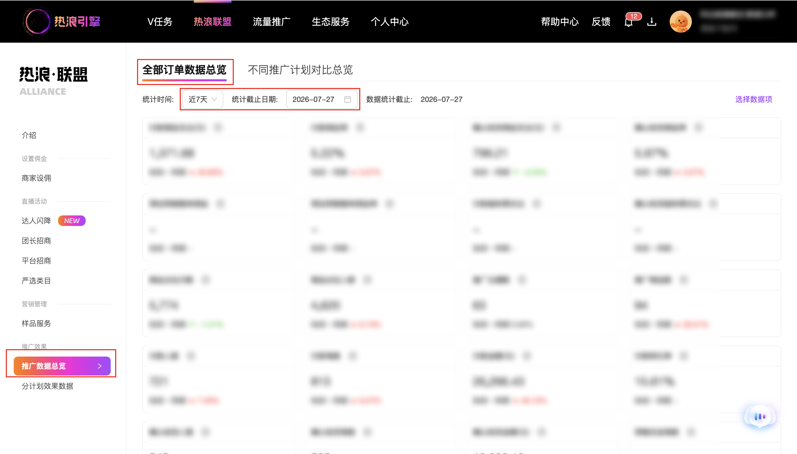
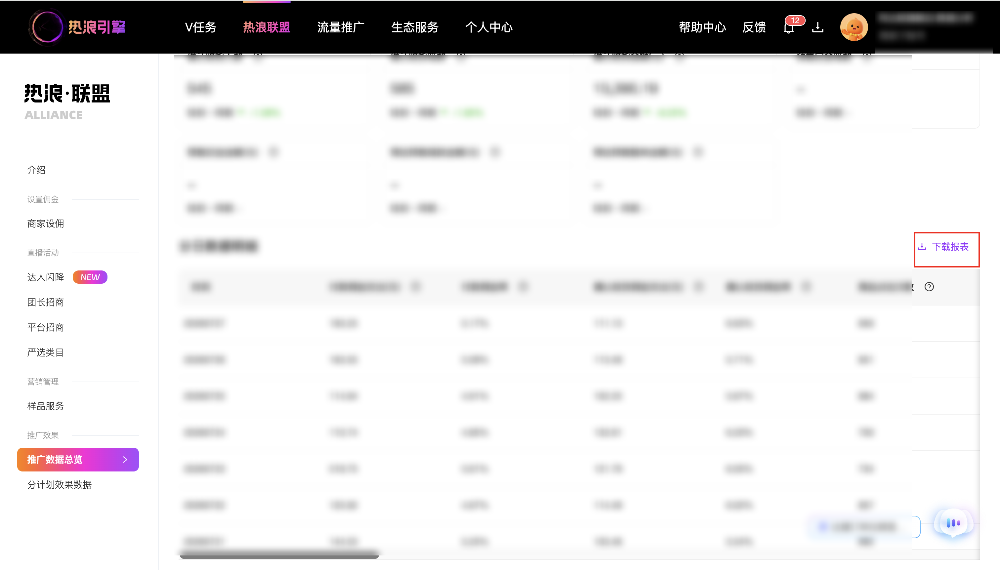

| 属性             | 值                                                         |
| ---------------- | ---------------------------------------------------------- |
| **连接器类型**   | `RPA 连接器`                                               |
| **连接器名称**   | `ODS_推广订单数据总览报表下载(热浪引擎RPA)`                    |
| **连接器代码**   | `rpa.conn.rlyq.promotion.data`                             |
| **操作类型**     | `文件导出`                                                 |
| **目标网页**     | `https://hot.taobao.com/hw/union/goods-alliance/databoard/overview` |
| **适用场景**     | 打开推广数据总览页后完成入参校验，按统计时间与统计截止日期下载分日/分商品/分主播明细报表 |
| **数据表名**     | `ods_rpa_rlyq_promotion_data_du`                           |
| **业务表名**     | `ODS_推广订单数据总览报表下载(热浪引擎RPA)`                     |

### 目标页面

> **取数路径**：热浪引擎—商品联盟—数据看板—推广数据总览
>
> **取数链接**：[https://hot.taobao.com/hw/union/goods-alliance/databoard/overview](https://hot.taobao.com/hw/union/goods-alliance/databoard/overview)





### 业务入参

| 字段 | 中文释义 | 数据类型 | 必填 | 默认值 | 说明 |
| ---- | -------- | -------- | ---- | ------ | ---- |
| `stat_time` | 统计时间 | `String` | 否 | `YESTERDAY` | 可选值：`LAST_7_DAYS`（近7天）/ `LAST_30_DAYS`（近30天）/ `THIS_MONTH`（本月）/ `YESTERDAY`（昨天） |
| `detail_type` | 明细类型 | `String` | 否 | `DAILY` | 可选值：`DAILY`（分日数据明细）/ `ITEM`（分商品数据明细）/ `ANCHOR`（分主播数据明细）；决定导出区块与返回维度列 |
| `stat_end_date` | 统计截止日期 | `String` | 否 | — | 格式 `YYYYMMDD` 或 `YYYY-MM-DD`。**打开目标页后校验**：不传或传空 → 默认使用页面「统计截止日期」**当前可选上限**设筛；有传 → 格式非法或**晚于**该上限 →「输入参数错误」；**不晚于上限的更早日期**允许。对应明细区块表格 placeholder 为「暂无数据」或无数据行时任务成功返回「无数据」（`data=[]`）；成功导出且有明细行时每条附加 `statEndDate`（有入参则为规范化入参值，未传则为默认补齐的上限日，格式 `YYYYMMDD`） |

### 入参样例

```json
{
  "stat_time": "YESTERDAY",
  "detail_type": "DAILY"
}
```

```json
{
  "stat_time": "LAST_7_DAYS",
  "detail_type": "ITEM",
  "stat_end_date": "20260725"
}
```

```json
{
  "detail_type": "ANCHOR",
  "stat_time": "THIS_MONTH"
}
```

```json
{
  "stat_time": "YESTERDAY",
  "detail_type": "ANCHOR",
  "stat_end_date": "2023-04-13"
}
```

### 入参校验

```json-schema collapsed
{
  "$schema": "https://json-schema.org/draft/2020-12/schema",
  "title": "热浪引擎-推广数据总览明细报表下载 - 查询入参",
  "description": "按统计时间与统计截止日期，下载推广数据总览页分日/分商品/分主播明细报表",
  "type": "object",
  "properties": {
    "stat_time": {
      "type": "string",
      "enum": ["LAST_7_DAYS", "LAST_30_DAYS", "THIS_MONTH", "YESTERDAY"],
      "default": "YESTERDAY",
      "description": "统计时间"
    },
    "detail_type": {
      "type": "string",
      "enum": ["DAILY", "ITEM", "ANCHOR"],
      "default": "DAILY",
      "description": "明细类型：分日 / 分商品 / 分主播"
    },
    "stat_end_date": {
      "type": "string",
      "description": "统计截止日期，YYYYMMDD 或 YYYY-MM-DD；空字符串视为未传。打开目标页后校验：未传则默认页面统计截止日期当前可选上限；不可晚于该上限；可早于上限",
      "anyOf": [
        { "const": "" },
        { "pattern": "^\\d{8}$" },
        { "pattern": "^\\d{4}-\\d{2}-\\d{2}$" }
      ]
    }
  },
  "required": [],
  "additionalProperties": false
}
```

### 数据字段

> **按 `detail_type` 区分**：三种明细共用同一套指标列（下表「共用指标列」）；**维度列**与部分指标是否出现因类型不同（见「出现条件」）。成功导出且 `data` 非空时，每条明细含维度列 + 共用指标列 + 附加字段；任务成功但「无数据」时 `data=[]`，不附加 `statEndDate`。

#### 维度列（随 `detail_type` 变化，每次任务仅一类）

| 字段 | 中文释义 | 数据类型 | 可为空 | 取数路径 | 出现条件 | 示例 |
| ---- | -------- | -------- | ------ | -------- | -------- | ---- |
| `statDate` | 统计日期 | `String` | 是 | `XLS.0.时间` | `detail_type=DAILY` | 20260727 |
| `itemName` | 商品名称 | `String` | 是 | `XLS.0.商品名称` | `detail_type=ITEM` | 示例****称 (已脱敏) |
| `itemId` | 商品 ID | `String` | 是 | `XLS.0.商品ID` | `detail_type=ITEM` | 752****302 (已脱敏) |
| `anchorName` | 主播名称 | `String` | 是 | `XLS.0.主播名称` | `detail_type=ANCHOR` | 示例****称 (已脱敏) |
| `anchorId` | 主播 ID | `String` | 是 | `XLS.0.主播ID` | `detail_type=ANCHOR` | 123****789 (已脱敏) |

#### 共用指标列

| 字段 | 中文释义 | 数据类型 | 可为空 | 取数路径 | 出现条件 | 示例 |
| ---- | -------- | -------- | ------ | -------- | -------- | ---- |
| `payCommissionAmount` | 付款佣金支出(元) | `Number` | 是 | `XLS.0.付款佣金支出(元)` | 三种明细均有 | 193.25 |
| `payCommissionRate` | 付款佣金率 | `String` | 是 | `XLS.0.付款佣金率` | 三种明细均有 | 5.17% |
| `confirmCommissionAmount` | 确认收货佣金支出(元) | `Number` | 是 | `XLS.0.确认收货佣金支出(元)` | 三种明细均有 | 111.13 |
| `confirmCommissionRate` | 确认收货佣金率 | `String` | 是 | `XLS.0.确认收货佣金率` | 三种明细均有 | 6.63% |
| `itemClickCount` | 商品点击次数 | `Number` | 是 | `XLS.0.商品点击次数` | 三种明细均有 | 856 |
| `itemClickUserCount` | 商品点击人数 | `Number` | 是 | `XLS.0.商品点击人数` | 三种明细均有 | 677 |
| `promoteAnchorCount` | 推广主播数 | `Number` | 是 | `XLS.0.推广主播数` | `DAILY`、`ITEM`（`ANCHOR` 明细无此列） | 30 |
| `promoteItemCount` | 推广商品数 | `Number` | 是 | `XLS.0.推广商品数` | `DAILY`、`ANCHOR`（`ITEM` 明细无此列） | 36 |
| `payUserCount` | 付款人数 | `Number` | 是 | `XLS.0.付款人数` | 三种明细均有 | 127 |
| `payOrderCount` | 付款笔数 | `Number` | 是 | `XLS.0.付款笔数` | 三种明细均有 | 150 |
| `payAmount` | 付款金额(元) | `String` | 是 | `XLS.0.付款金额(元)` | 三种明细均有 | 3,740.97 |
| `payConversionRate` | 付款转化率 | `String` | 是 | `XLS.0.付款转化率` | 三种明细均有 | - |
| `confirmUserCount` | 确认收货人数 | `Number` | 是 | `XLS.0.确认收货人数` | 三种明细均有 | 73 |
| `confirmOrderCount` | 确认收货笔数 | `Number` | 是 | `XLS.0.确认收货笔数` | 三种明细均有 | 75 |
| `confirmAmount` | 确认收货金额(元) | `String` | 是 | `XLS.0.确认收货金额(元)` | 三种明细均有 | 1,676.63 |
| `estimatePresaleCommission` | 预估预售整单佣金 | `String` | 是 | `XLS.0.预估预售整单佣金` | 三种明细均有 | - |
| `estimatePresaleCommissionRate` | 预估预售整单佣金率 | `String` | 是 | `XLS.0.预估预售整单佣金率` | 三种明细均有 | - |
| `presaleDepositCount` | 预售定金笔数 | `String` | 是 | `XLS.0.预售定金笔数` | 三种明细均有 | - |
| `presaleDepositAmount` | 预售定金金额(元) | `String` | 是 | `XLS.0.预售定金金额(元)` | 三种明细均有 | - |
| `estimatePresaleBalanceAmount` | 预估预售尾款金额(元) | `String` | 是 | `XLS.0.预估预售尾款金额(元)` | 三种明细均有 | - |
| `estimatePresaleOrderAmount` | 预估预售整单金额(元) | `String` | 是 | `XLS.0.预估预售整单金额(元)` | 三种明细均有 | - |
| `payServiceFee` | 付款服务费支出 | `String` | 是 | `XLS.0.付款服务费支出` | 三种明细均有 | - |
| `confirmServiceFee` | 确认收货服务费支出 | `String` | 是 | `XLS.0.确认收货服务费支出` | 三种明细均有 | - |

#### 附加字段

| 字段 | 中文释义 | 数据类型 | 可为空 | 取数路径 | 出现条件 | 示例 |
| ---- | -------- | -------- | ------ | -------- | -------- | ---- |
| `statEndDate` | 统计截止日期 | `String` | 否 | 附加（入参规范化值或未传时默认补齐的可选上限日） | 成功导出且有明细行 | 20260729 |
| `bizDate` | 业务日期 | `String` | 否 | 附加（任务执行当日 `YYYYMMDD`） | 成功导出且有明细行 | 20260729 |
| `accountId` | 授权 ID | `String` | 否 | 附加 | 成功导出且有明细行 | 127****7 (已脱敏) |

#### 各 `detail_type` 首行字段一览（实测）

| `detail_type` | 首行字段数 | 维度列 | 相对其它类型的差异 |
| ------------- | ---------- | ------ | ------------------ |
| `DAILY` | 26 + `statEndDate` 时 27 | `statDate` | 含 `promoteAnchorCount`、`promoteItemCount` |
| `ITEM` | 26 + `statEndDate` 时 27 | `itemName`、`itemId` | 无 `promoteItemCount`；含 `promoteAnchorCount` |
| `ANCHOR` | 26 + `statEndDate` 时 27 | `anchorName`、`anchorId` | 无 `promoteAnchorCount`；含 `promoteItemCount` |

### 数据样例

**分日（`detail_type=DAILY`）**

```json
[
  {
    "statDate": 20260727,
    "payCommissionAmount": 193.25,
    "payCommissionRate": "5.17%",
    "confirmCommissionAmount": 111.13,
    "confirmCommissionRate": "6.63%",
    "itemClickCount": 856,
    "itemClickUserCount": 677,
    "promoteAnchorCount": 30,
    "promoteItemCount": 36,
    "payUserCount": 127,
    "payOrderCount": 150,
    "payAmount": "3,740.97",
    "payConversionRate": "-",
    "confirmUserCount": 73,
    "confirmOrderCount": 75,
    "confirmAmount": "1,676.63",
    "estimatePresaleCommission": "-",
    "estimatePresaleCommissionRate": "-",
    "presaleDepositCount": "-",
    "presaleDepositAmount": "-",
    "estimatePresaleBalanceAmount": "-",
    "estimatePresaleOrderAmount": "-",
    "payServiceFee": "-",
    "confirmServiceFee": "-",
    "statEndDate": "20260729",
    "bizDate": "20260729",
    "accountId": "127****7"
  }
]
```

**分商品（`detail_type=ITEM`）**

```json
[
  {
    "itemName": "示例****称",
    "itemId": "752****302",
    "payCommissionAmount": 193.25,
    "payCommissionRate": "5.17%",
    "confirmCommissionAmount": 111.13,
    "confirmCommissionRate": "6.63%",
    "itemClickCount": 856,
    "itemClickUserCount": 677,
    "promoteAnchorCount": 30,
    "payUserCount": 127,
    "payOrderCount": 150,
    "payAmount": "3,740.97",
    "payConversionRate": "-",
    "confirmUserCount": 73,
    "confirmOrderCount": 75,
    "confirmAmount": "1,676.63",
    "estimatePresaleCommission": "-",
    "estimatePresaleCommissionRate": "-",
    "presaleDepositCount": "-",
    "presaleDepositAmount": "-",
    "estimatePresaleBalanceAmount": "-",
    "estimatePresaleOrderAmount": "-",
    "payServiceFee": "-",
    "confirmServiceFee": "-",
    "statEndDate": "20260729",
    "bizDate": "20260729",
    "accountId": "127****7"
  }
]
```

**分主播（`detail_type=ANCHOR`）**

```json
[
  {
    "anchorName": "示例****称",
    "anchorId": "123****789",
    "payCommissionAmount": 193.25,
    "payCommissionRate": "5.17%",
    "confirmCommissionAmount": 111.13,
    "confirmCommissionRate": "6.63%",
    "itemClickCount": 856,
    "itemClickUserCount": 677,
    "promoteItemCount": 36,
    "payUserCount": 127,
    "payOrderCount": 150,
    "payAmount": "3,740.97",
    "payConversionRate": "-",
    "confirmUserCount": 73,
    "confirmOrderCount": 75,
    "confirmAmount": "1,676.63",
    "estimatePresaleCommission": "-",
    "estimatePresaleCommissionRate": "-",
    "presaleDepositCount": "-",
    "presaleDepositAmount": "-",
    "estimatePresaleBalanceAmount": "-",
    "estimatePresaleOrderAmount": "-",
    "payServiceFee": "-",
    "confirmServiceFee": "-",
    "statEndDate": "20260729",
    "bizDate": "20260729",
    "accountId": "127****7"
  }
]
```

---
