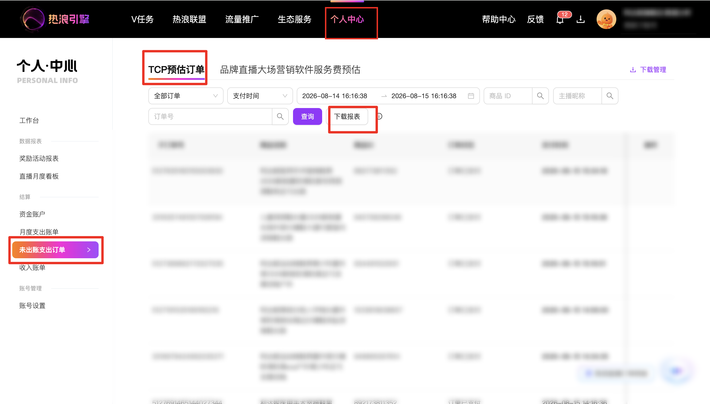

| 属性             | 值                                                         |
| ---------------- | ---------------------------------------------------------- |
| **连接器类型**   | `RPA 连接器`                                               |
| **连接器名称**   | `ODS_个人中心未出TCP预估订单明细报表(热浪引擎RPA)`             |
| **连接器代码**   | `rpa.conn.rlyq.tcp.predict.order`                          |
| **操作类型**     | `文件导出`                                                 |
| **目标网页**     | `https://hot.taobao.com/hw/union/console/wallet/consumer-predict-order` |
| **适用场景**     | 按订单状态、日期类型与自定义时间范围申请并下载 TCP 预估订单（预估佣金）报表 |
| **数据表名**     | `ods_rpa_rlyq_tcp_predict_order_du`                        |
| **业务表名**     | `ODS_个人中心未出TCP预估订单明细报表(热浪引擎RPA)`             |

### 目标页面

> **取数路径**：热浪引擎—控制台—钱包—TCP预估订单
>
> **取数链接**：[https://hot.taobao.com/hw/union/console/wallet/consumer-predict-order](https://hot.taobao.com/hw/union/console/wallet/consumer-predict-order)



### 业务入参

| 字段 | 中文释义 | 数据类型 | 必填 | 默认值 | 说明 |
| ---- | -------- | -------- | ---- | ------ | ---- |
| `order_status` | 订单状态 | `String` | 是 | — | 可选值：`ALL`（全部订单）/ `ORDER_PAID`（订单已支付）/ `ORDER_CONFIRMED`（订单已确认收货）/ `ORDER_CANCELLED`（订单已取消）/ `ORDER_REFUNDED`（订单有退款）。与 `date_type=CONFIRM_RECEIPT_TIME` 组合时，不可为 `ORDER_PAID` 或 `ORDER_CANCELLED` |
| `date_type` | 日期类型 | `String` | 是 | — | 可选值：`PAYMENT_TIME`（支付时间）/ `CONFIRM_RECEIPT_TIME`（确认收货时间） |
| `custom_start_date` | 开始时间 | `String` | 是 | — | 支持 `YYYYMMDD` / `YYYY-MM-DD` / `YYYY-MM-DD HH:mm:ss`；无时分秒时默认 `00:00:00`。可选区间：最早为上月 1 日 `00:00:00`，最晚为本月最后一天 `00:00:00`；且不得晚于 `custom_end_date` |
| `custom_end_date` | 结束时间 | `String` | 是 | — | 格式同 `custom_start_date`；须不早于开始时间，且落在上述可选区间内。同一账号成功提交后 5 分钟内不可再次提交下载申请 |

### 入参样例

合法示例：

```json
{
  "order_status": "ORDER_CONFIRMED",
  "date_type": "CONFIRM_RECEIPT_TIME",
  "custom_start_date": "2026-08-01",
  "custom_end_date": "2026-08-05"
}
```

```json
{
  "order_status": "ALL",
  "date_type": "PAYMENT_TIME",
  "custom_start_date": "20260801 00:00:00",
  "custom_end_date": "20260805 00:00:00"
}
```

非法组合（将直接失败，不进入下载）：

```json
{
  "order_status": "ORDER_PAID",
  "date_type": "CONFIRM_RECEIPT_TIME",
  "custom_start_date": "2026-08-01",
  "custom_end_date": "2026-08-05"
}
```

### 入参校验

```json-schema collapsed
{
  "$schema": "https://json-schema.org/draft/2020-12/schema",
  "title": "热浪引擎-TCP预估订单报表下载 - 查询入参",
  "description": "按订单状态、日期类型与自定义时间范围申请并下载 TCP 预估订单（预估佣金）报表",
  "type": "object",
  "properties": {
    "order_status": {
      "type": "string",
      "enum": [
        "ALL",
        "ORDER_PAID",
        "ORDER_CONFIRMED",
        "ORDER_CANCELLED",
        "ORDER_REFUNDED"
      ],
      "description": "订单状态：全部订单 / 订单已支付 / 订单已确认收货 / 订单已取消 / 订单有退款"
    },
    "date_type": {
      "type": "string",
      "enum": ["PAYMENT_TIME", "CONFIRM_RECEIPT_TIME"],
      "description": "日期类型：支付时间 / 确认收货时间"
    },
    "custom_start_date": {
      "type": "string",
      "description": "开始时间；YYYYMMDD、YYYY-MM-DD 或 YYYY-MM-DD HH:mm:ss；无时分秒默认 00:00:00",
      "anyOf": [
        { "pattern": "^\\d{8}$" },
        { "pattern": "^\\d{4}-\\d{2}-\\d{2}$" },
        { "pattern": "^\\d{4}-\\d{2}-\\d{2} \\d{2}:\\d{2}:\\d{2}$" },
        { "pattern": "^\\d{8} \\d{2}:\\d{2}:\\d{2}$" }
      ]
    },
    "custom_end_date": {
      "type": "string",
      "description": "结束时间；格式同 custom_start_date；须不早于开始时间，且在页面可选区间内",
      "anyOf": [
        { "pattern": "^\\d{8}$" },
        { "pattern": "^\\d{4}-\\d{2}-\\d{2}$" },
        { "pattern": "^\\d{4}-\\d{2}-\\d{2} \\d{2}:\\d{2}:\\d{2}$" },
        { "pattern": "^\\d{8} \\d{2}:\\d{2}:\\d{2}$" }
      ]
    }
  },
  "required": [
    "order_status",
    "date_type",
    "custom_start_date",
    "custom_end_date"
  ],
  "additionalProperties": false,
  "allOf": [
    {
      "if": {
        "properties": {
          "date_type": { "const": "CONFIRM_RECEIPT_TIME" }
        },
        "required": ["date_type"]
      },
      "then": {
        "properties": {
          "order_status": {
            "not": {
              "enum": ["ORDER_PAID", "ORDER_CANCELLED"]
            },
            "description": "确认收货时间不支持订单已支付 / 订单已取消状态"
          }
        }
      }
    }
  ]
}
```

### 数据字段

| 字段 | 中文释义 | 数据类型 | 可为空 | 取数路径 | 示例 |
| ---- | -------- | -------- | ------ | -------- | ---- |
| `mainOrderId` | 淘宝主订单号 | `String` | 是 | `CSV.0.淘宝主订单号` | `331****191` (已脱敏) |
| `subOrderId` | 淘宝子订单号 | `String` | 是 | `CSV.0.淘宝子订单号` | `331****191` (已脱敏) |
| `itemName` | 商品名称 | `String` | 是 | `CSV.0.商品名称` | `利达妮****男士` (已脱敏) |
| `itemId` | 商品 ID | `String` | 是 | `CSV.0.商品ID` | `702****067` (已脱敏) |
| `anchorNick` | 主播昵称 | `String` | 是 | `CSV.0.主播昵称` | `家****方` (已脱敏) |
| `serviceProviderName` | 服务商名称 | `String` | 是 | `CSV.0.服务商名称` | `杭****媒` (已脱敏) |
| `orderCreateTime` | 订单创建时间 | `String` | 是 | `CSV.0.订单创建时间` | `2026-08-02 13:50:38` |
| `payTime` | 订单支付时间 | `String` | 是 | `CSV.0.订单支付时间` | `2026-08-02 13:50:50` |
| `confirmReceiptTime` | 订单确认收货时间 | `String` | 是 | `CSV.0.订单确认收货时间` | `2026-08-04 11:00:12` |
| `orderStatus` | 订单状态 | `String` | 是 | `CSV.0.订单状态` | `订单已确认收货` |
| `orderPayAmount` | 订单支付金额 | `Number` | 是 | `CSV.0.订单支付金额` | `12.9` |
| `refundAmount` | 订单退款金额 | `String` | 是 | `CSV.0.订单退款金额` | `-` |
| `estimateCommissionAmount` | 预估计佣金额 | `Number` | 是 | `CSV.0.预估计佣金额` | `12.9` |
| `estimateCommissionTotal` | 预估出佣总额 | `Number` | 是 | `CSV.0.预估出佣总额` | `0.96` |
| `commissionRate` | 出佣比例 | `String` | 是 | `CSV.0.出佣比例` | `7.50%` |
| `remark` | 备注 | `String` | 是 | `CSV.0.备注` | `直播严选计划` |
| `bizDate` | 业务日期 | `String` | 否 | 附加（任务执行当日 `YYYYMMDD`） | `20260807` |
| `accountId` | 授权 ID | `String` | 否 | 附加 | `1****0` (已脱敏) |

### 数据样例

```json
[
  {
    "mainOrderId": "331****191",
    "subOrderId": "331****191",
    "itemName": "利达妮****男士",
    "itemId": "702****067",
    "anchorNick": "家****方",
    "serviceProviderName": "杭****媒",
    "orderCreateTime": "2026-08-02 13:50:38",
    "payTime": "2026-08-02 13:50:50",
    "confirmReceiptTime": "2026-08-04 11:00:12",
    "orderStatus": "订单已确认收货",
    "orderPayAmount": 12.9,
    "refundAmount": "-",
    "estimateCommissionAmount": 12.9,
    "estimateCommissionTotal": 0.96,
    "commissionRate": "7.50%",
    "remark": "直播严选计划",
    "bizDate": "20260807",
    "accountId": "1****0"
  }
]
```

---
