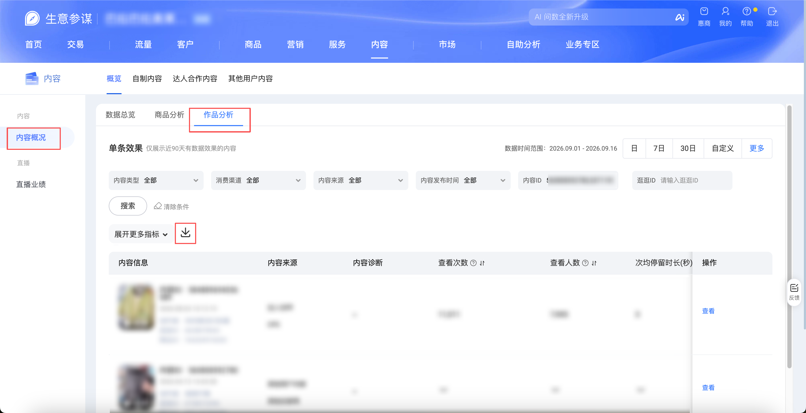

| 属性             | 值 |
| ---------------- | --- |
| **连接器类型**   | `RPA 连接器` |
| **连接器名称**   | `ODS_内容概况作品分析报表(生意参谋RPA)` |
| **连接器代码**   | `rpa.conn.sycm.content.analysis.report` |
| **操作类型**     | `文件导出` |
| **目标网页**     | `https://sycm.taobao.com/xsite/contentanalysis/overview_new_v2` |
| **适用场景**     | 按统计时间与可选筛选项导出生意参谋内容概况「作品分析」明细报表 |
| **数据表名**     | `ods_rpa_sycm_content_analysis_report_du` |
| **业务表名**     | `ODS_内容概况作品分析报表(生意参谋RPA)` |

### 目标页面

> **取数路径**：生意参谋—内容—内容概况—作品分析
>
> **取数链接**：[https://sycm.taobao.com/xsite/contentanalysis/overview_new_v2](https://sycm.taobao.com/xsite/contentanalysis/overview_new_v2)



### 业务入参

| 字段 | 中文释义 | 数据类型 | 必填 | 默认值 | 说明 |
| ---- | -------- | -------- | ---- | ------ | ---- |
| `date_type` | 统计时间 | `String` | 是 | `-` | 允许值：`DAY`（日）/ `LAST_7_DAYS`（7日）/ `LAST_30_DAYS`（30日）/ `WEEK`（自然周）/ `MONTH`（自然月）/ `CUSTOM`（自定义） |
| `biz_date` | 统计日期 | `String` | 条件必填 | `-` | `date_type` 为 `DAY`/`LAST_7_DAYS`/`LAST_30_DAYS`/`WEEK`/`MONTH` 时必填。格式 `YYYYMMDD` 或 `YYYY-MM-DD`。`DAY` 为当天，不可选今日及以后，最早昨天往前30天。`LAST_7_DAYS` 为 7 日窗口起始日，结束日不可为今日及以后，最早昨天往前22天。`LAST_30_DAYS` 为 30 日窗口起始日，结束日不可为今日及以后，最早昨天往前45天。`WEEK`/`MONTH` 用这一天定位所在周/月；`WEEK` 不可选下一周及以后的日期，最早约 today 往前 6 周；`MONTH` 不可选下一月及以后的日期，最早约 today 往前 3 个月 |
| `custom_start_date` | 自定义开始日 | `String` | 条件必填 | `-` | `date_type` 为 `CUSTOM` 时必填。格式 `YYYYMMDD` 或 `YYYY-MM-DD`。须早于结束日；含首尾不超过 15 天；不可选今日及以后；最早昨天往前60天 |
| `custom_end_date` | 自定义结束日 | `String` | 条件必填 | `-` | `date_type` 为 `CUSTOM` 时必填。格式 `YYYYMMDD` 或 `YYYY-MM-DD`。不可与开始日同一天；不可选今日及以后 |
| `content_type` | 内容类型 | `String` | 否 | `-` | 允许值：`ALL`（全部）/ `VIDEO`（视频）/ `IMAGE`（图文） |
| `content_source` | 内容来源 | `String` | 否 | `-` | 填写可搜索到的来源原文；支持模糊搜索，搜索出多条取第一条 |
| `publish_date_type` | 内容发布时间 | `String` | 否 | `-` | 允许值：`ALL`（全部）/ `LAST_30_DAYS`（近30日） |
| `content_id` | 内容ID | `String` | 否 | `-` | 多个 ID 用 `,` 分隔 |
| `ggid` | 逛逛ID | `String` | 否 | `-` | 输入逛逛ID搜索 |

### 入参样例

按日：

```json
{
  "date_type": "DAY",
  "biz_date": "2026-09-14"
}
```

7日 + 视频：

```json
{
  "date_type": "LAST_7_DAYS",
  "biz_date": "2026-09-01",
  "content_type": "VIDEO"
}
```

自然周：

```json
{
  "date_type": "WEEK",
  "biz_date": "2026-08-24"
}
```

自然月：

```json
{
  "date_type": "MONTH",
  "biz_date": "2026-07-01"
}
```

自定义区间 + 近30日发布：

```json
{
  "date_type": "CUSTOM",
  "custom_start_date": "2026-09-14",
  "custom_end_date": "2026-09-15",
  "content_type": "VIDEO",
  "publish_date_type": "LAST_30_DAYS"
}
```

按逛逛ID搜索：

```json
{
  "date_type": "DAY",
  "biz_date": "2026-09-14",
  "ggid": "466123097"
}
```

按内容ID搜索：

```json
{
  "date_type": "DAY",
  "biz_date": "20260914",
  "content_id": "562000110"
}
```

### 入参校验

```json-schema collapsed
{
  "$schema": "https://json-schema.org/draft/2020-12/schema",
  "title": "生意参谋-内容概况-作品分析 - 查询入参",
  "description": "按统计时间与可选筛选项导出生意参谋内容概况「作品分析」明细报表",
  "type": "object",
  "properties": {
    "date_type": {
      "type": "string",
      "description": "统计时间。允许值：DAY（日）/ LAST_7_DAYS（7日）/ LAST_30_DAYS（30日）/ WEEK（自然周）/ MONTH（自然月）/ CUSTOM（自定义）",
      "enum": ["DAY", "LAST_7_DAYS", "LAST_30_DAYS", "WEEK", "MONTH", "CUSTOM"]
    },
    "biz_date": {
      "type": "string",
      "description": "统计日期；date_type 为 DAY/LAST_7_DAYS/LAST_30_DAYS/WEEK/MONTH 时必填。格式 YYYYMMDD 或 YYYY-MM-DD。DAY 为当天，不可选今日及以后，最早昨天往前30天。LAST_7_DAYS 为 7 日窗口起始日，结束日不可为今日及以后，最早昨天往前22天。LAST_30_DAYS 为 30 日窗口起始日，结束日不可为今日及以后，最早昨天往前45天。WEEK/MONTH 用这一天定位所在周/月；WEEK 不可选下一周及以后的日期，最早约 today 往前 6 周；MONTH 不可选下一月及以后的日期，最早约 today 往前 3 个月",
      "pattern": "^$|^(\\d{8}|\\d{4}-\\d{2}-\\d{2})$"
    },
    "custom_start_date": {
      "type": "string",
      "description": "自定义开始日；date_type 为 CUSTOM 时必填。格式 YYYYMMDD 或 YYYY-MM-DD。须早于结束日；含首尾不超过 15 天；不可选今日及以后；最早昨天往前60天",
      "pattern": "^$|^(\\d{8}|\\d{4}-\\d{2}-\\d{2})$"
    },
    "custom_end_date": {
      "type": "string",
      "description": "自定义结束日；date_type 为 CUSTOM 时必填。格式 YYYYMMDD 或 YYYY-MM-DD。不可与开始日同一天；不可选今日及以后",
      "pattern": "^$|^(\\d{8}|\\d{4}-\\d{2}-\\d{2})$"
    },
    "content_type": {
      "type": "string",
      "description": "内容类型。允许值：ALL（全部）/ VIDEO（视频）/ IMAGE（图文）",
      "enum": ["", "ALL", "VIDEO", "IMAGE"]
    },
    "content_source": {
      "type": "string",
      "description": "内容来源。填写可搜索到的来源原文；支持模糊搜索，搜索出多条取第一条"
    },
    "publish_date_type": {
      "type": "string",
      "description": "内容发布时间。允许值：ALL（全部）/ LAST_30_DAYS（近30日）",
      "enum": ["", "ALL", "LAST_30_DAYS"]
    },
    "content_id": {
      "type": "string",
      "description": "内容ID。多个 ID 用 , 分隔"
    },
    "ggid": {
      "type": "string",
      "description": "逛逛ID。输入逛逛ID搜索"
    }
  },
  "required": ["date_type"],
  "additionalProperties": false,
  "allOf": [
    {
      "if": {
        "properties": { "date_type": { "const": "CUSTOM" } },
        "required": ["date_type"]
      },
      "then": {
        "required": ["custom_start_date", "custom_end_date"]
      }
    },
    {
      "if": {
        "properties": {
          "date_type": { "enum": ["DAY", "LAST_7_DAYS", "LAST_30_DAYS", "WEEK", "MONTH"] }
        },
        "required": ["date_type"]
      },
      "then": {
        "required": ["biz_date"]
      }
    }
  ]
}
```

### 数据字段

| 字段 | 中文释义 | 数据类型 | 可为空 | 取数路径 | 示例 |
| ---- | -------- | -------- | ------ | -------- | ---- |
| `contentId` | 内容ID | `String` | 否 | `XLSX.明细数据.内容ID` | `562****110` (已脱敏) |
| `contentName` | 内容名称 | `String` | 否 | `XLSX.明细数据.内容名称` | `****` (已脱敏) |
| `contentPublishTime` | 内容发布时间 | `String` | 否 | `XLSX.明细数据.内容发布时间` | `2026-04-28 10:35:35` |
| `itemId` | 商品ID | `String` | 否 | `XLSX.明细数据.商品ID` | `905****998` (已脱敏) |
| `ggid` | 逛逛ID | `String` | 否 | `XLSX.明细数据.逛逛ID` | `466****097` (已脱敏) |
| `viewUv` | 查看人数 | `String` | 否 | `XLSX.明细数据.查看人数` | `1117` |
| `viewPv` | 查看次数 | `String` | 否 | `XLSX.明细数据.查看次数` | `1160` |
| `validViewUv` | 有效查看人数 | `String` | 否 | `XLSX.明细数据.有效查看人数` | `1116` |
| `validViewPv` | 有效查看次数 | `String` | 否 | `XLSX.明细数据.有效查看次数` | `1151` |
| `playUv` | 播放人数 | `String` | 否 | `XLSX.明细数据.播放人数` | `1117` |
| `playPv` | 播放次数 | `String` | 否 | `XLSX.明细数据.播放次数` | `1160` |
| `completePlayUv` | 完整播放人数 | `String` | 否 | `XLSX.明细数据.完整播放人数` | `1110` |
| `completePlayPv` | 完整播放次数 | `String` | 否 | `XLSX.明细数据.完整播放次数` | `1143` |
| `completePlayRate` | 完播率 | `String` | 否 | `XLSX.明细数据.完播率` | `0.9853448275862069` |
| `totalStayDurationSec` | 总停留时长（秒） | `String` | 否 | `XLSX.明细数据.总停留时长（秒）` | `12232.92` |
| `avgStayDurationPerUserSec` | 人均停留时长（秒） | `String` | 否 | `XLSX.明细数据.人均停留时长（秒）` | `10.95158460161146` |
| `avgStayDurationPerViewSec` | 次均停留时长(秒) | `String` | 否 | `XLSX.明细数据.次均停留时长(秒)` | `10.545620689655172` |
| `interactUv` | 互动人数 | `String` | 否 | `XLSX.明细数据.互动人数` | `0` |
| `interactPv` | 互动次数 | `String` | 否 | `XLSX.明细数据.互动次数` | `0` |
| `likeUv` | 点赞人数 | `String` | 否 | `XLSX.明细数据.点赞人数` | `0` |
| `likePv` | 点赞次数 | `String` | 否 | `XLSX.明细数据.点赞次数` | `0` |
| `commentUv` | 评论人数 | `String` | 否 | `XLSX.明细数据.评论人数` | `0` |
| `commentPv` | 评论次数 | `String` | 否 | `XLSX.明细数据.评论次数` | `0` |
| `shareUv` | 分享人数 | `String` | 否 | `XLSX.明细数据.分享人数` | `0` |
| `sharePv` | 分享次数 | `String` | 否 | `XLSX.明细数据.分享次数` | `0` |
| `favoriteUv` | 收藏人数 | `String` | 否 | `XLSX.明细数据.收藏人数` | `0` |
| `favoritePv` | 收藏次数 | `String` | 否 | `XLSX.明细数据.收藏次数` | `0` |
| `newFansCnt` | 新增粉丝数 | `String` | 否 | `XLSX.明细数据.新增粉丝数` | `*` |
| `itemGuideClickUv` | 商品引导点击人数 | `String` | 否 | `XLSX.明细数据.商品引导点击人数` | `0` |
| `itemGuideClickPv` | 商品引导点击次数 | `String` | 否 | `XLSX.明细数据.商品引导点击次数` | `0` |
| `plantDealUv` | 种草成交人数 | `String` | 否 | `XLSX.明细数据.种草成交人数` | `0` |
| `plantDealOrderCnt` | 种草成交订单数 | `String` | 否 | `XLSX.明细数据.种草成交订单数` | `0` |
| `plantDealAmt` | 种草成交金额 | `String` | 否 | `XLSX.明细数据.种草成交金额` | `0` |
| `exposeUv` | 曝光人数 | `String` | 否 | `XLSX.明细数据.曝光人数` | `0` |
| `exposePv` | 曝光次数 | `String` | 否 | `XLSX.明细数据.曝光次数` | `0` |
| `itemCartUv` | 商品加购人数 | `String` | 否 | `XLSX.明细数据.商品加购人数` | `0` |
| `itemCartPv` | 商品加购次数 | `String` | 否 | `XLSX.明细数据.商品加购次数` | `0` |
| `clickPv` | 点击次数 | `String` | 否 | `XLSX.明细数据.点击次数` | `0` |
| `clickUv` | 点击人数 | `String` | 否 | `XLSX.明细数据.点击人数` | `0` |
| `exposePvClickRate` | 曝光PV点击率 | `String` | 否 | `XLSX.明细数据.曝光PV点击率` | `0` |
| `exposeUvClickRate` | 曝光UV点击率 | `String` | 否 | `XLSX.明细数据.曝光UV点击率` | `0` |
| `itemClickPv` | 商品点击次数 | `String` | 否 | `XLSX.明细数据.商品点击次数` | `0` |
| `itemClickUv` | 商品点击人数 | `String` | 否 | `XLSX.明细数据.商品点击人数` | `0` |
| `bizDate` | 业务日期 | `String` | 否 | 附加 | `20260914` |
| `accountId` | 授权 ID | `String` | 否 | 附加 |  |

### 数据样例

```json
[
  {
    "contentId": "562****110",
    "contentName": "****",
    "contentPublishTime": "2026-04-28 10:35:35",
    "itemId": "905****998",
    "ggid": "466****097",
    "viewUv": "1117",
    "viewPv": "1160",
    "validViewUv": "1116",
    "validViewPv": "1151",
    "playUv": "1117",
    "playPv": "1160",
    "completePlayUv": "1110",
    "completePlayPv": "1143",
    "completePlayRate": "0.9853448275862069",
    "totalStayDurationSec": "12232.92",
    "avgStayDurationPerUserSec": "10.95158460161146",
    "avgStayDurationPerViewSec": "10.545620689655172",
    "interactUv": "0",
    "interactPv": "0",
    "likeUv": "0",
    "likePv": "0",
    "commentUv": "0",
    "commentPv": "0",
    "shareUv": "0",
    "sharePv": "0",
    "favoriteUv": "0",
    "favoritePv": "0",
    "newFansCnt": "*",
    "itemGuideClickUv": "0",
    "itemGuideClickPv": "0",
    "plantDealUv": "0",
    "plantDealOrderCnt": "0",
    "plantDealAmt": "0",
    "exposeUv": "0",
    "exposePv": "0",
    "itemCartUv": "0",
    "itemCartPv": "0",
    "clickPv": "0",
    "clickUv": "0",
    "exposePvClickRate": "0",
    "exposeUvClickRate": "0",
    "itemClickPv": "0",
    "itemClickUv": "0",
    "bizDate": "20260914",
    "accountId": "1****8"
  }
]
```
