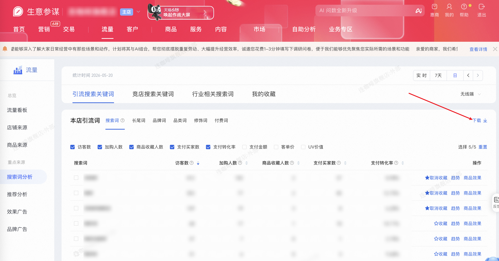

| 属性             | 值                                                                                |
| ---------------- | --------------------------------------------------------------------------------- |
| **连接器类型**   | `RPA 连接器`|
| **连接器名称**   | `ODS_流量引流搜索关键词列表下载(生意参谋RPA)`|
| **连接器代码**   | `rpa.conn.sycm.flow.drainage.keyword`|
| **操作类型**     | `文件导出`|
| **目标网页**     | `https://sycm.taobao.com/flow/monitor/keyword_assistant`|
| **适用场景**     | 导出「引流搜索关键词」明细报表，获得引流侧搜索词效果（UV、加购、收藏、支付、UV 价值等）与流量转化|
| **数据表名**     | `ods_rpa_sycm_flow_drainage_keyword_du`|
| **业务表名**     | `ODS_流量引流搜索关键词列表下载(生意参谋RPA)`|

### 目标页面

> **取数路径**：生意参谋—流量—搜索词分析—引流搜索关键词
>
> **取数链接**：[https://sycm.taobao.com/flow/monitor/keyword_assistant](https://sycm.taobao.com/flow/monitor/keyword_assistant)



### 业务入参

| 字段 | 中文释义 | 数据类型 | 必填 | 默认值 | 说明 |
| ---- | -------- | -------- | ---- | ------ | ---- |
| `date_type` | 统计时间类型 | `String` | 是 | `-` | 允许值：`LAST_7_DAYS`（近 7 天）/ `DAY`（按日） |
| `biz_date` | 业务日期 | `String` | 条件必填 | `-` | `date_type` 为 `DAY` 时必填；格式 `YYYYMMDD` 或 `YYYY-MM-DD`；不可选今日及以后；最早约 2024-06-05。`LAST_7_DAYS` 时忽略 |

### 入参样例

近 7 天：

```json
{
  "date_type": "LAST_7_DAYS"
}
```

指定自然日（`YYYYMMDD`）：

```json
{
  "date_type": "DAY",
  "biz_date": "20260905"
}
```

指定自然日（`YYYY-MM-DD`）：

```json
{
  "date_type": "DAY",
  "biz_date": "2026-08-31"
}
```

### 入参校验

```json-schema collapsed
{
  "$schema": "https://json-schema.org/draft/2020-12/schema",
  "title": "生意参谋-引流搜索关键词 - 查询入参",
  "description": "按 7天/日 导出引流搜索关键词明细",
  "type": "object",
  "properties": {
    "date_type": {
      "type": "string",
      "description": "统计时间类型。允许值：LAST_7_DAYS（近 7 天）/ DAY（按日）",
      "enum": ["LAST_7_DAYS", "DAY"]
    },
    "biz_date": {
      "type": "string",
      "description": "业务日期；date_type 为 DAY 时必填；LAST_7_DAYS 时忽略。格式 YYYYMMDD 或 YYYY-MM-DD；不可选今日及以后；最早约 2024-06-05",
      "pattern": "^(\\d{8}|\\d{4}-\\d{2}-\\d{2})$"
    }
  },
  "required": ["date_type"],
  "additionalProperties": false,
  "allOf": [
    {
      "if": {
        "properties": {
          "date_type": { "const": "DAY" }
        },
        "required": ["date_type"]
      },
      "then": {
        "required": ["biz_date"]
      }
    }
  ]
}
```

### 数据字段

| 字段            | 中文释义   | 数据类型              | 可为空 | 取数路径           | 示例 |
| --------------- | ---------- | --------------------- | ------ | ------------------ | ---- |
| `statDate`      | 统计日期   | `string` | 否     | `XLS.0.统计日期`   | 2026-04-14 |
| `keyword`       | 搜索词     | `string` | 否     | `XLS.0.搜索词`     | 内衣洗衣机 |
| `uv`            | 访客数     | `number`  | 否     | `XLS.0.访客数`     | 7 |
| `addCartUv`     | 加购人数   | `number`  | 否     | `XLS.0.加购人数`   | 0 |
| `collectUv`     | 商品收藏人数 | `number` | 否   | `XLS.0.商品收藏人数` | 0 |
| `payBuyerCnt`   | 支付买家数 | `number`  | 否     | `XLS.0.支付买家数` | 0 |
| `payConversionRatio`        | 支付转化率 | `string` | 否     | `XLS.0.支付转化率` | 0.00% |
| `payItemCnt`    | 支付件数   | `number`  | 是     | `XLS.0.支付件数`   | - |
| `payAmt`        | 支付金额   | `string` | 是     | `XLS.0.支付金额`   | - |
| `avgPrice`      | 客单价     | `number`  | 是     | `XLS.0.客单价`     | - |
| `uvValue`       | UV 价值    | `number`  | 是     | `XLS.0.UV价值`     | - |
| `dateType`      | 统计时间类型 | `String` | 否   | 附加，来自入参 `date_type` | `DAY` |
| `dateRangeStart` | 统计区间起始日 | `String` | 否 | 附加 | `2026-08-05` |
| `dateRangeEnd`  | 统计区间结束日 | `String` | 否   | 附加 | `2026-08-05` |
| `bizDate`       | 业务日期   | `string` | 否     | 附加，取区间结束日 `YYYYMMDD` | |
| `accountId`     | 授权 ID    | `string` | 否     | 附加 | |

### 数据样例

```json
[
  {
    "statDate": "2026-04-14",
    "keyword": "内衣洗衣机",
    "uv": 7,
    "addCartUv": 0,
    "collectUv": 0,
    "payBuyerCnt": 0,
    "payConversionRatio": "0.00%",
    "payAmt": "-",
    "avgPrice": "-",
    "uvValue": "-",
    "dateType": "DAY",
    "dateRangeStart": "2026-04-14",
    "dateRangeEnd": "2026-04-14",
    "bizDate": "20260414",
    "accountId": "101"
  }
]
```

---
