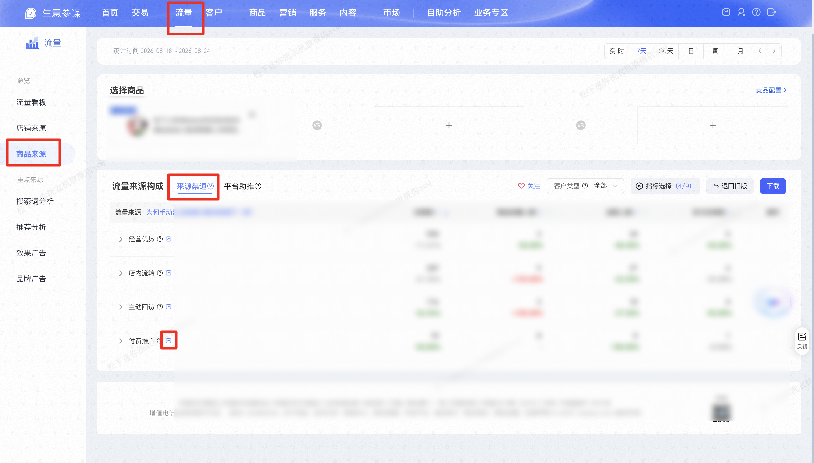

| 属性             | 值                                                                 |
| ---------------- | ------------------------------------------------------------------ |
| **连接器类型**   | `RPA 连接器`                                                       |
| **连接器名称**   | `ODS_流量商品来源流量趋势明细报表(生意参谋RPA)`                    |
| **连接器代码**   | `rpa.conn.sycm.flow.item.source.trends.report`                     |
| **操作类型**     | `文件导出`                                                         |
| **目标网页**     | `https://sycm.taobao.com/flow/monitor/itemsource`                |
| **适用场景**     | 按商品 ID、统计时间与流量来源名称下载生意参谋「流量—商品来源—来源渠道」趋势明细 |
| **数据表名**     | `ods_rpa_sycm_flow_item_source_trends_report_du`                   |
| **业务表名**     | `ODS_流量商品来源流量趋势明细报表(生意参谋RPA)`                    |

### 目标页面

> **取数路径**：生意参谋—流量—商品来源—来源渠道
>
> **取数链接**：[https://sycm.taobao.com/flow/monitor/itemsource](https://sycm.taobao.com/flow/monitor/itemsource)




### 业务入参

| 字段 | 中文释义 | 数据类型 | 必填 | 默认值 | 说明 |
| ---- | -------- | -------- | ---- | ------ | ---- |
| `item_id` | 商品 ID | `String` | 是 | — | 10~25 位数字字符串 |
| `date_type` | 统计时间类型 | `String` | 否 | `day` | 控制取数时间范围。未传时按「按日、取昨天」。可选：`day`（按日）/ `recent7`（近 7 天）/ `recent30`（近 30 天）/ `week`（按自然周）/ `month`（按自然月）。不支持 实时（实时页面无趋势下载入口） |
| `biz_date` | 业务日期 | `String` | 条件必填 | — | 格式 `YYYYMMDD` 或 `YYYY-MM-DD`，须配合 `date_type` 使用。**按日**（`day`）：可传具体日期，不传则取**昨天**。**近 7/30 天**（`recent7`/`recent30`）：无需传，传了会忽略。**按周/按月**（`week`/`month`）：**必填**；传该周或该月内任意一天即可，连接器自动扩展为整周或整月区间 |
| `flow_source` | 流量来源 | `String` | 否 | `付费推广` | 输入来源渠道中有的（如 `付费推广`、`淘宝直播`、`购物车`）。未传时默认 `付费推广`。没有该名称或下载入口不可见时返回空数据 |

### 入参样例

仅商品 ID（不传时间参数，默认取昨天单日）：

```json
{
  "item_id": "826562939262"
}
```

按商品 + 昨天（与上例等价，显式指定 `date_type=day`）：

```json
{
  "item_id": "826562939262",
  "date_type": "day"
}
```

指定自然日：

```json
{
  "item_id": "826562939262",
  "date_type": "day",
  "biz_date": "2026-08-24"
}
```

近 7 天（忽略 `biz_date`）：

```json
{
  "item_id": "826562939262",
  "date_type": "recent7"
}
```

近 30 天（忽略 `biz_date`）：

```json
{
  "item_id": "826562939262",
  "date_type": "recent30"
}
```

按周（`biz_date` 落在该周内任意一天即可）：

```json
{
  "item_id": "826562939262",
  "date_type": "week",
  "biz_date": "2026-08-20"
}
```

按月（`biz_date` 落在该月内任意一天即可）：

```json
{
  "item_id": "826562939262",
  "date_type": "month",
  "biz_date": "2026-01-27"
}
```

指定流量来源（精确匹配来源树行名）：

```json
{
  "item_id": "826562939262",
  "date_type": "day",
  "flow_source": "淘宝直播"
}
```

### 入参校验

```json-schema collapsed
{
  "$schema": "https://json-schema.org/draft/2020-12/schema",
  "title": "生意参谋-流量-商品来源-来源渠道 - 查询入参",
  "description": "按商品 ID、统计时间与流量来源名称下载生意参谋「流量—商品来源—来源渠道」趋势明细，输出按日拆分的访客、浏览、加购、支付等指标。账号未开店或未订购生意参谋标准包时任务失败",
  "type": "object",
  "properties": {
    "item_id": {
      "type": "string",
      "description": "商品 ID，10~25 位数字字符串",
      "pattern": "^\\d{10,25}$"
    },
    "date_type": {
      "type": "string",
      "description": "统计时间类型，未传默认 day。可选值：recent7（7天）/ recent30（30天）/ day（日）/ week（周）/ month（月）。不支持 today",
      "enum": ["recent7", "recent30", "day", "week", "month"],
      "default": "day"
    },
    "biz_date": {
      "type": "string",
      "description": "业务日期，格式 YYYYMMDD 或 YYYY-MM-DD。按日（day）时不传则取昨天；按周/按月（week/month）时必填，传该周/月内任意一天并归一化为整周/整月；近 7/30 天（recent7/recent30）时无需传",
      "pattern": "^(\\d{8}|\\d{4}-\\d{2}-\\d{2})$"
    },
    "flow_source": {
      "type": "string",
      "description": "流量来源名称，与来源树行名精确匹配。未传默认付费推广；未匹配到则返回空数据",
      "default": "付费推广",
      "minLength": 1
    }
  },
  "required": ["item_id"],
  "additionalProperties": false,
  "allOf": [
    {
      "if": {
        "properties": { "date_type": { "enum": ["week", "month"] } },
        "required": ["date_type"]
      },
      "then": { "required": ["biz_date"] }
    }
  ]
}
```

### 数据字段

| 字段 | 中文释义 | 数据类型 | 可为空 | 取数路径 | 示例 |
| ---- | -------- | -------- | ------ | -------- | ---- |
| `statDate` | 统计时间 | `String` | 否 | `XLS.0.统计时间` | `2026-07-26` |
| `uv` | 访客数 | `String` | 是 | `XLS.0.访客数` | `4` |
| `pv` | 浏览量 | `String` | 是 | `XLS.0.浏览量` | `4` |
| `addCartUv` | 加购人数 | `String` | 是 | `XLS.0.加购人数` | `-` |
| `collectUv` | 商品收藏人数 | `String` | 是 | `XLS.0.商品收藏人数` | `-` |
| `payBuyerCnt` | 支付买家数 | `String` | 是 | `XLS.0.支付买家数` | `-` |
| `payConversionRatio` | 支付转化率 | `String` | 是 | `XLS.0.支付转化率` | `-` |
| `payAmt` | 支付金额 | `String` | 是 | `XLS.0.支付金额` | `-` |
| `avgPrice` | 客单价 | `String` | 是 | `XLS.0.客单价` | `-` |
| `payItemCnt` | 支付件数 | `String` | 是 | `XLS.0.支付件数` | `-` |
| `itemId` | 商品 ID | `String` | 否 | 附加，来自入参 `item_id` | `826****262` (已脱敏) |
| `dateType` | 统计时间类型 | `String` | 否 | 附加，来自入参 `date_type` | `day` |
| `flowSource` | 流量来源 | `String` | 否 | 附加，来自入参 `flow_source` | `淘宝直播` |
| `dateRangeStart` | 统计区间起始日 | `String` | 否 | 附加 | `2026-08-24` |
| `dateRangeEnd` | 统计区间结束日 | `String` | 否 | 附加 | `2026-08-24` |
| `bizDate` | 业务日期 | `String` | 否 | 附加，取统计区间结束日 `YYYYMMDD` | `20260824` |
| `accountId` | 授权 ID | `String` | 否 | 附加 | `1****1` (已脱敏) |

### 数据样例

```json
[
  {
    "statDate": "2026-07-26",
    "uv": "4",
    "pv": "4",
    "addCartUv": "-",
    "collectUv": "-",
    "payBuyerCnt": "-",
    "payConversionRatio": "-",
    "payAmt": "-",
    "avgPrice": "-",
    "payItemCnt": "-",
    "bizDate": "20260824",
    "accountId": "1****1",
    "itemId": "826****262",
    "dateType": "day",
    "flowSource": "淘宝直播",
    "dateRangeStart": "2026-08-24",
    "dateRangeEnd": "2026-08-24"
  }
]
```

---
