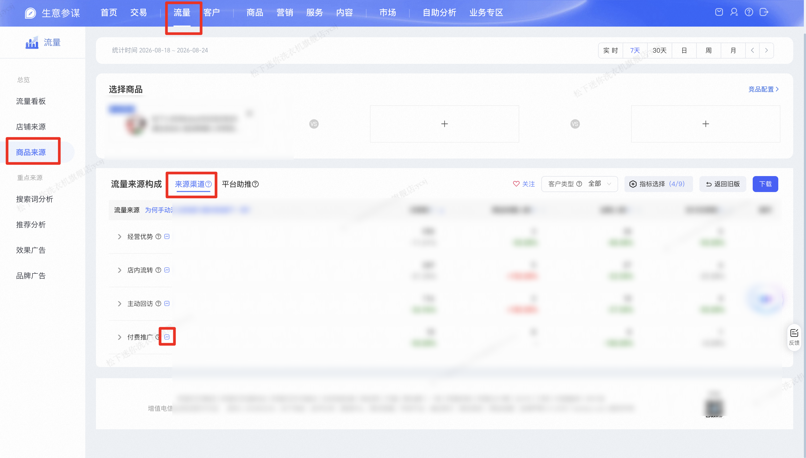

| 属性             | 值                                                                 |
| ---------------- | ------------------------------------------------------------------ |
| **连接器类型**   | `RPA 连接器`                                                       |
| **连接器名称**   | `ODS_流量商品来源流量趋势明细报表(生意参谋RPA)`                    |
| **连接器代码**   | `rpa.conn.sycm.flow.item.source.trends.report`                     |
| **操作类型**     | `文件导出`                                                         |
| **目标网页**     | `https://sycm.taobao.com/flow/monitor/itemsource`                |
| **适用场景**     | 按商品 ID、统计时间与流量来源名称下载生意参谋「流量—商品来源—来源渠道」趋势明细 |
| **数据表名**     | `ods_rpa_sycm_flow_item_source_trends_report_du`                   |
| **业务表名**     | `ODS_流量商品来源流量趋势明细报表(生意参谋RPA)`                    |

### 目标页面

> **取数路径**：生意参谋—流量—商品来源—来源渠道
>
> **取数链接**：[https://sycm.taobao.com/flow/monitor/itemsource](https://sycm.taobao.com/flow/monitor/itemsource)




### 业务入参

| 字段 | 中文释义 | 数据类型 | 必填 | 默认值 | 说明 |
| ---- | -------- | -------- | ---- | ------ | ---- |
| `item_id` | 商品 ID | `String` | 是 | `-` | 10~25 位数字字符串 |
| `date_type` | 统计时间类型 | `String` | 是 | `-` | 允许值：`LAST_7_DAYS`（近 7 天）/ `LAST_30_DAYS`（近 30 天）/ `DAY`（按日）/ `WEEK`（自然周）/ `MONTH`（自然月） |
| `biz_date` | 业务日期 | `String` | 条件必填 | `-` | `date_type` 为 `DAY`/`WEEK`/`MONTH` 时必填；始终填一天，格式 `YYYYMMDD` 或 `YYYY-MM-DD`；`LAST_7_DAYS`/`LAST_30_DAYS` 时忽略。`DAY` 不可选今日及以后；`WEEK`/`MONTH` 用这一天定位所在周/月，不可选本周/本月的日期；`DAY`/`WEEK` 最早 today-800；`MONTH` 最早约本年 1 月 |
| `flow_source` | 流量来源 | `String` | 否 | `付费推广` | 填写来源列表名称；未匹配到则返回空数据 |

### 入参样例

近 7 天：

```json
{
  "item_id": "826562939262",
  "date_type": "LAST_7_DAYS"
}
```

近 30 天：

```json
{
  "item_id": "826562939262",
  "date_type": "LAST_30_DAYS"
}
```

指定自然日：

```json
{
  "item_id": "826562939262",
  "date_type": "DAY",
  "biz_date": "2026-08-24"
}
```

按周：

```json
{
  "item_id": "826562939262",
  "date_type": "WEEK",
  "biz_date": "2026-08-20"
}
```

按月：

```json
{
  "item_id": "826562939262",
  "date_type": "MONTH",
  "biz_date": "2026-01-27"
}
```

指定流量来源：

```json
{
  "item_id": "826562939262",
  "date_type": "DAY",
  "biz_date": "2026-08-24",
  "flow_source": "淘宝直播"
}
```

### 入参校验

```json-schema collapsed
{
  "$schema": "https://json-schema.org/draft/2020-12/schema",
  "title": "生意参谋-流量-商品来源-来源渠道 - 查询入参",
  "description": "按商品 ID、统计时间与流量来源名称下载生意参谋「流量—商品来源—来源渠道」趋势明细，输出按日拆分的访客、浏览、加购、支付等指标。账号未开店或未订购生意参谋标准包时任务失败",
  "type": "object",
  "properties": {
    "item_id": {
      "type": "string",
      "description": "商品 ID，10~25 位数字字符串",
      "pattern": "^\\d{10,25}$"
    },
    "date_type": {
      "type": "string",
      "description": "统计时间类型。允许值：LAST_7_DAYS（近 7 天）/ LAST_30_DAYS（近 30 天）/ DAY（按日）/ WEEK（自然周）/ MONTH（自然月）",
      "enum": ["LAST_7_DAYS", "LAST_30_DAYS", "DAY", "WEEK", "MONTH"]
    },
    "biz_date": {
      "type": "string",
      "description": "业务日期；date_type 为 DAY/WEEK/MONTH 时必填；始终填一天；LAST_7_DAYS/LAST_30_DAYS 时忽略。格式 YYYYMMDD 或 YYYY-MM-DD；DAY 不可选今日及以后；WEEK/MONTH 用这一天定位所在周/月，不可选本周/本月的日期；DAY/WEEK 最早 today-800；MONTH 最早约本年 1 月",
      "pattern": "^(\\d{8}|\\d{4}-\\d{2}-\\d{2})$"
    },
    "flow_source": {
      "type": "string",
      "description": "流量来源名称，填写来源列表名称。未匹配到则返回空数据",
      "default": "付费推广",
      "minLength": 1
    }
  },
  "required": ["item_id", "date_type"],
  "additionalProperties": false,
  "allOf": [
    {
      "if": {
        "properties": { "date_type": { "enum": ["DAY", "WEEK", "MONTH"] } },
        "required": ["date_type"]
      },
      "then": { "required": ["biz_date"] }
    }
  ]
}
```

### 数据字段

| 字段 | 中文释义 | 数据类型 | 可为空 | 取数路径 | 示例 |
| ---- | -------- | -------- | ------ | -------- | ---- |
| `statDate` | 统计时间 | `String` | 否 | `XLS.0.统计时间` | `2026-07-26` |
| `uv` | 访客数 | `String` | 是 | `XLS.0.访客数` | `4` |
| `pv` | 浏览量 | `String` | 是 | `XLS.0.浏览量` | `4` |
| `addCartUv` | 加购人数 | `String` | 是 | `XLS.0.加购人数` | `-` |
| `collectUv` | 商品收藏人数 | `String` | 是 | `XLS.0.商品收藏人数` | `-` |
| `payBuyerCnt` | 支付买家数 | `String` | 是 | `XLS.0.支付买家数` | `-` |
| `payConversionRatio` | 支付转化率 | `String` | 是 | `XLS.0.支付转化率` | `-` |
| `payAmt` | 支付金额 | `String` | 是 | `XLS.0.支付金额` | `-` |
| `avgPrice` | 客单价 | `String` | 是 | `XLS.0.客单价` | `-` |
| `payItemCnt` | 支付件数 | `String` | 是 | `XLS.0.支付件数` | `-` |
| `itemId` | 商品 ID | `String` | 否 | 附加，来自入参 `item_id` | `826****262` (已脱敏) |
| `dateType` | 统计时间类型 | `String` | 否 | 附加，来自入参 `date_type` | `DAY` |
| `flowSource` | 流量来源 | `String` | 否 | 附加，来自入参 `flow_source` | `淘宝直播` |
| `dateRangeStart` | 统计区间起始日 | `String` | 否 | 附加 | `2026-08-24` |
| `dateRangeEnd` | 统计区间结束日 | `String` | 否 | 附加 | `2026-08-24` |
| `bizDate` | 业务日期 | `String` | 否 | 附加，取统计区间结束日 `YYYYMMDD` | `20260824` |
| `accountId` | 授权 ID | `String` | 否 | 附加 | `1****1` (已脱敏) |

### 数据样例

```json
[
  {
    "statDate": "2026-07-26",
    "uv": "4",
    "pv": "4",
    "addCartUv": "-",
    "collectUv": "-",
    "payBuyerCnt": "-",
    "payConversionRatio": "-",
    "payAmt": "-",
    "avgPrice": "-",
    "payItemCnt": "-",
    "bizDate": "20260824",
    "accountId": "1****1",
    "itemId": "826****262",
    "dateType": "DAY",
    "flowSource": "淘宝直播",
    "dateRangeStart": "2026-08-24",
    "dateRangeEnd": "2026-08-24"
  }
]
```

---
