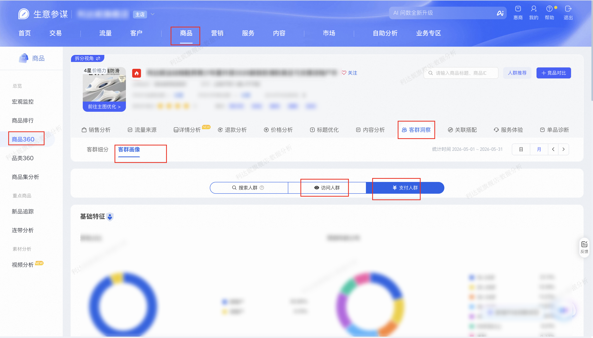

| 属性             | 值                                                                 |
| ---------------- | ------------------------------------------------------------------ |
| **连接器类型**   | `RPA 连接器`                                                       |
| **连接器名称**   | `ODS_商品360客群画像信息表(生意参谋RPA)`                           |
| **连接器代码**   | `rpa.conn.sycm.item.archives.customer.profile`                     |
| **操作类型**     | `页面解析`                                                         |
| **目标网页**     | `https://sycm.taobao.com/cc/item_archives`                         |
| **适用场景**     | 按商品 ID 与业务日期采集生意参谋商品360客群洞察中的客群画像（访问人群 / 支付人群） |
| **数据表名**     | `ods_rpa_sycm_item_archives_customer_profile_du`                   |
| **业务表名**     | `ODS_商品360客群画像信息表(生意参谋RPA)`                           |

### 目标页面

> **取数路径**：生意参谋—商品—商品360—客群洞察—客群画像
>
> **取数链接**：[https://sycm.taobao.com/cc/item_archives](https://sycm.taobao.com/cc/item_archives)



### 业务入参

| 字段 | 中文释义 | 数据类型 | 必填 | 默认值 | 说明 |
| ---- | -------- | -------- | ---- | ------ | ---- |
| `item_id` | 商品 ID | `String` | 是 | — | 仅允许纯数字，长度 10～20 位；含字母/符号/过短/超长均判输入参数错误 |
| `date_type` | 统计粒度 | `String` | 否 | `DAY` | 允许值：`DAY`(日) / `MONTH`(月)。决定页面点选「日」或「月」 |
| `biz_date` | 业务日期 | `String` | 否 | `DAY` 时为昨天（T-1）；`MONTH` 时为上一完整月首日 | 仅支持 `YYYYMMDD` / `YYYY-MM-DD`。`DAY`：点选到日；硬校验近 400 天且不含今天（T-400～T-1）；有数据窗口近 90 天（today-90～T-1），窗外软返回「暂无数据」。`MONTH`：只取入参年月点选月；仅支持当前月之前连续 3 个完整月 |

> 执行前会在商品360搜索框校验 `item_id` 是否可命中；未搜到相关商品时返回空数据（`没有相关商品: <item_id>`）。
>
> 访问人群、支付人群任一侧页面提示「不统计客群画像」（样本量不足）时跳过该侧；两侧皆无则返回空数据（文案：`本店商品人群样本量小于300人, 不统计客群画像`）。搜索人群不采集。

### 入参样例

日模式：

```json
{
  "item_id": "934****931",
  "date_type": "DAY",
  "biz_date": "20260715"
}
```

月模式（`biz_date` 仍传年月日，只取年月）：

```json
{
  "item_id": "934****931",
  "date_type": "MONTH",
  "biz_date": "20260515"
}
```

未传 `date_type` / `biz_date`（默认 `DAY` + 昨天）：

```json
{
  "item_id": "934****931"
}
```

### 入参校验

```json-schema collapsed
{
  "$schema": "https://json-schema.org/draft/2020-12/schema",
  "title": "生意参谋-商品360-客群画像 - 查询入参",
  "description": "按商品 ID 与业务日期采集生意参谋商品360客群洞察中的客群画像（访问人群 / 支付人群）",
  "type": "object",
  "properties": {
    "item_id": {
      "type": "string",
      "description": "商品 ID；仅允许纯数字，长度 10～20 位",
      "pattern": "^\\d{10,20}$",
      "minLength": 10,
      "maxLength": 20
    },
    "date_type": {
      "type": "string",
      "description": "统计粒度；允许值 DAY(日) / MONTH(月)；未传默认 DAY",
      "enum": ["DAY", "MONTH"],
      "default": "DAY"
    },
    "biz_date": {
      "type": "string",
      "description": "业务日期；仅 YYYYMMDD / YYYY-MM-DD。DAY 未填默认 T-1；MONTH 未填默认上一完整月首日。DAY 硬范围 T-400～T-1、有数据窗口近 90 天窗外软空；MONTH 只取年月且为当前月之前连续 3 个完整月",
      "pattern": "^(\\d{8}|\\d{4}-\\d{2}-\\d{2})$"
    }
  },
  "required": ["item_id"],
  "additionalProperties": false
}
```

### 数据字段

:::field-tree
@define 画像明细项
| `label` | 维度标签 | `String` | 否 | 页面解析；新老占比经枚举映射（`Y`→新客户 / `N`→老客户） | `新客户` |
| `ratio` | 占比 | `String` | 是 | 页面解析后格式化为百分比字符串 | `98.99%` |
| `rank` | 排名 | `Number` | 是 | 地域市/省、浏览品牌偏好按接口顺序生成 | `1` |
| `count` | 人数 | `Number` | 是 | 仅预测消费层级、淘气值分布输出 | `38489` |

@define 画像模块
| `title` | 模块标题 | `String` | 否 | 页面解析 | `新老占比` |
| `items` @画像明细项 | 模块明细 | `List[Dict]` | 否 | 页面解析 | 见数据样例 |

@define 人群画像
| `crowdType` | 人群类型 | `String` | 否 | 内置映射：`VISIT`（访问人群）/ `PAY`（支付人群） | `VISIT` |
| `basicFeatures` @画像模块 | 基础特征 | `List[Dict]` | 否 | 页面解析；含新老占比、预测年龄、预测性别、兴趣爱好 | 见数据样例 |
| `region` @画像模块 | 地域 | `List[Dict]` | 否 | 页面解析；含预测地域（市）、预测地域（省） | 见数据样例 |
| `preferenceFeatures` @画像模块 | 偏好特征 | `List[Dict]` | 否 | 页面解析；含浏览类目偏好、浏览品牌偏好 | 见数据样例 |
| `consumptionFeatures` @画像模块 | 消费特征 | `List[Dict]` | 否 | 页面解析；含预测消费层级、淘气值分布 | 见数据样例 |

| 字段 | 中文释义 | 数据类型 | 可为空 | 取数路径 | 示例 |
| ---- | -------- | -------- | ------ | -------- | ---- |
| `itemTitle` | 商品标题 | `String` | 否 | 页面解析（头图区） | `利达妮****拖户外` (已脱敏) |
| `itemId` | 主商品 ID | `String` | 否 | 页面解析（头图区「主商品ID」） | `934****931` (已脱敏) |
| `articleNumber` | 货号 | `String` | 是 | 页面解析（头图区「货号」；无则空串） | `LDN****T65` (已脱敏) |
| `queryDate` | 查询入参日期 | `String` | 否 | 来自入参 `biz_date`（日格式；未传则按 `date_type` 默认） | `20260515` |
| `dateType` | 日期粒度 | `String` | 否 | 由入参 `date_type` 映射：`DAY`→`day` / `MONTH`→`month` | `month` |
| `statisticsTime` | 页面实际统计时间 | `String` | 否 | 页面解析；单日为 `YYYY-MM-DD`，月区间为 `YYYY-MM-DD ~ YYYY-MM-DD` | `2026-05-01 ~ 2026-05-31` |
| `bizDate` | 业务日期 | `String` | 否 | 附加（任务执行当天，`YYYYMMDD`） | `20260731` |
| `accountId` | 授权 ID | `String` | 否 | 附加 | `1****7` (已脱敏) |
| `visit` @人群画像 | 访问人群画像 | `Dict` | 是 | 页面解析；字典内含 `crowdType=VISIT`；无数据时为 `null` | 见数据样例 |
| `pay` @人群画像 | 支付人群画像 | `Dict` | 是 | 页面解析；字典内含 `crowdType=PAY`；无数据时为 `null` | 见数据样例 |
:::

> **空数据场景**：
>
> | 场景 | 输出 |
> | ---- | ---- |
> | `item_id` 未搜到相关商品 | `data=[]`，文案含「没有相关商品」 |
> | 日模式落在近 90 天有数据窗口之外 | `data=[]`，文案「暂无数据」 |
> | 访问/支付两侧样本量均不足 | `data=[]`，文案「本店商品人群样本量小于300人, 不统计客群画像」 |
> | 仅一侧有画像 | 有数据侧为字典，另一侧为 `null` |

### 数据样例

> 样例来自真实运行（月模式）；公共字段只出现一次，`visit` / `pay` 为含 `crowdType` 的画像字典；各 `items` 仅保留 1 条示意，实际输出为接口全量。

```json
[
  {
    "itemTitle": "利达妮****拖户外",
    "itemId": "934****931",
    "articleNumber": "LDN****T65",
    "queryDate": "20260515",
    "dateType": "month",
    "statisticsTime": "2026-05-01 ~ 2026-05-31",
    "bizDate": "20260731",
    "accountId": "1****7",
    "visit": {
      "crowdType": "VISIT",
      "basicFeatures": [
        {
          "title": "新老占比",
          "items": [
            {
              "label": "新客户",
              "ratio": "98.99%"
            }
          ]
        },
        {
          "title": "预测年龄分布",
          "items": [
            {
              "label": "18-24岁",
              "ratio": "13.71%"
            }
          ]
        },
        {
          "title": "预测性别占比",
          "items": [
            {
              "label": "男",
              "ratio": "53.14%"
            }
          ]
        },
        {
          "title": "兴趣爱好(偏好度)",
          "items": [
            {
              "label": "买鞋控",
              "ratio": "10.94%"
            }
          ]
        }
      ],
      "region": [
        {
          "title": "预测地域（市）",
          "items": [
            {
              "label": "广州市",
              "ratio": "3.19%",
              "rank": 1
            }
          ]
        },
        {
          "title": "预测地域（省）",
          "items": [
            {
              "label": "广东省",
              "ratio": "15.89%",
              "rank": 1
            }
          ]
        }
      ],
      "preferenceFeatures": [
        {
          "title": "浏览类目偏好（除虚拟类目）",
          "items": [
            {
              "label": "居家凉拖/凉鞋",
              "ratio": "45.86%"
            }
          ]
        },
        {
          "title": "浏览品牌偏好",
          "items": [
            {
              "label": "TZL****布艺）",
              "ratio": "45.00%",
              "rank": 1
            }
          ]
        }
      ],
      "consumptionFeatures": [
        {
          "title": "预测消费层级",
          "items": [
            {
              "label": "第一层级",
              "ratio": "77.06%",
              "count": 38489
            }
          ]
        },
        {
          "title": "淘气值分布",
          "items": [
            {
              "label": "T0",
              "ratio": "2.17%",
              "count": 1082
            }
          ]
        }
      ]
    },
    "pay": {
      "crowdType": "PAY",
      "basicFeatures": [
        {
          "title": "新老占比",
          "items": [
            {
              "label": "新客户",
              "ratio": "93.85%"
            }
          ]
        },
        {
          "title": "预测年龄分布",
          "items": [
            {
              "label": "18-24岁",
              "ratio": "21.11%"
            }
          ]
        },
        {
          "title": "预测性别占比",
          "items": [
            {
              "label": "男",
              "ratio": "54.10%"
            }
          ]
        },
        {
          "title": "兴趣爱好(偏好度)",
          "items": [
            {
              "label": "数码达人",
              "ratio": "9.55%"
            }
          ]
        }
      ],
      "region": [
        {
          "title": "预测地域（市）",
          "items": [
            {
              "label": "广州市",
              "ratio": "3.18%",
              "rank": 1
            }
          ]
        },
        {
          "title": "预测地域（省）",
          "items": [
            {
              "label": "广东省",
              "ratio": "16.32%",
              "rank": 1
            }
          ]
        }
      ],
      "preferenceFeatures": [
        {
          "title": "浏览类目偏好（除虚拟类目）",
          "items": [
            {
              "label": "居家凉拖/凉鞋",
              "ratio": "54.68%"
            }
          ]
        },
        {
          "title": "浏览品牌偏好",
          "items": [
            {
              "label": "TZL****布艺）",
              "ratio": "86.71%",
              "rank": 1
            }
          ]
        }
      ],
      "consumptionFeatures": [
        {
          "title": "预测消费层级",
          "items": [
            {
              "label": "第一层级",
              "ratio": "75.25%",
              "count": 3371
            }
          ]
        },
        {
          "title": "淘气值分布",
          "items": [
            {
              "label": "T0",
              "ratio": "1.56%",
              "count": 70
            }
          ]
        }
      ]
    }
  }
]
```

---
