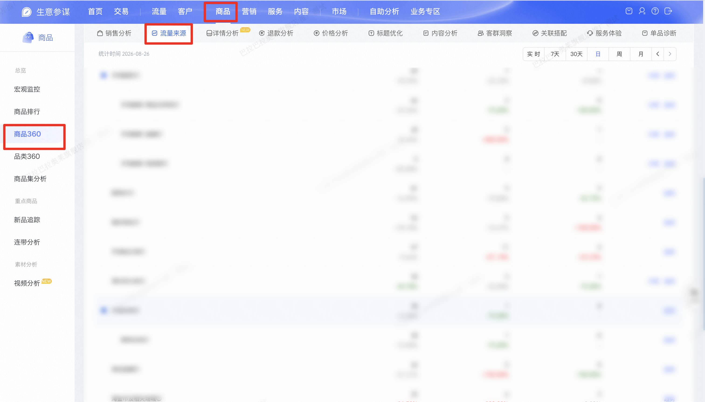
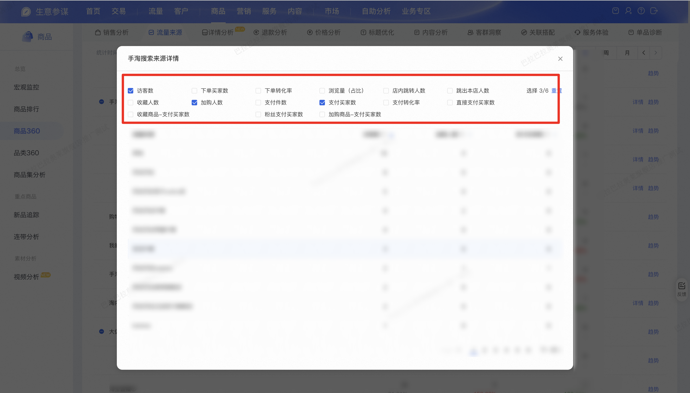

| 属性             | 值                  |
| ---------------- | ------------------- |
| **连接器类型**   | `RPA 连接器`|
| **连接器名称**   | `ODS_商品360流量来源关键词详情旧版页面(生意参谋RPA)`|
| **连接器代码**   | `rpa.conn.sycm.item.archives.flow.source.keyword.detail.old.page`|
| **操作类型**     | `页面解析`|
| **目标网页**     | `https://sycm.taobao.com/cc/item_archives`|
| **适用场景**     | 在生意参谋商品360旧版流量来源页，按来源类型进入关键词详情弹窗，翻页采集所选指标数据|
| **数据表名**     | `ods_rpa_sycm_item_archives_flow_source_keyword_detail_old_page_du`|
| **业务表名**     | `ODS_商品360流量来源关键词详情旧版页面(生意参谋RPA)`|

### 目标页面

> **取数路径**：生意参谋—商品—商品360—流量来源—详情
>
> **取数链接**：[https://sycm.taobao.com/cc/item_archives](https://sycm.taobao.com/cc/item_archives?activeKey=flow)






### 业务入参

| 字段 | 中文释义 | 数据类型 | 必填 | 默认值 | 说明 |
| ---- | -------- | -------- | ---- | ------ | ---- |
| `item_id` | 商品 ID | `String` | 是 | — | 10~25 位数字 |
| `traffic_source` | 来源类型 | `List[String]` \| `String` | 是 | — | 最多 2 个；支持 JSON 数组或英文逗号分隔。可选值：`TAOBAO_SEARCH`（手淘搜索）/ `TAOBAO_SEARCH_PRODUCT_AND_OTHER`（手淘搜索-商品及其他）/ `TAOBAO_SEARCH_LIVE`（手淘搜索-直播）/ `TAOBAO_SEARCH_SHORT_VIDEO`（手淘搜索-短视频）/ `KEYWORD_PROMOTION`（关键词推广）/ `SHOP_SUPER_LINK`（店铺超链）/ `TAO_INTERNAL_UNCLASSIFIED`（淘内待分类） |
| `date_type` | 统计时间类型 | `String` | 否 | `day` | 可选值：`today`（今天）/ `recent7`（7天）/ `recent30`（30天）/ `day`（日）/ `week`（周）/ `month`（月） |
| `biz_date` | 统计日期 | `String` | 条件必填 | — | `date_type` 为 `week` / `month` 时必填；`day` 且未传时默认 T-1；`today` / `recent7` / `recent30` 时忽略。格式：`YYYYMMDD` 或 `YYYY-MM-DD` |
| `device_type` | 终端 | `String` | 否 | — | 可选值：`WIRELESS`（无线端）/ `PC`（PC端）；未传则保持页面默认 |
| `conversion_attribution` | 转化归属 | `String` | 否 | — | 可选值：`EVERY_VISIT`（每一次访问来源）/ `FIRST_VISIT`（第一次访问来源）/ `LAST_VISIT`（最后一次访问来源）；未传则保持页面默认 |
| `detail_metrics` | 详情弹窗指标 | `List[String]` \| `String` | 否 | — | 最多 6 个；支持 JSON 数组或英文逗号分隔；未传则保持页面默认勾选（访客数、加购人数、支付买家数）。可选值：`UV`（访客数）/ `ORDER_BUYER_CNT`（下单买家数）/ `ORDER_CVR`（下单转化率）/ `PV`（浏览量（占比））/ `IN_STORE_JUMP_UV`（店内跳转人数）/ `BOUNCE_UV`（跳出本店人数）/ `FAVORITE_UV`（收藏人数）/ `ADD_CART_UV`（加购人数）/ `PAY_ITEM_CNT`（支付件数）/ `PAY_BUYER_CNT`（支付买家数）/ `PAY_CVR`（支付转化率）/ `DIRECT_PAY_BUYER_CNT`（直接支付买家数）/ `FAVORITE_PAY_BUYER_CNT`（收藏商品-支付买家数）/ `FAN_PAY_BUYER_CNT`（粉丝支付买家数）/ `ADD_CART_PAY_BUYER_CNT`（加购商品-支付买家数）。**输出 `value` 内的键名与所选指标中文名一致，未选指标不会出现在输出中** |

### 入参样例

与 `.mock.json` 默认调试入参一致（未传 `detail_metrics`，沿用页面默认三指标）：

```json
{
  "item_id": "947****749",
  "date_type": "day",
  "biz_date": "2026-08-26",
  "traffic_source": ["TAOBAO_SEARCH", "KEYWORD_PROMOTION"]
}
```

### 入参校验

```json-schema collapsed
{
  "$schema": "https://json-schema.org/draft/2020-12/schema",
  "title": "生意参谋-商品360流量来源关键词详情（旧版页） - 查询入参",
  "description": "在生意参谋商品360旧版流量来源页，按来源类型进入关键词详情弹窗，翻页采集所选指标数据",
  "type": "object",
  "properties": {
    "item_id": {
      "type": "string",
      "description": "商品 ID，10~25 位数字",
      "pattern": "^\\d{10,25}$"
    },
    "traffic_source": {
      "description": "来源类型，最多 2 个；支持字符串（英文逗号分隔）或字符串数组",
      "oneOf": [
        {
          "type": "string",
          "minLength": 1
        },
        {
          "type": "array",
          "items": {
            "type": "string",
            "enum": [
              "TAOBAO_SEARCH",
              "TAOBAO_SEARCH_PRODUCT_AND_OTHER",
              "TAOBAO_SEARCH_LIVE",
              "TAOBAO_SEARCH_SHORT_VIDEO",
              "KEYWORD_PROMOTION",
              "SHOP_SUPER_LINK",
              "TAO_INTERNAL_UNCLASSIFIED"
            ]
          },
          "minItems": 1,
          "maxItems": 2,
          "uniqueItems": true
        }
      ]
    },
    "date_type": {
      "type": "string",
      "description": "统计时间类型",
      "enum": ["today", "recent7", "recent30", "day", "week", "month"],
      "default": "day"
    },
    "biz_date": {
      "type": "string",
      "description": "统计日期；week/month 时必填；day 未传默认 T-1",
      "pattern": "^(\\d{8}|\\d{4}-\\d{2}-\\d{2})$"
    },
    "device_type": {
      "type": "string",
      "description": "终端",
      "enum": ["WIRELESS", "PC"]
    },
    "conversion_attribution": {
      "type": "string",
      "description": "转化归属",
      "enum": ["EVERY_VISIT", "FIRST_VISIT", "LAST_VISIT"]
    },
    "detail_metrics": {
      "description": "详情弹窗指标，最多 6 个；支持字符串（英文逗号分隔）或字符串数组",
      "oneOf": [
        {
          "type": "string",
          "minLength": 1
        },
        {
          "type": "array",
          "items": {
            "type": "string",
            "enum": [
              "UV",
              "ORDER_BUYER_CNT",
              "ORDER_CVR",
              "PV",
              "IN_STORE_JUMP_UV",
              "BOUNCE_UV",
              "FAVORITE_UV",
              "ADD_CART_UV",
              "PAY_ITEM_CNT",
              "PAY_BUYER_CNT",
              "PAY_CVR",
              "DIRECT_PAY_BUYER_CNT",
              "FAVORITE_PAY_BUYER_CNT",
              "FAN_PAY_BUYER_CNT",
              "ADD_CART_PAY_BUYER_CNT"
            ]
          },
          "minItems": 1,
          "maxItems": 6,
          "uniqueItems": true
        }
      ]
    }
  },
  "required": ["item_id", "traffic_source"],
  "allOf": [
    {
      "if": {
        "properties": {
          "date_type": {
            "enum": ["week", "month"]
          }
        },
        "required": ["date_type"]
      },
      "then": {
        "required": ["biz_date"]
      }
    }
  ],
  "additionalProperties": false
}
```

### 数据字段


| 字段 | 中文释义 | 数据类型 | 可为空 | 取数路径 | 示例 |
| ---- | -------- | -------- | ------ | -------- | ---- |
| `id` | 行序号 | `Number` | 否 | 序号从 1 递增 | 1 |
| `value` | 详情行数据 | `Dict` | 否 | 页面解析（键名为页面中文表头） | 见数据样例 `value` |
| `taskId` | 任务 ID | `String` | 否 | 附加 | `dev****f02` (已脱敏) |
| `bizDate` | 业务日期 | `String` | 否 | 附加 | `20260831` |
| `accountId` | 授权 ID | `String` | 否 | 附加 | `1****8` (已脱敏) |

### 数据样例


```json
[
  {
    "id": 1,
    "value": {
      "流量来源": "其他",
      "访客数": 18,
      "加购人数": 4,
      "支付买家数": 0
    },
    "bizDate": "20260831",
    "accountId": "1****8",
    "taskId": "dev****f02"
  }
]
```

---
