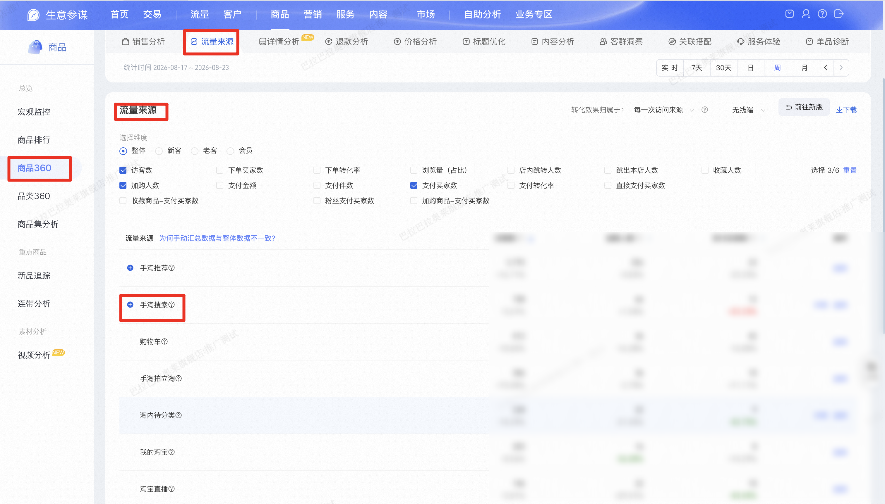
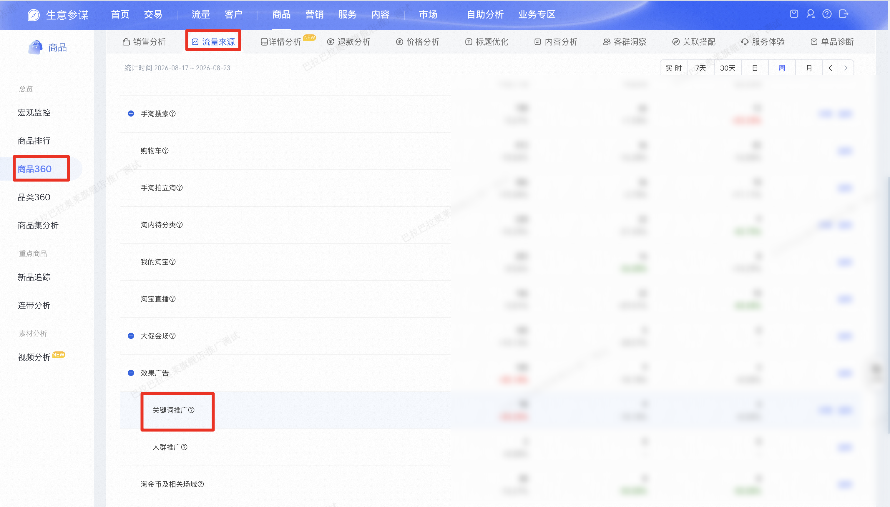

| 属性             | 值                                                                                      |
| ---------------- | --------------------------------------------------------------------------------------- |
| **连接器类型**   | `RPA 连接器`                                                                            |
| **连接器名称**   | `ODS_商品360流量来源关键词详情旧版页面(生意参谋RPA)`                                    |
| **连接器代码**   | `rpa.conn.sycm.item.archives.flow.source.keyword.detail.old.page`                     |
| **操作类型**     | `页面解析`                                                                              |
| **目标网页**     | `https://sycm.taobao.com/cc/item_archives`                                              |
| **适用场景**     | 按商品 ID 与统计时间在商品360旧版流量来源页采集「手淘搜索」「关键词推广」详情弹窗中的关键词级流量指标 |
| **数据表名**     | `ods_rpa_sycm_item_archives_flow_source_keyword_detail_old_page_du`                   |
| **业务表名**     | `ODS_商品360流量来源关键词详情旧版页面(生意参谋RPA)`                                    |

### 目标页面

> **取数路径**：生意参谋—商品—商品360—流量来源—手淘搜索/关键词推广—详情
>
> **取数链接**：[https://sycm.taobao.com/cc/item_archives](https://sycm.taobao.com/cc/item_archives?activeKey=flow)





页面可能默认展示新版 UI，连接器会自动切换至旧版并校验统计时间是否生效。当前固定采集「手淘搜索」「关键词推广」两个来源行的详情弹窗数据；商品无对应来源行时跳过该来源（例如未开通关键词推广、来源表仅有「手淘搜索」时，任务仍正常成功，仅返回手淘搜索的关键词详情）。来源表整体「暂无数据」，或两个来源均无详情数据时，返回 `success=true`、`message=暂无数据`、`data=[]`；采集成功时 `message=商品360流量来源关键词详情采集完成, 共计 N 条`（N 为实际条数）。「商品不是该店铺的」「压力山大」会立即失败。

### 业务入参

| 字段 | 中文释义 | 数据类型 | 必填 | 默认值 | 说明 |
| ---- | -------- | -------- | ---- | ------ | ---- |
| `selfItemId` | 商品 ID | `String` | 是 | — | 10~15 位数字字符串 |
| `date_type` | 统计时间类型 | `String` | 否 | `day` | 可选值：`recent7`（7天）/ `recent30`（30天）/ `day`（日）/ `week`（周）/ `month`（月） |
| `biz_date` | 业务日期 | `String` | 条件必填 | `day` 都空则昨日 T-1 | 格式 `YYYYMMDD` 或 `YYYY-MM-DD`。`week`/`month` 必填；`recent7`/`recent30` 忽略本参数。日可选 T-800 ~ T-1；周须为已结束的完整自然周；月须为当年已结束的完整自然月 |
| `traffic_source` | 流量来源 | `String` | 否 | — | 预留字段，当前未使用；固定采集手淘搜索与关键词推广 |

### 入参样例

按商品 + 默认昨天：

```json
{
  "selfItemId": "947040935749",
  "date_type": "day"
}
```

指定自然月：

```json
{
  "selfItemId": "947040935749",
  "date_type": "month",
  "biz_date": "2026-01-27"
}
```

近 7 天：

```json
{
  "selfItemId": "947040935749",
  "date_type": "recent7"
}
```

按周：

```json
{
  "selfItemId": "947040935749",
  "date_type": "week",
  "biz_date": "2026-01-20"
}
```

### 入参校验

```json-schema collapsed
{
  "$schema": "https://json-schema.org/draft/2020-12/schema",
  "title": "生意参谋-商品360-流量来源-关键词详情（旧版页） - 查询入参",
  "description": "按商品 ID 与统计时间在商品360旧版流量来源页采集「手淘搜索」「关键词推广」详情弹窗中的关键词级流量指标",
  "type": "object",
  "properties": {
    "selfItemId": {
      "type": "string",
      "description": "商品 ID，10~15 位数字字符串",
      "pattern": "^\\d{10,15}$"
    },
    "date_type": {
      "type": "string",
      "description": "统计时间类型，未传默认 day。可选值：recent7（7天）/ recent30（30天）/ day（日）/ week（周）/ month（月）",
      "enum": ["recent7", "recent30", "day", "week", "month"],
      "default": "day"
    },
    "biz_date": {
      "type": "string",
      "description": "业务日期；week/month 时必填；day 都空则昨日 T-1；recent7/recent30 时忽略。格式 YYYYMMDD 或 YYYY-MM-DD",
      "pattern": "^(\\d{8}|\\d{4}-\\d{2}-\\d{2})$"
    },
    "traffic_source": {
      "type": "string",
      "description": "预留流量来源筛选，当前未使用"
    }
  },
  "required": ["selfItemId"],
  "additionalProperties": false,
  "allOf": [
    {
      "if": {
        "properties": {
          "date_type": {
            "enum": ["week", "month"]
          }
        },
        "required": ["date_type"]
      },
      "then": {
        "required": ["biz_date"]
      }
    }
  ]
}
```

### 数据字段

| 字段 | 中文释义 | 数据类型 | 可为空 | 取数路径 | 示例 |
| ---- | -------- | -------- | ------ | -------- | ---- |
| `trafficSource` | 流量来源（关键词） | `String` | 否 | 页面解析 | `****` (已脱敏) |
| `uv` | 访客数 | `Number` | 否 | 页面解析 | `47` |
| `addCartUv` | 加购人数 | `Number` | 否 | 页面解析 | `5` |
| `payBuyerCnt` | 支付买家数 | `Number` | 否 | 页面解析 | `0` |
| `trafficSourceType` | 流量来源类型 | `String` | 否 | 经来源类型枚举映射 | `TAOBAO_SEARCH` |
| `selfItemId` | 商品 ID | `String` | 否 | 附加，来自入参 | `947****749` (已脱敏) |
| `dateType` | 统计时间类型 | `String` | 否 | 附加，来自入参 `date_type` | `month` |
| `dateRangeStart` | 统计区间起始日 | `String` | 否 | 附加 | `2026-01-01` |
| `dateRangeEnd` | 统计区间结束日 | `String` | 否 | 附加 | `2026-01-31` |
| `bizDate` | 业务日期 | `String` | 否 | 附加 | `20260826` |
| `accountId` | 授权 ID | `String` | 否 | 附加 | `1****8` (已脱敏) |

`trafficSourceType` 取值：`TAOBAO_SEARCH`（手淘搜索）、`KEYWORD_PROMOTION`（关键词推广）。

### 数据样例

```json
[
  {
    "trafficSource": "****",
    "uv": 47,
    "addCartUv": 5,
    "payBuyerCnt": 0,
    "trafficSourceType": "TAOBAO_SEARCH",
    "selfItemId": "947****749",
    "dateType": "month",
    "dateRangeStart": "2026-01-01",
    "dateRangeEnd": "2026-01-31",
    "bizDate": "20260826",
    "accountId": "1****8"
  }
]
```

---
