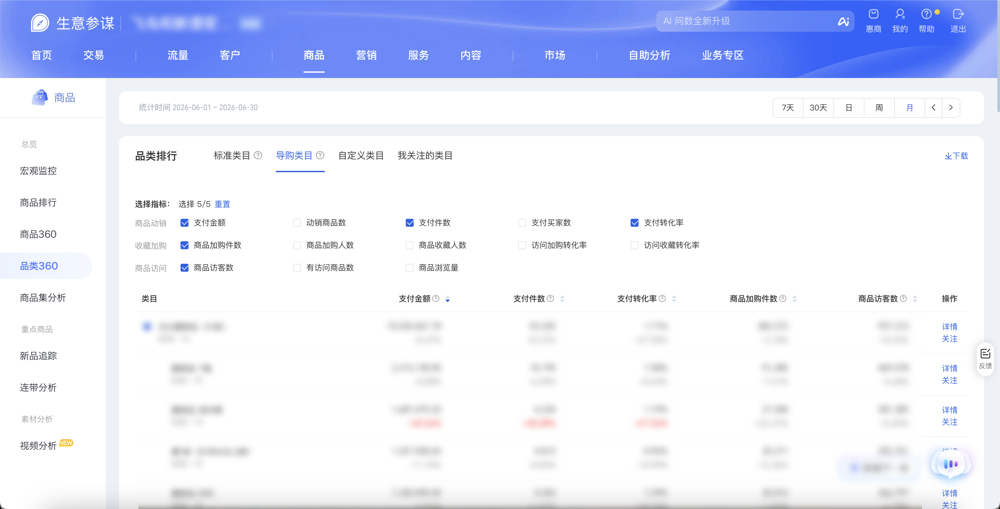

| 属性             | 值                                                                                       |
| ---------------- | ---------------------------------------------------------------------------------------- |
| **连接器类型**   | `RPA 连接器`                                                                             |
| **连接器名称**   | `ODS_商品品类360导购类目明细表(生意参谋RPA)`                                             |
| **连接器代码**   | `rpa.conn.sycm.item.category.archives.guide`                                             |
| **操作类型**     | `文件导出`                                                                               |
| **目标网页**     | `https://sycm.taobao.com/cc/new_cate_archives`                                           |
| **适用场景**     | 采集生意参谋品类360页「品类排行」模块下 **导购类目** Tab 的访客、加购、下单、支付及转化等指标 |
| **数据表名**     | `ods_rpa_sycm_item_category_archives_guide_du`                                           |
| **业务表名**     | `ODS_商品品类360导购类目明细表(生意参谋RPA)`                                             |

### 目标页面

> **取数路径**：生意参谋—商品—品类360—品类排行—导购类目
>
> **取数链接**：[https://sycm.taobao.com/cc/new_cate_archives](https://sycm.taobao.com/cc/new_cate_archives)

**采集范围**：仅 **导购类目** Tab，浏览器下载 xls 全量导出。

不纳入采集范围：**标准类目**、**自定义类目**、**我关注的类目**、**品类诊断** 及页面其他模块。



### 业务入参

| 字段 | 中文释义 | 数据类型 | 必填 | 默认值 | 说明 |
| ---- | -------- | -------- | ---- | ------ | ---- |
| `date_type` | 统计时间类型 | `String` | 否 | `recent30` | 可选值：`recent7`（7天）/ `recent30`（30天）/ `day`（日）/ `week`（周）/ `month`（月） |
| `stat_date` | 统计日期 | `String` | 条件必填 | — | 仅当 `date_type` 为 `day` / `week` / `month` 时必填；格式 `YYYYMMDD` 或 `YYYY-MM-DD`；统计区间不能晚于最近完整日期（昨天） |

### 入参样例

默认近 30 天：

```json
{}
```

按月：

```json
{
  "date_type": "month",
  "stat_date": "20260630"
}
```

近 7 天：

```json
{
  "date_type": "recent7"
}
```

### 入参校验

```json-schema collapsed
{
  "$schema": "https://json-schema.org/draft/2020-12/schema",
  "title": "生意参谋-商品-品类360-导购类目 - 查询入参",
  "description": "采集生意参谋品类360页「品类排行」下导购类目 Tab 的访客、加购、下单、支付及转化等指标",
  "type": "object",
  "properties": {
    "date_type": {
      "type": "string",
      "description": "统计时间类型，未传默认 recent30。可选值：recent7（7天）/ recent30（30天）/ day（日）/ week（周）/ month（月）",
      "enum": ["recent7", "recent30", "day", "week", "month"],
      "default": "recent30"
    },
    "stat_date": {
      "type": "string",
      "description": "统计日期；date_type 为 day/week/month 时必填。格式 YYYYMMDD 或 YYYY-MM-DD；统计区间不能晚于最近完整日期（昨天）",
      "pattern": "^(\\d{8}|\\d{4}-\\d{2}-\\d{2})$"
    }
  },
  "required": [],
  "allOf": [
    {
      "if": {
        "properties": {
          "date_type": { "enum": ["day", "week", "month"] }
        },
        "required": ["date_type"]
      },
      "then": {
        "required": ["stat_date"]
      }
    }
  ],
  "additionalProperties": false
}
```

### 数据字段

每条任务按类目行输出多条记录，数据来自导购类目导出表格。导购导出列可能少于标准类目，未出现的指标字段不会输出。

:::field-tree
| 字段 | 中文释义 | 数据类型 | 可为空 | 取数路径 | 示例 |
| ---- | -------- | -------- | ------ | -------- | ---- |
| `statDate` | 统计日期 | `String` | 是 | `XLS.0.统计日期` | `2026-06-30` |
| `level1CategoryName` | 一级类目名称 | `String` | 是 | `XLS.0.一级类目名称` | `2026夏新品（大类）` |
| `level2CategoryName` | 二级类目名称 | `String` | 是 | `XLS.0.二级类目名称` | `2026夏新品（大类）` |
| `categoryName` | 类目名称 | `String` | 是 | `XLS.0.类目名称` | `2026夏新品（大类）` |
| `itemUv` | 商品访客数 | `String` | 是 | `XLS.0.商品访客数` | `937,312` |
| `itemPv` | 商品浏览量 | `String` | 是 | `XLS.0.商品浏览量` | `12,118,028` |
| `visitItemCnt` | 有访客商品数 | `String` / `Number` | 是 | `XLS.0.有访客商品数` | `267` |
| `payItemCnt` | 有支付商品数 | `String` / `Number` | 是 | `XLS.0.有支付商品数` | `260` |
| `itemCartBuyerCnt` | 商品加购人数 | `String` | 是 | `XLS.0.商品加购人数` | `68,269` |
| `itemCartCnt` | 商品加购件数 | `String` | 是 | `XLS.0.商品加购件数` | `282,372` |
| `itemCollectBuyerCnt` | 商品收藏人数 | `String` | 是 | `XLS.0.商品收藏人数` | `11,680` |
| `visitCollectRate` | 访问收藏转化率 | `String` | 是 | `XLS.0.访问收藏转化率` | `1.25%` |
| `visitCartRate` | 访问加购转化率 | `String` | 是 | `XLS.0.访问加购转化率` | `7.28%` |
| `orderBuyerCnt` | 下单买家数 | `String` | 是 | `XLS.0.下单买家数` | `16,974` |
| `orderItemCnt` | 下单件数 | `String` | 是 | `XLS.0.下单件数` | `57,354` |
| `orderAmt` | 下单金额 | `String` | 是 | `XLS.0.下单金额` | `16,845,181.26` |
| `orderConvertRate` | 下单转化率 | `String` | 是 | `XLS.0.下单转化率` | `1.81%` |
| `payBuyerCnt` | 支付买家数 | `String` | 是 | `XLS.0.支付买家数` | `16,041` |
| `payQty` | 支付件数 | `String` | 是 | `XLS.0.支付件数` | `53,225` |
| `payAmt` | 支付金额 | `String` | 是 | `XLS.0.支付金额` | `15,525,067.70` |
| `payRate` | 支付转化率 | `String` | 是 | `XLS.0.支付转化率` | `1.71%` |
| `monthPayAmt` | 月累计支付金额 | `String` | 是 | `XLS.0.月累计支付金额` | `-` |
| `categoryType` | 类目类型代码 | `String` | 否 | 固定值 | `guide` |
| `categoryTypeName` | 类目类型名称 | `String` | 否 | 固定值 | `导购类目` |
| `statTime` | 统计时间区间文案 | `String` | 否 | 根据入参统计周期派生 | `2026-06-01 ~ 2026-06-30` |
| `statDateStart` | 统计起始日 | `String` | 否 | 根据入参统计周期派生 | `2026-06-01` |
| `statDateEnd` | 统计结束日 | `String` | 否 | 根据入参统计周期派生 | `2026-06-30` |
| `dateType` | 统计时间类型 | `String` | 否 | 根据入参 `date_type` 派生 | `month` |
| `bizDate` | 业务日期 | `String` | 否 | 附加 | `20260810` |
| `accountId` | 授权 ID | `String` | 否 | 附加 | `1****6` (已脱敏) |
:::

### 数据样例

```json
[
  {
    "statDate": "2026-06-30",
    "level1CategoryName": "2026夏新品（大类）",
    "level2CategoryName": "2026夏新品（大类）",
    "categoryName": "2026夏新品（大类）",
    "itemUv": "937,312",
    "itemPv": "12,118,028",
    "visitItemCnt": 267,
    "payItemCnt": 260,
    "itemCartBuyerCnt": "68,269",
    "itemCartCnt": "282,372",
    "itemCollectBuyerCnt": "11,680",
    "visitCollectRate": "1.25%",
    "visitCartRate": "7.28%",
    "orderBuyerCnt": "16,974",
    "orderItemCnt": "57,354",
    "orderAmt": "16,845,181.26",
    "orderConvertRate": "1.81%",
    "payBuyerCnt": "16,041",
    "payQty": "53,225",
    "payAmt": "15,525,067.70",
    "payRate": "1.71%",
    "monthPayAmt": "-",
    "categoryType": "guide",
    "categoryTypeName": "导购类目",
    "statTime": "2026-06-01 ~ 2026-06-30",
    "statDateStart": "2026-06-01",
    "statDateEnd": "2026-06-30",
    "dateType": "month",
    "bizDate": "20260810",
    "accountId": "1****6",
    "taskId": "dev****01"
  }
]
```

---
