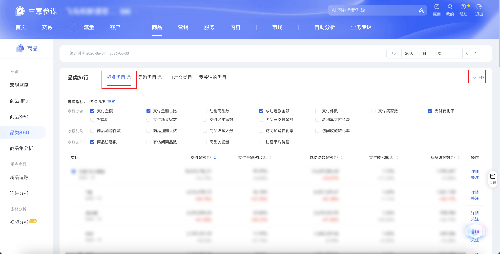

| 属性             | 值                                                                                       |
| ---------------- | ---------------------------------------------------------------------------------------- |
| **连接器类型**   | `RPA 连接器`                                                                             |
| **连接器名称**   | `ODS_商品品类360标准类目明细表(生意参谋RPA)`                                             |
| **连接器代码**   | `rpa.conn.sycm.item.category.archives.standard`                                          |
| **操作类型**     | `文件导出`                                                                               |
| **目标网页**     | `https://sycm.taobao.com/cc/new_cate_archives`                                           |
| **适用场景**     | 采集生意参谋品类360页「品类排行」模块下 **标准类目** Tab 的访客、加购、下单、支付及转化等指标 |
| **数据表名**     | `ods_rpa_sycm_item_category_archives_standard_du`                                        |
| **业务表名**     | `ODS_商品品类360标准类目明细表(生意参谋RPA)`                                             |

### 目标页面

> **取数路径**：生意参谋—商品—品类360—品类排行—标准类目
>
> **取数链接**：[https://sycm.taobao.com/cc/new_cate_archives](https://sycm.taobao.com/cc/new_cate_archives)

**采集范围**：仅 **标准类目** Tab，浏览器下载 xls 全量导出。

不纳入采集范围：**导购类目**、**自定义类目**、**我关注的类目**、**品类诊断** 及页面其他模块。



### 业务入参

| 字段 | 中文释义 | 数据类型 | 必填 | 默认值 | 说明 |
| ---- | -------- | -------- | ---- | ------ | ---- |
| `date_type` | 统计时间类型 | `String` | 否 | `recent30` | 可选值：`recent7`（7天）/ `recent30`（30天）/ `day`（日）/ `week`（周）/ `month`（月） |
| `stat_date` | 统计日期 | `String` | 条件必填 | — | 仅当 `date_type` 为 `day` / `week` / `month` 时必填；格式 `YYYYMMDD` 或 `YYYY-MM-DD`；统计区间不能晚于最近完整日期（昨天） |

### 入参样例

默认近 30 天：

```json
{}
```

按月：

```json
{
  "date_type": "month",
  "stat_date": "20260630"
}
```

近 7 天：

```json
{
  "date_type": "recent7"
}
```

### 入参校验

```json-schema collapsed
{
  "$schema": "https://json-schema.org/draft/2020-12/schema",
  "title": "生意参谋-商品-品类360-标准类目 - 查询入参",
  "description": "采集生意参谋品类360页「品类排行」下标准类目 Tab 的访客、加购、下单、支付及转化等指标",
  "type": "object",
  "properties": {
    "date_type": {
      "type": "string",
      "description": "统计时间类型，未传默认 recent30。可选值：recent7（7天）/ recent30（30天）/ day（日）/ week（周）/ month（月）",
      "enum": ["recent7", "recent30", "day", "week", "month"],
      "default": "recent30"
    },
    "stat_date": {
      "type": "string",
      "description": "统计日期；date_type 为 day/week/month 时必填。格式 YYYYMMDD 或 YYYY-MM-DD；统计区间不能晚于最近完整日期（昨天）",
      "pattern": "^(\\d{8}|\\d{4}-\\d{2}-\\d{2})$"
    }
  },
  "required": [],
  "allOf": [
    {
      "if": {
        "properties": {
          "date_type": { "enum": ["day", "week", "month"] }
        },
        "required": ["date_type"]
      },
      "then": {
        "required": ["stat_date"]
      }
    }
  ],
  "additionalProperties": false
}
```

### 数据字段

每条任务按类目行输出多条记录，数据来自标准类目导出表格。

:::field-tree
| 字段 | 中文释义 | 数据类型 | 可为空 | 取数路径 | 示例 |
| ---- | -------- | -------- | ------ | -------- | ---- |
| `statDate` | 统计日期 | `String` | 是 | `XLS.0.统计日期` | `2026-06-30` |
| `level1CategoryName` | 一级类目名称 | `String` | 是 | `XLS.0.一级类目名称` | `女装/女士精品` |
| `level2CategoryName` | 二级类目名称 | `String` | 是 | `XLS.0.二级类目名称` | `女装/女士精品` |
| `categoryName` | 类目名称 | `String` | 是 | `XLS.0.类目名称` | `女装/女士精品` |
| `itemUv` | 商品访客数 | `String` | 是 | `XLS.0.商品访客数` | `1,995,447` |
| `itemPv` | 商品浏览量 | `String` | 是 | `XLS.0.商品浏览量` | `13,093,717` |
| `visitItemCnt` | 有访客商品数 | `String` | 是 | `XLS.0.有访客商品数` | `4,624` |
| `payItemCnt` | 有支付商品数 | `String` / `Number` | 是 | `XLS.0.有支付商品数` | `1,310` |
| `itemCartBuyerCnt` | 商品加购人数 | `String` | 是 | `XLS.0.商品加购人数` | `139,591` |
| `itemCartCnt` | 商品加购件数 | `String` | 是 | `XLS.0.商品加购件数` | `314,710` |
| `itemCollectBuyerCnt` | 商品收藏人数 | `String` | 是 | `XLS.0.商品收藏人数` | `24,546` |
| `visitCollectRate` | 访问收藏转化率 | `String` | 是 | `XLS.0.访问收藏转化率` | `1.23%` |
| `visitCartRate` | 访问加购转化率 | `String` | 是 | `XLS.0.访问加购转化率` | `7.00%` |
| `orderBuyerCnt` | 下单买家数 | `String` | 是 | `XLS.0.下单买家数` | `36,367` |
| `orderItemCnt` | 下单件数 | `String` | 是 | `XLS.0.下单件数` | `67,788` |
| `orderAmt` | 下单金额 | `String` | 是 | `XLS.0.下单金额` | `19,839,911.49` |
| `orderConvertRate` | 下单转化率 | `String` | 是 | `XLS.0.下单转化率` | `1.82%` |
| `payBuyerCnt` | 支付买家数 | `String` | 是 | `XLS.0.支付买家数` | `34,478` |
| `payQty` | 支付件数 | `String` | 是 | `XLS.0.支付件数` | `62,834` |
| `payAmt` | 支付金额 | `String` | 是 | `XLS.0.支付金额` | `18,010,786.21` |
| `payAmtRatio` | 支付金额占比 | `String` | 是 | `XLS.0.支付金额占比` | `99.99%` |
| `payRate` | 支付转化率 | `String` | 是 | `XLS.0.支付转化率` | `1.73%` |
| `monthPayAmt` | 月累计支付金额 | `String` | 是 | `XLS.0.月累计支付金额` | `-` |
| `yearPayAmt` | 年累计支付金额 | `String` | 是 | `XLS.0.年累计支付金额` | `-` |
| `jhsPayAmt` | 聚划算支付金额 | `Number` | 是 | `XLS.0.聚划算支付金额` | `0` |
| `payNewBuyerCnt` | 支付新买家数 | `String` | 是 | `XLS.0.支付新买家数` | `22,510` |
| `payOldBuyerCnt` | 支付老买家数 | `String` | 是 | `XLS.0.支付老买家数` | `11,968` |
| `oldBuyerPayAmt` | 老买家支付金额 | `String` | 是 | `XLS.0.老买家支付金额` | `8,798,528.36` |
| `avgPricePerBuyer` | 客单价 | `String` / `Number` | 是 | `XLS.0.客单价` | `522.38` |
| `unitPrice` | 件单价 | `Number` / `String` | 是 | `XLS.0.件单价` | — |
| `uvValue` | 访客平均价值 | `Number` | 是 | `XLS.0.访客平均价值` | `9.03` |
| `sucRefundAmt` | 售中售后成功退款金额 | `String` | 是 | `XLS.0.售中售后成功退款金额` | `13,639,086.60` |
| `categoryType` | 类目类型代码 | `String` | 否 | 固定值 | `standard` |
| `categoryTypeName` | 类目类型名称 | `String` | 否 | 固定值 | `标准类目` |
| `statTime` | 统计时间区间文案 | `String` | 否 | 根据入参统计周期派生 | `2026-06-01 ~ 2026-06-30` |
| `statDateStart` | 统计起始日 | `String` | 否 | 根据入参统计周期派生 | `2026-06-01` |
| `statDateEnd` | 统计结束日 | `String` | 否 | 根据入参统计周期派生 | `2026-06-30` |
| `dateType` | 统计时间类型 | `String` | 否 | 根据入参 `date_type` 派生 | `month` |
| `bizDate` | 业务日期 | `String` | 否 | 附加 | `20260810` |
| `accountId` | 授权 ID | `String` | 否 | 附加 | `1****6` (已脱敏) |
:::

### 数据样例

```json
[
  {
    "statDate": "2026-06-30",
    "level1CategoryName": "女装/女士精品",
    "level2CategoryName": "女装/女士精品",
    "categoryName": "女装/女士精品",
    "itemUv": "1,995,447",
    "itemPv": "13,093,717",
    "visitItemCnt": "4,624",
    "payItemCnt": "1,310",
    "itemCartBuyerCnt": "139,591",
    "itemCartCnt": "314,710",
    "itemCollectBuyerCnt": "24,546",
    "visitCollectRate": "1.23%",
    "visitCartRate": "7.00%",
    "orderBuyerCnt": "36,367",
    "orderItemCnt": "67,788",
    "orderAmt": "19,839,911.49",
    "orderConvertRate": "1.82%",
    "payBuyerCnt": "34,478",
    "payQty": "62,834",
    "payAmt": "18,010,786.21",
    "payAmtRatio": "99.99%",
    "payRate": "1.73%",
    "monthPayAmt": "-",
    "yearPayAmt": "-",
    "jhsPayAmt": 0.0,
    "payNewBuyerCnt": "22,510",
    "payOldBuyerCnt": "11,968",
    "oldBuyerPayAmt": "8,798,528.36",
    "avgPricePerBuyer": "522.38",
    "uvValue": 9.03,
    "sucRefundAmt": "13,639,086.60",
    "categoryType": "standard",
    "categoryTypeName": "标准类目",
    "statTime": "2026-06-01 ~ 2026-06-30",
    "statDateStart": "2026-06-01",
    "statDateEnd": "2026-06-30",
    "dateType": "month",
    "bizDate": "20260810",
    "accountId": "1****6",
    "taskId": "dev****bb"
  }
]
```

---
