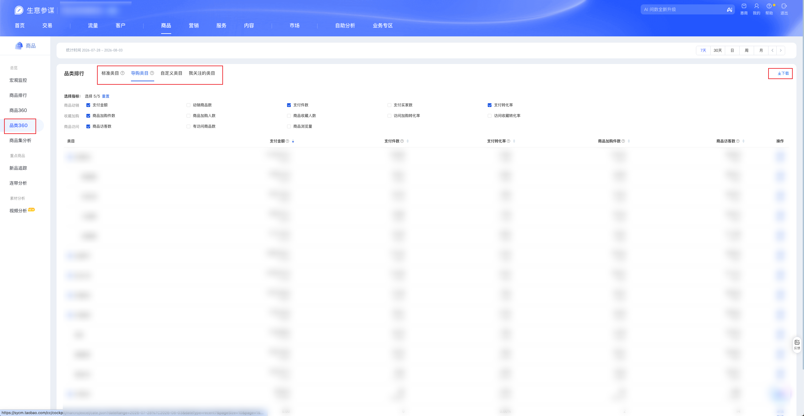

| 属性             | 值                                                                                       |
| ---------------- | ---------------------------------------------------------------------------------------- |
| **连接器类型**   | `RPA 连接器`                                                                             |
| **连接器名称**   | `ODS_商品品类360明细表(生意参谋RPA)`                                                     |
| **连接器代码**   | `rpa.conn.sycm.item.category.archives`                                                   |
| **操作类型**     | `页面解析` + `文件导出`                                                                  |
| **目标网页**     | `https://sycm.taobao.com/cc/new_cate_archives`                                           |
| **适用场景**     | 采集生意参谋品类360页「品类排行」模块下 **标准类目、导购类目、自定义类目** 三个 Tab 的访客、加购、下单、支付及转化等指标 |
| **数据表名**     | `ods_rpa_sycm_item_category_archives_du`                                                 |
| **业务表名**     | `ODS_商品品类360明细表(生意参谋RPA)`                                                     |

### 目标页面

> **取数路径**：生意参谋—商品—品类360
>
> **取数链接**：[https://sycm.taobao.com/cc/new_cate_archives](https://sycm.taobao.com/cc/new_cate_archives)

**采集 Tab 范围**（仅以下三个，其余 Tab 不采集）：

| Tab | 采集方式 | 说明 |
| --- | -------- | ---- |
| 标准类目 | 浏览器下载 xls | 全量导出 |
| 导购类目 | 浏览器下载 xls | 全量导出 |
| 自定义类目 | 监听 `/cc/category/tag/list.json` 分页接口 | 翻页采集全量 |

不纳入采集范围：**我关注的类目**、**品类诊断** 及页面其他模块。



### 业务入参

| 字段 | 中文释义 | 数据类型 | 必填 | 默认值 | 说明 |
| ---- | -------- | -------- | ---- | ------ | ---- |
| `date_type` | 统计时间类型 | `String` | 否 | `recent30` | 可选值：`recent7`（7天）/ `recent30`（30天）/ `day`（日）/ `week`（周）/ `month`（月） |
| `stat_date` | 统计日期 | `String` | 条件必填 | — | 仅当 `date_type` 为 `day` / `week` / `month` 时必填；格式 `YYYYMMDD` 或 `YYYY-MM-DD`；统计区间不能晚于最近完整日期（昨天） |

### 入参样例

默认近 30 天（`date_type`、`stat_date` 均可不传）：

```json
{}
```

或显式指定：

```json
{
  "date_type": "recent30"
}
```

按月（需传 `stat_date`）：

```json
{
  "date_type": "month",
  "stat_date": "20260630"
}
```

近 7 天（无需 `stat_date`）：

```json
{
  "date_type": "recent7"
}
```

指定自然周：

```json
{
  "date_type": "week",
  "stat_date": "20260615"
}
```

### 入参校验

```json-schema collapsed
{
  "$schema": "https://json-schema.org/draft/2020-12/schema",
  "title": "生意参谋-商品-品类360 - 查询入参",
  "description": "采集生意参谋品类360页「品类排行」下标准类目、导购类目与自定义类目三个 Tab 的访客、加购、下单、支付及转化等指标",
  "type": "object",
  "properties": {
    "date_type": {
      "type": "string",
      "description": "统计时间类型，未传默认 recent30。可选值：recent7（7天）/ recent30（30天）/ day（日）/ week（周）/ month（月）",
      "enum": ["recent7", "recent30", "day", "week", "month"],
      "default": "recent30"
    },
    "stat_date": {
      "type": "string",
      "description": "统计日期；date_type 为 day/week/month 时必填。格式 YYYYMMDD 或 YYYY-MM-DD；统计区间不能晚于最近完整日期（昨天）",
      "pattern": "^(\\d{8}|\\d{4}-\\d{2}-\\d{2})$"
    }
  },
  "required": [],
  "allOf": [
    {
      "if": {
        "properties": {
          "date_type": { "enum": ["day", "week", "month"] }
        },
        "required": ["date_type"]
      },
      "then": {
        "required": ["stat_date"]
      }
    }
  ],
  "additionalProperties": false
}
```

### 数据字段

每条任务按类目行输出多条记录：标准类目 / 导购类目来自导出表格（字段多为字符串指标）；自定义类目来自 `list.json` 接口（部分指标为对象）。三类记录共用 `categoryType` 区分，且仅覆盖 **标准类目 / 导购类目 / 自定义类目** 三个 Tab。

:::field-tree
@define 指标对象
| `value` | 指标值 | `Number` | 是 | 页面解析 | `68262.68` |
| `cycleCrc` | 较上周期变化率 | `Number` | 是 | 页面解析 | `-0.051803184` |
| `syncCrc` | 较同期变化率 | `Number` | 是 | 页面解析 | `-0.4943486457` |

@define 统计日期对象
| `value` | 统计日期时间戳 | `Number` | 是 | 页面解析 | `1782748800000` |

| 字段 | 中文释义 | 数据类型 | 可为空 | 取数路径 | 示例 |
| ---- | -------- | -------- | ------ | -------- | ---- |
| `statDate` @统计日期对象 | 统计日期 | `String` / `Dict` | 是 | 标准/导购：`XLS.0.统计日期`；自定义：`list.json` | `2026-06-30` |
| `level1CategoryName` | 一级类目名称 | `String` | 是 | `XLS.0.一级类目名称` | `居家布艺` |
| `level2CategoryName` | 二级类目名称 | `String` | 是 | `XLS.0.二级类目名称` | `居家鞋/凉拖/棉拖(新)` |
| `categoryName` | 类目名称 | `String` | 是 | `XLS.0.类目名称` | `居家凉拖/凉鞋` |
| `itemUv` | 商品访客数 | `String` | 是 | `XLS.0.商品访客数` | `762,131` |
| `itemPv` | 商品浏览量 | `String` | 是 | `XLS.0.商品浏览量` | `2,517,262` |
| `visitItemCnt` | 有访客商品数 | `String` | 是 | `XLS.0.有访客商品数` | `1,821` |
| `payItemCnt` | 有支付商品数 | `Number` | 是 | `XLS.0.有支付商品数` | `624` |
| `itemCartBuyerCnt` | 商品加购人数 | `String` | 是 | `XLS.0.商品加购人数` | `100,831` |
| `itemCartCnt` | 商品加购件数 | `String` | 是 | `XLS.0.商品加购件数` | `153,955` |
| `itemCollectBuyerCnt` | 商品收藏人数 | `String` | 是 | `XLS.0.商品收藏人数` | `11,772` |
| `visitCollectRate` | 访问收藏转化率 | `String` | 是 | `XLS.0.访问收藏转化率` | `1.54%` |
| `visitCartRate` | 访问加购转化率 | `String` | 是 | `XLS.0.访问加购转化率` | `13.23%` |
| `orderBuyerCnt` | 下单买家数 | `String` | 是 | `XLS.0.下单买家数` | `76,821` |
| `orderItemCnt` | 下单件数 | `String` | 是 | `XLS.0.下单件数` | `102,047` |
| `orderAmt` | 下单金额 | `String` | 是 | `XLS.0.下单金额` | `2,481,059.84` |
| `orderConvertRate` | 下单转化率 | `String` | 是 | `XLS.0.下单转化率` | `10.08%` |
| `payBuyerCnt` | 支付买家数 | `String` | 是 | `XLS.0.支付买家数` | `74,764` |
| `payQty` | 支付件数 | `String` | 是 | `XLS.0.支付件数` | `96,892` |
| `payAmt` @指标对象 | 支付金额 | `String` / `Dict` | 是 | 标准/导购：`XLS.0.支付金额`；自定义：`list.json` | `2,355,109.15` |
| `payAmtRatio` | 支付金额占比 | `String` | 是 | `XLS.0.支付金额占比` | `76.49%` |
| `payRate` | 支付转化率 | `String` | 是 | `XLS.0.支付转化率` | `9.81%` |
| `monthPayAmt` | 月累计支付金额 | `String` | 是 | `XLS.0.月累计支付金额` | `-` |
| `yearPayAmt` | 年累计支付金额 | `String` | 是 | `XLS.0.年累计支付金额` | `-` |
| `jhsPayAmt` | 聚划算支付金额 | `Number` | 是 | `XLS.0.聚划算支付金额` | `0` |
| `payNewBuyerCnt` | 支付新买家数 | `String` | 是 | `XLS.0.支付新买家数` | `65,537` |
| `payOldBuyerCnt` | 支付老买家数 | `String` | 是 | `XLS.0.支付老买家数` | `9,227` |
| `oldBuyerPayAmt` | 老买家支付金额 | `String` | 是 | `XLS.0.老买家支付金额` | `392,824.71` |
| `avgPricePerBuyer` | 客单价 | `Number` | 是 | `XLS.0.客单价` | `31.5` |
| `uvValue` | 访客平均价值 | `Number` | 是 | `XLS.0.访客平均价值` | `3.09` |
| `sucRefundAmt` | 售中售后成功退款金额 | `String` | 是 | `XLS.0.售中售后成功退款金额` / `XLS.0.成功退款金额` | `378,123.32` |
| `tag` | 自定义类目标签 | `String` | 是 | `list.json` | `吴****1` (已脱敏) |
| `payItmCnt` @指标对象 | 支付件数（自定义类目） | `Dict` | 是 | `list.json` | 见数据样例 |
| `ordPqt` @指标对象 | 件单价（自定义类目） | `Dict` | 是 | `list.json` | 见数据样例 |
| `pageNum` | 自定义类目页码 | `Number` | 是 | 根据自定义类目翻页序号派生 | `1` |
| `categoryType` | 类目类型代码 | `String` | 否 | 经类目 Tab 映射 | `standard` |
| `categoryTypeName` | 类目类型名称 | `String` | 否 | 经类目 Tab 映射 | `标准类目` |
| `statTime` | 统计时间区间文案 | `String` | 否 | 根据入参统计周期派生 | `2026-06-01 ~ 2026-06-30` |
| `statDateStart` | 统计起始日 | `String` | 否 | 根据入参统计周期派生 | `2026-06-01` |
| `statDateEnd` | 统计结束日 | `String` | 否 | 根据入参统计周期派生 | `2026-06-30` |
| `dateType` | 统计时间类型 | `String` | 否 | 根据入参 `date_type` 派生 | `month` |
| `bizDate` | 业务日期 | `String` | 否 | 附加 | `20260804` |
| `accountId` | 授权 ID | `String` | 否 | 附加 | `1****0` (已脱敏) |
:::

### 数据样例

```json
[
  {
    "statDate": "2026-06-30",
    "level1CategoryName": "居家布艺",
    "level2CategoryName": "居家布艺",
    "categoryName": "居家布艺",
    "itemUv": "762,131",
    "itemPv": "2,517,262",
    "visitItemCnt": "1,821",
    "payItemCnt": 624.0,
    "itemCartBuyerCnt": "100,831",
    "itemCartCnt": "153,955",
    "itemCollectBuyerCnt": "11,772",
    "visitCollectRate": "1.54%",
    "visitCartRate": "13.23%",
    "orderBuyerCnt": "76,821",
    "orderItemCnt": "102,047",
    "orderAmt": "2,481,059.84",
    "orderConvertRate": "10.08%",
    "payBuyerCnt": "74,764",
    "payQty": "96,892",
    "payAmt": "2,355,109.15",
    "payAmtRatio": "76.49%",
    "payRate": "9.81%",
    "monthPayAmt": "-",
    "yearPayAmt": "-",
    "jhsPayAmt": 0.0,
    "payNewBuyerCnt": "65,537",
    "payOldBuyerCnt": "9,227",
    "oldBuyerPayAmt": "392,824.71",
    "avgPricePerBuyer": 31.5,
    "uvValue": 3.09,
    "sucRefundAmt": "378,123.32",
    "categoryType": "standard",
    "categoryTypeName": "标准类目",
    "statTime": "2026-06-01 ~ 2026-06-30",
    "statDateStart": "2026-06-01",
    "statDateEnd": "2026-06-30",
    "dateType": "month",
    "bizDate": "20260804",
    "accountId": "1****0",
    "taskId": "dev****05b"
  },
  {
    "statDate": {
      "value": 1782748800000
    },
    "payAmt": {
      "cycleCrc": -0.051803184,
      "syncCrc": -0.4943486457,
      "value": 68262.6800000003
    },
    "categoryType": "custom",
    "categoryTypeName": "自定义类目",
    "statTime": "2026-06-01 ~ 2026-06-30",
    "statDateStart": "2026-06-01",
    "statDateEnd": "2026-06-30",
    "dateType": "month",
    "tag": "吴****1",
    "payItmCnt": {
      "cycleCrc": -0.0570676032,
      "syncCrc": -0.5879531939,
      "value": 2148
    },
    "ordPqt": {
      "cycleCrc": 0.0055830293,
      "syncCrc": 0.2271696973,
      "value": 31.7796461825
    },
    "pageNum": 1.0,
    "bizDate": "20260804",
    "accountId": "1****0",
    "taskId": "dev****05b"
  }
]
```

---
