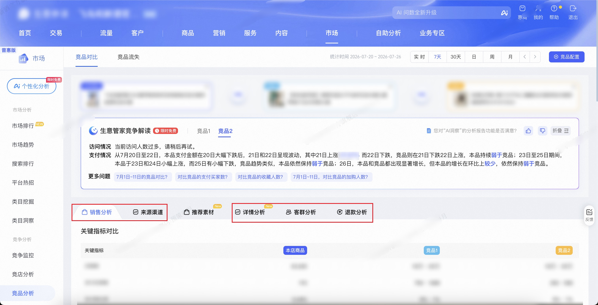

| 属性             | 值                                                                                 |
| ---------------- | ---------------------------------------------------------------------------------- |
| **连接器类型**   | `RPA 连接器`|
| **连接器名称**   | `ODS_市场竞品对比信息表(生意参谋RPA)`|
| **连接器代码**   | `rpa.conn.sycm.item.ci`|
| **操作类型**     | `页面解析`|
| **目标网页**     | `https://sycm.taobao.com/mc/free/ci_item`|
| **适用场景**     | 按本店与竞品商品 ID 采集生意参谋竞品对比页的销售分析、来源渠道、客群分析、详情分析与退款分析数据|
| **数据表名**     | `ods_rpa_sycm_item_ci_detail_du`|
| **业务表名**     | `ODS_市场竞品对比信息表(生意参谋RPA)`|

### 目标页面

> **取数路径**：生意参谋—市场—竞争—竞品对比
>
> **取数链接**：[https://sycm.taobao.com/mc/free/ci_item](https://sycm.taobao.com/mc/free/ci_item)



### 业务入参

| 字段 | 中文释义 | 数据类型 | 必填 | 默认值 | 说明 |
| ---- | -------- | -------- | ---- | ------ | ---- |
| `self_item_id` | 本店商品 ID | `String` | 是 | — | 本店参与对比的商品 ID |
| `rival_item_id_1` | 竞品商品 ID（第一个） | `String` | 是 | — | 第一个竞品商品 ID |
| `rival_item_id_2` | 竞品商品 ID（第二个） | `String` | 否 | — | 第二个竞品商品 ID；不传则不采集竞品 2 相关数据 |
| `date_type` | 销售/来源/详情/退款统计周期类型 | `String` | 否 | 实时 | 同时作用于销售分析、来源渠道、详情分析、退款分析。允许值：`实时`/`today`（今日）、`recent7`（近 7 天）、`recent30`（近 30 天）、`day`（指定日）、`week`（指定周）、`month`（指定月） |
| `stat_date` | 销售/来源/详情/退款统计日期 | `String` | 条件必填 | — | 当 `date_type` 为 `day`/`week`/`month` 时必填；格式 `YYYYMMDD` 或 `YYYY-MM-DD` |
| `customer_date_type` | 客群分析统计周期类型 | `String` | 否 | `day` | 仅作用于客群分析。允许值：`day`（指定日）、`month`（指定月） |
| `customer_stat_date` | 客群分析统计日期 | `String` | 条件必填 | 昨天 | 当 `customer_date_type=month` 时必填；`day` 时未传则默认昨天；格式 `YYYYMMDD` 或 `YYYY-MM-DD`；日粒度范围为近 90 天（不含今天），月粒度仅支持过去 3 个完整月 |

> 三个商品 ID（`self_item_id` / `rival_item_id_1` / `rival_item_id_2`）不允许重复。执行前会在页面商品选择框中搜索校验 ID 是否可命中；未搜到则返回空数据。
>
> 详情分析「主图素材」会在页面内依次切换曝光人数 / 互动人数 / 加购转化率 / 支付转化率 / 跳失率五个核心指标采集，**不是任务入参**。退款原因仅采集「全部」Tab（落地默认，不点「退货退款」）。

### 入参样例

```json
{
    "self_item_id": "975****355",
    "rival_item_id_1": "638****270",
    "date_type": "week",
    "stat_date": "2026-04-14",
    "customer_date_type": "month",
    "customer_stat_date": "2026-05-14"
}
```

### 入参校验

```json-schema collapsed
{
  "$schema": "https://json-schema.org/draft/2020-12/schema",
  "title": "生意参谋-市场-竞争-竞品对比 - 查询入参",
  "description": "按本店与竞品商品 ID 采集生意参谋竞品对比页的销售分析、来源渠道、客群分析、详情分析与退款分析数据",
  "type": "object",
  "properties": {
    "self_item_id": {
      "type": "string",
      "description": "本店参与对比的商品 ID",
      "minLength": 1
    },
    "rival_item_id_1": {
      "type": "string",
      "description": "第一个竞品商品 ID",
      "minLength": 1
    },
    "rival_item_id_2": {
      "type": "string",
      "description": "第二个竞品商品 ID；不传则不采集竞品 2 相关数据",
      "minLength": 1
    },
    "date_type": {
      "type": "string",
      "description": "销售/来源/详情/退款统计周期类型，未传默认实时",
      "enum": ["实时", "today", "recent7", "recent30", "day", "week", "month"],
      "default": "实时"
    },
    "stat_date": {
      "type": "string",
      "description": "销售/来源/详情/退款统计日期；date_type 为 day/week/month 时必填。格式 YYYYMMDD 或 YYYY-MM-DD",
      "pattern": "^(\\d{8}|\\d{4}-\\d{2}-\\d{2})$"
    },
    "customer_date_type": {
      "type": "string",
      "description": "客群分析统计周期类型，未传默认 day",
      "enum": ["day", "month"],
      "default": "day"
    },
    "customer_stat_date": {
      "type": "string",
      "description": "客群分析统计日期；customer_date_type=month 时必填；day 时未传默认昨天。格式 YYYYMMDD 或 YYYY-MM-DD",
      "pattern": "^(\\d{8}|\\d{4}-\\d{2}-\\d{2})$"
    }
  },
  "required": ["self_item_id", "rival_item_id_1"],
  "allOf": [
    {
      "if": {
        "properties": {
          "date_type": { "enum": ["day", "week", "month"] }
        },
        "required": ["date_type"]
      },
      "then": {
        "required": ["stat_date"]
      }
    },
    {
      "if": {
        "properties": {
          "customer_date_type": { "const": "month" }
        },
        "required": ["customer_date_type"]
      },
      "then": {
        "required": ["customer_stat_date"]
      }
    }
  ],
  "additionalProperties": false
}
```

### 数据字段

每条任务输出 **1 条聚合记录**（`data[0]`），各模块以数组内嵌，非行级平铺。

:::field-tree
@define 统计时间对象
| `dateType` | 实际统计周期类型 | `string` | 否 | 对应模块接口 URL 中的 `dateType` | `week` |
| `dateRangeStart` | 实际统计区间起始日 | `string` | 否 | 对应模块接口 URL 中的 `dateRange` 起始 | `2026-04-13` |
| `dateRangeEnd` | 实际统计区间结束日 | `string` | 否 | 对应模块接口 URL 中的 `dateRange` 结束 | `2026-04-19` |

@define 对比商品项
| `role` | 商品角色 | `string` | 否 | 固定枚举 | `selfItem` |
| `itemId` | 商品 ID | `string` | 否 | 来自入参或搜索接口 | `975****355` (已脱敏) |
| `title` | 商品标题 | `string` | 是 | 搜索接口或页面 DOM | `样例品牌A样例商品儿童牙膏防蛀抗糖含氟` (已脱敏) |
| `picUrl` | 商品头图 URL | `string` | 是 | 搜索接口或页面 DOM | `https://img.alicdn.com/****` (已脱敏) |

@define 关键指标项
| `itemId` | 商品 ID | `number` | 否 | `itemId` | `975****355` (已脱敏) |
| `itemRole` | 商品角色 | `string` | 否 | 由接口 role 映射 | `selfItem` |
| `uv` | 访客数 | `number` / `string` | 是 | `uv` | `286971` |
| `payBuyerCnt` | 支付买家数 | `number` / `string` | 是 | `payByrCnt` | `12764` |
| `payRate` | 支付转化率 | `number` / `string` | 是 | `payRate` | `0.04447836192507257` |
| `cartBuyerCnt` | 加购人数 | `number` / `string` | 是 | `cartByrCnt` | `11284` |
| `collectBuyerCnt` | 收藏人数 | `number` / `string` | 是 | `cltByrCnt` | `891` |

@define SKU分析项
| `itemId` | 商品 ID | `string` | 否 | 来自入参 | `975****355` (已脱敏) |
| `itemRole` | 商品角色 | `string` | 否 | 由表格列映射 | `selfItem` |
| `skuId` | SKU ID | `string` | 否 | `skuId` | `609****514` (已脱敏) |
| `skuName` | SKU 名称 | `string` | 否 | `skuName` | `颜色分类:【样例款】样例商品儿童牙膏-葡萄味 40g` (已脱敏) |
| `payBuyerCntRatioMkt` | 支付买家数占比 | `number` | 是 | `payByrCntRatioMkt` | `0.5346` |
| `page` | 分页页码 | `number` | 否 | 分页序号 | `1` |

@define 属性分析项
| `itemId` | 商品 ID | `string` | 否 | 来自入参 | `975****355` (已脱敏) |
| `itemRole` | 商品角色 | `string` | 否 | 由表格列映射 | `selfItem` |
| `attrName` | 属性维度名称 | `string` | 否 | 接口请求 `attrName` 参数 | `颜色分类` |
| `attrValue` | 属性值 | `string` | 否 | `attrValue` | `【样例款】样例商品儿童牙膏-葡萄味 40g` (已脱敏) |
| `payBuyerCntRatioMkt` | 支付买家数占比 | `number` | 是 | `payByrCntRatioMkt` | `0.5374` |
| `page` | 分页页码 | `number` | 否 | 分页序号 | `1` |

@define 入店搜索词项
| `itemId` | 商品 ID | `string` | 否 | 来自入参 | `975****355` (已脱敏) |
| `itemRole` | 商品角色 | `string` | 否 | 由接口 role 映射 | `selfItem` |
| `metricTab` | 指标 Tab | `string` | 否 | 由页面 Tab 映射 | `uv` |
| `keyword` | 搜索关键词 | `string` | 否 | `keyword` | `样例关键词` (已脱敏) |
| `uv` | 访客数 | `number` / `string` | 是 | `uv` | `1369` |
| `payBuyerCnt` | 支付买家数 | `number` / `string` | 是 | `payByrCnt` | `341` |
| `payRate` | 支付转化率 | `number` / `string` | 是 | `payRate` | `0.2491` |

@define 入店来源项
| `itemId` | 商品 ID | `string` | 否 | 来自入参 | `975****355` (已脱敏) |
| `itemRole` | 商品角色 | `string` | 否 | 由接口 role 映射 | `selfItem` |
| `metricTab` | 指标 Tab | `string` | 否 | 由页面 Tab 映射 | `uv` |
| `sourceName` | 来源名称 | `string` | 否 | `pageName` / `sourceName` | `主动回访` |
| `parentSourceName` | 上级来源名称 | `string` | 是 | 树形父节点名称 | `主动回访` |
| `uv` | 访客数 | `number` / `string` | 是 | `{role}Uv` | `11176` |
| `payBuyerCnt` | 支付买家数 | `number` / `string` | 是 | `{role}PayByrCnt` | `1704` |
| `payRate` | 支付转化率 | `number` / `string` | 是 | `{role}PayRate` | `0.15246957766642805` |

@define 经营优势项
| `tabType` | 模块类型 | `string` | 否 | 固定枚举 | `sourceChannel` |
| `sourceName` | 来源名称 | `string` | 否 | `pageName` / `sourceName` | `搜索` |
| `parentSourceName` | 上级来源名称 | `string` | 是 | 树形父节点名称 | `付费推广` |
| `selfUv` | 本店访客数 | `number` / `string` | 是 | `selfItemUv` | `4876` |
| `selfPayBuyerCnt` | 本店支付买家数 | `number` / `string` | 是 | `selfItemPayByrCnt` | `967` |
| `selfPayRate` | 本店支付转化率 | `number` / `string` | 是 | `selfItemPayRate` | `0.198318293683347` |
| `rival1Uv` | 竞品 1 访客数 | `number` / `string` | 是 | `rivalItem1Uv` | `1万 ~ 2.5万` |
| `rival1PayBuyerCnt` | 竞品 1 支付买家数 | `number` / `string` | 是 | `rivalItem1PayByrCnt` | `1000 ~ 2500` |
| `rival1PayRate` | 竞品 1 支付转化率 | `number` / `string` | 是 | `rivalItem1PayRate` | `15% ~ 20%` |
| `rival2Uv` | 竞品 2 访客数 | `number` / `string` | 是 | `rivalItem2Uv` | — |
| `rival2PayBuyerCnt` | 竞品 2 支付买家数 | `number` / `string` | 是 | `rivalItem2PayByrCnt` | — |
| `rival2PayRate` | 竞品 2 支付转化率 | `number` / `string` | 是 | `rivalItem2PayRate` | — |

@define 客群画像项
| `itemId` | 商品 ID | `String` | 是 | 来自入参 | `975****355` (已脱敏) |
| `itemRole` | 商品角色 | `String` | 是 | 页面解析 | `selfItem` |
| `crowdsType` | 人群类型代码 | `String` | 否 | 页面解析 | `appSearchUv` |
| `crowdsLabel` | 人群类型名称 | `String` | 否 | 页面解析 | `搜索人群` |
| `profileType` | 画像维度 | `String` | 是 | 页面解析 | `gender` |
| `attrValue` | 画像属性值 | `String` | 是 | 页面解析 | `女` |
| `ratio` | 占比 | `Number` | 是 | 页面解析 | `0.8717` |
| `dataStatus` | 数据状态 | `String` | 是 | 仅 Tab 全员无数据占位行输出 | `UNSUPPORTED` |
| `noDataReason` | 无数据原因 | `String` | 是 | 仅 Tab 全员无数据占位行输出 | `人群较少暂不支持分析` |

@define 详情关键指标项
| `itemId` | 商品 ID | `Number` / `String` | 否 | 页面解析 | `975****355` (已脱敏) |
| `itemRole` | 商品角色 | `String` | 否 | 页面解析 | `selfItem` |
| `itemExposeUv` | 曝光人数 | `Number` / `String` | 是 | 页面解析 | `26652` |
| `itemInteractUv` | 互动人数 | `Number` / `String` | 是 | 页面解析 | `21512` |
| `itemCartConvertRate` | 加购转化率 | `Number` / `String` | 是 | 页面解析 | `0.14291610385712142` |
| `itemPayConvertRate` | 支付转化率 | `Number` / `String` | 是 | 页面解析 | `0.15004502476362` |
| `itemLossRate` | 跳失率 | `Number` / `String` | 是 | 页面解析 | `0.7533018159987993` |
| `sellerId` | 卖家 ID | `Number` / `String` | 是 | 页面解析 | `369****865` (已脱敏) |
| `statDate` | 统计日期时间戳 | `Number` | 是 | 页面解析 | `1784736000000` |

@define 详情趋势项
| `itemId` | 商品 ID | `String` | 否 | 来自入参 | `975****355` (已脱敏) |
| `itemRole` | 商品角色 | `String` | 否 | 页面解析 | `selfItem` |
| `detailType` | 详情类型 code | `String` | 否 | 页面解析 | `image-video` |
| `statDate` | 按日统计日期序列 | `List[Number]` | 是 | 页面解析 | `[1782230400000, 1782316800000]` |
| `itemExposeUv` | 曝光人数按日序列 | `List[Number]` / `List[String]` | 是 | 页面解析 | `[5712, 5444]` |
| `itemInteractUv` | 互动人数按日序列 | `List[Number]` / `List[String]` | 是 | 页面解析 | `[4506, 4368]` |
| `itemCartConvertRate` | 加购转化率按日序列 | `List[Number]` / `List[String]` | 是 | 页面解析 | `[0.1155, 0.1177]` |
| `itemPayConvertRate` | 支付转化率按日序列 | `List[Number]` / `List[String]` | 是 | 页面解析 | `[0.1113, 0.1187]` |
| `itemLossRate` | 跳失率按日序列 | `List[Number]` / `List[String]` | 是 | 页面解析 | `[0.8001, 0.7904]` |
| `detailLevel` | 层级按日序列 | `List[String]` | 是 | 页面解析 | `["2", "2"]` |
| `parentDetailType` | 父类型按日序列 | `List[String]` | 是 | 页面解析 | `["image", "image"]` |
| `sellerId` | 卖家 ID 按日序列 | `List[Number]` | 是 | 页面解析 | — |

@define 详情模块项
| `detailType` | 详情类型 code | `String` | 否 | 页面解析 | `image` |
| `detailTypeCn` | 详情类型中文 | `String` | 否 | 页面解析 | `主图` |
| `detailLevel` | 层级 | `String` | 否 | 页面解析 | `1` |
| `parentDetailType` | 父类型 | `String` | 是 | 页面解析 | `-99` |
| `itemId` | 商品 ID | `String` / `Number` | 是 | 页面解析 | `638****270` (已脱敏) |
| `sellerId` | 卖家 ID | `Number` | 是 | 页面解析 | `220****363` (已脱敏) |
| `statDate` | 统计日期时间戳 | `Number` | 是 | 页面解析 | `1784736000000` |
| `selfItemItemExposeUv` | 本店曝光人数 | `Number` / `String` | 是 | 页面解析 | `26540` |
| `selfItemItemInteractUv` | 本店互动人数 | `Number` / `String` | 是 | 页面解析 | `20897` |
| `selfItemItemCartConvertRate` | 本店加购转化率 | `Number` / `String` | 是 | 页面解析 | `0.14299171062547097` |
| `selfItemItemPayConvertRate` | 本店支付转化率 | `Number` / `String` | 是 | 页面解析 | `0.15026375282592314` |
| `selfItemItemLossRate` | 本店跳失率 | `Number` / `String` | 是 | 页面解析 | `0.7530896759608139` |
| `rivalItem1ItemExposeUv` | 竞品 1 曝光人数 | `Number` / `String` | 是 | 页面解析 | `10万 ~ 25万` |
| `rivalItem1ItemInteractUv` | 竞品 1 互动人数 | `Number` / `String` | 是 | 页面解析 | `7.5万 ~ 10万` |
| `rivalItem1ItemCartConvertRate` | 竞品 1 加购转化率 | `Number` / `String` | 是 | 页面解析 | `15% ~ 20%` |
| `rivalItem1ItemPayConvertRate` | 竞品 1 支付转化率 | `Number` / `String` | 是 | 页面解析 | `15% ~ 20%` |
| `rivalItem1ItemLossRate` | 竞品 1 跳失率 | `Number` / `String` | 是 | 页面解析 | `70% ~ 75%` |
| `rivalItem2ItemExposeUv` | 竞品 2 曝光人数 | `Number` / `String` | 是 | 页面解析 | — |
| `rivalItem2ItemInteractUv` | 竞品 2 互动人数 | `Number` / `String` | 是 | 页面解析 | — |
| `rivalItem2ItemCartConvertRate` | 竞品 2 加购转化率 | `Number` / `String` | 是 | 页面解析 | — |
| `rivalItem2ItemPayConvertRate` | 竞品 2 支付转化率 | `Number` / `String` | 是 | 页面解析 | — |
| `rivalItem2ItemLossRate` | 竞品 2 跳失率 | `Number` / `String` | 是 | 页面解析 | — |
| `children` | 子详情类型（字段同本项，可多层嵌套，不拆平） | `List[Dict]` | 是 | 页面解析 | 见数据样例 |

@define 主图素材项
| `itemId` | 商品 ID | `Number` / `String` | 否 | 页面解析 | `975****355` (已脱敏) |
| `itemRole` | 商品角色 | `String` | 否 | 页面解析 | `selfItem` |
| `metricTab` | 指标 Tab 中文 | `String` | 否 | 页面解析 | `曝光人数` |
| `indexCode` | 指标 code | `String` | 否 | 页面解析 | `itemExposeUv` |
| `materialType` | 素材类型 | `String` | 否 | 页面解析 | `video` |
| `contentId` | 素材 ID | `String` | 是 | 页面解析 | `569****773` (已脱敏) |
| `contentInfo` | 素材 URL | `String` | 是 | 页面解析 | `https://img.alicdn.com/****` (已脱敏) |
| `contentType` | 素材内容类型 | `String` | 是 | 页面解析 | `video` |
| `itemExposeUv` | 曝光人数 | `Number` / `String` | 是 | 页面解析 | `25768` |
| `itemInteractUv` | 互动人数 | `Number` / `String` | 是 | 页面解析 | `20820` |
| `itemCartConvertRate` | 加购转化率 | `Number` / `String` | 是 | 页面解析 | `0.14393821794473766` |
| `itemPayConvertRate` | 支付转化率 | `Number` / `String` | 是 | 页面解析 | `0.15127289661595777` |
| `itemLossRate` | 跳失率 | `Number` / `String` | 是 | 页面解析 | `0.7511254268860602` |
| `sellerId` | 卖家 ID | `Number` / `String` | 是 | 页面解析 | `369****865` (已脱敏) |
| `statDate` | 统计日期时间戳 | `Number` | 是 | 页面解析 | `1784736000000` |

@define 退款概况项
| `itemId` | 商品 ID | `Number` / `String` | 否 | 页面解析 | `975****355` (已脱敏) |
| `itemRole` | 商品角色 | `String` | 否 | 页面解析 | `selfItem` |
| `statDate` | 统计日期时间戳 | `Number` | 是 | 页面解析 | `1784736000000` |
| `ordRfdRate` | 订单退款率 | `Number` / `String` | 是 | 页面解析 | `0.06873` |
| `realPayrealRfdRate` | 签收退款率 | `Number` / `String` | 是 | 页面解析 | `0.0013908205841446453` |
| `returnRefundOrdRfdRate` | 退货退款-订单退款率 | `Number` / `String` | 是 | 页面解析 | `0.0010315925209542231` |

@define 退款原因项
| `rfdReasonName` | 退款原因 code | `String` | 否 | 页面解析 | `unknow-strongintent` |
| `rfdReasonNameCn` | 退款原因中文 | `String` | 否 | 页面解析 | `强购买意愿_原因未识别` |
| `rfdReasonType` | 原因类型 code | `String` | 是 | 页面解析 | `Internal-causes` |
| `rfdReasonTypeCn` | 原因类型中文 | `String` | 是 | 页面解析 | `内部原因` |
| `rfdSubReasonName` | 子原因 code | `String` | 是 | 页面解析 | `nosub` |
| `rfdSubReasonNameCn` | 子原因中文 | `String` | 是 | 页面解析 | `nosub` |
| `ordRfdRate` | 本店订单退款率 | `Number` / `String` | 是 | 页面解析 | `0.029787` |
| `rivalItem1OrdRfdRate` | 竞品 1 订单退款率 | `Number` / `String` | 是 | 页面解析 | `2.5% ~ 5%` |
| `rivalItem2OrdRfdRate` | 竞品 2 订单退款率 | `Number` / `String` | 是 | 页面解析 | — |
| `isRecommend` | 是否推荐 | `Boolean` | 是 | 页面解析 | `false` |
| `caseScene` | 退款场景 | `String` | 否 | 固定 `ALL` | `ALL` |

| 字段 | 中文释义 | 数据类型 | 可为空 | 取数路径 | 示例 |
| ---- | -------- | -------- | ------ | -------- | ---- |
| `selfItemId` | 本店商品 ID | `String` | 否 | 来自入参 | `975****355` (已脱敏) |
| `rivalItemId1` | 竞品 1 商品 ID | `String` | 否 | 来自入参 | `638****270` (已脱敏) |
| `rivalItemId2` | 竞品 2 商品 ID | `String` | 是 | 来自入参 | `null` |
| `dateType` | 销售/来源/详情/退款统计周期类型 | `String` | 否 | 由入参 `date_type` 映射 | `week` |
| `dateRangeStart` | 销售/来源/详情/退款统计区间起始日 | `String` | 否 | 由入参与周期类型计算 | `2026-04-13` |
| `dateRangeEnd` | 销售/来源/详情/退款统计区间结束日 | `String` | 否 | 由入参与周期类型计算 | `2026-04-19` |
| `compareItems` @对比商品项 | 对比商品信息 | `List[Dict]` | 是 | 预检搜索与页面回填；按本店 → 竞品 1 → 竞品 2 顺序 | 见数据样例 |
| `keyMetrics` @关键指标项 | 销售分析关键指标对比 | `List[Dict]` | 是 | 页面解析 | 见数据样例 |
| `skuAnalysis` @SKU分析项 | SKU 分析 | `List[Dict]` | 是 | 页面解析 | 见数据样例 |
| `attributeAnalysis` @属性分析项 | 属性分析 | `List[Dict]` | 是 | 页面解析 | 见数据样例 |
| `saleStatTime` @统计时间对象 | 销售分析实际统计时间 | `Dict` | 是 | 页面解析 | 见数据样例 |
| `searchWords` @入店搜索词项 | 入店搜索词 | `List[Dict]` | 是 | 页面解析 | 见数据样例 |
| `flowSource` @入店来源项 | 入店来源 | `List[Dict]` | 是 | 页面解析 | 见数据样例 |
| `bizAdvantage` @经营优势项 | 经营优势 | `List[Dict]` | 是 | 页面解析 | 见数据样例 |
| `flowStatTime` @统计时间对象 | 来源渠道实际统计时间 | `Dict` | 是 | 页面解析 | 见数据样例 |
| `customerProfile` @客群画像项 | 客群画像 | `List[Dict]` | 是 | 页面解析 | 见数据样例 |
| `customerStatTime` @统计时间对象 | 客群分析实际统计时间 | `Dict` | 是 | 页面解析 | 见数据样例 |
| `detailKeyMetrics` @详情关键指标项 | 详情分析关键指标对比 | `List[Dict]` | 是 | 页面解析 | 见数据样例 |
| `detailTrend` @详情趋势项 | 详情分析按日趋势 | `List[Dict]` | 是 | 页面解析 | 见数据样例 |
| `detailModules` @详情模块项 | 详情模块列表 | `List[Dict]` | 是 | 页面解析 | 见数据样例 |
| `mainPicMaterials` @主图素材项 | 主图素材榜 | `List[Dict]` | 是 | 页面解析 | 见数据样例 |
| `detailStatTime` @统计时间对象 | 详情分析实际统计时间 | `Dict` | 是 | 页面解析 | 见数据样例 |
| `refundOverview` @退款概况项 | 退款概况 | `List[Dict]` | 是 | 页面解析 | 见数据样例 |
| `refundReasons` @退款原因项 | 退款原因（全部） | `List[Dict]` | 是 | 页面解析 | 见数据样例 |
| `refundStatTime` @统计时间对象 | 退款分析实际统计时间 | `Dict` | 是 | 页面解析 | 见数据样例 |
| `bizDate` | 业务日期 | `String` | 否 | 附加 | `20260724` |
| `accountId` | 授权 ID | `String` | 否 | 附加 | `1****8` (已脱敏) |
:::

> **对比商品信息**：预检阶段通过商品搜索接口回填标题与头图；进入目标页后若 DOM 已渲染，会再次读取页面商品位补全。按 `selfItem` → `rivalItem1` → `rivalItem2` 顺序输出；未传入竞品 2 时不含 `rivalItem2` 条目。
>
> **关键指标对比**：每个参与对比的商品（本店 / 竞品 1 / 竞品 2）各输出一行。竞品侧部分指标为区间脱敏值（如 `1万 ~ 2.5万`），本店侧为精确数值。
>
> **入店搜索词**：按指标 Tab（访客数 / 支付买家数 / 支付转化率）分别采集；`date_type=today` 时仅采集访客数 Tab。
>
> **入店来源**：树形结构按节点展开，子节点带 `parentSourceName`；按指标 Tab 分别采集。
>
> **经营优势**：横向对比本店与竞品，非按 `itemRole` 展开；`tabType` 允许值 `sourceChannel`（来源渠道）、`specialAdvantage`（专项优势）。`rival2*` 字段仅在入参传入 `rival_item_id_2` 时输出。
>
> **客群画像**：覆盖搜索人群 / 访问人群 / 支付人群三个 Tab，依次切换采集；某 Tab 页面提示「当前人群较少，暂不支持分析」时视为该 Tab 全员无数据。`profileType` 允许值：`gender`（性别）、`age`（年龄）、`crowd`（人群标签）、`brand_prefer`（品牌偏好）、`cate_prefer`（类目偏好）、`city`（城市）、`province`（省份）。
>
> **客群画像无数据场景**：
>
> | 场景 | 输出 |
> | ---- | ---- |
> | 某 Tab 全员无数据（如支付人群） | 该 Tab 写入 **1 条占位行**，`dataStatus=UNSUPPORTED`，`noDataReason=人群较少暂不支持分析`，其余画像字段为 `null` |
> | 某 Tab 有竞品数据 | 输出正常画像行，**不含** `dataStatus` / `noDataReason` 字段 |
> | 本店无数据、竞品有数据 | 仅输出竞品正常画像行，**不写占位行**（Tab 级仍有数据） |
>
> 下游可按 `dataStatus === "UNSUPPORTED"` 识别平台暂不支持分析；正常画像行不含 `dataStatus` / `noDataReason` 字段。
>
> **详情分析核心指标对比**：每个参与对比的商品各一行；指标含曝光人数 / 互动人数 / 加购转化率 / 支付转化率 / 跳失率。竞品侧常为区间值。
>
> **详情分析趋势**：按 `itemRole` × `detailType` 展开；各指标字段为按日序列数组（与 `statDate` 数组一一对应）。
>
> **详情模块**：含主图、sku、标题、物流、评价等；子类型在 `children` 中嵌套保留，不拆平。`rivalItem2*` 仅在传入竞品 2 时有值。
>
> **主图素材**：依次切换五个核心指标后采集；每条记录含 `metricTab`（中文）与 `indexCode`，`materialType` 为 `video` / `gallery`。不进入「素材管理 / 素材测试」外链。
>
> **退款概况**：本店 / 竞品各一行；本店多为精确小数，竞品多为区间字符串（如 `10% ~ 12.5%`）。
>
> **退款原因**：仅「全部」场景（`caseScene=ALL`）；不采集「退货退款」Tab。

### 数据样例

```json
{
    "accountId": "1****8",
    "bizDate": "20260724",
    "selfItemId": "975****355",
    "rivalItemId1": "638****270",
    "rivalItemId2": null,
    "dateType": "week",
    "dateRangeStart": "2026-04-13",
    "dateRangeEnd": "2026-04-19",
    "compareItems": [
        {
            "role": "selfItem",
            "itemId": "975****355",
            "title": "样例品牌A样例商品儿童牙膏防蛀抗糖含氟",
            "picUrl": "https://img.alicdn.com/****"
        },
        {
            "role": "rivalItem1",
            "itemId": "638****270",
            "title": "样例品牌B样例商品儿童洗发水控油去屑蓬松",
            "picUrl": "https://img.alicdn.com/****"
        }
    ],
    "keyMetrics": [
        {
            "cartBuyerCnt": 11284,
            "collectBuyerCnt": 891,
            "itemId": "975****355",
            "itemRole": "selfItem",
            "payBuyerCnt": 12764,
            "payRate": "0.04447836192507257",
            "uv": 286971
        },
        {
            "cartBuyerCnt": "2.5万 ~ 5万",
            "collectBuyerCnt": "5000 ~ 7500",
            "itemId": "638****270",
            "itemRole": "rivalItem1",
            "payBuyerCnt": "1万 ~ 2.5万",
            "payRate": "1% ~ 2.5%",
            "uv": "75万 ~ 100万"
        }
    ],
    "skuAnalysis": [
        {
            "itemId": "975****355",
            "itemRole": "selfItem",
            "skuId": "609****514",
            "skuName": "颜色分类:【样例款】样例商品儿童牙膏-葡萄味 40g",
            "payBuyerCntRatioMkt": 0.5346,
            "page": 1
        }
    ],
    "attributeAnalysis": [
        {
            "attrName": "颜色分类",
            "attrValue": "【样例款】样例商品儿童牙膏-葡萄味 40g",
            "itemId": "975****355",
            "itemRole": "selfItem",
            "payBuyerCntRatioMkt": 0.5374,
            "page": 1
        }
    ],
    "saleStatTime": {
        "dateType": "week",
        "dateRangeStart": "2026-04-13",
        "dateRangeEnd": "2026-04-19"
    },
    "searchWords": [
        {
            "itemId": "975****355",
            "itemRole": "selfItem",
            "keyword": "样例关键词",
            "metricTab": "uv",
            "payBuyerCnt": 341,
            "payRate": 0.2491,
            "uv": 1369
        }
    ],
    "flowSource": [
        {
            "itemId": "975****355",
            "itemRole": "selfItem",
            "metricTab": "uv",
            "sourceName": "主动回访",
            "payBuyerCnt": 1704,
            "payRate": 0.15246957766642805,
            "uv": 11176
        },
        {
            "itemId": "975****355",
            "itemRole": "selfItem",
            "metricTab": "uv",
            "parentSourceName": "主动回访",
            "sourceName": "站内沟通",
            "payBuyerCnt": 1679,
            "payRate": 0.23306496390893947,
            "uv": 7204
        }
    ],
    "bizAdvantage": [
        {
            "rival1PayBuyerCnt": "1000 ~ 2500",
            "rival1PayRate": "15% ~ 20%",
            "rival1Uv": "1万 ~ 2.5万",
            "selfPayBuyerCnt": 967,
            "selfPayRate": "0.198318293683347",
            "selfUv": 4876,
            "sourceName": "搜索",
            "tabType": "sourceChannel"
        },
        {
            "parentSourceName": "付费推广",
            "rival1PayBuyerCnt": "750 ~ 1000",
            "rival1PayRate": "20% ~ 25%",
            "rival1Uv": "2500 ~ 5000",
            "selfPayBuyerCnt": 269,
            "selfPayRate": 0.3237063778580024,
            "selfUv": 831,
            "sourceName": "淘宝客",
            "tabType": "specialAdvantage"
        }
    ],
    "flowStatTime": {
        "dateType": "week",
        "dateRangeStart": "2026-04-13",
        "dateRangeEnd": "2026-04-19"
    },
    "customerProfile": [
        {
            "attrValue": "女",
            "crowdsLabel": "搜索人群",
            "crowdsType": "appSearchUv",
            "itemId": "975****355",
            "itemRole": "selfItem",
            "profileType": "gender",
            "ratio": 0.8717
        },
        {
            "crowdsType": "payByrCnt",
            "crowdsLabel": "支付人群",
            "profileType": null,
            "attrValue": null,
            "ratio": null,
            "itemRole": null,
            "itemId": null,
            "dataStatus": "UNSUPPORTED",
            "noDataReason": "人群较少暂不支持分析"
        }
    ],
    "customerStatTime": {
        "dateType": "month",
        "dateRangeStart": "2026-05-01",
        "dateRangeEnd": "2026-05-31"
    },
    "detailKeyMetrics": [
        {
            "itemId": "975****355",
            "itemRole": "selfItem",
            "itemExposeUv": 26652,
            "itemInteractUv": 21512,
            "itemCartConvertRate": 0.14291610385712142,
            "itemPayConvertRate": 0.15004502476362,
            "itemLossRate": 0.7533018159987993,
            "sellerId": "369****865",
            "statDate": 1784736000000
        },
        {
            "itemId": "638****270",
            "itemRole": "rivalItem1",
            "itemExposeUv": "10万 ~ 25万",
            "itemInteractUv": "7.5万 ~ 10万",
            "itemCartConvertRate": "15% ~ 20%",
            "itemPayConvertRate": "15% ~ 20%",
            "itemLossRate": "70% ~ 75%",
            "sellerId": "220****363",
            "statDate": 1784736000000
        }
    ],
    "detailTrend": [
        {
            "itemId": "975****355",
            "itemRole": "selfItem",
            "detailType": "image-video",
            "statDate": [1782230400000, 1782316800000],
            "itemExposeUv": [5712, 5444],
            "itemInteractUv": [4506, 4368],
            "itemCartConvertRate": [0.11554621848739496, 0.1177443056576047],
            "itemPayConvertRate": [0.11134453781512606, 0.11866274797942689],
            "itemLossRate": [0.8000700280112045, 0.7904114621601763],
            "detailLevel": ["2", "2"],
            "parentDetailType": ["image", "image"]
        }
    ],
    "detailModules": [
        {
            "detailType": "image",
            "detailTypeCn": "主图",
            "detailLevel": "1",
            "parentDetailType": "-99",
            "itemId": "638****270",
            "sellerId": "220****363",
            "statDate": 1784736000000,
            "selfItemItemExposeUv": 26540,
            "selfItemItemInteractUv": 20897,
            "selfItemItemCartConvertRate": 0.14299171062547097,
            "selfItemItemPayConvertRate": 0.15026375282592314,
            "selfItemItemLossRate": 0.7530896759608139,
            "rivalItem1ItemExposeUv": "10万 ~ 25万",
            "rivalItem1ItemInteractUv": "7.5万 ~ 10万",
            "rivalItem1ItemCartConvertRate": "15% ~ 20%",
            "rivalItem1ItemPayConvertRate": "15% ~ 20%",
            "rivalItem1ItemLossRate": "70% ~ 75%",
            "children": [
                {
                    "detailType": "image-video",
                    "detailTypeCn": "主图视频",
                    "detailLevel": "2",
                    "parentDetailType": "image",
                    "selfItemItemExposeUv": 25768,
                    "selfItemItemInteractUv": 20820,
                    "children": []
                }
            ]
        }
    ],
    "mainPicMaterials": [
        {
            "itemId": "975****355",
            "itemRole": "selfItem",
            "metricTab": "曝光人数",
            "indexCode": "itemExposeUv",
            "materialType": "video",
            "contentId": "569****773",
            "contentInfo": "https://img.alicdn.com/****",
            "contentType": "video",
            "itemExposeUv": 25768,
            "itemInteractUv": 20820,
            "itemCartConvertRate": 0.14393821794473766,
            "itemPayConvertRate": 0.15127289661595777,
            "itemLossRate": 0.7511254268860602,
            "sellerId": "369****865",
            "statDate": 1784736000000
        },
        {
            "itemId": "975****355",
            "itemRole": "selfItem",
            "metricTab": "曝光人数",
            "indexCode": "itemExposeUv",
            "materialType": "gallery",
            "contentInfo": "https://img.alicdn.com/****",
            "contentType": "gallery",
            "itemExposeUv": 4195,
            "itemInteractUv": 156,
            "itemCartConvertRate": 0.16924910607866508,
            "itemPayConvertRate": 0.1799761620977354,
            "itemLossRate": 0.7125148986889154,
            "sellerId": "369****865",
            "statDate": 1784736000000
        }
    ],
    "detailStatTime": {
        "dateType": "recent7",
        "dateRangeStart": "2026-07-17",
        "dateRangeEnd": "2026-07-23"
    },
    "refundOverview": [
        {
            "itemId": "975****355",
            "statDate": 1784736000000,
            "ordRfdRate": 0.06873,
            "realPayrealRfdRate": 0.0013908205841446453,
            "returnRefundOrdRfdRate": 0.0010315925209542231,
            "itemRole": "selfItem"
        },
        {
            "itemId": "638****270",
            "statDate": 1784736000000,
            "ordRfdRate": "10% ~ 12.5%",
            "realPayrealRfdRate": "0% ~ 2.5%",
            "returnRefundOrdRfdRate": "0% ~ 2.5%",
            "itemRole": "rivalItem1"
        }
    ],
    "refundReasons": [
        {
            "rfdReasonName": "unknow-strongintent",
            "rfdReasonNameCn": "强购买意愿_原因未识别",
            "rfdReasonType": "Internal-causes",
            "rfdReasonTypeCn": "内部原因",
            "rfdSubReasonName": "nosub",
            "rfdSubReasonNameCn": "nosub",
            "ordRfdRate": 0.029787,
            "rivalItem1OrdRfdRate": "2.5% ~ 5%",
            "isRecommend": false,
            "caseScene": "ALL"
        },
        {
            "rfdReasonName": "misoperation",
            "rfdReasonNameCn": "下单错误",
            "rfdReasonType": "external-causes",
            "rfdReasonTypeCn": "消费者原因",
            "rfdSubReasonName": "nosub",
            "rfdSubReasonNameCn": "nosub",
            "ordRfdRate": 0.02334,
            "rivalItem1OrdRfdRate": "5% ~ 7.5%",
            "isRecommend": false,
            "caseScene": "ALL"
        }
    ],
    "refundStatTime": {
        "dateType": "recent7",
        "dateRangeStart": "2026-07-17",
        "dateRangeEnd": "2026-07-23"
    }
}
```


---

:::changelog{pageSize=5}

@title ### 更新记录

@20260724 新增采集模块: 详情分析 + 退款分析

**取数链接:** https://sycm.taobao.com/mc/free/ci_item

#### 页面变更说明

> 竞品对比页在原有「销售分析 / 来源渠道 / 客群分析」基础上，新增「详情分析」（`ciShop=detail`，带 New 标识）、「退款分析」（`ciShop=rfdAnalysis`）两个主模块 Tab；「推荐素材」本次不采集。入参不变，仍沿用 `date_type` / `stat_date`（详情、退款与销售/来源共用；客群仍独立使用 `customer_date_type` / `customer_stat_date`）。

#### 变更内容

- 追加 Part4 详情分析采集：关键指标对比表、按日趋势、详情模块（含 `children` 嵌套）、主图素材（页面内切换 5 个核心指标）
- 追加 Part5 退款分析采集：退款概况、退款原因（仅「全部」Tab，不点「退货退款」）
- 新增输出字段：`detailKeyMetrics` / `detailTrend` / `detailModules` / `mainPicMaterials` / `detailStatTime` / `refundOverview` / `refundReasons` / `refundStatTime`
- 不进入「素材管理 / 素材测试」外链
- 预估耗时由约 120s 调整为约 180s

#### 新增输出字段（挂在原 `data[0]` 同层）

| 字段 | 中文释义 | 数据类型 | 说明 |
| ---- | -------- | -------- | ---- |
| `detailKeyMetrics` | 详情分析关键指标对比 | `List[Dict]` | 本店/竞品各一行；含曝光人数、互动人数、加购/支付转化率、跳失率 |
| `detailTrend` | 详情分析按日趋势 | `List[Dict]` | 按 `itemRole` × `detailType` 展开；指标为按日序列数组 |
| `detailModules` | 详情模块列表 | `List[Dict]` | 主图/sku/标题等；子类型在 `children` 嵌套保留 |
| `mainPicMaterials` | 主图素材榜 | `List[Dict]` | `video` / `gallery`；含 `metricTab`、`indexCode` |
| `detailStatTime` | 详情分析实际统计时间 | `Dict` | `dateType` / `dateRangeStart` / `dateRangeEnd` |
| `refundOverview` | 退款概况 | `List[Dict]` | 订单退款率、签收退款率、退货退款-订单退款率 |
| `refundReasons` | 退款原因（全部） | `List[Dict]` | `caseScene=ALL`；含本店/竞品订单退款率 |
| `refundStatTime` | 退款分析实际统计时间 | `Dict` | `dateType` / `dateRangeStart` / `dateRangeEnd` |

#### 新增字段样例（已脱敏）

```json
{
  "detailKeyMetrics": [
    {
      "itemId": "975****355",
      "itemRole": "selfItem",
      "itemExposeUv": 26652,
      "itemInteractUv": 21512,
      "itemCartConvertRate": 0.1429,
      "itemPayConvertRate": 0.1500,
      "itemLossRate": 0.7533
    }
  ],
  "detailStatTime": {
    "dateType": "recent7",
    "dateRangeStart": "2026-07-17",
    "dateRangeEnd": "2026-07-23"
  },
  "refundOverview": [
    {
      "itemId": "975****355",
      "itemRole": "selfItem",
      "ordRfdRate": 0.06873,
      "realPayrealRfdRate": 0.00139,
      "returnRefundOrdRfdRate": 0.00103
    },
    {
      "itemId": "638****270",
      "itemRole": "rivalItem1",
      "ordRfdRate": "10% ~ 12.5%",
      "realPayrealRfdRate": "0% ~ 2.5%",
      "returnRefundOrdRfdRate": "0% ~ 2.5%"
    }
  ],
  "refundReasons": [
    {
      "rfdReasonNameCn": "强购买意愿_原因未识别",
      "ordRfdRate": 0.029787,
      "rivalItem1OrdRfdRate": "2.5% ~ 5%",
      "caseScene": "ALL"
    }
  ],
  "refundStatTime": {
    "dateType": "recent7",
    "dateRangeStart": "2026-07-17",
    "dateRangeEnd": "2026-07-23"
  }
}
```

:::
