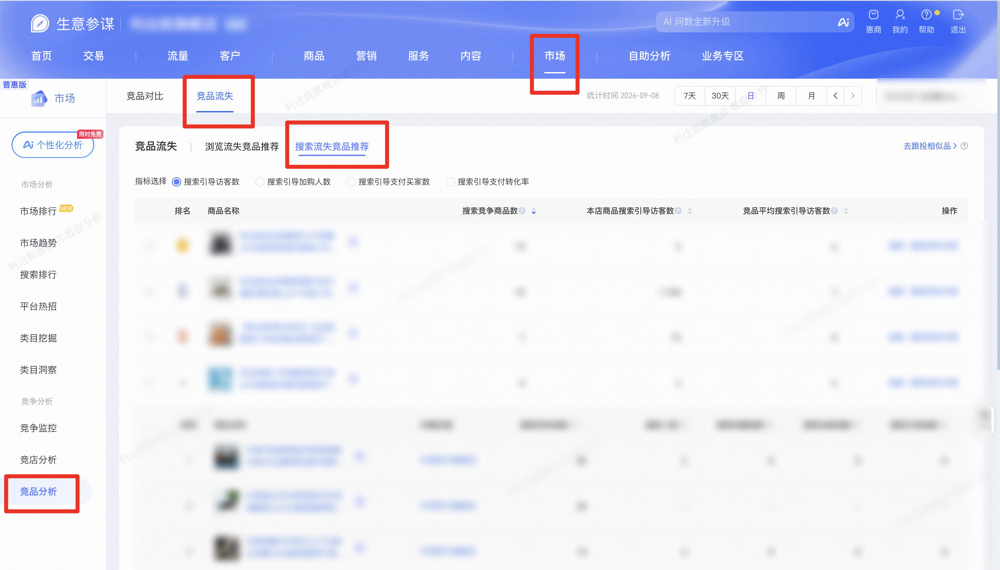

| 属性             | 值                                                                 |
| ---------------- | ------------------------------------------------------------------ |
| **连接器类型**   | `RPA 连接器`                                                       |
| **连接器名称**   | `ODS_市场竞品流失搜索推荐明细表(生意参谋RPA)`                       |
| **连接器代码**   | `rpa.conn.sycm.item.competitive.loss.search`                       |
| **操作类型**     | `页面解析`                                                         |
| **目标网页**     | `https://sycm.taobao.com/mc/free/ci_item`                          |
| **适用场景**     | 采集生意参谋市场竞品分析「竞品流失」中「搜索流失竞品推荐」列表，按统计时间与类目筛选，可只采流失竞品商品列表或展开采集商品子列表 |
| **数据表名**     | `ods_rpa_sycm_item_competitive_loss_search_du`                     |
| **业务表名**     | `ODS_市场竞品流失搜索推荐明细表(生意参谋RPA)`                       |

### 目标页面

> **取数路径**：生意参谋—市场—竞品分析—竞品流失—搜索流失竞品推荐
>
> **取数链接**：[https://sycm.taobao.com/mc/free/ci_item](https://sycm.taobao.com/mc/free/ci_item)



### 业务入参
`product_sublist` 是点击商品列表展开后的数据
| 字段 | 中文释义 | 数据类型 | 必填 | 默认值 | 说明 |
| ---- | -------- | -------- | ---- | ------ | ---- |
| `date_type` | 时间类型 | `String` | 否 | `DAY` | 可选值：`LAST_7_DAYS`（7天）/ `LAST_30_DAYS`（30天）/ `DAY`（日）/ `WEEK`（周）/ `MONTH`（月）。 |
| `biz_date` | 统计日期 | `String` | 条件必填 | — | `date_type` 为 `WEEK` / `MONTH` 时必填；为 `DAY` 时不传则默认昨天。格式 `YYYYMMDD` 或 `YYYY-MM-DD`。日：昨天往前共 90 天。周：整周必须在90天内。月：当前月之前的三个完整自然月 |
| `category_keyword` | 类目关键字 | `String` | 是 | — | 在类目选择器中按关键字搜索；多条命中点第一条；无结果返回「暂无搜索结果」 |
| `indicator_type` | 指标选择 | `String` | 否 | `SE_GUIDE_UV` | 可选值：`SE_GUIDE_UV`（搜索引导访客数）/ `SE_GUIDE_CART_BYR_CNT`（搜索引导加购人数）/ `SE_GUIDE_PAY_BYR_CNT`（搜索引导支付买家数）/ `SE_GUIDE_PAY_RATE`（搜索引导支付转化率）。 |
| `product_sublist` | 是否采集商品子列表 | `String` | 否 | `FALSE` | 可选值：`TRUE`（采集商品子列表）/ `FALSE`（只采流失竞品商品列表）。采集时输出含商品子列表，只采流失竞品商品列表时该字段为 `null` |
| `sort_column` | 流失竞品商品列表排序列 | `String` | 否 | — | 可选值：`SE_RIVAL_ITM_CNT`（搜索竞争商品数）/ `SELF_INDICATOR`（本店商品当前指标）/ `RIVAL_AVG_INDICATOR`（竞品平均当前指标）。保留页面默认排序 |
| `sort_order` | 排序方向 | `String` | 否 | — | 可选值：`DESC`（降序）/ `ASC`（升序）。有 `sort_column` 且未传时默认 `DESC` |
| `collect_limit` | 采集条数上限 | `Number` | 否 | — | 须为正整数。根据此值计算翻页数 |

### 入参样例
```json
{
  "category_keyword": "运动鞋new"
}
```

```json
{
  "date_type": "DAY",
  "category_keyword": "运动鞋new",
  "indicator_type": "SE_GUIDE_UV",
  "product_sublist": "TRUE",
  "collect_limit": 30
}
```

```json
{
  "date_type": "LAST_7_DAYS",
  "category_keyword": "运动鞋new",
  "sort_column": "SE_RIVAL_ITM_CNT",
  "sort_order": "DESC"
}
```

```json
{
  "date_type": "WEEK",
  "biz_date": "20260907",
  "category_keyword": "运动鞋new"
}
```

```json
{
  "date_type": "MONTH",
  "biz_date": "20260801",
  "category_keyword": "运动鞋new"
}
```

### 入参校验

```json-schema collapsed
{
  "$schema": "https://json-schema.org/draft/2020-12/schema",
  "title": "生意参谋-市场竞品流失搜索流失竞品推荐 - 查询入参",
  "description": "采集生意参谋市场竞品分析「竞品流失」中「搜索流失竞品推荐」列表，按统计时间与类目筛选，可只采流失竞品商品列表或展开采集商品子列表",
  "type": "object",
  "properties": {
    "date_type": {
      "type": "string",
      "description": "统计时间类型（可选）。可选值：LAST_7_DAYS（7天）/ LAST_30_DAYS（30天）/ DAY（日）/ WEEK（周）/ MONTH（月）。LAST_7_DAYS / LAST_30_DAYS 以昨天为终点自动取窗口，忽略 biz_date",
      "enum": ["LAST_7_DAYS", "LAST_30_DAYS", "DAY", "WEEK", "MONTH"],
      "default": "DAY"
    },
    "biz_date": {
      "type": "string",
      "description": "统计日期；date_type 为 WEEK / MONTH 时必填，为 DAY 时不传则用昨天。格式 YYYYMMDD 或 YYYY-MM-DD。日：昨天往前共 90 天（含昨天）。周：所在整周须落在该窗口内。月：仅能选当前月之前的三个完整自然月",
      "pattern": "^(\\d{8}|\\d{4}-\\d{2}-\\d{2})$"
    },
    "category_keyword": {
      "type": "string",
      "description": "类目关键字（必填）。在类目选择器中按关键字搜索；多条命中点第一条；无结果返回「暂无搜索结果」",
      "minLength": 1
    },
    "indicator_type": {
      "type": "string",
      "description": "指标选择（可选）。可选值：SE_GUIDE_UV（搜索引导访客数）/ SE_GUIDE_CART_BYR_CNT（搜索引导加购人数）/ SE_GUIDE_PAY_BYR_CNT（搜索引导支付买家数）/ SE_GUIDE_PAY_RATE（搜索引导支付转化率）。流失竞品商品列表后两列表头随所选指标变化",
      "enum": ["SE_GUIDE_UV", "SE_GUIDE_CART_BYR_CNT", "SE_GUIDE_PAY_BYR_CNT", "SE_GUIDE_PAY_RATE"],
      "default": "SE_GUIDE_UV"
    },
    "product_sublist": {
      "type": "string",
      "description": "是否采集商品子列表（可选）。可选值：TRUE（采集商品子列表）/ FALSE（只采流失竞品商品列表）。每条均为流失竞品商品列表字段平铺；采集商品子列表时该字段为当前页竞品（最多 10 条、可能不足），只采流失竞品商品列表时为 null，最多 50 条流失竞品商品",
      "enum": ["TRUE", "FALSE"],
      "default": "FALSE"
    },
    "sort_column": {
      "type": "string",
      "description": "流失竞品商品列表排序列（可选）。可选值：SE_RIVAL_ITM_CNT（搜索竞争商品数）/ SELF_INDICATOR（本店商品当前指标）/ RIVAL_AVG_INDICATOR（竞品平均当前指标）。不填则不点表头，保留页面默认排序",
      "enum": ["SE_RIVAL_ITM_CNT", "SELF_INDICATOR", "RIVAL_AVG_INDICATOR"]
    },
    "sort_order": {
      "type": "string",
      "description": "排序方向（可选）。可选值：DESC（降序）/ ASC（升序）。有 sort_column 且未传时默认 DESC",
      "enum": ["DESC", "ASC"]
    },
    "collect_limit": {
      "type": "integer",
      "description": "采集条数上限（可选）。须为正整数。未传时：只采流失竞品商品列表最多 100 页（每页 100 条，合计 10000）；采集商品子列表最多 50 条流失竞品商品。传入后不超过对应上限。一条为一条流失竞品商品（含 product_sublist）",
      "minimum": 1,
      "maximum": 10000
    }
  },
  "required": ["category_keyword"],
  "additionalProperties": false,
  "allOf": [
    {
      "if": {
        "properties": {
          "date_type": { "enum": ["WEEK", "MONTH"] }
        },
        "required": ["date_type"]
      },
      "then": {
        "required": ["biz_date"]
      }
    },
    {
      "if": {
        "properties": {
          "product_sublist": { "const": "TRUE" }
        },
        "required": ["product_sublist"]
      },
      "then": {
        "properties": {
          "collect_limit": {
            "maximum": 50
          }
        }
      }
    }
  ]
}
```

### 数据字段

`product_sublist` 在采集商品子列表时为该商品当前页竞品列表，只采流失竞品商品列表时为 `null`。

:::field-tree
@define 商品信息
| `itemId` | 商品 ID | `String` | 否 | 页面解析 | `103****424` (已脱敏) |
| `pictUrl` | 商品主图 | `String` | 否 | 页面解析 | `//img.alicdn.com/****` (已脱敏) |
| `detailUrl` | 商品详情链接 | `String` | 否 | 页面解析 | `//sycm.taobao.com/****` (已脱敏) |
| `title` | 商品标题 | `String` | 否 | 页面解析 | `****` (已脱敏) |
| `userId` | 卖家用户 ID | `Number` | 是 | 页面解析 | `221****497` (已脱敏) |

@define 店铺信息
| `province` | 省份 | `String` | 是 | 页面解析 | `浙江省` |
| `city` | 城市 | `String` | 是 | 页面解析 | `金华市` |
| `pictureUrl` | 店铺头像 | `String` | 否 | 页面解析 | `//img.alicdn.com/****` (已脱敏) |
| `title` | 店铺名称 | `String` | 否 | 页面解析 | `****` (已脱敏) |
| `shopUrl` | 店铺链接 | `String` | 否 | 页面解析 | `//****.tmall.com` (已脱敏) |
| `userId` | 卖家用户 ID | `Number` | 否 | 页面解析 | `221****497` (已脱敏) |

@define 商品标识
| `value` | 商品 ID | `String` | 否 | 页面解析 | `103****424` (已脱敏) |

@define 取值指标
| `value` | 指标值 | `Number` | 是 | 页面解析 | `12` |

@define 取值区间
| `value` | 指标值 | `String` | 是 | 页面解析 | `10 ~ 50` |

@define 取值布尔
| `value` | 是否已监控 | `Boolean` | 否 | 页面解析 | `false` |

@define 商品子列表
| `itemId` @商品标识 | 商品 ID | `Dict` | 否 | 页面解析 | 见数据样例 |
| `item` @商品信息 | 商品对象 | `Dict` | 否 | 页面解析 | 见数据样例 |
| `shop` @店铺信息 | 所属店铺 | `Dict` | 是 | 页面解析 | 见数据样例 |
| `seRivalIndex` @取值指标 | 搜索竞争指数 | `Dict` | 是 | 页面解析 | 见数据样例 |
| `searchUv` @取值区间 | 搜索人气 | `Dict` | 是 | 页面解析 | 见数据样例 |
| `seCltIndex` @取值指标 | 搜索收藏人气 | `Dict` | 是 | 页面解析 | 见数据样例 |
| `seCartIndex` @取值指标 | 搜索加购人气 | `Dict` | 是 | 页面解析 | 见数据样例 |
| `sePayAmtIndex` @取值指标 | 搜索支付金额指数 | `Dict` | 是 | 页面解析 | 见数据样例 |
| `isMonitored` @取值布尔 | 是否已监控 | `Dict` | 否 | 页面解析 | 见数据样例 |

| 字段 | 中文释义 | 数据类型 | 可为空 | 取数路径 | 示例 |
| ---- | -------- | -------- | ------ | -------- | ---- |
| `itemId` @商品标识 | 商品 ID | `Dict` | 否 | 页面解析 | 见数据样例 |
| `item` @商品信息 | 商品对象 | `Dict` | 否 | 页面解析 | 见数据样例 |
| `seRivalItmCnt` @取值指标 | 搜索竞争商品数 | `Dict` | 是 | 页面解析 | 见数据样例 |
| `seGuideUv` @取值指标 | 本店搜索引导访客数 | `Dict` | 是 | 页面解析 | 见数据样例 |
| `rivalItmAvgSeGuideUv` @取值指标 | 竞品平均搜索引导访客数 | `Dict` | 是 | 页面解析 | 见数据样例 |
| `seGuideCartByrCnt` @取值指标 | 本店搜索引导加购人数 | `Dict` | 是 | 页面解析 | 见数据样例 |
| `rivalItmAvgSeGuideCartByrCnt` @取值指标 | 竞品平均搜索引导加购人数 | `Dict` | 是 | 页面解析 | 见数据样例 |
| `seGuidePayByrCnt` @取值指标 | 本店搜索引导支付买家数 | `Dict` | 是 | 页面解析 | 见数据样例 |
| `rivalItmAvgSeGuidePayByrCnt` @取值指标 | 竞品平均搜索引导支付买家数 | `Dict` | 是 | 页面解析 | 见数据样例 |
| `seGuidePayRate` @取值指标 | 本店搜索引导支付转化率 | `Dict` | 是 | 页面解析 | 见数据样例 |
| `rivalItmAvgSeGuidePayRate` @取值指标 | 竞品平均搜索引导支付转化率 | `Dict` | 是 | 页面解析 | 见数据样例 |
| `isMonitored` @取值布尔 | 是否已监控 | `Dict` | 否 | 页面解析 | 见数据样例 |
| `product_sublist` @商品子列表 | 商品子列表 | `List[Dict]` | 是 | 页面解析 | 见数据样例 |
| `statDate` | 统计时间 | `String` | 否 | 页面统计时间 | `2026-09-09` |
| `categoryName` | 已选类目 | `String` | 否 | 页面已选类目 | `****` (已脱敏) |
| `indicatorType` | 已选指标 | `String` | 否 | 页面已选指标 | `搜索引导访客数` |
| `bizDate` | 业务日期 | `String` | 否 | 附加 | `20260910` |
| `accountId` | 授权 ID | `String` | 否 | 附加 | `1****7` (已脱敏) |
:::

### 数据样例

`product_sublist=TRUE` 时，输出字段 `product_sublist` 为商品子列表数据；`product_sublist=FALSE` 时该字段为 `null`：
```json
[
  {
    "itemId": {
      "value": "103****424"
    },
    "item": {
      "itemId": "103****424",
      "pictUrl": "//img.alicdn.com/****",
      "detailUrl": "//sycm.taobao.com/****",
      "title": "****"
    },
    "seRivalItmCnt": {
      "value": 12
    },
    "seGuideUv": {
      "value": 8
    },
    "rivalItmAvgSeGuideUv": {
      "value": 5
    },
    "seGuideCartByrCnt": {
      "value": 1
    },
    "rivalItmAvgSeGuideCartByrCnt": {
      "value": 1
    },
    "seGuidePayByrCnt": {
      "value": 0
    },
    "rivalItmAvgSeGuidePayByrCnt": {
      "value": 0
    },
    "seGuidePayRate": {
      "value": 0.0
    },
    "rivalItmAvgSeGuidePayRate": {
      "value": 0.0347
    },
    "isMonitored": {
      "value": false
    },
    "product_sublist": [
      {
        "itemId": {
          "value": "914****967"
        },
        "item": {
          "itemId": "914****967",
          "pictUrl": "//img.alicdn.com/****",
          "detailUrl": "//sycm.taobao.com/****",
          "title": "****",
          "userId": "221****497"
        },
        "shop": {
          "pictureUrl": "//img.alicdn.com/****",
          "title": "****",
          "shopUrl": "//****.tmall.com",
          "userId": "221****497"
        },
        "seRivalIndex": {
          "value": 29.0009113855
        },
        "searchUv": {
          "value": "10 ~ 50"
        },
        "seCltIndex": {
          "value": 0.0
        },
        "seCartIndex": {
          "value": 36.9314718056
        },
        "sePayAmtIndex": {
          "value": 689.7092164996
        },
        "isMonitored": {
          "value": false
        }
      },
      {
        "itemId": {
          "value": "107****501"
        },
        "item": {
          "itemId": "107****501",
          "pictUrl": "//img.alicdn.com/****",
          "detailUrl": "//sycm.taobao.com/****",
          "title": "****",
          "userId": "203****798"
        },
        "shop": {
          "province": "浙江省",
          "city": "金华市",
          "pictureUrl": "//img.alicdn.com/****",
          "title": "****",
          "shopUrl": "//****.tmall.com",
          "userId": "203****798"
        },
        "seRivalIndex": {
          "value": 24.2206894995
        },
        "searchUv": {
          "value": "4"
        },
        "seCltIndex": {
          "value": 0.0
        },
        "seCartIndex": {
          "value": 36.9314718056
        },
        "sePayAmtIndex": {
          "value": 0.0
        },
        "isMonitored": {
          "value": false
        }
      }
    ],
    "bizDate": "20260910",
    "accountId": "1****7",
    "statDate": "2026-09-09",
    "categoryName": "****",
    "indicatorType": "搜索引导访客数"
  }
]
```