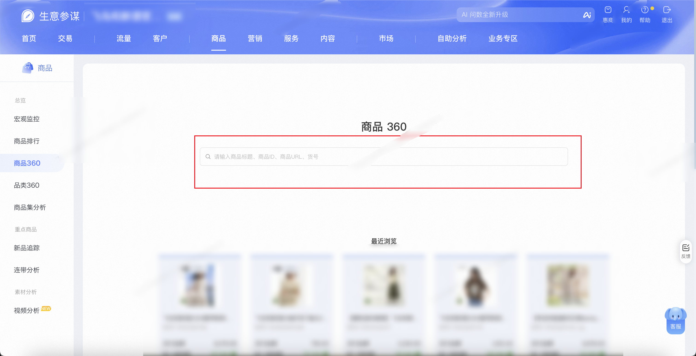
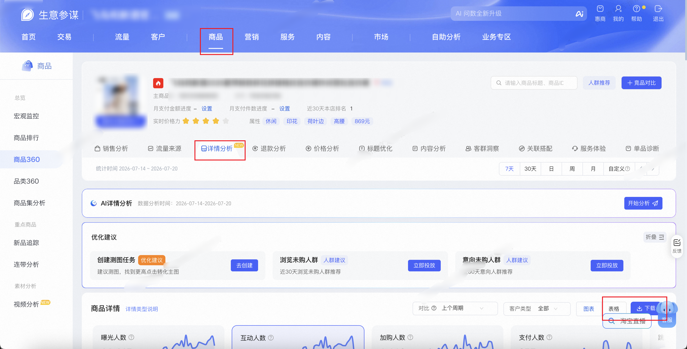

| 属性             | 值                                                                                       |
| ---------------- | ---------------------------------------------------------------------------------------- |
| **连接器类型**   | `RPA 连接器`                                                                             |
| **连接器名称**   | `ODS_商品360详情分析明细表(生意参谋RPA)`                                                 |
| **连接器代码**   | `rpa.conn.sycm.item.detail.analysis`                                                     |
| **操作类型**     | `文件导出`                                                                               |
| **目标网页**     | `https://sycm.taobao.com/cc/item_archives`                                               |
| **适用场景**     | 按商品关键词搜索进入商品360详情分析页，导出采集商品详情与主图分析的曝光、互动、跳失、加购、支付及转化率等指标 |
| **数据表名**     | `ods_rpa_sycm_item_detail_analysis_du`                                                   |
| **业务表名**     | `ODS_商品360详情分析明细表(生意参谋RPA)`                                                 |

### 目标页面

> **取数路径**：生意参谋—商品—商品360—详情分析
>
> **取数链接**：[https://sycm.taobao.com/cc/item_archives](https://sycm.taobao.com/cc/item_archives)





### 业务入参

| 字段 | 中文释义 | 数据类型 | 必填 | 默认值 | 说明 |
| ---- | -------- | -------- | ---- | ------ | ---- |
| `keyword` | 商品关键词 | `String` | 是 | — | 支持商品 ID、标题、货号或商品 URL；搜索后取第一条命中商品进入详情分析 |
| `date_type` | 统计时间类型 | `String` | 是 | — | 可选值：`RECENT7`（7天）/ `RECENT30`（30天）/ `DAY`（日）/ `WEEK`（周）/ `MONTH`（月）/ `CUSTOM`（自定义）；非 `CUSTOM` 时点击对应按钮并采用页面默认区间 |
| `custom_start_date` | 自定义起始日 | `String` | 条件必填 | — | `date_type=CUSTOM` 时必填；格式 `YYYYMMDD` 或 `YYYY-MM-DD` |
| `custom_end_date` | 自定义结束日 | `String` | 条件必填 | — | `date_type=CUSTOM` 时必填；格式 `YYYYMMDD` 或 `YYYY-MM-DD`；与起始日跨度不超过 31 天 |

> 未搜索到相关商品时，任务以 `success=false`、`retryable=false` 软退出，不写入存储。

### 入参样例

按商品 ID 查询近 7 天：

```json
{
  "keyword": "1051310889905",
  "date_type": "RECENT7"
}
```

按商品标题查询近 30 天：

```json
{
  "keyword": "示例品牌2026夏季新款连衣裙",
  "date_type": "RECENT30"
}
```

自定义统计区间（跨度 ≤ 31 天）：

```json
{
  "keyword": "1051310889905",
  "date_type": "CUSTOM",
  "custom_start_date": "20260701",
  "custom_end_date": "20260720"
}
```

### 入参校验

```json-schema collapsed
{
  "$schema": "https://json-schema.org/draft/2020-12/schema",
  "title": "生意参谋-商品360详情分析 - 查询入参",
  "description": "按商品关键词搜索进入商品360详情分析页，导出采集商品详情与主图分析的曝光、互动、跳失、加购、支付及转化率等指标",
  "type": "object",
  "properties": {
    "keyword": {
      "type": "string",
      "description": "商品关键词，支持商品 ID、标题、货号或商品 URL",
      "minLength": 1
    },
    "date_type": {
      "type": "string",
      "description": "统计时间类型。可选值：RECENT7（7天）/ RECENT30（30天）/ DAY（日）/ WEEK（周）/ MONTH（月）/ CUSTOM（自定义）",
      "enum": ["RECENT7", "RECENT30", "DAY", "WEEK", "MONTH", "CUSTOM"]
    },
    "custom_start_date": {
      "type": "string",
      "description": "自定义起始日；date_type=CUSTOM 时必填。格式 YYYYMMDD 或 YYYY-MM-DD",
      "pattern": "^(\\d{8}|\\d{4}-\\d{2}-\\d{2})$"
    },
    "custom_end_date": {
      "type": "string",
      "description": "自定义结束日；date_type=CUSTOM 时必填。格式 YYYYMMDD 或 YYYY-MM-DD；与起始日跨度不超过 31 天",
      "pattern": "^(\\d{8}|\\d{4}-\\d{2}-\\d{2})$"
    }
  },
  "required": ["keyword", "date_type"],
  "allOf": [
    {
      "if": {
        "properties": {
          "date_type": { "const": "CUSTOM" }
        },
        "required": ["date_type"]
      },
      "then": {
        "required": ["custom_start_date", "custom_end_date"]
      }
    }
  ],
  "additionalProperties": false
}
```

### 数据字段

每条任务输出 **1 条聚合记录**（`data[0]`），内含商品详情与主图分析两个嵌套数组。

:::field-tree
@define 商品详情项
| `itemId` | 商品 ID | `Number` | 否 | `XLS.0.商品id` | `105****905` (已脱敏) |
| `level` | 层级 | `Number` | 否 | `XLS.0.层级` | `1` |
| `detailType` | 参数类型 | `String` | 否 | `XLS.0.参数类型` | `主图` |
| `exposeUv` | 曝光人数 | `String` | 否 | `XLS.0.曝光人数` | `16,451` |
| `interactUv` | 互动人数 | `String` | 否 | `XLS.0.互动人数` | `11,793` |
| `lossUv` | 跳失人数 | `String` | 否 | `XLS.0.跳失人数` | `15,195` |
| `cartUv` | 加购人数 | `String` | 否 | `XLS.0.加购人数` | `1,113` |
| `collectUv` | 收藏人数 | `Number` | 否 | `XLS.0.收藏人数` | `122` |
| `createOrderUv` | 下单人数 | `Number` | 否 | `XLS.0.下单人数` | `269` |
| `payUv` | 支付人数 | `Number` | 否 | `XLS.0.支付人数` | `257` |
| `lossRate` | 跳失率 | `String` | 否 | `XLS.0.跳失率` | `92.37%` |
| `cartConvertRate` | 加购转化率 | `String` | 否 | `XLS.0.加购转化率` | `6.77%` |
| `payConvertRate` | 支付转化率 | `String` | 否 | `XLS.0.支付转化率` | `1.56%` |
| `bizDate` | 业务日期 | `String` | 否 | 附加 | `20260721` |
| `accountId` | 授权 ID | `String` | 否 | 附加 | `1****6` (已脱敏) |

@define 主图分析项
| `itemId` | 商品 ID | `Number` | 否 | `XLS.0.商品id` | `105****905` (已脱敏) |
| `materialType` | 素材类型 | `String` | 否 | `XLS.0.素材类型` | `视频` |
| `material` | 主图素材 URL | `String` | 否 | `XLS.0.主图素材` | `https://img.alicdn.com/****` |
| `exposeUv` | 曝光人数 | `String` | 否 | `XLS.0.曝光人数` | `15,582` |
| `interactUv` | 互动人数 | `String` | 否 | `XLS.0.互动人数` | `11,625` |
| `lossUv` | 跳失人数 | `String` | 否 | `XLS.0.跳失人数` | `14,371` |
| `cartUv` | 加购人数 | `String` | 否 | `XLS.0.加购人数` | `1,071` |
| `collectUv` | 收藏人数 | `Number` | 否 | `XLS.0.收藏人数` | `119` |
| `createOrderUv` | 下单人数 | `Number` | 否 | `XLS.0.下单人数` | `263` |
| `payUv` | 支付人数 | `Number` | 否 | `XLS.0.支付人数` | `251` |
| `lossRate` | 跳失率 | `String` | 否 | `XLS.0.跳失率` | `92.23%` |
| `cartConvertRate` | 加购转化率 | `String` | 否 | `XLS.0.加购转化率` | `6.87%` |
| `payConvertRate` | 支付转化率 | `String` | 否 | `XLS.0.支付转化率` | `1.61%` |
| `bizDate` | 业务日期 | `String` | 否 | 附加 | `20260721` |
| `accountId` | 授权 ID | `String` | 否 | 附加 | `1****6` (已脱敏) |

| 字段 | 中文释义 | 数据类型 | 可为空 | 取数路径 | 示例 |
| ---- | -------- | -------- | ------ | -------- | ---- |
| `itemId` | 商品 ID | `String` | 否 | 搜索接口命中商品 | `105****905` (已脱敏) |
| `itemName` | 商品名称 | `String` | 否 | 搜索接口命中商品 | `示例品牌2026夏季新款碎花拼接格纹连衣裙休闲宽松连衣裙` |
| `dateType` | 统计时间类型 | `String` | 否 | 来自入参 `date_type` | `RECENT7` |
| `dateRangeStart` | 实际统计区间起始日 | `String` | 否 | 页面统计时间控件 | `2026-07-14` |
| `dateRangeEnd` | 实际统计区间结束日 | `String` | 否 | 页面统计时间控件 | `2026-07-20` |
| `detailList` @商品详情项 | 商品详情表格数据 | `List[Dict]` | 是 | 商品详情卡「表格」→「下载」导出文件 | 见数据样例 |
| `mainPicList` @主图分析项 | 主图分析表格数据 | `List[Dict]` | 是 | 主图分析卡「下载」导出文件 | 见数据样例 |
:::

### 数据样例

```json
[
  {
    "itemId": "105****905",
    "itemName": "示例品牌2026夏季新款碎花拼接格纹连衣裙休闲宽松连衣裙",
    "dateType": "RECENT7",
    "dateRangeStart": "2026-07-14",
    "dateRangeEnd": "2026-07-20",
    "detailList": [
      {
        "itemId": "105****905",
        "level": 1,
        "detailType": "主图",
        "exposeUv": "16,451",
        "interactUv": "11,793",
        "lossUv": "15,195",
        "cartUv": "1,113",
        "collectUv": 122,
        "createOrderUv": 269,
        "payUv": 257,
        "lossRate": "92.37%",
        "cartConvertRate": "6.77%",
        "payConvertRate": "1.56%",
        "bizDate": "20260721",
        "accountId": "1****6"
      },
      {
        "itemId": "105****905",
        "level": 2,
        "detailType": "主图视频",
        "exposeUv": "15,601",
        "interactUv": "11,698",
        "lossUv": "14,388",
        "cartUv": "1,073",
        "collectUv": 119,
        "createOrderUv": 263,
        "payUv": 251,
        "lossRate": "92.22%",
        "cartConvertRate": "6.88%",
        "payConvertRate": "1.61%",
        "bizDate": "20260721",
        "accountId": "1****6"
      },
      {
        "itemId": "105****905",
        "level": 1,
        "detailType": "sku",
        "exposeUv": "16,414",
        "interactUv": "781",
        "lossUv": "15,159",
        "cartUv": "1,111",
        "collectUv": 122,
        "createOrderUv": 269,
        "payUv": 257,
        "lossRate": "92.35%",
        "cartConvertRate": "6.77%",
        "payConvertRate": "1.57%",
        "bizDate": "20260721",
        "accountId": "1****6"
      }
    ],
    "mainPicList": [
      {
        "itemId": "105****905",
        "materialType": "视频",
        "material": "https://img.alicdn.com/****",
        "exposeUv": "15,582",
        "interactUv": "11,625",
        "lossUv": "14,371",
        "cartUv": "1,071",
        "collectUv": 119,
        "createOrderUv": 263,
        "payUv": 251,
        "lossRate": "92.23%",
        "cartConvertRate": "6.87%",
        "payConvertRate": "1.61%",
        "bizDate": "20260721",
        "accountId": "1****6"
      },
      {
        "itemId": "105****905",
        "materialType": "图集",
        "material": "https://img.alicdn.com/****",
        "exposeUv": "3,616",
        "interactUv": "77",
        "lossUv": "3,064",
        "cartUv": "507",
        "collectUv": 49,
        "createOrderUv": 139,
        "payUv": 134,
        "lossRate": "84.73%",
        "cartConvertRate": "14.02%",
        "payConvertRate": "3.71%",
        "bizDate": "20260721",
        "accountId": "1****6"
      }
    ]
  }
]
```

---
