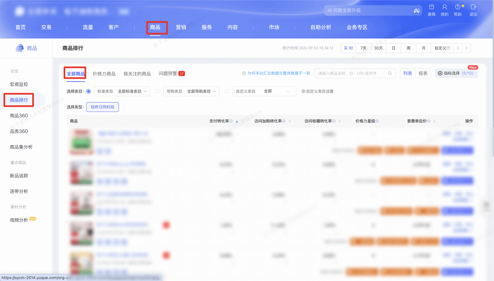

| 属性             | 值                                                                                     |
| ---------------- | -------------------------------------------------------------------------------------- |
| **连接器类型**   | `RPA 连接器`                                                                           |
| **连接器名称**   | `ODS_商品排行全部商品数据(生意参谋RPA)`                                                |
| **连接器代码**   | `rpa.conn.sycm.item.rank.all.runtime`                                                   |
| **操作类型**     | `页面解析`                                                                             |
| **目标网页**     | `https://sycm.taobao.com/cc/item_rank`                                                 |
| **适用场景**     | 采集生意参谋商品排行「全部商品」实时列表的支付转化、加购收藏、访客浏览及支付等指标 |
| **数据表名**     | `ods_rpa_sycm_item_rank_all_runtime_du`                                                |
| **业务表名**     | `ODS_商品排行全部商品数据(生意参谋RPA)`                                                |

### 目标页面

> **取数路径**：生意参谋—商品—商品排行—全部商品
>
> **取数链接**：[https://sycm.taobao.com/cc/item_rank](https://sycm.taobao.com/cc/item_rank)



### 业务入参

| 字段 | 中文释义 | 数据类型 | 必填 | 默认值 | 说明 |
| ---- | -------- | -------- | ---- | ------ | ---- |
| `sort_field` | 排序列 | `String` | 否 | — | 可选值：`PAY_AMT`（支付金额）/ `PAY_ITM_CNT`（支付件数）/ `PAY_RATE`（支付转化率）。不填则沿用页面当前排序列（默认支付金额）。不可同时传入多个值 |
| `sort_order` | 排序方向 | `String` | 否 | — | 可选值：`DESC`（倒序，从大到小）/ `ASC`（正序，从小到大）。不填则沿用页面当前排序方向（默认倒序） |
| `collect_limit` | 采集条数上限 | `Number` | 否 | — | 根据这个值计算页数进行翻页 |

### 入参样例

不填排序与条数，沿用页面默认（支付金额倒序，最多 1000 条）：

```json
{}
```

按支付金额倒序，采集不超过 100 条：

```json
{
  "sort_field": "PAY_AMT",
  "sort_order": "DESC",
  "collect_limit": 100
}
```

按支付件数倒序，采集不超过 12 条：

```json
{
  "sort_field": "PAY_ITM_CNT",
  "sort_order": "DESC",
  "collect_limit": 12
}
```

按支付转化率正序，采集不超过 10 条：

```json
{
  "sort_field": "PAY_RATE",
  "sort_order": "ASC",
  "collect_limit": 10
}
```

### 入参校验

```json-schema collapsed
{
  "$schema": "https://json-schema.org/draft/2020-12/schema",
  "title": "生意参谋-商品排行全部商品实时 - 查询入参",
  "description": "采集生意参谋商品排行「全部商品」实时列表的支付转化、加购收藏、访客浏览及支付等指标；可不填排序与条数（沿用页面默认：支付金额倒序，最多 1000 条），也可指定支付金额、支付件数或支付转化率及正序/倒序",
  "type": "object",
  "properties": {
    "sort_field": {
      "type": "string",
      "description": "排序列（单值，可选）。可选值：PAY_AMT（支付金额）/ PAY_ITM_CNT（支付件数）/ PAY_RATE（支付转化率）。不填则沿用页面当前排序列。不可同时传入多个值",
      "enum": ["PAY_AMT", "PAY_ITM_CNT", "PAY_RATE"]
    },
    "sort_order": {
      "type": "string",
      "description": "排序方向（可选）。可选值：DESC（倒序，从大到小）/ ASC（正序，从小到大）。不填则沿用页面当前排序方向",
      "enum": ["DESC", "ASC"]
    },
    "collect_limit": {
      "type": "integer",
      "description": "采集条数上限（可选）。范围 1~1000；不填则采至 1000 条上限或列表实际条数",
      "minimum": 1,
      "maximum": 1000
    }
  },
  "required": [],
  "additionalProperties": false
}
```

### 数据字段


:::field-tree
@define 商品信息
| `itemId` | 商品 ID | `String` | 否 | 页面解析 | `868****806` (已脱敏) |
| `isImageTest` | 是否测图 | `Boolean` | 否 | 页面解析 | `false` |
| `online` | 是否在线 | `Boolean` | 否 | 页面解析 | `true` |
| `pictUrl` | 商品主图 | `String` | 否 | 页面解析 | `//img.alicdn.com/****` (已脱敏) |
| `mallItem` | 是否商城商品 | `Boolean` | 否 | 页面解析 | `true` |
| `detailUrl` | 商品详情链接 | `String` | 否 | 页面解析 | `//detail.tmall.com/****` (已脱敏) |
| `title` | 商品标题 | `String` | 否 | 页面解析 | `****` (已脱敏) |
| `userId` | 卖家用户 ID | `Number` | 否 | 页面解析 | `221****888` (已脱敏) |
| `categoryId` | 类目 ID | `Number` | 否 | 页面解析 | `500****728` (已脱敏) |

@define 商品标识
| `cycleCrc` | 环比变化率 | `Number` | 是 | 页面解析 | `0.0` |
| `value` | 商品 ID | `String` | 否 | 页面解析 | `868****806` (已脱敏) |

@define 环比指标
| `cycleCrc` | 环比变化率 | `Number` | 是 | 页面解析 | — |
| `value` | 指标值 | `Number` | 是 | 页面解析 | `25.0` |

@define 取值指标
| `value` | 指标值 | `Number` | 否 | 页面解析 | `0.0` |

@define 取值布尔
| `value` | 是否有人群 | `Boolean` | 否 | 页面解析 | `true` |

| 字段 | 中文释义 | 数据类型 | 可为空 | 取数路径 | 示例 |
| ---- | -------- | -------- | ------ | -------- | ---- |
| `statDate` @取值指标 | 统计日期 | `Dict` | 否 | 页面解析 | 见数据样例 |
| `item` @商品信息 | 商品对象 | `Dict` | 否 | 页面解析 | 见数据样例 |
| `itemId` @商品标识 | 商品 ID | `Dict` | 否 | 页面解析 | 见数据样例 |
| `payRate` @环比指标 | 支付转化率 | `Dict` | 是 | 页面解析 | 见数据样例 |
| `visitCartRate` @取值指标 | 访问加购转化率 | `Dict` | 是 | 页面解析 | 见数据样例 |
| `visitCltRate` @取值指标 | 访问收藏转化率 | `Dict` | 是 | 页面解析 | 见数据样例 |
| `liveStarLevel` | 价格力星级 | `Number` | 是 | 页面解析 | — |
| `itmDstPrice` | 普惠券后价 | `Dict` | 是 | 页面解析 | — |
| `payAmt` @环比指标 | 支付金额 | `Dict` | 是 | 页面解析 | 见数据样例 |
| `payItmCnt` @环比指标 | 支付件数 | `Dict` | 是 | 页面解析 | 见数据样例 |
| `payByrCnt` @环比指标 | 支付买家数 | `Dict` | 是 | 页面解析 | 见数据样例 |
| `payPct` @环比指标 | 客单价 | `Dict` | 是 | 页面解析 | 见数据样例 |
| `itmUv` @环比指标 | 商品访客数 | `Dict` | 是 | 页面解析 | 见数据样例 |
| `itmPv` @环比指标 | 商品浏览量 | `Dict` | 是 | 页面解析 | 见数据样例 |
| `itemCartCnt` @环比指标 | 商品加购件数 | `Dict` | 是 | 页面解析 | 见数据样例 |
| `itemCartByrCnt` @环比指标 | 商品加购人数 | `Dict` | 是 | 页面解析 | 见数据样例 |
| `itemCltByrCnt` @环比指标 | 商品收藏人数 | `Dict` | 是 | 页面解析 | 见数据样例 |
| `taoSeUv` @环比指标 | 搜索引导访客数 | `Dict` | 是 | 页面解析 | 见数据样例 |
| `taoRecUv` @环比指标 | 推荐引导访客数 | `Dict` | 是 | 页面解析 | 见数据样例 |
| `sellerId` @环比指标 | 卖家 ID | `Dict` | 是 | 页面解析 | 见数据样例 |
| `hasSku` | 是否有 SKU | `Boolean` | 否 | 页面解析 | `false` |
| `hasCrowd` @取值布尔 | 是否有人群 | `Dict` | 是 | 页面解析 | 见数据样例 |
| `isTmallNewItem` | 是否天猫新品 | `Boolean` | 否 | 页面解析 | `false` |
| `itemStatus` | 商品状态 | `String` | 否 | 页面解析 | `已下架` |
| `showItem` | 是否展示商品 | `Boolean` | 否 | 页面解析 | `true` |
| `isMonitored` | 是否监控 | `Boolean` | 否 | 页面解析 | `false` |
| `itemTag` | 商品标签 | `String` | 是 | 页面解析 | — |
| `priceWarning` | 价格预警 | `Any` | 是 | 页面解析 | — |
| `bizDate` | 业务日期 | `String` | 否 | 附加 | `20260903` |
| `accountId` | 授权 ID | `String` | 否 | 附加 | `1****1` (已脱敏) |
:::

### 数据样例

```json
[
  {
    "statDate": {
      "value": 1788364800000
    },
    "item": {
      "itemId": "868****806",
      "isImageTest": false,
      "online": true,
      "pictUrl": "//img.alicdn.com/****",
      "mallItem": true,
      "detailUrl": "//detail.tmall.com/****",
      "title": "****",
      "userId": "221****888",
      "categoryId": "500****728"
    },
    "itemId": {
      "cycleCrc": 0.0,
      "value": "868****806"
    },
    "payRate": {
      "cycleCrc": null,
      "value": 1.0
    },
    "visitCartRate": {
      "value": 0.0
    },
    "visitCltRate": {
      "value": 0.0
    },
    "liveStarLevel": null,
    "itmDstPrice": null,
    "payAmt": {
      "cycleCrc": null,
      "value": 25.0
    },
    "payItmCnt": {
      "cycleCrc": null,
      "value": 25
    },
    "payByrCnt": {
      "cycleCrc": null,
      "value": 1
    },
    "payPct": {
      "cycleCrc": null,
      "value": 25.0
    },
    "itmUv": {
      "cycleCrc": null,
      "value": 1
    },
    "itmPv": {
      "cycleCrc": null,
      "value": 53
    },
    "itemCartCnt": {
      "cycleCrc": null,
      "value": 0
    },
    "itemCartByrCnt": {
      "cycleCrc": null,
      "value": 0
    },
    "itemCltByrCnt": {
      "cycleCrc": null,
      "value": 0
    },
    "taoSeUv": {
      "cycleCrc": null,
      "value": 0
    },
    "taoRecUv": {
      "cycleCrc": null,
      "value": 0
    },
    "sellerId": {
      "cycleCrc": null,
      "value": 0
    },
    "hasSku": false,
    "hasCrowd": {
      "value": true
    },
    "isTmallNewItem": false,
    "itemStatus": "已下架",
    "showItem": true,
    "isMonitored": false,
    "itemTag": null,
    "priceWarning": null,
    "bizDate": "20260903",
    "accountId": "1****1"
  }
]
```

---
