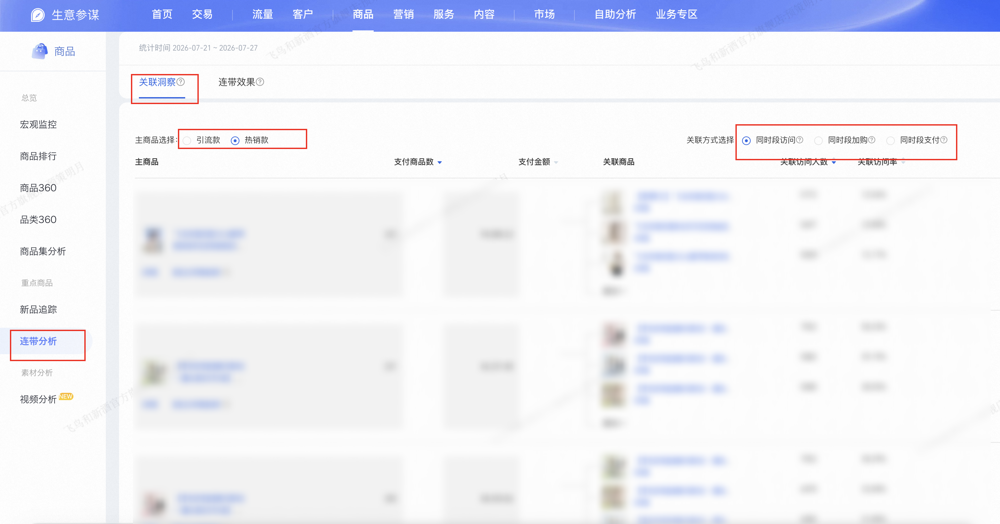

| 属性             | 值                                                                                       |
| ---------------- | ---------------------------------------------------------------------------------------- |
| **连接器类型**   | `RPA 连接器`                                                                             |
| **连接器名称**   | `ODS_商品连带分析关联洞察明细表(生意参谋RPA)`                                           |
| **连接器代码**   | `rpa.conn.sycm.item.relate.analyse`                                                      |
| **操作类型**     | `文件导出`                                                                               |
| **目标网页**     | `https://sycm.taobao.com/cc/item_relate?activeKey=cc_item_relate_analyse`                 |
| **适用场景**     | 导出生意参谋商品连带分析「关联洞察」页的主商品与关联商品访问、加购、支付等指标明细       |
| **数据表名**     | `ods_rpa_sycm_item_relate_analyse_du`                                                    |
| **业务表名**     | `ODS_商品连带分析关联洞察明细表(生意参谋RPA)`                                           |

### 目标页面

> **取数路径**：生意参谋—商品—连带分析—关联洞察
>
> **取数链接**：[https://sycm.taobao.com/cc/item_relate?activeKey=cc_item_relate_analyse](https://sycm.taobao.com/cc/item_relate?activeKey=cc_item_relate_analyse)



### 业务入参

| 字段 | 中文释义 | 数据类型 | 必填 | 默认值 | 说明 |
| ---- | -------- | -------- | ---- | ------ | ---- |
| `main_item_type` | 主商品选择 | `String` | 否 | `HOT` | 可选值：`TRAFFIC`（引流款）/ `HOT`（热销款）；未传或空串时默认 `HOT`（热销款） |
| `relate_type` | 关联方式选择 | `String` | 否 | `PAY` | 可选值：`VISIT`（同时段访问）/ `CART`（同时段加购）/ `PAY`（同时段支付）；未传或空串时默认 `PAY`（同时段支付） |

### 入参样例

不传参（默认热销款 + 同时段支付）：

```json
{}
```

引流款 + 同时段访问：

```json
{
  "main_item_type": "TRAFFIC",
  "relate_type": "VISIT"
}
```

热销款 + 同时段支付（显式指定，与默认等价）：

```json
{
  "main_item_type": "HOT",
  "relate_type": "PAY"
}
```

### 入参校验

```json-schema collapsed
{
  "$schema": "https://json-schema.org/draft/2020-12/schema",
  "title": "生意参谋-商品连带分析关联洞察 - 查询入参",
  "description": "导出生意参谋商品连带分析「关联洞察」页的主商品与关联商品访问、加购、支付等指标明细",
  "type": "object",
  "properties": {
    "main_item_type": {
      "type": "string",
      "description": "主商品选择。可选值：TRAFFIC（引流款）/ HOT（热销款）。未传或空串时默认 HOT（热销款）",
      "enum": ["TRAFFIC", "HOT"],
      "default": "HOT"
    },
    "relate_type": {
      "type": "string",
      "description": "关联方式选择。可选值：VISIT（同时段访问）/ CART（同时段加购）/ PAY（同时段支付）。未传或空串时默认 PAY（同时段支付）",
      "enum": ["VISIT", "CART", "PAY"],
      "default": "PAY"
    }
  },
  "additionalProperties": false
}
```

### 数据字段

| 字段 | 中文释义 | 数据类型 | 可为空 | 取数路径 | 示例 |
| ---- | -------- | -------- | ------ | -------- | ---- |
| `itemName` | 商品名称 | `String` | 否 | `XLS.0.商品名称` | `飞鸟和****连衣裙` (已脱敏) |
| `visitUv` | 访问人数 | `Number` | 否 | `XLS.0.访问人数` | `45950` |
| `payItemCnt` | 支付件数 | `Number` | 否 | `XLS.0.支付件数` | `237` |
| `payAmt` | 支付金额 | `Number` | 否 | `XLS.0.支付金额` | `94088.22` |
| `relateItemName` | 关联商品名称 | `String` | 否 | `XLS.0.关联商品名称` | `【莱赛****连衣裙` (已脱敏) |
| `relateVisitUv` | 关联访问人数 | `Number` | 否 | `XLS.0.关联访问人数` | `5772` |
| `relateVisitRate` | 关联访问率 | `String` | 否 | `XLS.0.关联访问率` | `12.56%` |
| `relateCartByrCnt` | 关联加购人数 | `Number` | 否 | `XLS.0.关联加购人数` | `70` |
| `relateCartByrRate` | 关联加购率 | `String` | 否 | `XLS.0.关联加购率` | `6.40%` |
| `relatePayByrCnt` | 关联支付人数 | `Number` | 否 | `XLS.0.关联支付人数` | `10` |
| `relatePayByrRate` | 关联购买率 | `String` | 否 | `XLS.0.关联购买率` | `4.41%` |
| `dateRangeStart` | 页面数据统计起始日 | `String` | 否 | `页面解析` | `2026-07-21` |
| `dateRangeEnd` | 页面数据统计结束日 | `String` | 否 | `页面解析` | `2026-07-27` |
| `bizDate` | 业务日期 | `String` | 否 | 附加 | `20260728` |
| `accountId` | 授权 ID | `String` | 否 | 附加 | `1****6` (已脱敏) |

### 数据样例

```json
{
  "itemName": "飞鸟和****连衣裙",
  "visitUv": 45950,
  "payItemCnt": 237,
  "payAmt": 94088.22,
  "relateItemName": "【莱赛****连衣裙",
  "relateVisitUv": 5772,
  "relateVisitRate": "12.56%",
  "relateCartByrCnt": 70,
  "relateCartByrRate": "6.40%",
  "relatePayByrCnt": 10,
  "relatePayByrRate": "4.41%",
  "dateRangeStart": "2026-07-21",
  "dateRangeEnd": "2026-07-27",
  "bizDate": "20260728",
  "accountId": "1****6"
}
```

---
