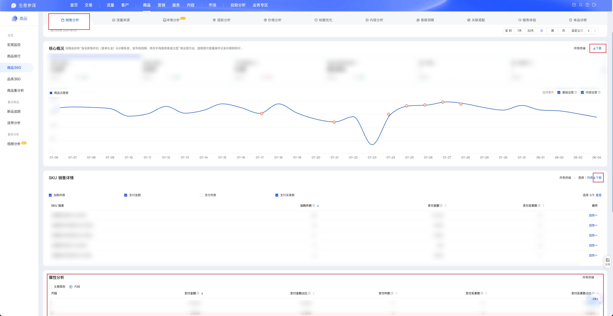

| 属性             | 值                                                                                       |
| ---------------- | ---------------------------------------------------------------------------------------- |
| **连接器类型**   | `RPA 连接器`                                                                             |
| **连接器名称**   | `ODS_商品360销售分析明细表(生意参谋RPA)`                                                 |
| **连接器代码**   | `rpa.conn.sycm.item.sale.analysis`                                                       |
| **操作类型**     | `页面解析` + `文件导出`                                                                  |
| **目标网页**     | `https://sycm.taobao.com/cc/item_archives?activeKey=sale`                                 |
| **适用场景**     | 按商品 ID 与统计周期采集生意参谋商品360「销售分析」页的核心概况、SKU 销售详情与属性分析指标 |
| **数据表名**     | `ods_rpa_sycm_item_sale_analysis_du`                                                     |
| **业务表名**     | `ODS_商品360销售分析明细表(生意参谋RPA)`                                                 |

### 目标页面

> **取数路径**：生意参谋—商品—商品360—销售分析
>
> **取数链接**：[https://sycm.taobao.com/cc/item_archives?activeKey=sale](https://sycm.taobao.com/cc/item_archives?activeKey=sale)

**采集模块范围**：

| 模块 | 采集方式 | 说明 |
| --- | -------- | ---- |
| 核心概况 | 浏览器下载 xls | 按统计周期导出指标明细 |
| SKU销售详情 | 浏览器下载 xls | 切至「列表」后导出 |
| 属性分析 | 页面表格解析 | 遍历全部属性维度，含翻页 |

执行前会在商品360搜索框校验 `item_id` 是否可命中。



### 业务入参

| 字段 | 中文释义 | 数据类型 | 必填 | 默认值 | 说明 |
| ---- | -------- | -------- | ---- | ------ | ---- |
| `item_id` | 商品 ID | `String` | 是 | — | 仅允许纯数字 |
| `date_type` | 统计时间类型 | `String` | 否 | `day` | 可选值：`recent7`（7天）/ `recent30`（30天）/ `day`（日）/ `week`（周）/ `month`（月） |
| `stat_date` | 统计日期 | `String` | 否 | `day`/`week`/`month` 不传时默认昨天/上周/上月 | 格式 `YYYYMMDD` 或 `YYYY-MM-DD`；`date_type` 为 `day`/`week`/`month` 时可传。禁止今日/本周/本月及以后；`recent7`/`recent30` 时忽略本参数 |

### 入参样例

按日（默认昨天，可不传 `stat_date`）：

```json
{
  "item_id": "1017291731088",
  "date_type": "day"
}
```

指定自然日：

```json
{
  "item_id": "1017291731088",
  "date_type": "day",
  "stat_date": "20260804"
}
```

近 7 天：

```json
{
  "item_id": "1017291731088",
  "date_type": "recent7"
}
```

按月（不传 `stat_date` 时默认上月）：

```json
{
  "item_id": "1017291731088",
  "date_type": "month",
  "stat_date": "20260701"
}
```

### 入参校验

```json-schema collapsed
{
  "$schema": "https://json-schema.org/draft/2020-12/schema",
  "title": "生意参谋-商品360-销售分析 - 查询入参",
  "description": "按商品 ID 与统计周期采集生意参谋商品360「销售分析」页的核心概况、SKU 销售详情与属性分析指标",
  "type": "object",
  "properties": {
    "item_id": {
      "type": "string",
      "description": "商品 ID；仅允许纯数字",
      "pattern": "^\\d+$"
    },
    "date_type": {
      "type": "string",
      "description": "统计时间类型，未传默认 day。可选值：recent7（7天）/ recent30（30天）/ day（日）/ week（周）/ month（月）",
      "enum": ["recent7", "recent30", "day", "week", "month"],
      "default": "day"
    },
    "stat_date": {
      "type": "string",
      "description": "统计日期；date_type 为 day/week/month 时可传，不传则默认昨天/上周/上月。格式 YYYYMMDD 或 YYYY-MM-DD；禁止今日/本周/本月及以后；recent7/recent30 时忽略",
      "pattern": "^(\\d{8}|\\d{4}-\\d{2}-\\d{2})$"
    }
  },
  "required": ["item_id"],
  "additionalProperties": false
}
```

### 数据字段

每条任务输出 **1 条**商品级记录：顶层含商品与统计区间信息；`coreList` / `skuSaleList` / `attrList` 分别为核心概况、SKU 销售详情、属性分析明细。

:::field-tree
@define 核心概况明细
| `statDate` | 时间 | `String` | 是 | `XLS.0.时间` | `2026年07月06日` |
| `itemUv` | 商品访客数 | `String` | 是 | `XLS.0.商品访客数` | `1,961` |
| `itemPv` | 商品浏览量 | `String` | 是 | `XLS.0.商品浏览量` | `5,381` |
| `itemAvgStayTime` | 商品平均停留时长 | `Number` | 是 | `XLS.0.商品平均停留时长` | `17` |
| `itemBounceRate` | 商品详情页跳出率 | `String` | 是 | `XLS.0.商品详情页跳出率` | `66.70%` |
| `itemCartBuyerCnt` | 商品加购人数 | `Number` | 是 | `XLS.0.商品加购人数` | `341` |
| `itemCartCnt` | 商品加购件数 | `Number` | 是 | `XLS.0.商品加购件数` | `468` |
| `itemCollectBuyerCnt` | 商品收藏人数 | `Number` | 是 | `XLS.0.商品收藏人数` | `37` |
| `orderBuyerCnt` | 下单买家数 | `Number` | 是 | `XLS.0.下单买家数` | `199` |
| `orderAmt` | 下单金额 | `String` | 是 | `XLS.0.下单金额` | `8,606.30` |
| `orderConvertRate` | 下单转换率 | `String` | 是 | `XLS.0.下单转换率` | `10.15%` |
| `payBuyerCnt` | 支付买家数 | `Number` | 是 | `XLS.0.支付买家数` | `196` |
| `orderItemCnt` | 下单件数 | `Number` | 是 | `XLS.0.下单件数` | `237` |
| `payRate` | 支付转换率 | `String` | 是 | `XLS.0.支付转换率` | `9.99%` |
| `payAmt` | 支付金额 | `String` | 是 | `XLS.0.支付金额` | `8,286.20` |
| `payQty` | 支付件数 | `Number` | 是 | `XLS.0.支付件数` | `228` |
| `jhsPayAmt` | 聚划算支付金额 | `Number` | 是 | `XLS.0.聚划算支付金额` | `0` |
| `payNewBuyerCnt` | 支付新买家数 | `Number` | 是 | `XLS.0.支付新买家数` | `174` |
| `payOldBuyerCnt` | 支付老买家数 | `Number` | 是 | `XLS.0.支付老买家数` | `22` |
| `oldBuyerPayAmt` | 老买家支付金额 | `String` | 是 | `XLS.0.老买家支付金额` | `855.60` |
| `monthPayAmt` | 月累计支付金额 | `String` | 是 | `XLS.0.月累计支付金额` | `59,147.20` |
| `monthPayQty` | 月累计支付件数 | `String` | 是 | `XLS.0.月累计支付件数` | `1,618` |
| `yearPayAmt` | 年累计支付金额 | `String` | 是 | `XLS.0.年累计支付金额` | `904,748.82` |
| `uvValue` | 访客平均价值 | `Number` | 是 | `XLS.0.访客平均价值` | `4` |
| `sucRefundAmt` | 成功退款金额 | `String` | 是 | `XLS.0.成功退款金额` | `1,585.55` |
| `bizDate` | 业务日期 | `String` | 否 | 附加 | `20260805` |
| `accountId` | 授权 ID | `String` | 否 | 附加 | `1****0` (已脱敏) |

@define SKU销售明细
| `skuId` | SKU ID | `Number` | 是 | `XLS.0.skuId` | `604****025` (已脱敏) |
| `skuName` | SKU 名称 | `String` | 是 | `XLS.0.sku名称` | `鞋码:****累脚】` (已脱敏) |
| `payAmt` | 支付金额 | `String` | 是 | `XLS.0.支付金额` | `39.90` |
| `payBuyerCnt` | 支付买家数 | `Number` | 是 | `XLS.0.支付买家数` | `1` |
| `payQty` | 支付件数 | `Number` | 是 | `XLS.0.支付件数` | `1` |
| `cartCnt` | 加购件数 | `Number` | 是 | `XLS.0.加购件数` | `3` |
| `bizDate` | 业务日期 | `String` | 否 | 附加 | `20260805` |
| `accountId` | 授权 ID | `String` | 否 | 附加 | `1****0` (已脱敏) |

@define 属性指标对象
| `value` | 指标值 | `String` / `Number` | 是 | 页面解析 | `2763.6` |
| `ratio` | 占比 | `Number` | 是 | 页面解析 | `0.3743` |

@define 属性分析明细
| `attrName` | 属性维度名称 | `String` | 否 | 页面解析（维度切换文案） | `鞋码` |
| `attrValue` @属性指标对象 | 属性值 | `Dict` | 是 | 页面解析 | 见数据样例 |
| `payAmt` @属性指标对象 | 支付金额 | `Dict` | 是 | 页面解析 | 见数据样例 |
| `payAmtRatio` @属性指标对象 | 支付金额占比 | `Dict` | 是 | 页面解析 | 见数据样例 |
| `payItmCnt` @属性指标对象 | 支付件数 | `Dict` | 是 | 页面解析 | 见数据样例 |
| `payByrCnt` @属性指标对象 | 支付买家数 | `Dict` | 是 | 页面解析 | 见数据样例 |
| `payByrCntRatio` @属性指标对象 | 支付买家数占比 | `Dict` | 是 | 页面解析 | 见数据样例 |
| `cartCnt` @属性指标对象 | 加购件数 | `Dict` | 是 | 页面解析 | 见数据样例 |

| 字段 | 中文释义 | 数据类型 | 可为空 | 取数路径 | 示例 |
| ---- | -------- | -------- | ------ | -------- | ---- |
| `itemId` | 商品 ID | `String` | 否 | 根据入参 `item_id` 派生 | `101****088` (已脱敏) |
| `itemName` | 商品名称 | `String` | 是 | 页面解析 | `示例品牌/商品` (已脱敏) |
| `dateType` | 统计时间类型 | `String` | 否 | 根据入参 `date_type` 派生 | `day` |
| `dateRangeStart` | 统计起始日 | `String` | 否 | 根据入参统计周期派生 | `2026-08-04` |
| `dateRangeEnd` | 统计结束日 | `String` | 否 | 根据入参统计周期派生 | `2026-08-04` |
| `coreList` @核心概况明细 | 核心概况明细列表 | `List[Dict]` | 是 | `XLS` 文件导出 | 见数据样例 |
| `skuSaleList` @SKU销售明细 | SKU 销售详情列表 | `List[Dict]` | 是 | `XLS` 文件导出 | 见数据样例 |
| `attrList` @属性分析明细 | 属性分析明细列表 | `List[Dict]` | 是 | 页面解析 | 见数据样例 |
| `bizDate` | 业务日期 | `String` | 否 | 附加 | `20260805` |
| `accountId` | 授权 ID | `String` | 否 | 附加 | `1****0` (已脱敏) |
:::

### 数据样例

```json
[
  {
    "itemId": "101****088",
    "itemName": "示例品牌/商品",
    "dateType": "day",
    "dateRangeStart": "2026-08-04",
    "dateRangeEnd": "2026-08-04",
    "coreList": [
      {
        "statDate": "2026年07月06日",
        "itemUv": "1,961",
        "itemPv": "5,381",
        "itemAvgStayTime": 17,
        "itemBounceRate": "66.70%",
        "itemCartBuyerCnt": 341,
        "itemCartCnt": 468,
        "itemCollectBuyerCnt": 37,
        "orderBuyerCnt": 199,
        "orderAmt": "8,606.30",
        "orderConvertRate": "10.15%",
        "payBuyerCnt": 196,
        "orderItemCnt": 237,
        "payRate": "9.99%",
        "payAmt": "8,286.20",
        "payQty": 228,
        "jhsPayAmt": 0.0,
        "payNewBuyerCnt": 174,
        "payOldBuyerCnt": 22,
        "oldBuyerPayAmt": "855.60",
        "monthPayAmt": "59,147.20",
        "monthPayQty": "1,618",
        "yearPayAmt": "904,748.82",
        "uvValue": 4,
        "sucRefundAmt": "1,585.55",
        "bizDate": "20260805",
        "accountId": "1****0"
      }
    ],
    "skuSaleList": [
      {
        "skuId": "604****025",
        "skuName": "鞋码:****累脚】",
        "payAmt": "39.90",
        "payBuyerCnt": 1,
        "payQty": 1,
        "cartCnt": 3,
        "bizDate": "20260805",
        "accountId": "1****0"
      }
    ],
    "attrList": [
      {
        "attrValue": {
          "value": "38-****8码】"
        },
        "payAmt": {
          "value": 2763.6,
          "ratio": 0.3743
        },
        "payAmtRatio": {
          "value": 0.3743
        },
        "payItmCnt": {
          "value": 74.0
        },
        "payByrCnt": {
          "value": 74.0,
          "ratio": 0.3737
        },
        "payByrCntRatio": {
          "value": 0.3737
        },
        "cartCnt": {
          "value": 134.0
        },
        "attrName": "鞋码"
      },
      {
        "attrValue": {
          "value": ".雾藕****支撑】"
        },
        "payAmt": {
          "value": 1835.4,
          "ratio": 0.2486
        },
        "payAmtRatio": {
          "value": 0.2486
        },
        "payItmCnt": {
          "value": 46.0
        },
        "payByrCnt": {
          "value": 46.0,
          "ratio": 0.2323
        },
        "payByrCntRatio": {
          "value": 0.2323
        },
        "cartCnt": {
          "value": 73.0
        },
        "attrName": "颜色分类"
      }
    ],
    "bizDate": "20260805",
    "accountId": "1****0"
  }
]
```

---
