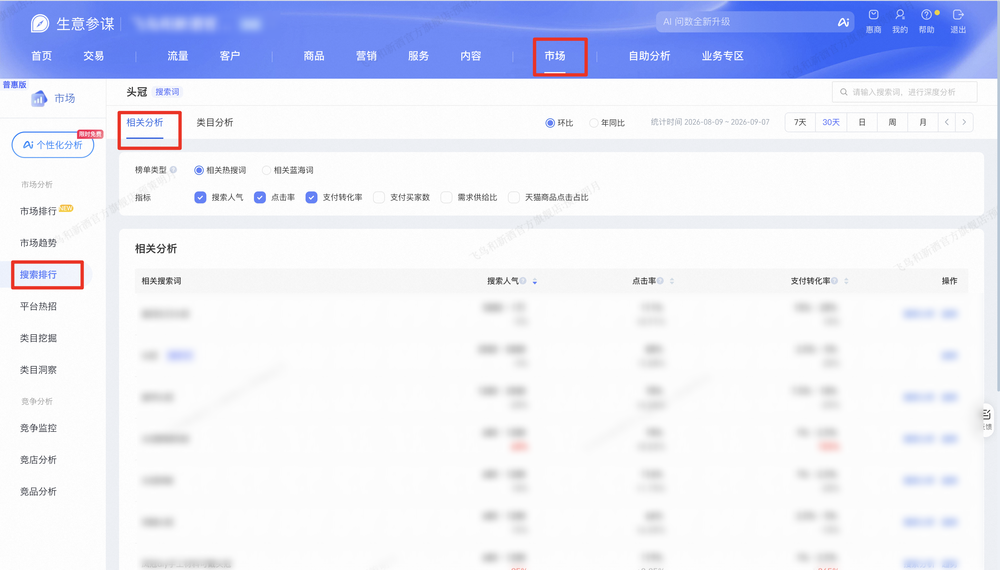

| 属性             | 值                                                                 |
| ---------------- | ------------------------------------------------------------------ |
| **连接器类型**   | `RPA 连接器`                                                       |
| **连接器名称**   | `ODS_市场搜索排行相关分析明细表(生意参谋RPA)`                       |
| **连接器代码**   | `rpa.conn.sycm.market.search.rank.correlation.analysis`            |
| **操作类型**     | `页面解析`                                                         |
| **目标网页**     | `https://sycm.taobao.com/mc/free/search_analysis`                  |
| **适用场景**     | 采集生意参谋市场搜索排行「相关分析」列表，按搜索词、统计时间、环比或年同比与榜单类型筛选，翻页采集相关热搜词或蓝海词的搜索人气、点击率、支付转化等指标 |
| **数据表名**     | `ods_rpa_sycm_market_search_rank_correlation_analysis_du`          |
| **业务表名**     | `ODS_市场搜索排行相关分析明细表(生意参谋RPA)`                       |

### 目标页面

> **取数路径**：生意参谋—市场—搜索排行—相关分析
>
> **取数链接**：[https://sycm.taobao.com/mc/free/search_analysis](https://sycm.taobao.com/mc/free/search_analysis)



### 业务入参

| 字段 | 中文释义 | 数据类型 | 必填 | 默认值 | 说明 |
| ---- | -------- | -------- | ---- | ------ | ---- |
| `key_word` | 搜索词 | `String` | 是 | — | 目标搜索词，不可为空 |
| `date_type` | 统计时间类型 | `String` | 否 | `DAY` | 可选值：`LAST_7_DAYS`（7天）/ `LAST_30_DAYS`（30天）/ `DAY`（日）/ `WEEK`（周）/ `MONTH`（月）。`LAST_7_DAYS` / `LAST_30_DAYS`  |
| `biz_date` | 统计日期 | `String` | 条件必填 | — | `date_type` 为 `WEEK` / `MONTH` 时必填；为 `DAY` 时不传则用昨天。格式 `YYYYMMDD` 或 `YYYY-MM-DD`。日：可选近90天。周：近90天的一个完整周。月：本月和前三个月 |
| `compare_type` | 环比或年同比 | `String` | 否 | `CYCLE` | 可选值：`CYCLE`（环比）/ `YEAR_ON_YEAR`（年同比） |
| `chart_type` | 榜单类型 | `String` | 否 | `RELATED` | 可选值：`RELATED`（相关热搜词）/ `BLUE_SEA`（相关蓝海词）。`BLUE_SEA` 时页面不支持自定义排序 |
| `sort_column` | 排序列 | `String` | 否 | — | 可选值：`SE_IPV_UV_HITS`（搜索人气）/ `CLICK_RATE`（点击率）/ `PAY_CONV_RATE`（支付转化率）/ `PAY_BYR_CNT`（支付买家数）/ `SIM_WEIGHT`（需求供给比）/ `TMAO_CLICK_RATIO`（天猫商品点击占比）。不填则不点表头，保留页面默认 |
| `sort_order` | 排序方向 | `String` | 否 | — | 可选值：`DESC`/ `ASC`。有 `sort_column` 且未传时默认 `DESC` |
| `collect_limit` | 采集条数上限 | `Number` | 否 | — | 根据这个值计算翻页数 |

### 入参样例

```json
{
  "key_word": "头冠"
}
```

```json
{
  "key_word": "头冠",
  "date_type": "DAY",
  "biz_date": "2026-09-07",
  "compare_type": "CYCLE",
  "chart_type": "RELATED",
  "sort_column": "CLICK_RATE",
  "sort_order": "DESC",
  "collect_limit": 20
}
```

```json
{
  "key_word": "头冠",
  "date_type": "LAST_7_DAYS",
  "compare_type": "YEAR_ON_YEAR",
  "chart_type": "BLUE_SEA"
}
```

```json
{
  "key_word": "头冠",
  "date_type": "WEEK",
  "biz_date": "20260907"
}
```

### 入参校验

```json-schema collapsed
{
  "$schema": "https://json-schema.org/draft/2020-12/schema",
  "title": "生意参谋-市场搜索排行相关分析 - 查询入参",
  "description": "采集生意参谋市场搜索排行「相关分析」列表，按搜索词、统计时间、环比或年同比与榜单类型筛选，翻页采集相关热搜词或蓝海词的搜索人气、点击率、支付转化等指标",
  "type": "object",
  "properties": {
    "key_word": {
      "type": "string",
      "description": "搜索词（必填），不可为空",
      "minLength": 1
    },
    "date_type": {
      "type": "string",
      "description": "统计时间类型（可选）。可选值：LAST_7_DAYS（7天）/ LAST_30_DAYS（30天）/ DAY（日）/ WEEK（周）/ MONTH（月）。LAST_7_DAYS / LAST_30_DAYS 以昨天为终点自动取窗口，忽略 biz_date",
      "enum": ["LAST_7_DAYS", "LAST_30_DAYS", "DAY", "WEEK", "MONTH"],
      "default": "DAY"
    },
    "biz_date": {
      "type": "string",
      "description": "统计日期；date_type 为 WEEK / MONTH 时必填，为 DAY 时不传则用昨天。格式 YYYYMMDD 或 YYYY-MM-DD。日不能晚于昨天、不能早于近三个月；周对齐到该周周一至周日且须落在本年完整周；月对齐到该月 1 号至月末，仅本年、本月之前最多三个月",
      "pattern": "^(\\d{8}|\\d{4}-\\d{2}-\\d{2})$"
    },
    "compare_type": {
      "type": "string",
      "description": "环比或年同比（可选）。可选值：CYCLE（环比）/ YEAR_ON_YEAR（年同比）",
      "enum": ["CYCLE", "YEAR_ON_YEAR"],
      "default": "CYCLE"
    },
    "chart_type": {
      "type": "string",
      "description": "榜单类型（可选）。可选值：RELATED（相关热搜词）/ BLUE_SEA（相关蓝海词）。BLUE_SEA 时页面不支持自定义排序，请去掉 sort_column / sort_order",
      "enum": ["RELATED", "BLUE_SEA"],
      "default": "RELATED"
    },
    "sort_column": {
      "type": "string",
      "description": "排序列（可选，单值）。可选值：SE_IPV_UV_HITS（搜索人气）/ CLICK_RATE（点击率）/ PAY_CONV_RATE（支付转化率）/ PAY_BYR_CNT（支付买家数）/ SIM_WEIGHT（需求供给比）/ TMAO_CLICK_RATIO（天猫商品点击占比）。不填则保留页面默认排序",
      "enum": ["SE_IPV_UV_HITS", "CLICK_RATE", "PAY_CONV_RATE", "PAY_BYR_CNT", "SIM_WEIGHT", "TMAO_CLICK_RATIO"]
    },
    "sort_order": {
      "type": "string",
      "description": "排序方向（可选）。可选值：DESC（倒序）/ ASC（正序）。有 sort_column 且未传时默认 DESC",
      "enum": ["DESC", "ASC"]
    },
    "collect_limit": {
      "type": "integer",
      "description": "采集条数上限（可选）。范围 1~1000；不填则采集全部结果（最多 100 页）",
      "minimum": 1,
      "maximum": 1000
    }
  },
  "required": ["key_word"],
  "additionalProperties": false,
  "allOf": [
    {
      "if": {
        "properties": {
          "date_type": { "enum": ["WEEK", "MONTH"] }
        },
        "required": ["date_type"]
      },
      "then": {
        "required": ["biz_date"]
      }
    },
    {
      "if": {
        "properties": {
          "chart_type": { "const": "BLUE_SEA" }
        },
        "required": ["chart_type", "sort_column"]
      },
      "then": {
        "properties": {
          "sort_column": { "enum": ["SIM_WEIGHT"] },
          "sort_order": { "enum": ["DESC"] }
        }
      }
    }
  ]
}
```

### 数据字段

:::field-tree
@define 相关搜索词
| `value` | 相关搜索词 | `String` | 否 | 页面解析 | `凤冠d****冠结婚` (已脱敏) |

@define 搜索人气
| `cycleCrc` | 环比变化 | `String` | 是 | 页面解析 | ` 30%` |
| `value` | 指标值 | `String` | 否 | 页面解析 | `0 ~ 20` |

@define 点击率
| `cycleCrc` | 环比变化率 | `Number` | 是 | 页面解析 | `1.5076923077` |
| `value` | 指标值 | `Number` | 否 | 页面解析 | `1.63` |

@define 免费点击率
| `cycleCrc` | 环比变化率 | `Number` | 是 | 页面解析 | `1.5076923077` |
| `value` | 指标值 | `Number` | 否 | 页面解析 | `1.63` |

@define 支付转化率
| `cycleCrc` | 环比变化 | `String` | 是 | 页面解析 | — |
| `value` | 指标值 | `String` | 否 | 页面解析 | `0% ~ 1%` |

@define 支付买家数
| `cycleCrc` | 环比变化 | `String` | 是 | 页面解析 | — |
| `value` | 指标值 | `String` | 否 | 页面解析 | `0` |

@define 需求供给比
| `cycleCrc` | 环比变化率 | `Number` | 是 | 页面解析 | `0.2465753425` |
| `value` | 指标值 | `Number` | 否 | 页面解析 | `0.91` |

@define 天猫商品点击占比
| `cycleCrc` | 环比变化率 | `Number` | 是 | 页面解析 | `-0.7424242424` |
| `value` | 指标值 | `Number` | 否 | 页面解析 | `0.0454545455` |

| 字段 | 中文释义 | 数据类型 | 可为空 | 取数路径 | 示例 |
| ---- | -------- | -------- | ------ | -------- | ---- |
| `relatedSekeyword` @相关搜索词 | 相关搜索词 | `Dict` | 否 | 页面解析 | 见数据样例 |
| `seIpvUvHits` @搜索人气 | 搜索人气 | `Dict` | 否 | 页面解析 | 见数据样例 |
| `clickThroughRate` @点击率 | 点击率 | `Dict` | 否 | 页面解析 | 见数据样例 |
| `freeClkRate` @免费点击率 | 免费点击率 | `Dict` | 否 | 页面解析 | 见数据样例 |
| `payConvRate` @支付转化率 | 支付转化率 | `Dict` | 否 | 页面解析 | 见数据样例 |
| `payByrCnt` @支付买家数 | 支付买家数 | `Dict` | 否 | 页面解析 | 见数据样例 |
| `simWeight` @需求供给比 | 需求供给比 | `Dict` | 否 | 页面解析 | 见数据样例 |
| `tmaoClickRatio` @天猫商品点击占比 | 天猫商品点击占比 | `Dict` | 否 | 页面解析 | 见数据样例 |
| `statisticalTime` | 统计时间 | `String` | 否 | 选择后页面上的统计时间 | `2026-09-07` |
| `chartType` | 榜单类型 | `String` | 否 | 根据输入榜单类型取值 | `RELATED` |
| `metrics` | 排序列 | `String` | 否 | 根据输入排序列取值 | `CLICK_RATE` |
| `sortOrder` | 排序方向 | `String` | 否 | 根据输入排序方式取值 | `DESC` |
| `bizDate` | 业务日期 | `String` | 否 | 附加 | `20260909` |
| `accountId` | 授权 ID | `String` | 否 | 附加 | `1****6` (已脱敏) |
:::

### 数据样例

```json
[
  {
    "relatedSekeyword": {
      "value": "凤冠d****冠结婚"
    },
    "seIpvUvHits": {
      "cycleCrc": " 30%",
      "value": "0 ~ 20"
    },
    "clickThroughRate": {
      "cycleCrc": 1.5076923077,
      "value": 1.63
    },
    "freeClkRate": {
      "cycleCrc": 1.5076923077,
      "value": 1.63
    },
    "payConvRate": {
      "cycleCrc": null,
      "value": "0% ~ 1%"
    },
    "payByrCnt": {
      "cycleCrc": null,
      "value": "0"
    },
    "simWeight": {
      "cycleCrc": 0.2465753425,
      "value": 0.91
    },
    "tmaoClickRatio": {
      "cycleCrc": -0.7424242424,
      "value": 0.0454545455
    },
    "bizDate": "20260909",
    "accountId": "1****6",
    "statisticalTime": "2026-09-07",
    "chartType": "RELATED",
    "metrics": "CLICK_RATE",
    "sortOrder": "DESC"
  }
]
```

---
