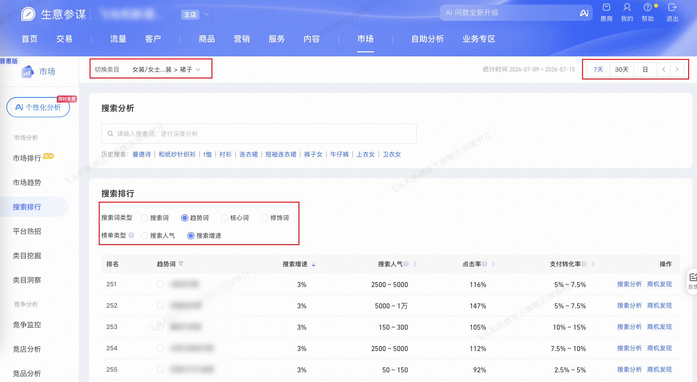

| 属性             | 值                                                                 |
| ---------------- | ------------------------------------------------------------------ |
| **连接器类型**   | `RPA 连接器`                                                       |
| **连接器名称**   | `ODS_市场搜索排行明细表(生意参谋RPA)`                               |
| **连接器代码**   | `rpa.conn.sycm.market.search.rank`                                 |
| **操作类型**     | `页面解析`                                                         |
| **目标网页**     | `https://sycm.taobao.com/mc/free/search_rank`                      |
| **适用场景**     | 采集生意参谋市场搜索排行列表，支持按搜索词类型、榜单类型、统计时间与类目筛选并翻页取全量 |
| **数据表名**     | `ods_rpa_sycm_market_search_rank_du`                               |
| **业务表名**     | `ODS_市场搜索排行明细表(生意参谋RPA)`                               |

### 目标页面

> **取数路径**：生意参谋—市场—搜索排行
>
> **取数链接**：[https://sycm.taobao.com/mc/free/search_rank](https://sycm.taobao.com/mc/free/search_rank)



### 业务入参

| 字段 | 中文释义 | 数据类型 | 必填 | 默认值 | 说明 |
| ---- | -------- | -------- | ---- | ------ | ---- |
| `keyword_type` | 搜索词类型 | `String` | 是 | `-` | 允许值：`SEARCH`（搜索词）/ `TREND`（趋势词）/ `CORE`（核心词）/ `PROP`（修饰词） |
| `rank_type` | 榜单类型 | `String` | 是 | `-` | 允许值：`HOT`（搜索人气）/ `SOAR`（搜索增速） |
| `date_type` | 统计时间 | `String` | 是 | `-` | 允许值：`LAST_7_DAYS`（近 7 天）/ `LAST_30_DAYS`（近 30 天）/ `DAY`（按日） |
| `biz_date` | 业务日期 | `String` | 条件必填 | `-` | `date_type` 为 `DAY` 时必填；始终填一天，格式 `YYYYMMDD` 或 `YYYY-MM-DD`；`LAST_7_DAYS`/`LAST_30_DAYS` 时忽略。`DAY` 不可选今日及以后；最早 today-90 |
| `category_level1` | 一级类目 | `String` | 否 | `-` | 左栏类目；支持路径或短名匹配（三级类目如果传路径，都用「/」分隔） |
| `category_level2` | 二级类目 | `String` | 条件必填 | `-` | 中栏类目；传入时必须同时传 `category_level1`；无二级面板时回退选中一级 |
| `category_level3` | 三级类目 | `String` | 条件必填 | `-` | 右栏类目；传入时必须同时传 `category_level1`、`category_level2`；推荐传末级短名（如「裙子」）；无三级面板时回退选中二级 |

### 入参样例

```json
{
  "keyword_type": "SEARCH",
  "rank_type": "HOT",
  "date_type": "LAST_7_DAYS"
}
```

```json
{
  "keyword_type": "CORE",
  "rank_type": "HOT",
  "date_type": "LAST_30_DAYS",
  "category_level1": "女装",
  "category_level2": "半身裙"
}
```

```json
{
  "keyword_type": "TREND",
  "rank_type": "SOAR",
  "date_type": "DAY",
  "biz_date": "20260715",
  "category_level1": "女装/女士精品",
  "category_level2": "唐装/民族服装/舞台服装",
  "category_level3": "裙子"
}
```

```json
{
  "keyword_type": "PROP",
  "rank_type": "SOAR",
  "date_type": "DAY",
  "biz_date": "2026-07-12"
}
```

### 入参校验

```json-schema collapsed
{
  "$schema": "https://json-schema.org/draft/2020-12/schema",
  "title": "生意参谋-市场-搜索排行-搜索排行 - 查询入参",
  "description": "采集生意参谋市场搜索排行列表，支持按搜索词类型、榜单类型、统计时间与类目筛选并翻页取全量",
  "type": "object",
  "properties": {
    "keyword_type": {
      "type": "string",
      "description": "搜索词类型。允许值：SEARCH（搜索词）/ TREND（趋势词）/ CORE（核心词）/ PROP（修饰词）",
      "enum": ["SEARCH", "TREND", "CORE", "PROP"]
    },
    "rank_type": {
      "type": "string",
      "description": "榜单类型。允许值：HOT（搜索人气）/ SOAR（搜索增速）",
      "enum": ["HOT", "SOAR"]
    },
    "date_type": {
      "type": "string",
      "description": "统计时间。允许值：LAST_7_DAYS（近 7 天）/ LAST_30_DAYS（近 30 天）/ DAY（按日）",
      "enum": ["LAST_7_DAYS", "LAST_30_DAYS", "DAY"]
    },
    "biz_date": {
      "type": "string",
      "description": "业务日期；date_type 为 DAY 时必填；始终填一天；LAST_7_DAYS/LAST_30_DAYS 时忽略。格式 YYYYMMDD 或 YYYY-MM-DD；DAY 不可选今日及以后；最早 today-90",
      "pattern": "^(\\d{8}|\\d{4}-\\d{2}-\\d{2})$"
    },
    "category_level1": {
      "type": "string",
      "description": "一级类目（左栏）。支持路径或短名匹配，「>」与「/」等价"
    },
    "category_level2": {
      "type": "string",
      "description": "二级类目（中栏）。传入时必须同时传 category_level1；无二级面板时回退选中一级"
    },
    "category_level3": {
      "type": "string",
      "description": "三级类目（右栏）。传入时必须同时传 category_level1、category_level2；推荐传末级短名；无三级面板时回退选中二级"
    }
  },
  "required": ["keyword_type", "rank_type", "date_type"],
  "additionalProperties": false,
  "allOf": [
    {
      "if": {
        "properties": {
          "date_type": { "const": "DAY" }
        },
        "required": ["date_type"]
      },
      "then": {
        "required": ["biz_date"]
      }
    },
    {
      "if": {
        "properties": {
          "category_level2": { "type": "string", "minLength": 1 }
        },
        "required": ["category_level2"]
      },
      "then": {
        "required": ["category_level1"]
      }
    },
    {
      "if": {
        "properties": {
          "category_level3": { "type": "string", "minLength": 1 }
        },
        "required": ["category_level3"]
      },
      "then": {
        "required": ["category_level1", "category_level2"]
      }
    }
  ]
}
```

### 数据字段

| 字段 | 中文释义 | 数据类型 | 可为空 | 取数路径 | 示例 |
| ---- | -------- | -------- | ------ | -------- | ---- |
| `rn` | 排名 | `Number` | 否 | 页面解析 | `1` |
| `searchWord` | 搜索词 | `String` | 否 | 页面解析 | `亚****裙` (已脱敏) |
| `seIpvUvHits` | 搜索人气 | `String` | 否 | 页面解析 | `600 ~ 1200` |
| `seUvEx` | 搜索增速 | `Number` | 是 | `rank_type=HOT` 时为空 | `2.9935483871` |
| `clickThroughRate` | 点击率 | `Number` | 否 | 页面解析 | `1.21` |
| `payRate` | 支付转化率 | `String` | 否 | 页面解析 | `5% ~ 7.5%` |
| `freeClkRate` | 免费点击率 | `Number` | 否 | 页面解析 | `1.21` |
| `categoryName` | 实际类目 | `String` | 否 | 页面解析 | `女装/女士精品 > 唐装/民族服装/舞台服装 > 唐装/中式服装 > 裙子` |
| `bizDate` | 业务日期 | `String` | 否 | 附加 | `20260716` |
| `accountId` | 授权 ID | `String` | 否 | 附加 | `1****6` (已脱敏) |

### 数据样例

```json
[
  {
    "rn": 1,
    "searchWord": "亚****裙",
    "seIpvUvHits": "600 ~ 1200",
    "seUvEx": 2.9935483871,
    "clickThroughRate": 1.21,
    "payRate": "5% ~ 7.5%",
    "freeClkRate": 1.21,
    "bizDate": "20260716",
    "accountId": "1****6",
    "categoryName": "女装/女士精品 > 唐装/民族服装/舞台服装 > 唐装/中式服装 > 裙子"
  }
]
```

---
