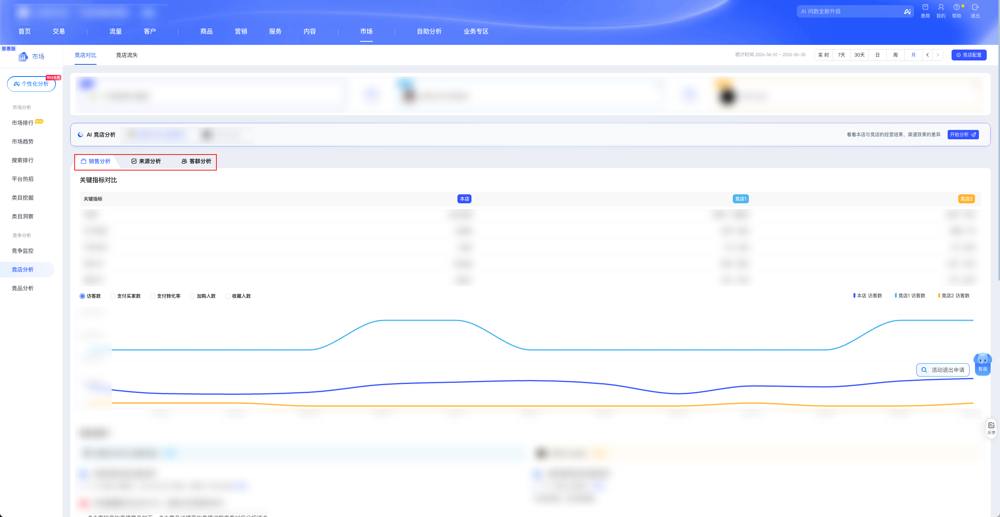

| 属性             | 值                                                                                       |
| ---------------- | ---------------------------------------------------------------------------------------- |
| **连接器类型**   | `RPA 连接器`                                                                             |
| **连接器名称**   | `ODS_市场竞店对比信息表(生意参谋RPA)`                                                 |
| **连接器代码**   | `rpa.conn.sycm.shop.ci`                                                                  |
| **操作类型**     | `页面解析`                                                                               |
| **目标网页**     | `https://sycm.taobao.com/mc/free/ci_shop`                                                |
| **适用场景**     | 采集生意参谋竞店对比的销售分析、来源分析与客群分析数据，支持本店与最多 2 个竞店对比     |
| **数据表名**     | `ods_rpa_sycm_shop_ci_du`                                                                |
| **业务表名**     | `ODS_市场竞店对比信息表(生意参谋RPA)`                                                 |

### 目标页面

> **取数路径**：生意参谋—市场—竞争—竞店分析—竞店对比
>
> **取数链接**：[https://sycm.taobao.com/mc/free/ci_shop](https://sycm.taobao.com/mc/free/ci_shop)



### 业务入参

| 字段 | 中文释义 | 数据类型 | 必填 | 默认值 | 说明 |
| ---- | -------- | -------- | ---- | ------ | ---- |
| `rival_shop_keywords` | 竞店关键字 | `String` / `List[String]` | 是 | — | 支持英文逗号或中文逗号分隔字符串，或字符串数组；最少 1 个、最多 2 个；按关键字在监控列表中搜索点选，任一未命中则任务失败 |
| `date_type` | 统计时间类型 | `String` | 否 | `today` | 可选值：`today`（实时）/ `recent7`（近7天）/ `recent30`（近30天）/ `day`（日）/ `week`（周）/ `month`（月）；兼容别名 `实时`→`today`；销售/来源/客群分析共用该时间 |
| `stat_date` | 统计锚定日 | `String` | 条件必填 | — | `date_type` 为 `day` / `week` / `month` 时必填；格式 `YYYYMMDD` 或 `YYYY-MM-DD`；日=当日，周=锚定日所在自然周，月=锚定日所在自然月 |

### 入参样例

近 7 天，对比 2 个竞店：

```json
{
  "rival_shop_keywords": "示例竞店A,示例竞店B",
  "date_type": "recent7"
}
```

实时，仅对比 1 个竞店：

```json
{
  "rival_shop_keywords": ["示例竞店A"],
  "date_type": "today"
}
```

指定自然月：

```json
{
  "rival_shop_keywords": "示例竞店A,示例竞店B",
  "date_type": "month",
  "stat_date": "2026-06-15"
}
```

指定日 / 周：

```json
{
  "rival_shop_keywords": "示例竞店A",
  "date_type": "day",
  "stat_date": "20260729"
}
```

### 入参校验

```json-schema collapsed
{
  "$schema": "https://json-schema.org/draft/2020-12/schema",
  "title": "生意参谋-市场竞店对比 - 查询入参",
  "description": "采集生意参谋竞店对比的销售分析、来源分析与客群分析数据，支持本店与最多 2 个竞店对比",
  "type": "object",
  "properties": {
    "rival_shop_keywords": {
      "description": "竞店关键字；字符串（英文/中文逗号分隔）或字符串数组；最少 1 个、最多 2 个",
      "oneOf": [
        {
          "type": "string",
          "minLength": 1
        },
        {
          "type": "array",
          "items": {
            "type": "string",
            "minLength": 1
          },
          "minItems": 1,
          "maxItems": 2
        }
      ]
    },
    "date_type": {
      "type": "string",
      "description": "统计时间类型，未传时默认 today（实时）。可选值：today（实时）/ recent7（近7天）/ recent30（近30天）/ day（日）/ week（周）/ month（月）；兼容别名「实时」",
      "enum": ["today", "recent7", "recent30", "day", "week", "month", "实时"],
      "default": "today"
    },
    "stat_date": {
      "type": "string",
      "description": "统计锚定日；date_type 为 day/week/month 时必填。格式 YYYYMMDD 或 YYYY-MM-DD",
      "pattern": "^(\\d{8}|\\d{4}-\\d{2}-\\d{2})$"
    }
  },
  "required": ["rival_shop_keywords"],
  "allOf": [
    {
      "if": {
        "properties": {
          "date_type": {
            "enum": ["day", "week", "month"]
          }
        },
        "required": ["date_type"]
      },
      "then": {
        "required": ["stat_date"]
      }
    }
  ],
  "additionalProperties": false
}
```

### 数据字段

每条任务输出 **1 条聚合记录**（`data[0]`），覆盖销售分析、来源分析、客群分析。

:::field-tree
@define 对比店铺
| `role` | 店铺角色 | `String` | 否 | 页面解析 | `selfShop` |
| `name` | 店铺名称 | `String` | 是 | 页面解析 | `示例本店` (已脱敏) |
| `userId` | 竞店加密 ID | `String` | 是 | 页面解析 | `示例加密ID` (已脱敏) |
| `keyword` | 入参匹配关键字 | `String` | 是 | 来自入参 `rival_shop_keywords` | `示例竞店A` (已脱敏) |

@define 关键指标行
| `indexCode` | 指标编码 | `String` | 否 | 页面解析 | `uv` |
| `indexName` | 指标名称 | `String` | 否 | 页面解析 | `访客数` |
| `selfShop` | 本店指标值 | `Number` / `String` | 是 | 页面解析 | `2576338` |
| `rivalShop1` | 竞店1指标值 | `Number` / `String` | 是 | 页面解析 | `750万 ~ 1000万` |
| `rivalShop2` | 竞店2指标值 | `Number` / `String` | 是 | 页面解析 | `50万 ~ 75万` |
| `statDate` | 统计日时间戳 | `Number` | 是 | 页面解析 | `1782748800000` |

@define 竞店趋势序列
| `drawValue` | 绘图用数值序列 | `List[Number]` | 是 | 页面解析 | 见数据样例 |
| `value` | 展示值序列 | `List[String]` | 是 | 页面解析 | 见数据样例 |

@define 指标趋势店铺数据
| `statDate` | 统计日时间戳序列 | `List[Number]` | 否 | 页面解析 | 见数据样例 |
| `<indexCode>` @竞店趋势序列 | 与外层指标编码同名的序列；本店多为 `List[Number]`，竞店多为含 `drawValue`/`value` 的对象 | `List` / `Dict` | 是 | 页面解析 | 见数据样例 |

@define 单指标趋势
| `selfShop` @指标趋势店铺数据 | 本店趋势 | `Dict` | 是 | 页面解析 | 见数据样例 |
| `rivalShop1` @指标趋势店铺数据 | 竞店1趋势 | `Dict` | 是 | 页面解析 | 见数据样例 |
| `rivalShop2` @指标趋势店铺数据 | 竞店2趋势 | `Dict` | 是 | 页面解析 | 见数据样例 |

@define 关键指标趋势
| `uv` @单指标趋势 | 访客数趋势 | `Dict` | 是 | 页面解析 | 见数据样例 |
| `payByrCnt` @单指标趋势 | 支付买家数趋势 | `Dict` | 是 | 页面解析 | 见数据样例 |
| `payRate` @单指标趋势 | 支付转化率趋势 | `Dict` | 是 | 页面解析 | 见数据样例 |
| `cartByrCnt` @单指标趋势 | 加购人数趋势 | `Dict` | 是 | 页面解析 | 见数据样例 |
| `cltByrCnt` @单指标趋势 | 收藏人数趋势 | `Dict` | 是 | 页面解析 | 见数据样例 |

@define 运营短文案
| `statDate` | 统计日时间戳 | `Number` | 是 | 页面解析 | `1782748800000` |
| `info` | 运营短文案 | `String` | 是 | 页面解析 | `十几个商品大幅降价，新上架上百个商品，新增2个合作主播` |

@define 运营亮点
| `cate` | 亮点类目 | `String` | 是 | 页面解析 | `live` |
| `tagCode` | 策略标签编码 | `String` | 是 | 页面解析 | `liveRate` |
| `description` | 亮点描述 | `String` | 是 | 页面解析 | `本店直播成交占比43.1%，竞店比本店高约80%` |
| `title` | 亮点标题 | `String` | 是 | 页面解析 | `本店直播成交占比43.1%，竞店比本店高约80%` |

@define 策略商品项
| `button` | 按钮文案 | `String` | 是 | 页面解析 | `查看` |
| `itemId` | 商品 ID | `Number` | 是 | 页面解析 | `100000000002` (已脱敏) |
| `pictUrl` | 主图 URL | `String` | 是 | 页面解析 | `//img.alicdn.com/****` |
| `detailUrl` | 详情页 URL | `String` | 是 | 页面解析 | `//item.taobao.com/****` |
| `title` | 商品标题 | `String` | 是 | 页面解析 | `示例商品` (已脱敏) |
| `type` | 条目类型 | `String` | 是 | 页面解析 | `item` |

@define 策略信息
| `description` | 策略说明 | `String` | 是 | 页面解析 | `点击率较高的直播商品如下，点击商品详情页的直播讲解查看对应介绍话术` |
| `info` @策略商品项 | 策略关联商品列表 | `List[Dict]` | 是 | 页面解析 | 见数据样例 |

@define 策略明细项
| `strategyName` | 策略名称 | `String` | 是 | 页面解析 | `rivalGoodItem` |
| `tagCode` | 策略标签编码 | `String` | 是 | 页面解析 | `liveRate` |
| `strategyInfo` @策略信息 | 策略详情 | `Dict` | 是 | 页面解析 | 见数据样例 |

@define 策略结果映射
| `<tagCode>` @策略明细项 | 按亮点 `tagCode` 分组的策略列表（如 `liveRate`） | `List[Dict]` | 是 | 页面解析 | 见数据样例 |

@define 竞店运营
| `role` | 竞店角色 | `String` | 否 | 页面解析 | `rivalShop1` |
| `name` | 竞店名称 | `String` | 否 | 页面解析 | `示例竞店A` (已脱敏) |
| `userId` | 竞店加密 ID | `String` | 否 | 页面解析 | `示例加密ID` (已脱敏) |
| `summary` @运营短文案 | 运营短文案 | `Dict` | 是 | 页面解析 | 见数据样例 |
| `highlights` @运营亮点 | 运营亮点列表 | `List[Dict]` | 是 | 页面解析 | 见数据样例 |
| `strategyResultMap` @策略结果映射 | 按 tagCode 分组的策略明细 | `Dict` | 是 | 页面解析 | 见数据样例 |

@define Top商品信息
| `itemId` | 商品 ID | `Number` | 是 | 页面解析 | `100000000001` (已脱敏) |
| `pictUrl` | 主图 URL | `String` | 是 | 页面解析 | `//img.alicdn.com/****` |
| `detailUrl` | 详情页 URL | `String` | 是 | 页面解析 | `//detail.tmall.com/****` |
| `title` | 商品标题 | `String` | 是 | 页面解析 | `示例商品` (已脱敏) |

@define Top商品行
| `itemId` | 商品 ID | `Number` | 是 | 页面解析 | `100000000001` (已脱敏) |
| `item` @Top商品信息 | 商品信息 | `Dict` | 是 | 页面解析 | 见数据样例 |
| `statDate` | 统计日 | `String` | 是 | 页面解析 | `2026-06-30` |
| `isMonitor` | 是否已监控 | `Boolean` | 是 | 页面解析 | `false` |
| `uv` | 访客数（访客数榜有值） | `Number` / `String` | 是 | 页面解析 | `219854` |
| `payByrCnt` | 支付买家数（支付买家数榜有值） | `Number` / `String` | 是 | 页面解析 | `—` |

@define Top店铺块
| `role` | 店铺角色 | `String` | 否 | 页面解析 | `selfShop` |
| `name` | 店铺名称 | `String` | 是 | 页面解析 | `示例本店` (已脱敏) |
| `userId` | 竞店加密 ID | `String` | 是 | 页面解析 | `—` |
| `items` @Top商品行 | Top 商品列表 | `List[Dict]` | 是 | 页面解析 | 见数据样例 |

@define Top商品榜
| `uv` @Top店铺块 | 按访客数 Top 榜（本店/竞店） | `List[Dict]` | 是 | 页面解析 | 见数据样例 |
| `payByrCnt` @Top店铺块 | 按支付买家数 Top 榜（本店/竞店） | `List[Dict]` | 是 | 页面解析 | 见数据样例 |

@define 搜索词行
| `keyword` | 搜索词 | `String` | 否 | 页面解析 | `示例品牌` (已脱敏) |
| `uv` | 访客数 | `Number` / `String` | 是 | 页面解析 | `21430` |
| `payByrCnt` | 支付买家数 | `Number` / `String` | 是 | 页面解析 | `718` |
| `payRate` | 支付转化率（接口原值） | `Number` / `String` | 是 | 页面解析 | `0.0335` |
| `payRateDisplay` | 支付转化率（页面展示值） | `Number` / `String` | 是 | 对齐页面展示映射 | `0.0335` |

@define 搜索词店铺块
| `role` | 店铺角色 | `String` | 否 | 页面解析 | `selfShop` |
| `name` | 店铺名称 | `String` | 是 | 页面解析 | `示例本店` (已脱敏) |
| `userId` | 竞店加密 ID | `String` | 是 | 页面解析 | `—` |
| `items` @搜索词行 | 搜索词列表 | `List[Dict]` | 是 | 页面解析 | 见数据样例 |

@define 入店搜索词
| `uv` @搜索词店铺块 | 按访客数排序的搜索词 | `List[Dict]` | 是 | 页面解析 | 见数据样例 |
| `payByrCnt` @搜索词店铺块 | 按支付买家数排序的搜索词 | `List[Dict]` | 是 | 页面解析 | 见数据样例 |
| `payRate` @搜索词店铺块 | 按支付转化率排序的搜索词 | `List[Dict]` | 是 | 页面解析 | 见数据样例 |

@define 流量构成行
| `pageTypeName` | 流量来源名称 | `String` | 否 | 页面解析 | `商品流量` |
| `pageType` | 流量来源类型 | `String` | 否 | 页面解析 | `item` |
| `selfShopUv` | 本店访客数 | `Number` / `String` | 是 | 页面解析 | `1993737` |
| `rivalShop1Uv` | 竞店1访客数 | `Number` / `String` | 是 | 页面解析 | `250万 ~ 500万` |
| `rivalShop2Uv` | 竞店2访客数 | `Number` / `String` | 是 | 页面解析 | `25万 ~ 50万` |

@define 入店来源节点
| `pageName` | 来源名称 | `String` | 否 | 页面解析 | `经营优势` |
| `pageId` | 来源 ID | `String` | 否 | 页面解析 | `reward` |
| `pageLevel` | 层级 | `Number` | 是 | 页面解析 | `1` |
| `pageDesc` | 来源描述 | `String` | 是 | 页面解析 | `商家通过向消费者提供好价、好货、好服务、好直播内容等用户价值获得流量` |
| `selfShopUv` | 本店访客数 | `Number` / `String` | 是 | 页面解析 | `2044394` |
| `rivalShop1Uv` | 竞店1访客数 | `Number` / `String` | 是 | 页面解析 | `500万 ~ 750万` |
| `rivalShop2Uv` | 竞店2访客数 | `Number` / `String` | 是 | 页面解析 | `25万 ~ 50万` |
| `selfShopPayByrCnt` | 本店支付买家数 | `Number` / `String` | 是 | 页面解析 | `21694` |
| `rivalShop1PayByrCnt` | 竞店1支付买家数 | `Number` / `String` | 是 | 页面解析 | `10万 ~ 25万` |
| `rivalShop2PayByrCnt` | 竞店2支付买家数 | `Number` / `String` | 是 | 页面解析 | `5000 ~ 7500` |
| `selfShopPayRate` | 本店支付转化率 | `Number` / `String` | 是 | 页面解析 | `0.0106` |
| `rivalShop1PayRate` | 竞店1支付转化率 | `Number` / `String` | 是 | 页面解析 | `1% ~ 2.5%` |
| `rivalShop2PayRate` | 竞店2支付转化率 | `Number` / `String` | 是 | 页面解析 | `1% ~ 2.5%` |
| `children` | 子来源树（字段同本节点，可多级嵌套） | `List[Dict]` | 是 | 页面解析 | 见数据样例 |

@define 入店来源指标组
| `uv` @入店来源节点 | 访客数视角来源树 | `List[Dict]` | 是 | 页面解析 | 见数据样例 |
| `payByrCnt` @入店来源节点 | 支付买家数视角来源树 | `List[Dict]` | 是 | 页面解析 | 见数据样例 |
| `payRate` @入店来源节点 | 支付转化率视角来源树 | `List[Dict]` | 是 | 页面解析 | 见数据样例 |
| `payByrCntNewCustomer` @入店来源节点 | 新客支付买家数视角（多见于全店） | `List[Dict]` | 是 | 页面解析 | 见数据样例 |
| `payByrCntOldCustomer` @入店来源节点 | 老客支付买家数视角（多见于全店） | `List[Dict]` | 是 | 页面解析 | 见数据样例 |

@define 入店来源
| `all` @入店来源指标组 | 全店入店来源 | `Dict` | 是 | 页面解析 | 见数据样例 |
| `item` @入店来源指标组 | 商品页入店来源 | `Dict` | 是 | 页面解析 | 见数据样例 |
| `shop` @入店来源指标组 | 店铺页入店来源 | `Dict` | 是 | 页面解析 | 见数据样例 |
| `live` @入店来源指标组 | 直播页入店来源 | `Dict` | 是 | 页面解析 | 见数据样例 |
| `content` @入店来源指标组 | 内容页入店来源（通常仅 `uv`） | `Dict` | 是 | 页面解析 | 见数据样例 |

@define 客群画像行
| `statDate` | 统计日时间戳 | `Number` | 是 | 页面解析 | `1782748800000` |
| `attributeValue` | 维度值 | `String` | 否 | 页面解析 | `F` |
| `attributeName` | 维度类型 | `String` | 否 | 页面解析 | `gender` |
| `uvRatio` | 访问人群占比 | `Number` / `String` | 是 | 页面解析 | `0.8918212008111206` |
| `payByrCntRatio` | 支付人群占比 | `Number` / `String` | 是 | 页面解析 | `—` |
| `attributeValueName` | 维度中文名 | `String` | 是 | 性别枚举映射 | `女性` |

@define 客群画像维度
| `gender` @客群画像行 | 性别分布 | `List[Dict]` | 是 | 页面解析 | 见数据样例 |
| `age` @客群画像行 | 年龄分布 | `List[Dict]` | 是 | 页面解析 | 见数据样例 |
| `province` @客群画像行 | 省份分布 | `List[Dict]` | 是 | 页面解析 | 见数据样例 |

@define 客群画像
| `selfShop` @客群画像维度 | 本店画像 | `Dict` | 是 | 页面解析 | 见数据样例 |
| `rivalShop1` @客群画像维度 | 竞店1画像 | `Dict` | 是 | 页面解析 | 见数据样例 |
| `rivalShop2` @客群画像维度 | 竞店2画像 | `Dict` | 是 | 页面解析 | 见数据样例 |

@define 八大人群行
| `statDate` | 统计日时间戳 | `Number` | 是 | 页面解析 | `1782748800000` |
| `crowdId` | 人群编码 | `String` | 否 | 页面解析 | `示例人群编码` (已脱敏) |
| `crowdName` | 人群名称 | `String` | 是 | 经人群枚举映射 | `示例人群` |
| `uvRatio` | 访问占比 | `Number` | 是 | 页面解析 | `0.0968442754` |
| `payByrCntRatio` | 支付占比 | `Number` | 是 | 页面解析 | `0.0746285714` |

@define 八大人群
| `selfShop` @八大人群行 | 本店八大人群 | `List[Dict]` | 是 | 页面解析 | 见数据样例 |
| `rivalShop1` @八大人群行 | 竞店1八大人群 | `List[Dict]` | 是 | 页面解析 | 见数据样例 |
| `rivalShop2` @八大人群行 | 竞店2八大人群 | `List[Dict]` | 是 | 页面解析 | 见数据样例 |

@define 客群分析块
| `profile` @客群画像 | 客群画像（性别/年龄/地域） | `Dict` | 是 | 页面解析 | 见数据样例 |
| `crowds` @八大人群 | 预测八大人群 | `Dict` | 是 | 页面解析 | 见数据样例 |

@define 客群分析
| `uv` @客群分析块 | 访问人群分析 | `Dict` | 是 | 页面解析 | 见数据样例 |
| `payByrCnt` @客群分析块 | 支付人群分析 | `Dict` | 是 | 页面解析 | 见数据样例 |

| 字段 | 中文释义 | 数据类型 | 可为空 | 取数路径 | 示例 |
| ---- | -------- | -------- | ------ | -------- | ---- |
| `bizDate` | 业务日期 | `String` | 否 | 附加 | `20260731` |
| `accountId` | 授权 ID | `String` | 否 | 附加 | `1****6` (已脱敏) |
| `dateType` | 实际统计时间类型 | `String` | 否 | 页面解析 | `month` |
| `dateRangeStart` | 实际统计区间起始日 | `String` | 否 | 页面解析 | `2026-06-01` |
| `dateRangeEnd` | 实际统计区间结束日 | `String` | 否 | 页面解析 | `2026-06-30` |
| `compareShops` @对比店铺 | 本店与竞店列表 | `List[Dict]` | 否 | 页面解析 | 见数据样例 |
| `keyMetrics` @关键指标行 | 关键指标末日汇总 | `List[Dict]` | 是 | 页面解析 | 见数据样例 |
| `keyMetricTrends` @关键指标趋势 | 关键指标完整趋势 | `Dict` | 是 | 页面解析 | 见数据样例 |
| `rivalOperations` @竞店运营 | 竞店运营分析 | `List[Dict]` | 是 | 页面解析 | 见数据样例 |
| `topItems` @Top商品榜 | Top 商品榜 | `Dict` | 是 | 页面解析 | 见数据样例 |
| `searchWords` @入店搜索词 | 入店搜索词 | `Dict` | 是 | 页面解析 | 见数据样例 |
| `flowComposition` @流量构成行 | 流量构成概览 | `List[Dict]` | 是 | 页面解析 | 见数据样例 |
| `flowSources` @入店来源 | 入店来源树 | `Dict` | 是 | 页面解析 | 见数据样例 |
| `customerAnalysis` @客群分析 | 客群分析 | `Dict` | 是 | 页面解析 | 见数据样例 |
:::

### 数据样例

```json
[
  {
    "bizDate": "20260731",
    "accountId": "1****6",
    "dateType": "month",
    "dateRangeStart": "2026-06-01",
    "dateRangeEnd": "2026-06-30",
    "compareShops": [
      {
        "role": "selfShop",
        "name": "示例本店",
        "userId": "",
        "keyword": ""
      },
      {
        "role": "rivalShop1",
        "name": "示例竞店A",
        "userId": "示例加密ID",
        "keyword": "示例竞店A"
      }
    ],
    "keyMetrics": [
      {
        "indexCode": "uv",
        "indexName": "访客数",
        "selfShop": 2576338,
        "rivalShop1": "750万 ~ 1000万",
        "rivalShop2": "50万 ~ 75万",
        "statDate": 1782748800000
      },
      {
        "indexCode": "payByrCnt",
        "indexName": "支付买家数",
        "selfShop": 34505,
        "rivalShop1": "10万 ~ 25万",
        "rivalShop2": "7500 ~ 1万",
        "statDate": 1782748800000
      }
    ],
    "keyMetricTrends": {
      "uv": {
        "selfShop": {
          "statDate": [
            1751212800000,
            1753891200000
          ],
          "uv": [
            1867879,
            1301388
          ]
        },
        "rivalShop1": {
          "statDate": [
            1751212800000,
            1753891200000
          ],
          "uv": {
            "drawValue": [
              5000000,
              5000000
            ],
            "value": [
              "500万 ~ 750万",
              "500万 ~ 750万"
            ]
          }
        }
      }
    },
    "rivalOperations": [
      {
        "role": "rivalShop1",
        "name": "示例竞店A",
        "userId": "示例加密ID",
        "summary": {
          "statDate": 1782748800000,
          "info": "十几个商品大幅降价，新上架上百个商品，新增2个合作主播"
        },
        "highlights": [
          {
            "cate": "live",
            "tagCode": "liveRate",
            "description": "本店直播成交占比43.1%，竞店比本店高约80%",
            "title": "本店直播成交占比43.1%，竞店比本店高约80%"
          }
        ],
        "strategyResultMap": {
          "liveRate": [
            {
              "strategyName": "rivalGoodItem",
              "tagCode": "liveRate",
              "strategyInfo": {
                "description": "点击率较高的直播商品如下，点击商品详情页的直播讲解查看对应介绍话术",
                "info": [
                  {
                    "button": "查看",
                    "itemId": "100000000002",
                    "pictUrl": "//img.alicdn.com/****",
                    "detailUrl": "//item.taobao.com/****",
                    "title": "示例商品",
                    "type": "item"
                  }
                ]
              }
            }
          ]
        }
      }
    ],
    "topItems": {
      "uv": [
        {
          "role": "selfShop",
          "name": "示例本店",
          "userId": "",
          "items": [
            {
              "itemId": "100000000001",
              "item": {
                "itemId": "100000000001",
                "pictUrl": "//img.alicdn.com/****",
                "detailUrl": "//detail.tmall.com/****",
                "title": "示例商品"
              },
              "statDate": "2026-06-30",
              "isMonitor": false,
              "uv": 219854,
              "payByrCnt": null
            }
          ]
        },
        {
          "role": "rivalShop1",
          "name": "示例竞店A",
          "userId": "示例加密ID",
          "items": [
            {
              "itemId": "100000000003",
              "item": {
                "itemId": "100000000003",
                "pictUrl": "//img.alicdn.com/****",
                "detailUrl": "//item.taobao.com/****",
                "title": "示例商品"
              },
              "statDate": "2026-06-30",
              "isMonitor": false,
              "uv": "10万 ~ 25万",
              "payByrCnt": null
            }
          ]
        }
      ]
    },
    "searchWords": {
      "uv": [
        {
          "role": "selfShop",
          "name": "示例本店",
          "userId": "",
          "items": [
            {
              "keyword": "示例品牌",
              "uv": 21430,
              "payByrCnt": 718,
              "payRate": 0.0335,
              "payRateDisplay": 0.0335
            },
            {
              "keyword": "示例搜索词",
              "uv": 10060,
              "payByrCnt": 108,
              "payRate": 0.0107,
              "payRateDisplay": 0.0107
            }
          ]
        }
      ]
    },
    "flowComposition": [
      {
        "pageTypeName": "商品流量",
        "pageType": "item",
        "selfShopUv": 1993737,
        "rivalShop1Uv": "250万 ~ 500万",
        "rivalShop2Uv": "25万 ~ 50万"
      }
    ],
    "flowSources": {
      "all": {
        "uv": [
          {
            "pageName": "经营优势",
            "pageId": "reward",
            "pageLevel": 1,
            "pageDesc": "商家通过向消费者提供好价、好货、好服务、好直播内容等用户价值获得流量",
            "selfShopUv": 2044394,
            "rivalShop1Uv": "500万 ~ 750万",
            "rivalShop2Uv": "25万 ~ 50万",
            "selfShopPayByrCnt": 21694,
            "rivalShop1PayByrCnt": "10万 ~ 25万",
            "rivalShop2PayByrCnt": "5000 ~ 7500",
            "selfShopPayRate": 0.0106,
            "rivalShop1PayRate": "1% ~ 2.5%",
            "rivalShop2PayRate": "1% ~ 2.5%",
            "children": [
              {
                "pageName": "推荐",
                "pageId": "reward.5081",
                "pageLevel": 2,
                "pageDesc": "原手淘推荐、淘特推荐合并至推荐，为系统通过算法推荐的猜你喜欢流量。",
                "selfShopUv": 1072842,
                "rivalShop1Uv": "100万 ~ 250万",
                "rivalShop2Uv": "25万 ~ 50万",
                "selfShopPayByrCnt": 6610,
                "rivalShop1PayByrCnt": "5万 ~ 7.5万",
                "rivalShop2PayByrCnt": "1000 ~ 2500",
                "selfShopPayRate": 0.0062,
                "rivalShop1PayRate": "2.5% ~ 5%",
                "rivalShop2PayRate": "0% ~ 1%"
              }
            ]
          }
        ]
      }
    },
    "customerAnalysis": {
      "uv": {
        "profile": {
          "rivalShop2": {
            "gender": [
              {
                "statDate": 1782748800000,
                "attributeValue": "F",
                "attributeName": "gender",
                "uvRatio": "0.8918212008111206",
                "payByrCntRatio": null,
                "attributeValueName": "女性"
              }
            ],
            "age": [
              {
                "statDate": 1782748800000,
                "attributeValue": "18-24岁",
                "attributeName": "age",
                "uvRatio": "0.04919648503871178",
                "payByrCntRatio": null,
                "attributeValueName": null
              }
            ],
            "province": [
              {
                "statDate": 1782748800000,
                "attributeValue": "广东省",
                "attributeName": "province",
                "uvRatio": "0.13463059011279968",
                "payByrCntRatio": null,
                "attributeValueName": null
              }
            ]
          }
        },
        "crowds": {
          "rivalShop2": [
            {
              "statDate": 1782748800000,
              "crowdId": "示例人群编码",
              "crowdName": "示例人群",
              "uvRatio": 0.0968442754,
              "payByrCntRatio": 0.0746285714
            }
          ]
        }
      }
    }
  }
]
```

---
