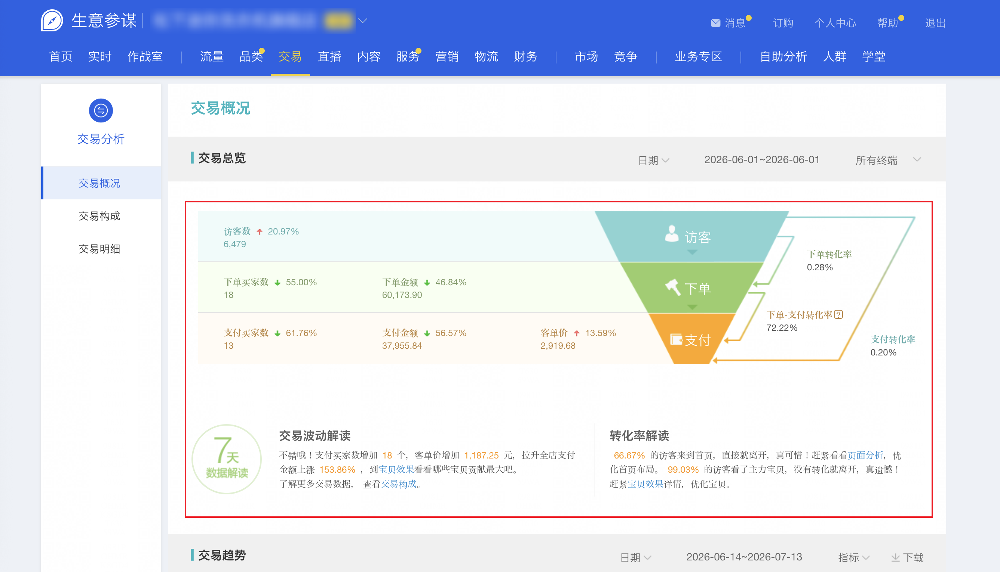

| 属性             | 值                                                                 |
| ---------------- | ------------------------------------------------------------------ |
| **连接器类型**   | `RPA 连接器`                                                       |
| **连接器名称**   | `ODS_店铺交易交易概况交易总览信息表(生意参谋RPA)`                  |
| **连接器代码**   | `rpa.conn.sycm.shop.trade.overview`                                |
| **操作类型**     | `页面解析`                                                         |
| **目标网页**     | `https://sycm.taobao.com/bda/tradinganaly/overview/overview.htm`   |
| **适用场景**     | 采集生意参谋交易概况交易总览页的访客、下单、支付等核心交易指标，以及交易波动与转化率解读文案 |
| **数据表名**     | `ods_rpa_sycm_shop_trade_overview_du`                              |
| **业务表名**     | `ODS_店铺交易交易概况交易总览信息表(生意参谋RPA)`                  |

### 目标页面

> **取数路径**：生意参谋—交易—销售分析—交易概况—交易总览
>
> **取数链接**：[https://sycm.taobao.com/bda/tradinganaly/overview/overview.htm](https://sycm.taobao.com/bda/tradinganaly/overview/overview.htm)



### 业务入参

| 字段 | 中文释义 | 数据类型 | 必填 | 默认值 | 说明 |
| ---- | -------- | -------- | ---- | ------ | ---- |
| `date_type` | 交易总览日期类型 | `String` | 是 | — | 可选值：`LAST_1_DAY`（最近1天）、`LAST_7_DAYS`（最近7天）、`LAST_30_DAYS`（最近30天）、`DAY`（日）、`WEEK`（周）、`MONTH`（月） |
| `custom_start_date` | 自定义锚点日期 | `String` | 条件必填 | — | `date_type` 为 `DAY`/`WEEK`/`MONTH` 时必填；支持 `YYYYMMDD` 或 `YYYY-MM-DD`；`DAY`/`WEEK` 时不能晚于昨天 |

### 入参样例

最近 1 天：

```json
{
  "date_type": "LAST_1_DAY"
}
```

指定日：

```json
{
  "date_type": "DAY",
  "custom_start_date": "20260601"
}
```

### 入参校验

```json-schema collapsed
{
  "$schema": "https://json-schema.org/draft/2020-12/schema",
  "title": "生意参谋-交易总览 - 查询入参",
  "description": "采集生意参谋交易概况交易总览页的访客、下单、支付等核心交易指标，以及交易波动与转化率解读文案",
  "type": "object",
  "properties": {
    "date_type": {
      "type": "string",
      "description": "交易总览日期类型。可选值：LAST_1_DAY（最近1天）、LAST_7_DAYS（最近7天）、LAST_30_DAYS（最近30天）、DAY（日）、WEEK（周）、MONTH（月）",
      "enum": ["LAST_1_DAY", "LAST_7_DAYS", "LAST_30_DAYS", "DAY", "WEEK", "MONTH"]
    },
    "custom_start_date": {
      "type": "string",
      "description": "面板点选锚点日期；date_type 为 DAY/WEEK/MONTH 时必填；支持 YYYYMMDD 或 YYYY-MM-DD；DAY/WEEK 时不能晚于昨天",
      "pattern": "^(\\d{4}-\\d{2}-\\d{2}|\\d{8})$"
    }
  },
  "required": ["date_type"],
  "additionalProperties": false,
  "allOf": [
    {
      "if": {
        "properties": {
          "date_type": {
            "enum": ["DAY", "WEEK", "MONTH"]
          }
        },
        "required": ["date_type"]
      },
      "then": {
        "required": ["custom_start_date"]
      }
    }
  ]
}
```

### 数据字段

每条任务输出 **1 条聚合记录**（`data[0]`）。

| 字段 | 中文释义 | 数据类型 | 可为空 | 取数路径 | 示例 |
| ---- | -------- | -------- | ------ | -------- | ---- |
| `uv` | 访客数 | `Number` | 否 | 页面解析 | `6479` |
| `uvVariRate` | 访客数环比 | `Number` | 否 | 页面解析 | `0.2097` |
| `orderBuyerCnt` | 下单买家数 | `Number` | 否 | 页面解析 | `18` |
| `orderBuyerCntVariRate` | 下单买家数环比 | `Number` | 否 | 页面解析 | `-0.55` |
| `orderAmt` | 下单金额 | `Number` | 否 | 页面解析 | `60173.91` |
| `orderAmtVariRate` | 下单金额环比 | `Number` | 否 | 页面解析 | `-0.4684` |
| `payBuyerCnt` | 支付买家数 | `Number` | 否 | 页面解析 | `13` |
| `payBuyerCntVariRate` | 支付买家数环比 | `Number` | 否 | 页面解析 | `-0.6176` |
| `payAmt` | 支付金额 | `Number` | 否 | 页面解析 | `37955.84` |
| `payAmtVariRate` | 支付金额环比 | `Number` | 否 | 页面解析 | `-0.5657` |
| `payPct` | 客单价 | `Number` | 否 | 页面解析 | `2919.68` |
| `payPctVariRate` | 客单价环比 | `Number` | 否 | 页面解析 | `0.1359` |
| `orderRate` | 下单转化率 | `Number` | 否 | 页面解析 | `0.0028` |
| `orderToPayRate` | 下单-支付转化率 | `Number` | 否 | 页面解析 | `0.7222` |
| `payRate` | 支付转化率 | `Number` | 否 | 页面解析 | `0.002` |
| `payRateVariRate` | 支付转化率环比 | `Number` | 否 | 页面解析 | `-0.6825` |
| `paySubOrdersCnt` | 支付子订单数 | `Number` | 否 | 页面解析 | `17` |
| `paySubOrdersVariRate` | 支付子订单数环比 | `Number` | 否 | 页面解析 | `-0.5405` |
| `newBuyerCnt` | 新买家数 | `Number` | 否 | 页面解析 | `11` |
| `oldBuyerCnt` | 老买家数 | `Number` | 否 | 页面解析 | `2` |
| `pageDateRangeStart` | 页面统计区间起始日 | `String` | 否 | 页面解析 | `2026-06-01` |
| `pageDateRangeEnd` | 页面统计区间结束日 | `String` | 否 | 页面解析 | `2026-06-01` |
| `transactionFluctuationInterpretation` | 交易波动解读 | `String` | 否 | 页面解析 | 见数据样例 |
| `conversionRateInterpretation` | 转化率解读 | `String` | 否 | 页面解析 | 见数据样例 |
| `dateType` | 日期类型 | `String` | 否 | 任务入参 `date_type` | `DAY` |
| `bizDate` | 业务日期 | `String` | 否 | 附加 | `20260714` |
| `accountId` | 授权 ID | `String` | 否 | 附加 | `101` |

### 数据样例

```json
[
  {
    "uv": 6479,
    "uvVariRate": 0.2097,
    "orderBuyerCnt": 18,
    "orderBuyerCntVariRate": -0.55,
    "orderAmt": 60173.91,
    "orderAmtVariRate": -0.4684,
    "payBuyerCnt": 13,
    "payBuyerCntVariRate": -0.6176,
    "payAmt": 37955.84,
    "payAmtVariRate": -0.5657,
    "payPct": 2919.68,
    "payPctVariRate": 0.1359,
    "orderRate": 0.0028,
    "orderToPayRate": 0.7222,
    "payRate": 0.002,
    "payRateVariRate": -0.6825,
    "paySubOrdersCnt": 17,
    "paySubOrdersVariRate": -0.5405,
    "newBuyerCnt": 11,
    "oldBuyerCnt": 2,
    "pageDateRangeStart": "2026-06-01",
    "pageDateRangeEnd": "2026-06-01",
    "transactionFluctuationInterpretation": "不错哦！支付买家数增加18个，客单价增加1,187.25元，拉升全店支付金额上涨153.86%，到宝贝效果看看哪些宝贝贡献最大吧。了解更多交易数据， 查看交易构成。",
    "conversionRateInterpretation": "66.67%的访客来到首页，直接就离开，真可惜！赶紧看看页面分析，优化首页布局。99.03%的访客看了主力宝贝，没有转化就离开，真遗憾！赶紧宝贝效果详情，优化宝贝。",
    "dateType": "DAY",
    "bizDate": "20260714",
    "accountId": "101"
  }
]
```

---
