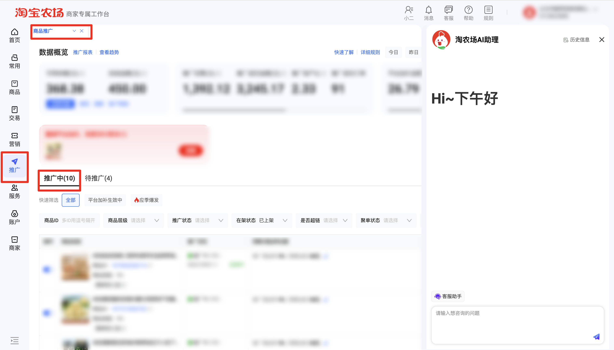

| 属性             | 值                                                         |
| ---------------- | ---------------------------------------------------------- |
| **连接器类型**   | `RPA 连接器`                                               |
| **连接器名称**   | `ODS_商品推广明细报表(淘宝农场RPA)`                        |
| **连接器代码**   | `rpa.conn.taobaonongchang.item.promotion.report`           |
| **操作类型**     | `页面解析`                                                 |
| **目标网页**     | `https://mmc.tmall.com/ds/page/supplier/commercial-hosting-home` |
| **适用场景**     | 登录淘宝农场后进入商业托管商品推广页，按可选筛选项采集推广中商品的推广明细 |
| **数据表名**     | `ods_rpa_taobaonongchang_item_promotion_report_du`         |
| **业务表名**     | `ODS_商品推广明细报表(淘宝农场RPA)`                        |

### 目标页面

> **取数路径**：淘宝农场—推广—商品推广—推广中
>
> **取数链接**：[https://mmc.tmall.com/ds/page/supplier/commercial-hosting-home](https://mmc.tmall.com/ds/page/supplier/commercial-hosting-home)



### 业务入参

| 字段 | 中文释义 | 数据类型 | 必填 | 默认值 | 说明 |
| ---- | -------- | -------- | ---- | ------ | ---- |
| `date_type` | 统计时间类型 | `String` | 否 | — | 未传则沿用页面当前统计时间。可选值：`TODAY`（今日）/ `YESTERDAY`（昨日）/ `LAST_7_DAYS`（近7天）/ `LAST_WEEK`（上周）/ `LAST_15_DAYS`（近15天）/ `THIS_MONTH`（本月）/ `LAST_30_DAYS`（近30天）/ `LAST_MONTH`（上月）/ `LAST_90_DAYS`（近90天）/ `CUSTOM`（自定义） |
| `custom_start_date` | 自定义起始日期 | `String` | 条件必填 | — | 仅 `date_type=CUSTOM` 时必填。格式：`YYYYMMDD` 或 `YYYY-MM-DD`；不得晚于结束日期；含起止共不超过 179 天；最早为今天往前 179 天，最晚为昨日 |
| `custom_end_date` | 自定义结束日期 | `String` | 条件必填 | — | 仅 `date_type=CUSTOM` 时必填。格式：`YYYYMMDD` 或 `YYYY-MM-DD`；不得早于起始日期；含起止共不超过 179 天；最早为今天往前 179 天，最晚为昨日 |
| `item_ids` | 商品 ID | `String` / `List[String]` | 否 | — | 未传则跳过。支持英文逗号分隔字符串或 JSON 数组；每个 ID 须为 10~25 位数字 |
| `item_level` | 商品层级 | `String` | 否 | — | 未传则跳过。可选值：`F0级商品` / `F1级商品` / `F2级商品` / `F3级商品` |
| `promote_status` | 推广状态 | `String` | 否 | — | 未传则跳过。可选值：`推广异常` / `待暂停/已暂停` / `待推广` / `推广中` |
| `on_shelf_status` | 在架状态 | `String` | 否 | — | 未传则跳过。可选值：`已上架` / `已下架` |
| `is_super_link` | 是否超链 | `String` | 否 | — | 未传则跳过。可选值：`是` / `否` |
| `ju_dan_status` | 聚单状态 | `String` | 否 | — | 未传则跳过。可选值：`聚单生效中` / `聚单待生效` / `聚单待入池` / `聚单退出预警` |
| `high_priority_scene` | 高优场景 | `String` | 否 | — | 未传则跳过。可选值：`供货价不达标` / `应季爆发` / `供货价恶化` / `大促TR下调` / `高预算使用率` / `F23品支出率超出` / `爆品流失` / `低TR商品TR拉升` / `GMV上涨` / `商品搜索排名上升` / `F01纯TR加码` / `F层级跃迁` / `jbp激励` / `F01品支出率超出` / `限时扶持补贴` / `超链平台消费券-TR提升` / `普链平台消费券-TR提升` |
| `delivery_restrict_warning` | 投流受限预警 | `String` | 否 | — | 未传则跳过。可选值：`充值失败` / `投流受限` / `紧急预警` |

### 入参样例

不传筛选项，沿用页面当前条件：

```json
{}
```

近 7 天 + 推广状态 / 在架状态：

```json
{
  "date_type": "LAST_7_DAYS",
  "promote_status": "推广异常",
  "on_shelf_status": "已下架"
}
```

自定义日期 + 商品 ID：

```json
{
  "date_type": "CUSTOM",
  "custom_start_date": "20260801",
  "custom_end_date": "2026-08-31",
  "item_ids": ["1234567890123"]
}
```

### 入参校验

```json-schema collapsed
{
  "$schema": "https://json-schema.org/draft/2020-12/schema",
  "title": "淘宝农场-商品推广明细 - 查询入参",
  "description": "登录淘宝农场后进入商业托管商品推广页，按可选筛选项采集推广中商品的推广明细",
  "type": "object",
  "properties": {
    "date_type": {
      "type": "string",
      "enum": ["TODAY", "YESTERDAY", "LAST_7_DAYS", "LAST_WEEK", "LAST_15_DAYS", "THIS_MONTH", "LAST_30_DAYS", "LAST_MONTH", "LAST_90_DAYS", "CUSTOM", ""],
      "description": "统计时间类型；空字符串视为未传，沿用页面当前统计时间。可选值：TODAY（今日）/ YESTERDAY（昨日）/ LAST_7_DAYS（近7天）/ LAST_WEEK（上周）/ LAST_15_DAYS（近15天）/ THIS_MONTH（本月）/ LAST_30_DAYS（近30天）/ LAST_MONTH（上月）/ LAST_90_DAYS（近90天）/ CUSTOM（自定义）"
    },
    "custom_start_date": {
      "type": "string",
      "description": "自定义起始日期，仅 date_type=CUSTOM 时必填；支持 YYYYMMDD 或 YYYY-MM-DD；含起止共不超过 179 天，最早为今天往前 179 天，最晚为昨日",
      "anyOf": [
        { "const": "" },
        { "pattern": "^\\d{8}$" },
        { "pattern": "^\\d{4}-\\d{2}-\\d{2}$" }
      ]
    },
    "custom_end_date": {
      "type": "string",
      "description": "自定义结束日期，仅 date_type=CUSTOM 时必填；支持 YYYYMMDD 或 YYYY-MM-DD；含起止共不超过 179 天，最早为今天往前 179 天，最晚为昨日",
      "anyOf": [
        { "const": "" },
        { "pattern": "^\\d{8}$" },
        { "pattern": "^\\d{4}-\\d{2}-\\d{2}$" }
      ]
    },
    "item_ids": {
      "description": "商品 ID，支持英文逗号分隔字符串或 JSON 数组；每个 ID 须为 10~25 位数字；空字符串视为未传",
      "oneOf": [
        { "type": "string" },
        {
          "type": "array",
          "items": {
            "type": "string",
            "pattern": "^\\d{10,25}$"
          }
        }
      ]
    },
    "item_level": {
      "type": "string",
      "enum": ["F0级商品", "F1级商品", "F2级商品", "F3级商品", ""],
      "description": "商品层级；空字符串视为未传。可选值：F0级商品 / F1级商品 / F2级商品 / F3级商品"
    },
    "promote_status": {
      "type": "string",
      "enum": ["推广异常", "待暂停/已暂停", "待推广", "推广中", ""],
      "description": "推广状态；空字符串视为未传。可选值：推广异常 / 待暂停/已暂停 / 待推广 / 推广中"
    },
    "on_shelf_status": {
      "type": "string",
      "enum": ["已上架", "已下架", ""],
      "description": "在架状态；空字符串视为未传。可选值：已上架 / 已下架"
    },
    "is_super_link": {
      "type": "string",
      "enum": ["是", "否", ""],
      "description": "是否超链；空字符串视为未传。可选值：是 / 否"
    },
    "ju_dan_status": {
      "type": "string",
      "enum": ["聚单生效中", "聚单待生效", "聚单待入池", "聚单退出预警", ""],
      "description": "聚单状态；空字符串视为未传。可选值：聚单生效中 / 聚单待生效 / 聚单待入池 / 聚单退出预警"
    },
    "high_priority_scene": {
      "type": "string",
      "enum": ["供货价不达标", "应季爆发", "供货价恶化", "大促TR下调", "高预算使用率", "F23品支出率超出", "爆品流失", "低TR商品TR拉升", "GMV上涨", "商品搜索排名上升", "F01纯TR加码", "F层级跃迁", "jbp激励", "F01品支出率超出", "限时扶持补贴", "超链平台消费券-TR提升", "普链平台消费券-TR提升", ""],
      "description": "高优场景；空字符串视为未传。可选值：供货价不达标 / 应季爆发 / 供货价恶化 / 大促TR下调 / 高预算使用率 / F23品支出率超出 / 爆品流失 / 低TR商品TR拉升 / GMV上涨 / 商品搜索排名上升 / F01纯TR加码 / F层级跃迁 / jbp激励 / F01品支出率超出 / 限时扶持补贴 / 超链平台消费券-TR提升 / 普链平台消费券-TR提升"
    },
    "delivery_restrict_warning": {
      "type": "string",
      "enum": ["充值失败", "投流受限", "紧急预警", ""],
      "description": "投流受限预警；空字符串视为未传。可选值：充值失败 / 投流受限 / 紧急预警"
    }
  },
  "required": [],
  "additionalProperties": false,
  "allOf": [
    {
      "if": {
        "properties": { "date_type": { "const": "CUSTOM" } },
        "required": ["date_type"]
      },
      "then": {
        "required": ["custom_start_date", "custom_end_date"],
        "properties": {
          "custom_start_date": {
            "type": "string",
            "minLength": 1
          },
          "custom_end_date": {
            "type": "string",
            "minLength": 1
          }
        }
      }
    }
  ]
}
```

### 数据字段

:::field-tree
@define 策略项
| `strategyModeDesc` | 策略模式文案 | `String` | 是 | 页面解析 | `佣金比例` |
| `strategyValue` | 策略值 | `Number` | 是 | 页面解析 | `0.09` |
| `strategyModeCode` | 策略模式码 | `String` | 是 | 页面解析 | `COMMISSION_RATE` |

@define 新操作记录
| `canOperate` | 是否可操作 | `Boolean` | 是 | 页面解析 | `true` |
| `actionCode` | 动作码 | `String` | 是 | 页面解析 | `HOT_ITEM_PAUSE` |
| `cannotOperateMsg` | 不可操作原因 | `String` | 是 | 页面解析 | `null` |
| `strategyVOList` @策略项 | 策略列表 | `List[Dict]` | 是 | 页面解析 | 见数据样例 |
| `actionDesc` | 动作文案 | `String` | 是 | 页面解析 | `打爆托管暂停` |
| `open` | 是否开启 | `Boolean` | 是 | 页面解析 | `true` |

@define 新品流量券
| `inAssessment` | 是否考核中 | `Any` | 是 | 页面解析 | `null` |
| `validHoverText` | 有效态悬浮文案 | `String` | 是 | 页面解析 | `null` |
| `guideText` | 引导文案 | `String` | 是 | 页面解析 | `null` |
| `validText` | 有效态文案 | `String` | 是 | 页面解析 | `null` |
| `subsidyAmount` | 补贴金额 | `Number` | 是 | 页面解析 | `null` |
| `guideHoverText` | 引导悬浮文案 | `String` | 是 | 页面解析 | `null` |
| `remainDays` | 剩余天数 | `Number` | 是 | 页面解析 | `null` |

@define 操作记录
| `canOperate` | 是否可操作 | `Boolean` | 是 | 页面解析 | `true` |
| `commercialRecordOperationStrategyVOList` | 商业操作策略列表 | `List[Dict]` | 是 | 页面解析 | `null` |
| `strategyModeDesc` | 策略模式文案 | `String` | 是 | 页面解析 | `佣金比例` |
| `actionCode` | 动作码 | `String` | 是 | 页面解析 | `HOT_ITEM_PAUSE` |
| `strategyValue` | 策略值 | `Number` | 是 | 页面解析 | `0.09` |
| `cannotOperateMsg` | 不可操作原因 | `String` | 是 | 页面解析 | `null` |
| `actionDesc` | 动作文案 | `String` | 是 | 页面解析 | `打爆托管暂停` |
| `open` | 是否开启 | `Boolean` | 是 | 页面解析 | `true` |
| `strategyModeCode` | 策略模式码 | `String` | 是 | 页面解析 | `COMMISSION_RATE` |

@define 配置值
| `displayOperate` | 是否展示操作 | `Boolean` | 是 | 页面解析 | `true` |
| `openTrAppendDailyBudget` | 是否开启 TR 追加日预算 | `Boolean` | 是 | 页面解析 | `true` |
| `commissionRate` | 佣金率 | `Number` | 是 | 页面解析 | `0.09` |
| `trAppendDailyBudget` | TR 追加日预算 | `Number` | 是 | 页面解析 | `50` |
| `operateTime` | 操作时间 | `String` | 是 | 页面解析 | `null` |
| `detailId` | 明细 ID | `Number` | 是 | 页面解析 | `127****910` (已脱敏) |
| `commissionRateIncrRate` | 佣金率加码幅度 | `Number` | 是 | 页面解析 | `null` |
| `maxCommissionRate` | 最高佣金率 | `Number` | 是 | 页面解析 | `null` |
| `seasonalCommissionIncrRate` | 应季佣金加码幅度 | `Number` | 是 | 页面解析 | `null` |
| `effectTimeDesc` | 生效时间文案 | `String` | 是 | 页面解析 | `""` |
| `canOperate` | 是否可操作 | `Boolean` | 是 | 页面解析 | `true` |
| `dailyBudget` | 日预算 | `Number` | 是 | 页面解析 | `null` |
| `trAppendDailyBudgetIncrRate` | TR 追加日预算加码幅度 | `Number` | 是 | 页面解析 | `null` |
| `incrRateSource` | 加码来源 | `String` | 是 | 页面解析 | `null` |
| `strategyModeDesc` | 策略模式文案 | `String` | 是 | 页面解析 | `推广佣金率` |
| `cannotOperateMsg` | 不可操作原因 | `String` | 是 | 页面解析 | `null` |
| `predictTrAppendDailyBudgetIncrRate` | 预测 TR 追加日预算加码幅度 | `Number` | 是 | 页面解析 | `null` |
| `strategyModeCode` | 策略模式码 | `String` | 是 | 页面解析 | `COMMISSION_RATE` |
| `budget` | 预算 | `Number` | 是 | 页面解析 | `null` |

| 字段 | 中文释义 | 数据类型 | 可为空 | 取数路径 | 示例 |
| ---- | -------- | -------- | ------ | -------- | ---- |
| `guideActionVO` | 引导动作 | `Dict` | 是 | 页面解析 | `null` |
| `adjustApprovalFlowVO` | 调价审批流 | `Dict` | 是 | 页面解析 | `null` |
| `cateName` | 叶子类目 | `String` | 是 | 页面解析 | `核桃仁` |
| `recordOperationNewVO` @新操作记录 | 新操作记录 | `Dict` | 是 | 页面解析 | 见数据样例 |
| `slrPubTrUp` | 商家出资 TR 加码 | `Number` | 是 | 页面解析 | `null` |
| `isItemOffline` | 是否下架 | `Boolean` | 是 | 页面解析 | `false` |
| `cycleBudgetCost` | 周期预算消耗 | `Number` | 是 | 页面解析 | `0` |
| `recordOperationVOList` | 操作记录列表 | `List[Dict]` | 是 | 页面解析 | `null` |
| `trChargeCost` | TR 扣费 | `Number` | 是 | 页面解析 | `60.28` |
| `promoteSubStatusDesc` | 推广子状态文案 | `String` | 是 | 页面解析 | `二阶段：稳定投放期` |
| `dailyBudgetCost` | 日预算消耗 | `Number` | 是 | 页面解析 | `0` |
| `custodyTurnoverRate` | 托管周转率 | `Number` | 是 | 页面解析 | `0.9` |
| `startOrEndTimeDesc` | 起止时间文案 | `String` | 是 | 页面解析 | `""` |
| `newItemFlowCouponVO` @新品流量券 | 新品流量券 | `Dict` | 是 | 页面解析 | 见数据样例 |
| `hiddenSubsidyBudgetRatio` | 隐藏补贴预算占比 | `Number` | 是 | 页面解析 | `0.0` |
| `isPromotionSubsidy` | 是否推广补贴 | `Boolean` | 是 | 页面解析 | `null` |
| `promoteStatusCode` | 推广状态码 | `String` | 是 | 页面解析 | `promotionStart` |
| `version` | 版本 | `Number` | 是 | 页面解析 | `1` |
| `seasonalBurstConfigList` | 应季爆发配置 | `List[Dict]` | 是 | 页面解析 | `null` |
| `runningAllotStrategy` | 运行中分配策略 | `Any` | 是 | 页面解析 | `null` |
| `itemId` | 商品 ID | `Number` | 否 | 页面解析 | `107****714` (已脱敏) |
| `itemLayer` | 商品层级 | `String` | 是 | 页面解析 | `F0` |
| `cateLevel1Name` | 一级类目 | `String` | 是 | 页面解析 | `零食/坚果/特产` |
| `trCost` | TR 花费 | `Number` | 是 | 页面解析 | `8.33` |
| `itemTagInfoVOList` | 商品标签列表 | `List[Dict]` | 是 | 页面解析 | `[]` |
| `payOrdCost` | 成交花费 | `Number` | 是 | 页面解析 | `68.61` |
| `cateLevel2Id` | 二级类目 ID | `Number` | 是 | 页面解析 | `500****981` (已脱敏) |
| `custodyGmv` | 托管成交金额 | `Number` | 是 | 页面解析 | `61.64` |
| `cateId` | 类目 ID | `Number` | 是 | 页面解析 | `500****994` (已脱敏) |
| `lastBudgetValue` | 上次预算 | `Number` | 是 | 页面解析 | `null` |
| `payOrdAmt` | 成交金额 | `Number` | 是 | 页面解析 | `92.48` |
| `aiHostingOpen` | 是否开启智能托管 | `Boolean` | 是 | 页面解析 | `false` |
| `isTimeInvest` | 是否限时投放 | `Boolean` | 是 | 页面解析 | `false` |
| `allGiudeActionVOList` | 全部引导动作 | `List[Dict]` | 是 | 页面解析 | `null` |
| `gmvPerOrder` | 笔单价 | `Number` | 是 | 页面解析 | `30.82` |
| `headGuidanceItemInfoVO` | 头部引导商品 | `Dict` | 是 | 页面解析 | `null` |
| `guideActionVOList` | 引导动作列表 | `List[Dict]` | 是 | 页面解析 | `[]` |
| `slrPubAmt` | 商家出资金额 | `Number` | 是 | 页面解析 | `0.0` |
| `displayUv` | 展示 UV | `Number` | 是 | 页面解析 | `0` |
| `restoreTimeDesc` | 恢复时间文案 | `String` | 是 | 页面解析 | `null` |
| `openSmartCoupons` | 是否开启智能优惠券 | `Boolean` | 是 | 页面解析 | `false` |
| `itemTitle` | 商品标题 | `String` | 是 | 页面解析 | `****` (已脱敏) |
| `promoteSubStatusCode` | 推广子状态码 | `String` | 是 | 页面解析 | `STABLE_DELIVERY` |
| `payOrdCnt` | 成交订单数 | `Number` | 是 | 页面解析 | `3` |
| `industry` | 行业 | `String` | 是 | 页面解析 | `null` |
| `cateLevel2Name` | 二级类目 | `String` | 是 | 页面解析 | `山核桃/坚果/炒货` |
| `roi` | 投产比 | `Number` | 是 | 页面解析 | `1.35` |
| `displayPromoteHistory` | 推广历史展示 | `Any` | 是 | 页面解析 | `null` |
| `llmAnaMetaDTO` | 大模型分析元数据 | `Dict` | 是 | 页面解析 | `null` |
| `recordOperationVO` @操作记录 | 操作记录 | `Dict` | 是 | 页面解析 | 见数据样例 |
| `configValueVOList` @配置值 | 配置值列表 | `List[Dict]` | 是 | 页面解析 | 见数据样例 |
| `labelVOList` | 标签列表 | `List[Dict]` | 是 | 页面解析 | `[]` |
| `custodyOrderCnt` | 托管订单数 | `Number` | 是 | 页面解析 | `2` |
| `smartCouponBudget` | 智能优惠券金额 | `Number` | 是 | 页面解析 | `0.0` |
| `isFlowSubsidy` | 是否流量补贴 | `String` | 是 | 页面解析 | `N` |
| `chargeCost` | 扣费金额 | `Number` | 是 | 页面解析 | `0` |
| `lastCommissionRate` | 上次佣金率 | `Number` | 是 | 页面解析 | `0.09` |
| `signRecordId` | 签约记录 ID | `Number` | 是 | 页面解析 | `100****450` (已脱敏) |
| `supperLink` | 是否超链 | `Boolean` | 是 | 页面解析 | `false` |
| `promoteStatusDesc` | 推广状态文案 | `String` | 是 | 页面解析 | `推广中` |
| `itemPict` | 商品主图 | `String` | 是 | 页面解析 | `****` (已脱敏) |
| `lastDailyBudgetValue` | 上次日预算 | `Number` | 是 | 页面解析 | `null` |
| `openPubSubsidy` | 是否开启公域补贴 | `Boolean` | 是 | 页面解析 | `false` |
| `cateLevel1Id` | 一级类目 ID | `Number` | 是 | 页面解析 | `500****766` (已脱敏) |
| `hiddenSubsidyVO` | 隐藏补贴 | `Dict` | 是 | 页面解析 | `null` |
| `commercialSubsidyVO` | 商业补贴 | `Dict` | 是 | 页面解析 | `null` |
| `isBrand` | 是否品牌 | `Boolean` | 是 | 页面解析 | `false` |
| `bizDate` | 业务日期 | `String` | 否 | 附加 | `20260907` |
| `accountId` | 授权 ID | `String` | 否 | 附加 | `1****8` (已脱敏) |
:::

### 数据样例

```json
{
  "guideActionVO": null,
  "adjustApprovalFlowVO": null,
  "cateName": "核桃仁",
  "recordOperationNewVO": {
    "canOperate": true,
    "actionCode": "HOT_ITEM_PAUSE",
    "cannotOperateMsg": null,
    "strategyVOList": [
      {
        "strategyModeDesc": "佣金比例",
        "strategyValue": 0.09,
        "strategyModeCode": "COMMISSION_RATE"
      }
    ],
    "actionDesc": "打爆托管暂停",
    "open": true
  },
  "slrPubTrUp": null,
  "isItemOffline": false,
  "cycleBudgetCost": 0,
  "recordOperationVOList": null,
  "trChargeCost": 60.28,
  "promoteSubStatusDesc": "二阶段：稳定投放期",
  "dailyBudgetCost": 0,
  "custodyTurnoverRate": 0.9,
  "startOrEndTimeDesc": "",
  "newItemFlowCouponVO": {
    "inAssessment": null,
    "validHoverText": null,
    "guideText": null,
    "validText": null,
    "subsidyAmount": null,
    "guideHoverText": null,
    "remainDays": null
  },
  "hiddenSubsidyBudgetRatio": 0.0,
  "isPromotionSubsidy": null,
  "promoteStatusCode": "promotionStart",
  "version": 1,
  "seasonalBurstConfigList": null,
  "runningAllotStrategy": null,
  "itemId": "107****714",
  "itemLayer": "F0",
  "cateLevel1Name": "零食/坚果/特产",
  "trCost": 8.33,
  "itemTagInfoVOList": [],
  "payOrdCost": 68.61,
  "cateLevel2Id": "500****981",
  "custodyGmv": 61.64,
  "cateId": "500****994",
  "lastBudgetValue": null,
  "payOrdAmt": 92.48,
  "aiHostingOpen": false,
  "isTimeInvest": false,
  "allGiudeActionVOList": null,
  "gmvPerOrder": 30.82,
  "headGuidanceItemInfoVO": null,
  "guideActionVOList": [],
  "slrPubAmt": 0.0,
  "displayUv": 0,
  "restoreTimeDesc": null,
  "openSmartCoupons": false,
  "itemTitle": "****",
  "promoteSubStatusCode": "STABLE_DELIVERY",
  "payOrdCnt": 3,
  "industry": null,
  "cateLevel2Name": "山核桃/坚果/炒货",
  "roi": 1.35,
  "displayPromoteHistory": null,
  "llmAnaMetaDTO": null,
  "recordOperationVO": {
    "canOperate": true,
    "commercialRecordOperationStrategyVOList": null,
    "strategyModeDesc": "佣金比例",
    "actionCode": "HOT_ITEM_PAUSE",
    "strategyValue": 0.09,
    "cannotOperateMsg": null,
    "actionDesc": "打爆托管暂停",
    "open": true,
    "strategyModeCode": "COMMISSION_RATE"
  },
  "configValueVOList": [
    {
      "displayOperate": true,
      "openTrAppendDailyBudget": true,
      "commissionRate": 0.09,
      "trAppendDailyBudget": 50,
      "operateTime": null,
      "detailId": "127****910",
      "commissionRateIncrRate": null,
      "maxCommissionRate": null,
      "seasonalCommissionIncrRate": null,
      "effectTimeDesc": "",
      "canOperate": true,
      "dailyBudget": null,
      "trAppendDailyBudgetIncrRate": null,
      "incrRateSource": null,
      "strategyModeDesc": "推广佣金率",
      "cannotOperateMsg": null,
      "predictTrAppendDailyBudgetIncrRate": null,
      "strategyModeCode": "COMMISSION_RATE",
      "budget": null
    }
  ],
  "labelVOList": [],
  "custodyOrderCnt": 2,
  "smartCouponBudget": 0.0,
  "isFlowSubsidy": "N",
  "chargeCost": 0,
  "lastCommissionRate": 0.09,
  "signRecordId": "100****450",
  "supperLink": false,
  "promoteStatusDesc": "推广中",
  "itemPict": "****",
  "lastDailyBudgetValue": null,
  "openPubSubsidy": false,
  "cateLevel1Id": "500****766",
  "hiddenSubsidyVO": null,
  "commercialSubsidyVO": null,
  "isBrand": false,
  "bizDate": "20260907",
  "accountId": "1****8"
}
```

---
