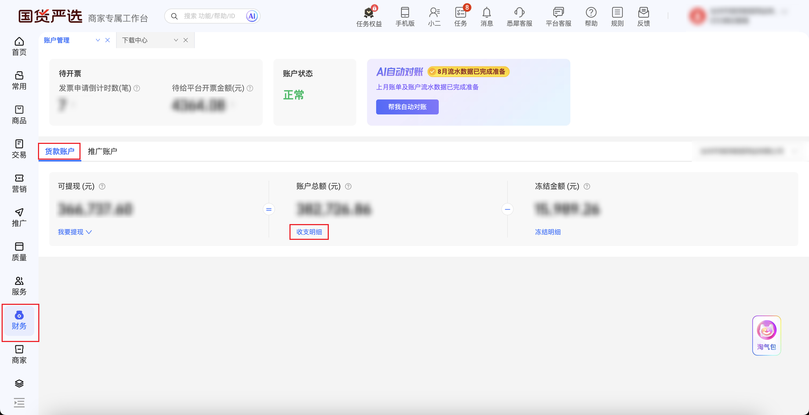
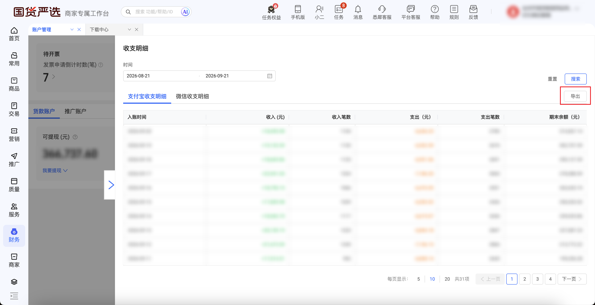

| 属性             | 值                                                         |
| ---------------- | ---------------------------------------------------------- |
| **连接器类型**   | `RPA 连接器`                                               |
| **连接器名称**   | `ODS_财务账户收支明细报表(淘工厂RPA)`                      |
| **连接器代码**   | `rpa.conn.taogongchang.finance.account.bill.detail`        |
| **操作类型**     | `文件下载`                                                 |
| **目标网页**     | `https://tgc.tmall.com/ds/page/supplier/fund-account`     |
| **适用场景**     | 登录淘工厂后进入货款账户，打开收支明细，按日期与渠道导出流水 |
| **数据表名**     | `ods_rpa_taogongchang_finance_account_bill_detail_du`      |
| **业务表名**     | `ODS_财务账户收支明细报表(淘工厂RPA)`                      |

### 目标页面

> **取数路径**：淘工厂商家工作台—财务—账户管理—货款账户—收支明细
>
> **取数链接**：[https://tgc.tmall.com/ds/page/supplier/fund-account](https://tgc.tmall.com/ds/page/supplier/fund-account)

仅采集货款账户收支明细，不操作推广账户。





### 业务入参

| 字段 | 中文释义 | 数据类型 | 必填 | 默认值 | 说明 |
| ---- | -------- | -------- | ---- | ------ | ---- |
| `custom_start_date` | 起始日期 | `String` | 是 | — | 入账时间起。格式：`YYYYMMDD` 或 `YYYY-MM-DD`；不可晚于结束日 |
| `custom_end_date` | 结束日期 | `String` | 是 | — | 入账时间止。格式：`YYYYMMDD` 或 `YYYY-MM-DD`；不可早于起始日 |
| `detail_tab` | 收支明细渠道 | `String` | 是 | — | 可选值：`ALIPAY`（支付宝收支明细）/ `WECHAT`（微信收支明细） |

### 入参样例

支付宝渠道，指定入账区间：

```json
{
  "custom_start_date": "20260919",
  "custom_end_date": "20260919",
  "detail_tab": "ALIPAY"
}
```

微信渠道：

```json
{
  "custom_start_date": "2026-09-01",
  "custom_end_date": "2026-09-10",
  "detail_tab": "WECHAT"
}
```

### 入参校验

```json-schema collapsed
{
  "$schema": "https://json-schema.org/draft/2020-12/schema",
  "title": "淘工厂-货款账户收支明细 - 查询入参",
  "description": "登录淘工厂后进入货款账户，按入账时间和支付宝/微信渠道导出收支流水",
  "type": "object",
  "properties": {
    "custom_start_date": {
      "type": "string",
      "pattern": "^\\d{8}$|^\\d{4}-\\d{2}-\\d{2}$",
      "description": "起始日期，必填。格式 YYYYMMDD 或 YYYY-MM-DD；不可晚于结束日"
    },
    "custom_end_date": {
      "type": "string",
      "pattern": "^\\d{8}$|^\\d{4}-\\d{2}-\\d{2}$",
      "description": "结束日期，必填。格式 YYYYMMDD 或 YYYY-MM-DD；不可早于起始日"
    },
    "detail_tab": {
      "type": "string",
      "enum": ["ALIPAY", "WECHAT"],
      "description": "收支明细渠道，必填。可选值：ALIPAY（支付宝收支明细）/ WECHAT（微信收支明细）"
    }
  },
  "required": ["custom_start_date", "custom_end_date", "detail_tab"],
  "additionalProperties": false
}
```

### 数据字段

| 字段 | 中文释义 | 数据类型 | 可为空 | 来源 | 示例 |
| ---- | -------- | -------- | ------ | ---- | ---- |
| `fundSerialNo` | 资金流水号 | `String` | 否 | `XLSX.1.资金流水号` | `2026****3914` (已脱敏) |
| `fundDirection` | 资金方向 | `String` | 否 | `XLSX.1.资金方向` | `收入` |
| `amount` | 金额 | `String` | 否 | `XLSX.1.金额` | `7.78` |
| `accountChangeTime` | 动账时间 | `String` | 否 | `XLSX.1.动账时间` | `2026-09-19 13:16:37` |
| `bizDate` | 业务日期 | `String` | 否 | 附加 | `20260921` |
| `accountId` | 授权 ID | `String` | 否 | 附加 | `1****4` (已脱敏) |

### 数据样例

```json
{
  "accountChangeTime": "2026-09-19 13:16:37",
  "accountId": "1****4",
  "amount": "7.78",
  "bizDate": "20260921",
  "fundDirection": "收入",
  "fundSerialNo": "2026****3914"
}
```
