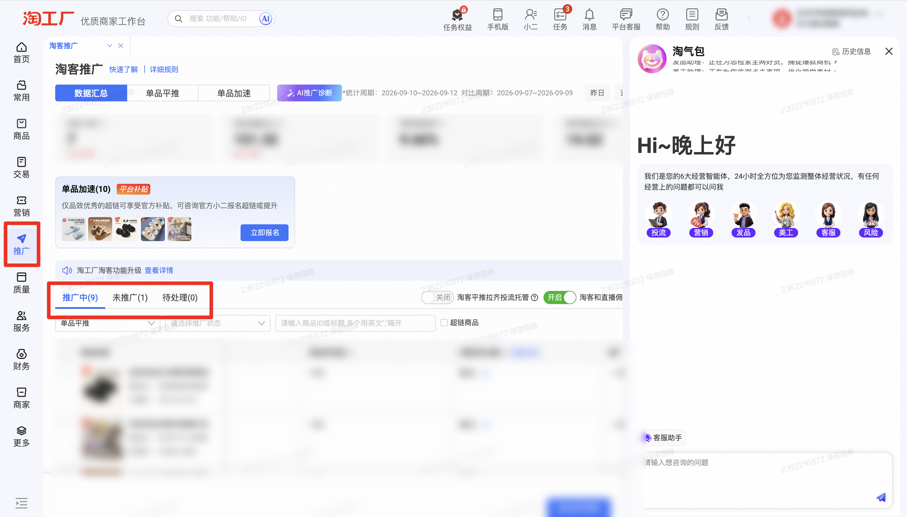

| 属性             | 值                                                         |
| ---------------- | ---------------------------------------------------------- |
| **连接器类型**   | `RPA 连接器`                                               |
| **连接器名称**   | `ODS_淘客推广商品明细数据(淘工厂RPA)`                      |
| **连接器代码**   | `rpa.conn.taogongchang.promotion.item`                     |
| **操作类型**     | `页面解析`                                                 |
| **目标网页**     | `https://tgc.tmall.com/ds/page/supplier/taoke-promotion`   |
| **适用场景**     | 登录淘工厂后进入淘客推广页，按统计时间、活动类型、推广状态等筛选项采集商品明细 |
| **数据表名**     | `ods_rpa_taogongchang_promotion_item_du`                   |
| **业务表名**     | `ODS_淘客推广商品明细数据(淘工厂RPA)`                      |

### 目标页面

> **取数路径**：淘工厂商家工作台—推广—淘客推广
>
> **取数链接**：[https://tgc.tmall.com/ds/page/supplier/taoke-promotion](https://tgc.tmall.com/ds/page/supplier/taoke-promotion)



### 业务入参

| 字段 | 中文释义 | 数据类型 | 必填 | 默认值 | 说明 |
| ---- | -------- | -------- | ---- | ------ | ---- |
| `date_type` | 统计时间类型 | `String` | 否 | — | 不传则沿用页面当前日期。可选值：`YESTERDAY`（昨日）/ `LAST_7_DAYS`（近 7 天）/ `LAST_WEEK`（上周）/ `LAST_15_DAYS`（近 15 天）/ `THIS_MONTH`（本月）/ `LAST_30_DAYS`（近 30 天）/ `LAST_MONTH`（上月）/ `LAST_90_DAYS`（近 90 天）/ `CUSTOM`（自定义区间） |
| `custom_start_date` | 自定义起始日期 | `String` | 条件必填 | — | `date_type` 为 `CUSTOM` 时必填。格式：`YYYYMMDD` 或 `YYYY-MM-DD`；不可晚于结束日；不可选今日及以后 |
| `custom_end_date` | 自定义结束日期 | `String` | 条件必填 | — | `date_type` 为 `CUSTOM` 时必填。格式：`YYYYMMDD` 或 `YYYY-MM-DD`；不可早于起始日；不可选今日及以后 |
| `activity_type` | 活动类型 | `String` | 否 | — | 不传则跳过。可选值：`ITEM_ACCELERATE`（单品加速）/ `ITEM_FLAT_PUSH`（单品平推） |
| `promotion_status` | 推广状态 | `String` | 否 | — | 不传则跳过。可选值：`WAIT_CONFIRM_INVITE`（待确认邀约）/ `XIAOER_REVIEWING`（小二审核中）/ `WAIT_COMPLETE_SIGNUP`（待完善报名信息）/ `WAIT_PROMOTE`（待推广）/ `PROMOTING`（推广中）/ `ENDED`（已结束） |
| `item_id_or_title` | 商品 ID 或标题 | `String` / `List[String]` | 否 | — | 英文逗号分隔或 JSON 数组；中文逗号自动转英文。不传则跳过 |
| `item_tab` | 列表 Tab | `String` | 否 | — | 不传则沿用页面当前 Tab。可选值：`PROMOTING`（推广中）/ `NOT_PROMOTING`（未推广）/ `PENDING`（待处理） |

### 入参样例

```json
{
  "date_type": "CUSTOM",
  "custom_start_date": "2026-09-10",
  "custom_end_date": "2026-09-12",
  "activity_type": "ITEM_FLAT_PUSH",
  "item_tab": "PROMOTING"
}
```

```json
{
  "date_type": "LAST_7_DAYS",
  "activity_type": "ITEM_ACCELERATE",
  "item_id_or_title": "1014479858520",
  "item_tab": "PROMOTING"
}
```

```json
{}
```

### 入参校验

```json-schema collapsed
{
  "$schema": "https://json-schema.org/draft/2020-12/schema",
  "title": "淘工厂-淘客推广商品明细 - 查询入参",
  "description": "登录淘工厂后进入淘客推广页，按统计时间、活动类型、推广状态等筛选项采集商品明细",
  "type": "object",
  "properties": {
    "date_type": {
      "type": "string",
      "enum": ["YESTERDAY", "LAST_7_DAYS", "LAST_WEEK", "LAST_15_DAYS", "THIS_MONTH", "LAST_30_DAYS", "LAST_MONTH", "LAST_90_DAYS", "CUSTOM", ""],
      "description": "统计时间类型；空字符串视为未传，沿用页面当前日期。可选值：YESTERDAY（昨日）/ LAST_7_DAYS（近 7 天）/ LAST_WEEK（上周）/ LAST_15_DAYS（近 15 天）/ THIS_MONTH（本月）/ LAST_30_DAYS（近 30 天）/ LAST_MONTH（上月）/ LAST_90_DAYS（近 90 天）/ CUSTOM（自定义区间）"
    },
    "custom_start_date": {
      "type": "string",
      "pattern": "^$|^\\d{8}$|^\\d{4}-\\d{2}-\\d{2}$",
      "description": "自定义起始日期；date_type=CUSTOM 时必填。格式 YYYYMMDD 或 YYYY-MM-DD；不可晚于结束日；不可选今日及以后"
    },
    "custom_end_date": {
      "type": "string",
      "pattern": "^$|^\\d{8}$|^\\d{4}-\\d{2}-\\d{2}$",
      "description": "自定义结束日期；date_type=CUSTOM 时必填。格式 YYYYMMDD 或 YYYY-MM-DD；不可早于起始日；不可选今日及以后"
    },
    "activity_type": {
      "type": "string",
      "enum": ["ITEM_ACCELERATE", "ITEM_FLAT_PUSH", ""],
      "description": "活动类型；空字符串视为未传。可选值：ITEM_ACCELERATE（单品加速）/ ITEM_FLAT_PUSH（单品平推）"
    },
    "promotion_status": {
      "type": "string",
      "enum": ["WAIT_CONFIRM_INVITE", "XIAOER_REVIEWING", "WAIT_COMPLETE_SIGNUP", "WAIT_PROMOTE", "PROMOTING", "ENDED", ""],
      "description": "推广状态；空字符串视为未传。可选值：WAIT_CONFIRM_INVITE（待确认邀约）/ XIAOER_REVIEWING（小二审核中）/ WAIT_COMPLETE_SIGNUP（待完善报名信息）/ WAIT_PROMOTE（待推广）/ PROMOTING（推广中）/ ENDED（已结束）"
    },
    "item_id_or_title": {
      "description": "商品 ID 或标题；英文逗号分隔字符串或字符串数组，中文逗号自动转英文",
      "anyOf": [
        { "type": "string" },
        {
          "type": "array",
          "items": { "type": "string" }
        }
      ]
    },
    "item_tab": {
      "type": "string",
      "enum": ["PROMOTING", "NOT_PROMOTING", "PENDING", ""],
      "description": "列表 Tab；空字符串视为未传。可选值：PROMOTING（推广中）/ NOT_PROMOTING（未推广）/ PENDING（待处理）"
    }
  },
  "required": [],
  "allOf": [
    {
      "if": {
        "properties": { "date_type": { "const": "CUSTOM" } },
        "required": ["date_type"]
      },
      "then": {
        "required": ["custom_start_date", "custom_end_date"]
      }
    }
  ],
  "additionalProperties": false
}
```

### 数据字段

:::field-tree
@define 供应商商品信息
| `industryName` | 行业名称 | `String` | 是 | 页面解析 | `null` |
| `tenantType` | 租户类型 | `String` | 是 | 页面解析 | `tgc` |
| `itemPicUrl` | 商品主图路径 | `String` | 是 | 页面解析 | `****` (已脱敏) |
| `category1Level` | 一级类目 ID | `Number` | 是 | 页面解析 | `122****001` (已脱敏) |
| `settlePriceMax` | 结算价上限 | `Number` | 是 | 页面解析 | `51.3` |
| `dailySalePriceMin` | 日常售价下限 | `Number` | 是 | 页面解析 | `51.3` |
| `itemTitle` | 商品标题 | `String` | 是 | 页面解析 | `****` (已脱敏) |
| `isSuperLinkItem` | 是否超链商品 | `Boolean` | 是 | 页面解析 | `false` |
| `skuName` | SKU 名称 | `String` | 是 | 页面解析 | `null` |
| `itemId` | 商品 ID | `Number` | 是 | 页面解析 | `103****849` (已脱敏) |
| `isChangPaiItem` | 是否厂牌商品 | `Boolean` | 是 | 页面解析 | `false` |
| `skuMainPicUrl` | SKU 主图 | `String` | 是 | 页面解析 | `null` |
| `category2Level` | 二级类目 ID | `Number` | 是 | 页面解析 | `201****006` (已脱敏) |
| `settlePriceMin` | 结算价下限 | `Number` | 是 | 页面解析 | `51.3` |
| `dailySalePriceMax` | 日常售价上限 | `Number` | 是 | 页面解析 | `51.3` |
| `bizId` | 业务 ID | `String` | 是 | 页面解析 | `124****777` (已脱敏) |
| `skuId` | SKU ID | `Number` | 是 | 页面解析 | `null` |

@define 佣金比例
| `labelHover` | 标签悬停文案 | `String` | 是 | 页面解析 | `null` |
| `commissionRate` | 佣金比例 | `Number` | 是 | 页面解析 | `0.1` |
| `subsidyPolicyRelId` | 补贴政策关联 ID | `String` | 是 | 页面解析 | `null` |
| `inviteTaskId` | 邀约任务 ID | `String` | 是 | 页面解析 | `null` |
| `waitEffectCommissionRate` | 待生效佣金比例 | `Number` | 是 | 页面解析 | `null` |
| `inviteTaskType` | 邀约任务类型 | `String` | 是 | 页面解析 | `null` |
| `label` | 标签 | `String` | 是 | 页面解析 | `null` |
| `subsidyCommissionRate` | 补贴佣金比例 | `Number` | 是 | 页面解析 | `null` |
| `tips` | 提示 | `String` | 是 | 页面解析 | `null` |
| `subsidyType` | 补贴类型 | `String` | 是 | 页面解析 | `null` |
| `ordCnt` | 订单数 | `Number` | 是 | 页面解析 | `null` |
| `waitEffectTotalCommissionRate` | 待生效总佣金比例 | `Number` | 是 | 页面解析 | `null` |
| `mmcJsServiceRate` | 服务费率 | `Number` | 是 | 页面解析 | `null` |
| `inviteRuleId` | 邀约规则 ID | `String` | 是 | 页面解析 | `null` |
| `totalCommissionRate` | 总佣金比例 | `Number` | 是 | 页面解析 | `null` |
| `actionFields` | 操作字段 | `List` | 是 | 页面解析 | `null` |
| `waitEffectSubsidyCommissionRate` | 待生效补贴佣金比例 | `Number` | 是 | 页面解析 | `null` |

@define 优惠券
| `supplierTemplateName` | 商家券模板名称 | `String` | 是 | 页面解析 | `暂无` |
| `couponReceivedCount` | 券领取数 | `Number` | 是 | 页面解析 | `null` |
| `supplierTemplateId` | 商家券模板 ID | `String` | 是 | 页面解析 | `null` |
| `couponAffiliatedItemCountLimit` | 券可关联商品数上限 | `Number` | 是 | 页面解析 | `null` |
| `couponAffiliatedItemCount` | 券已关联商品数 | `Number` | 是 | 页面解析 | `null` |
| `isAffiliatedCouponItem` | 是否已关联券商品 | `Boolean` | 是 | 页面解析 | `null` |
| `couponConsumeCount` | 券核销数 | `Number` | 是 | 页面解析 | `null` |

@define 淘客类型
| `keyName` | 类型名称 | `String` | 是 | 页面解析 | `单品平推` |
| `key` | 类型编码 | `String` | 是 | 页面解析 | `low_commission_push_supplier_wholly` |

@define 推广模型
| `commissionRate` @佣金比例 | 佣金比例信息 | `Dict` | 是 | 页面解析 | 见数据样例 |
| `speedStatusDesc` | 加速状态描述 | `String` | 是 | 页面解析 | `null` |
| `remark` | 备注 | `String` | 是 | 页面解析 | `null` |
| `lowestCommissionLimit` | 最低佣金限制 | `Number` | 是 | 页面解析 | `0.06` |
| `skuName` | SKU 名称 | `String` | 是 | 页面解析 | `null` |
| `normalStatusDesc` | 常规状态描述 | `String` | 是 | 页面解析 | `null` |
| `pushOnlineEndTime` | 推广上线结束时间 | `String` | 是 | 页面解析 | `null` |
| `discountStatus` | 优惠状态 | `String` | 是 | 页面解析 | `null` |
| `discountStatusDesc` | 优惠状态描述 | `String` | 是 | 页面解析 | `null` |
| `from` | 来源标识 | `String` | 是 | 页面解析 | `auto_set_new_item_tr` |
| `waitEffectStatus` | 待生效状态 | `String` | 是 | 页面解析 | `null` |
| `skuId` | SKU ID | `Number` | 是 | 页面解析 | `null` |
| `highestCommissionLimit` | 最高佣金限制 | `Number` | 是 | 页面解析 | `0.7` |
| `skuDailySalePrice` | SKU 日常售价 | `Number` | 是 | 页面解析 | `null` |
| `waitEffectStatusDesc` | 待生效状态描述 | `String` | 是 | 页面解析 | `null` |
| `statusDesc` | 推广状态文案 | `String` | 是 | 页面解析 | `推广中` |
| `actionField` | 操作字段 | `String` | 是 | 页面解析 | `null` |
| `discountCouponList` @优惠券 | 优惠券列表 | `List[Dict]` | 是 | 页面解析 | 见数据样例 |
| `speedTip` | 加速提示 | `String` | 是 | 页面解析 | `null` |
| `tkType` @淘客类型 | 淘客活动类型 | `Dict` | 是 | 页面解析 | 见数据样例 |
| `trSettingId` | 推广设置 ID | `Number` | 是 | 页面解析 | `124****777` (已脱敏) |
| `skuMainPicUrl` | SKU 主图 | `String` | 是 | 页面解析 | `null` |
| `pushOnlineStartTime` | 推广上线开始时间 | `String` | 是 | 页面解析 | `null` |
| `maxCanSaleInventory` | 可售库存类型 | `String` | 是 | 页面解析 | `一盘货` |
| `status` | 推广状态码 | `Number` | 是 | 页面解析 | `40000` |

| 字段 | 中文释义 | 数据类型 | 可为空 | 取数路径 | 示例 |
| ---- | -------- | -------- | ------ | -------- | ---- |
| `itemId` | 商品 ID | `Number` | 否 | 页面解析 | `103****849` (已脱敏) |
| `gmv` | GMV | `Number` | 是 | 页面解析 | `46.1` |
| `aiAnalysisModel` | AI 分析信息 | `Dict` | 是 | 页面解析 | `null` |
| `orderAmount` | 订单金额 | `Number` | 是 | 页面解析 | `0.0` |
| `supplierId` | 供应商 ID | `Number` | 是 | 页面解析 | `500****981` (已脱敏) |
| `supplierItemInfoModel` @供应商商品信息 | 供应商商品信息 | `Dict` | 是 | 页面解析 | 见数据样例 |
| `predictCommission` | 预估佣金 | `Number` | 是 | 页面解析 | `0.0` |
| `promotionModelList` @推广模型 | 推广模型列表 | `List[Dict]` | 是 | 页面解析 | 见数据样例 |
| `supplierIdSec` | 供应商 ID 密文 | `String` | 是 | 页面解析 | `null` |
| `isAiAnaItem` | 是否 AI 分析商品 | `Boolean` | 是 | 页面解析 | `false` |
| `order` | 订单数 | `Number` | 是 | 页面解析 | `0` |
| `dateType` | 统计时间类型 | `String` | 否 | 附加 | `CUSTOM` |
| `customStartDate` | 自定义起始日期 | `String` | 是 | `dateType=CUSTOM` 时附加 | `2026-09-10` |
| `customEndDate` | 自定义结束日期 | `String` | 是 | `dateType=CUSTOM` 时附加 | `2026-09-12` |
| `activityType` | 活动类型 | `String` | 是 | 从页面读取 | `ITEM_FLAT_PUSH` |
| `promotionStatus` | 推广状态 | `String` | 是 | 从页面读取 | `PROMOTING` |
| `itemIdOrTitle` | 商品 ID 或标题 | `String` | 是 | 从页面读取 | `103****849` (已脱敏) |
| `itemTab` | 列表 Tab | `String` | 否 | 附加 | `PROMOTING` |
| `bizDate` | 业务日期 | `String` | 否 | 附加 | `20260913` |
| `accountId` | 授权 ID | `String` | 否 | 附加 | `1****1` (已脱敏) |
:::

### 数据样例

```json
{
  "itemId": "103****849",
  "gmv": 46.1,
  "aiAnalysisModel": null,
  "orderAmount": 0.0,
  "supplierId": "500****981",
  "supplierItemInfoModel": {
    "industryName": null,
    "tenantType": "tgc",
    "itemPicUrl": "****",
    "category1Level": "122****001",
    "settlePriceMax": 51.3,
    "dailySalePriceMin": 51.3,
    "itemTitle": "****",
    "isSuperLinkItem": false,
    "skuName": null,
    "itemId": "103****849",
    "isChangPaiItem": false,
    "skuMainPicUrl": null,
    "category2Level": "201****006",
    "settlePriceMin": 51.3,
    "dailySalePriceMax": 51.3,
    "bizId": "124****777",
    "skuId": null
  },
  "predictCommission": 0.0,
  "promotionModelList": [
    {
      "commissionRate": {
        "labelHover": null,
        "commissionRate": 0.1,
        "subsidyPolicyRelId": null,
        "inviteTaskId": null,
        "waitEffectCommissionRate": null,
        "inviteTaskType": null,
        "label": null,
        "subsidyCommissionRate": null,
        "tips": null,
        "subsidyType": null,
        "ordCnt": null,
        "waitEffectTotalCommissionRate": null,
        "mmcJsServiceRate": null,
        "inviteRuleId": null,
        "totalCommissionRate": null,
        "actionFields": null,
        "waitEffectSubsidyCommissionRate": null
      },
      "speedStatusDesc": null,
      "remark": null,
      "lowestCommissionLimit": 0.06,
      "skuName": null,
      "normalStatusDesc": null,
      "pushOnlineEndTime": null,
      "discountStatus": null,
      "discountStatusDesc": null,
      "from": "auto_set_new_item_tr",
      "waitEffectStatus": null,
      "skuId": null,
      "highestCommissionLimit": 0.7,
      "skuDailySalePrice": null,
      "waitEffectStatusDesc": null,
      "statusDesc": "推广中",
      "actionField": null,
      "discountCouponList": [
        {
          "supplierTemplateName": "暂无",
          "couponReceivedCount": null,
          "supplierTemplateId": null,
          "couponAffiliatedItemCountLimit": null,
          "couponAffiliatedItemCount": null,
          "isAffiliatedCouponItem": null,
          "couponConsumeCount": null
        }
      ],
      "speedTip": null,
      "tkType": {
        "keyName": "单品平推",
        "key": "low_commission_push_supplier_wholly"
      },
      "trSettingId": "124****777",
      "skuMainPicUrl": null,
      "pushOnlineStartTime": null,
      "maxCanSaleInventory": "一盘货",
      "status": 40000
    }
  ],
  "supplierIdSec": null,
  "isAiAnaItem": false,
  "order": 0,
  "dateType": "CUSTOM",
  "customStartDate": "2026-09-10",
  "customEndDate": "2026-09-12",
  "activityType": "ITEM_FLAT_PUSH",
  "itemTab": "PROMOTING",
  "bizDate": "20260913",
  "accountId": "1****1"
}
```

---
