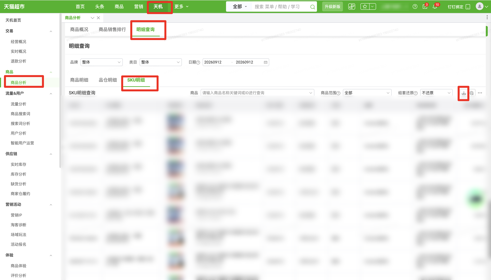

| 属性             | 值                                                         |
| ---------------- | ---------------------------------------------------------- |
| **连接器类型**   | `RPA 连接器`                                               |
| **连接器名称**   | `ODS_商品分析明细查询SKU明细报表(天猫超市RPA)`                     |
| **连接器代码**   | `rpa.conn.tianmaochaoshi.item.analysis.sku.report`         |
| **操作类型**     | `文件导出`                                                 |
| **目标网页**     | `https://web.txcs.tmall.com/?frameUrl=https://web.txcs.tmall.com/pages/chaoshi/ai_tj_item_v2` |
| **适用场景**     | 登录天猫超市后进入天机商品分析页，按日期与筛选项导出明细查询SKU明细查询报表 |
| **数据表名**     | `ods_rpa_tianmaochaoshi_item_analysis_sku_report_du`       |
| **业务表名**     | `ODS_商品分析明细查询SKU明细报表(天猫超市RPA)`                     |

### 目标页面

> **取数路径**：天猫超市—天机—商品分析—明细查询—SKU明细
>
> **取数链接**：[https://web.txcs.tmall.com/?frameUrl=https://web.txcs.tmall.com/pages/chaoshi/ai_tj_item_v2](https://web.txcs.tmall.com/?frameUrl=https://web.txcs.tmall.com/pages/chaoshi/ai_tj_item_v2)



### 业务入参

| 字段 | 中文释义 | 数据类型 | 必填 | 默认值 | 说明 |
| ---- | -------- | -------- | ---- | ------ | ---- |
| `custom_start_date` | 查询起始日期 | `String` | 是 | — | 格式：`YYYYMMDD` 或 `YYYY-MM-DD`；不可选今日及以后；不早于页面当前最早可选日；不得晚于结束日；与结束日跨度（含首尾）不超过 31 天 |
| `custom_end_date` | 查询结束日期 | `String` | 是 | — | 格式：`YYYYMMDD` 或 `YYYY-MM-DD`；不可选今日及以后；不早于页面当前最早可选日；不得早于起始日；与起始日跨度（含首尾）不超过 31 天 |
| `brand` | 品牌 | `String` | 否 | — | 不传则沿用页面当前选项；选项不存在则任务失败 |
| `category` | 类目 | `String` | 否 | — | 不传则沿用页面当前选项；选项不存在则任务失败 |
| `item_id` | 商品 ID | `String` | 否 | — | 不传则跳过。须为 10~25 位数字字符串；搜不到则任务失败 |
| `item_scope` | 商品范围 | `String` | 否 | — | 不传则沿用页面当前值。可选值：`ALL`（全部）/ `DEAL_ONLY`（仅成交）/ `BROWSE_AND_REFUND`（仅浏览&退款） |
| `combo_restore` | 组套还原 | `String` | 否 | — | 不传则沿用页面当前值。可选值：`NOT_RESTORE`（不还原）/ `RESTORE`（还原） |

### 入参样例

仅指定日期区间：

```json
{
  "custom_start_date": "20260911",
  "custom_end_date": "20260911"
}
```

指定品牌、类目、商品与范围：

```json
{
  "custom_start_date": "20260911",
  "custom_end_date": "20260911",
  "brand": "Herlab/她研社",
  "category": "组合套装",
  "item_id": "815001076016",
  "item_scope": "DEAL_ONLY",
  "combo_restore": "RESTORE"
}
```

### 入参校验

```json-schema collapsed
{
  "$schema": "https://json-schema.org/draft/2020-12/schema",
  "title": "天猫超市-商品分析SKU明细 - 查询入参",
  "description": "登录天猫超市后进入天机商品分析页，按日期与筛选项导出明细查询SKU明细查询报表",
  "type": "object",
  "properties": {
    "custom_start_date": {
      "type": "string",
      "description": "查询起始日期，必填。支持 YYYYMMDD 或 YYYY-MM-DD；不可选今日及以后；不早于页面当前最早可选日；不得晚于结束日；与结束日跨度（含首尾）不超过 31 天",
      "anyOf": [
        { "pattern": "^\\d{8}$" },
        { "pattern": "^\\d{4}-\\d{2}-\\d{2}$" }
      ]
    },
    "custom_end_date": {
      "type": "string",
      "description": "查询结束日期，必填。支持 YYYYMMDD 或 YYYY-MM-DD；不可选今日及以后；不早于页面当前最早可选日；不得早于起始日；与起始日跨度（含首尾）不超过 31 天",
      "anyOf": [
        { "pattern": "^\\d{8}$" },
        { "pattern": "^\\d{4}-\\d{2}-\\d{2}$" }
      ]
    },
    "brand": {
      "type": "string",
      "description": "品牌；不传则沿用页面当前选项；填写页面下拉选项原文，选项不存在则任务失败"
    },
    "category": {
      "type": "string",
      "description": "类目；不传则沿用页面当前选项；填写页面下拉选项原文，选项不存在则任务失败"
    },
    "item_id": {
      "type": "string",
      "description": "商品 ID，可选；不传则跳过。须为 10~25 位数字字符串；搜不到则任务失败",
      "pattern": "^\\d{10,25}$"
    },
    "item_scope": {
      "type": "string",
      "enum": ["ALL", "DEAL_ONLY", "BROWSE_AND_REFUND"],
      "description": "商品范围；不传则沿用页面当前值。可选值：ALL（全部）/ DEAL_ONLY（仅成交）/ BROWSE_AND_REFUND（仅浏览&退款）"
    },
    "combo_restore": {
      "type": "string",
      "enum": ["NOT_RESTORE", "RESTORE"],
      "description": "组套还原；不传则沿用页面当前值。可选值：NOT_RESTORE（不还原）/ RESTORE（还原）"
    }
  },
  "required": ["custom_start_date", "custom_end_date"],
  "additionalProperties": false
}
```

### 数据字段

| 字段 | 中文释义 | 数据类型 | 可为空 | 取数路径 | 示例 |
| ---- | -------- | -------- | ------ | -------- | ---- |
| `pictUrl` | 商品图片 | `String` | 是 | `XLSX.0.商品图片` | `****` (已脱敏) |
| `itemName` | 商品名称 | `String` | 否 | `XLSX.0.商品名称` | `****` (已脱敏) |
| `itemId` | 商品 ID | `String` | 否 | `XLSX.0.商品ID` | `814****720` (已脱敏) |
| `skuId` | SKU ID | `String` | 否 | `XLSX.0.SKUID` | `552****906` (已脱敏) |
| `skuProperty` | SKU 属性 | `String` | 是 | `XLSX.0.SKU属性` | `****` (已脱敏) |
| `statDate` | 统计日期 | `String` | 否 | `XLSX.0.统计日期` | 20260912 |
| `cateLevelName` | 四级类目 | `String` | 否 | `XLSX.0.四级类目` | 组合套装 |
| `regionName` | 区域 | `String` | 否 | `XLSX.0.区域` | 整体 |
| `brandName` | 品牌 | `String` | 否 | `XLSX.0.品牌` | `****` (已脱敏) |
| `supplierName` | 供应商名称 | `String` | 否 | `XLSX.0.供应商名称` | `****` (已脱敏) |
| `payOrdAmt1d` | 支付金额 | `Number` | 否 | `XLSX.0.支付金额` | 1169.91 |
| `payItmQty1d` | 支付商品件数 | `Number` | 否 | `XLSX.0.支付商品件数` | 140 |
| `payByrCnt1d` | 支付用户数 | `Number` | 否 | `XLSX.0.支付用户数` | 21 |
| `addCartIpvuv1d` | 加购用户数 | `Number` | 否 | `XLSX.0.加购用户数` | 32 |
| `addCartItmQty1d` | 加购件数 | `Number` | 否 | `XLSX.0.加购件数` | 163 |
| `refundClaimAmt1d` | 发起退款金额 | `Number` | 否 | `XLSX.0.发起退款金额` | 751.41 |
| `refundCnt1d` | 发起退款子订单数 | `Number` | 否 | `XLSX.0.发起退款子订单数` | 6 |
| `refundItmQty1d` | 发起退款商品件数 | `Number` | 否 | `XLSX.0.发起退款商品件数` | 90 |
| `realPayOrdAmt1d` | 支付金额 | `Number` | 否 | `XLSX.0.支付金额(剔退款)` | 418.5 |
| `realPayOrdCnt1d` | 支付子订单数 | `Number` | 否 | `XLSX.0.支付子订单数(剔退款)` | 19 |
| `refundRealAmt1d` | 退款成功金额 | `Number` | 否 | `XLSX.0.退款成功金额` | 751.41 |
| `refundCntEnd1d` | 退款成功子订单数 | `Number` | 否 | `XLSX.0.退款成功子订单数` | 6 |
| `refundItmQtyEnd1d` | 退款成功商品件数 | `Number` | 否 | `XLSX.0.退款成功商品件数` | 90 |
| `payOrdPqt1d` | 件单价 | `Number` | 否 | `XLSX.0.件单价` | 8.3565 |
| `customStartDate` | 查询起始日期 | `String` | 否 | 页面筛选项回读 | 20260911 |
| `customEndDate` | 查询结束日期 | `String` | 否 | 页面筛选项回读 | 20260911 |
| `brand` | 品牌 | `String` | 否 | 页面筛选项回读 | `****` (已脱敏) |
| `category` | 类目 | `String` | 否 | 页面筛选项回读 | 组合套装 |
| `bizDate` | 业务日期 | `String` | 否 | 附加 | 20260913 |
| `accountId` | 授权 ID | `String` | 否 | 附加 | `1****1` (已脱敏) |

### 数据样例

```json
{
  "pictUrl": "****",
  "itemName": "****",
  "itemId": "814****720",
  "skuId": "552****906",
  "skuProperty": "****",
  "statDate": "20260912",
  "cateLevelName": "组合套装",
  "regionName": "整体",
  "brandName": "****",
  "supplierName": "****",
  "payOrdAmt1d": "1169.91",
  "payItmQty1d": "140",
  "payByrCnt1d": "21",
  "addCartIpvuv1d": "32",
  "addCartItmQty1d": "163",
  "refundClaimAmt1d": "751.41",
  "refundCnt1d": "6",
  "refundItmQty1d": "90",
  "realPayOrdAmt1d": "418.5",
  "realPayOrdCnt1d": "19",
  "refundRealAmt1d": "751.41",
  "refundCntEnd1d": "6",
  "refundItmQtyEnd1d": "90",
  "payOrdPqt1d": "8.3565",
  "bizDate": "20260913",
  "accountId": "1****1",
  "customStartDate": "20260911",
  "customEndDate": "20260911",
  "brand": "****",
  "category": "组合套装"
}
```

---
