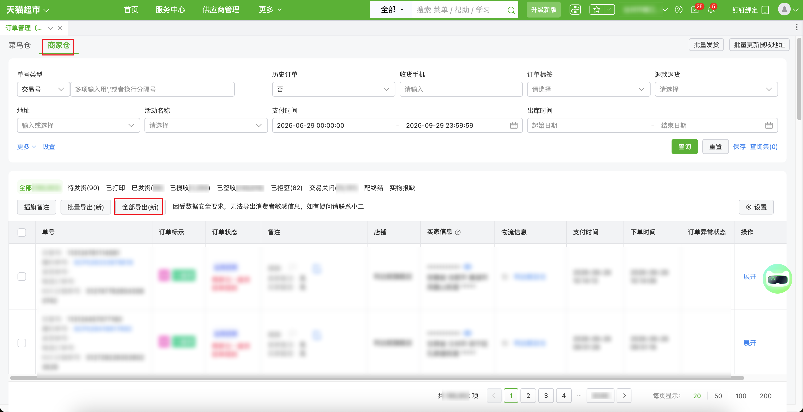

| 属性             | 值                                                         |
| ---------------- | ---------------------------------------------------------- |
| **连接器类型**   | `RPA 连接器`                                               |
| **连接器名称**   | `ODS_订单管理商家仓明细报表(天猫超市RPA)`                  |
| **连接器代码**   | `rpa.conn.tianmaochaoshi.order.merchant.warehouse.report`  |
| **操作类型**     | `文件导出`                                                 |
| **目标网页**     | `https://web.txcs.tmall.com/?frameUrl=https://web.txcs.tmall.com/pages/chaoshi/fulfillment_order_manage_config` |
| **适用场景**     | 登录天猫超市后进入订单管理商家仓，按筛选条件导出全部订单明细 |
| **数据表名**     | `ods_rpa_tianmaochaoshi_order_merchant_warehouse_report_du` |
| **业务表名**     | `ODS_订单管理商家仓明细报表(天猫超市RPA)`                  |

### 目标页面

> **取数路径**：天猫超市—订单管理—商家仓—全部导出(新)
>
> **取数链接**：[https://web.txcs.tmall.com/?frameUrl=https://web.txcs.tmall.com/pages/chaoshi/fulfillment_order_manage_config](https://web.txcs.tmall.com/?frameUrl=https://web.txcs.tmall.com/pages/chaoshi/fulfillment_order_manage_config)



### 业务入参

| 字段 | 中文释义 | 数据类型 | 必填 | 默认值 | 说明 |
| ---- | -------- | -------- | ---- | ------ | ---- |
| `historical_order` | 历史订单 | `String` | 否 | `NO` | 允许值：`YES`（是）/ `NO`（否） |
| `refund_type` | 退款退货 | `String` | 否 | — | 允许值：`NO_REFUND_OR_RETURN`（无退款退货）/ `REFUND_ONLY`（仅退款）/ `RETURN_ONLY`（仅退货）/ `REFUND_AND_RETURN`（退款退货）/ `PARTIAL_RETURN_ONLY`（仅部分退货）/ `PARTIAL_REFUND_ONLY`（仅部分退款）。不传则不选择该项 |
| `province` | 省 | `String` | 条件必填 | — | 页面行政区划原文。`city`、`district`、`street` 任一有值时必填。只传到某一级即停在该级 |
| `city` | 市 | `String` | 条件必填 | — | 页面行政区划原文。`district` 或 `street` 有值时必填 |
| `district` | 区/县 | `String` | 条件必填 | — | 页面行政区划原文。`street` 有值时必填 |
| `street` | 街道/镇 | `String` | 否 | — | 页面行政区划原文 |
| `payment_start_date` | 支付开始时间 | `String` | 是 | — | `YYYYMMDD` 或 `YYYY-MM-DD`。开始时刻 `00:00:00` |
| `payment_end_date` | 支付结束时间 | `String` | 是 | — | `YYYYMMDD` 或 `YYYY-MM-DD`。结束时刻 `23:59:59`。不得早于 `payment_start_date` |
| `outbound_start_date` | 出库开始时间 | `String` | 条件必填 | — | 与 `outbound_end_date` 成对传入；均不传则不填。`YYYYMMDD` 或 `YYYY-MM-DD`。开始时刻 `00:00:00` |
| `outbound_end_date` | 出库结束时间 | `String` | 条件必填 | — | 与 `outbound_start_date` 成对传入；均不传则不填。`YYYYMMDD` 或 `YYYY-MM-DD`。结束时刻 `23:59:59`。不得早于 `outbound_start_date` |
| `order_status` | 订单状态 | `String` | 否 | `ALL` | 允许值：`ALL`（全部）/ `PENDING_SHIPMENT`（待发货）/ `PRINTED`（已打印）/ `SHIPPED`（已发货）/ `COLLECTED`（已揽收）/ `SIGNED`（已签收）/ `REJECTED`（已拒签）/ `TRADE_CLOSED`（交易关闭）/ `DELIVERY_ENDED`（配终结）/ `GOODS_SHORTAGE`（实物报缺） |

### 入参样例

只传支付时间，其余沿用默认：

```json
{
  "payment_start_date": "20260927",
  "payment_end_date": "20260928"
}
```

指定订单状态，支付时间用 `YYYY-MM-DD`：

```json
{
  "payment_start_date": "2026-09-27",
  "payment_end_date": "2026-09-28",
  "order_status": "SIGNED"
}
```

地址只到区，并指定退款退货：

```json
{
  "payment_start_date": "20260927",
  "payment_end_date": "20260928",
  "refund_type": "NO_REFUND_OR_RETURN",
  "province": "北京",
  "city": "北京市",
  "district": "东城区"
}
```

支付时间与出库时间都传：

```json
{
  "payment_start_date": "20260927",
  "payment_end_date": "20260928",
  "outbound_start_date": "20260927",
  "outbound_end_date": "20260928"
}
```

### 入参校验

```json-schema collapsed
{
  "$schema": "https://json-schema.org/draft/2020-12/schema",
  "title": "天猫超市-订单管理商家仓明细 - 查询入参",
  "description": "登录天猫超市后进入订单管理商家仓，按筛选条件导出全部订单明细",
  "type": "object",
  "properties": {
    "historical_order": {
      "type": "string",
      "enum": ["YES", "NO"],
      "description": "历史订单。允许值：YES（是）/ NO（否）"
    },
    "refund_type": {
      "type": "string",
      "enum": [
        "NO_REFUND_OR_RETURN",
        "REFUND_ONLY",
        "RETURN_ONLY",
        "REFUND_AND_RETURN",
        "PARTIAL_RETURN_ONLY",
        "PARTIAL_REFUND_ONLY"
      ],
      "description": "退款退货。允许值：NO_REFUND_OR_RETURN（无退款退货）/ REFUND_ONLY（仅退款）/ RETURN_ONLY（仅退货）/ REFUND_AND_RETURN（退款退货）/ PARTIAL_RETURN_ONLY（仅部分退货）/ PARTIAL_REFUND_ONLY（仅部分退款）。不传则不选择该项"
    },
    "province": {
      "type": "string",
      "description": "省，页面行政区划原文。city、district、street 任一有值时必填"
    },
    "city": {
      "type": "string",
      "description": "市，页面行政区划原文。district 或 street 有值时必填"
    },
    "district": {
      "type": "string",
      "description": "区/县，页面行政区划原文。street 有值时必填"
    },
    "street": {
      "type": "string",
      "description": "街道/镇，页面行政区划原文"
    },
    "payment_start_date": {
      "type": "string",
      "description": "支付开始时间。支持 YYYYMMDD 或 YYYY-MM-DD。开始时刻 00:00:00",
      "anyOf": [
        { "pattern": "^\\d{8}$" },
        { "pattern": "^\\d{4}-\\d{2}-\\d{2}$" }
      ]
    },
    "payment_end_date": {
      "type": "string",
      "description": "支付结束时间。支持 YYYYMMDD 或 YYYY-MM-DD。结束时刻 23:59:59。不得早于 payment_start_date",
      "anyOf": [
        { "pattern": "^\\d{8}$" },
        { "pattern": "^\\d{4}-\\d{2}-\\d{2}$" }
      ]
    },
    "outbound_start_date": {
      "type": "string",
      "description": "出库开始时间。与 outbound_end_date 成对传入，均不传则不填。支持 YYYYMMDD 或 YYYY-MM-DD。开始时刻 00:00:00",
      "anyOf": [
        { "pattern": "^\\d{8}$" },
        { "pattern": "^\\d{4}-\\d{2}-\\d{2}$" }
      ]
    },
    "outbound_end_date": {
      "type": "string",
      "description": "出库结束时间。与 outbound_start_date 成对传入，均不传则不填。支持 YYYYMMDD 或 YYYY-MM-DD。结束时刻 23:59:59。不得早于 outbound_start_date",
      "anyOf": [
        { "pattern": "^\\d{8}$" },
        { "pattern": "^\\d{4}-\\d{2}-\\d{2}$" }
      ]
    },
    "order_status": {
      "type": "string",
      "enum": [
        "ALL",
        "PENDING_SHIPMENT",
        "PRINTED",
        "SHIPPED",
        "COLLECTED",
        "SIGNED",
        "REJECTED",
        "TRADE_CLOSED",
        "DELIVERY_ENDED",
        "GOODS_SHORTAGE"
      ],
      "description": "订单状态。允许值：ALL（全部）/ PENDING_SHIPMENT（待发货）/ PRINTED（已打印）/ SHIPPED（已发货）/ COLLECTED（已揽收）/ SIGNED（已签收）/ REJECTED（已拒签）/ TRADE_CLOSED（交易关闭）/ DELIVERY_ENDED（配终结）/ GOODS_SHORTAGE（实物报缺）"
    }
  },
  "required": ["payment_start_date", "payment_end_date"],
  "additionalProperties": false,
  "allOf": [
    {
      "if": {
        "properties": { "city": { "type": "string", "minLength": 1 } },
        "required": ["city"]
      },
      "then": { "required": ["province"] }
    },
    {
      "if": {
        "properties": { "district": { "type": "string", "minLength": 1 } },
        "required": ["district"]
      },
      "then": { "required": ["province", "city"] }
    },
    {
      "if": {
        "properties": { "street": { "type": "string", "minLength": 1 } },
        "required": ["street"]
      },
      "then": { "required": ["province", "city", "district"] }
    },
    {
      "if": {
        "properties": { "outbound_start_date": { "type": "string", "minLength": 1 } },
        "required": ["outbound_start_date"]
      },
      "then": { "required": ["outbound_end_date"] }
    },
    {
      "if": {
        "properties": { "outbound_end_date": { "type": "string", "minLength": 1 } },
        "required": ["outbound_end_date"]
      },
      "then": { "required": ["outbound_start_date"] }
    }
  ]
}
```

### 数据字段

| 字段 | 中文释义 | 数据类型 | 可为空 | 取数路径 | 示例 |
| ---- | -------- | -------- | ------ | -------- | ---- |
| `shopName` | 店铺名称 | `String` | 是 | `XLSX.0.店铺名称` | `****` (已脱敏) |
| `warehouseName` | 仓库名称 | `String` | 是 | `XLSX.0.仓库名称` | `****` (已脱敏) |
| `cashOnDelivery` | 货到付款 | `String` | 是 | `XLSX.0.货到付款` | 否 |
| `orderCreateTime` | 下单时间 | `String` | 是 | `XLSX.0.下单时间` | `2026-09-17 13:03:44` |
| `payTime` | 支付时间 | `String` | 是 | `XLSX.0.支付时间` | `2026-09-17 13:03:46` |
| `expectDeliveryTime` | 预计发货时间 | `String` | 是 | `XLSX.0.预计发货时间` | `2026-09-17 23:59:59` |
| `shipTime` | 发货时间 | `String` | 是 | `XLSX.0.发货时间` | `2026-09-17 14:54:18` |
| `signTime` | 签收时间 | `String` | 是 | `XLSX.0.签收时间` | `2026-09-20 08:48:51` |
| `orderType` | 订单类型 | `String` | 是 | `XLSX.0.订单类型` | 销售单 |
| `deliveryMethod` | 配送方式 | `String` | 是 | `XLSX.0.配送方式` | 普通配送 |
| `orderStatus` | 状态 | `String` | 是 | `XLSX.0.状态` | 已签收 |
| `auditor` | 审单人 | `String` | 是 | `XLSX.0.审单人` | null |
| `systemOrderNo` | 系统单号 | `String` | 是 | `XLSX.0.系统单号` | `SCP****711` (已脱敏) |
| `tradeOrderNo` | 交易订单号 | `String` | 是 | `XLSX.0.交易订单号` | `112****010` (已脱敏) |
| `logisticsOrderNo` | 物流订单号 | `String` | 是 | `XLSX.0.物流订单号` | `LP0****118` (已脱敏) |
| `externalOrderNo` | 外部订单号 | `String` | 是 | `XLSX.0.外部订单号` | `112****010` (已脱敏) |
| `warehouseOrderNo` | 仓库订单号 | `String` | 是 | `XLSX.0.仓库订单号` | null |
| `expressCompany` | 快递公司 | `String` | 是 | `XLSX.0.快递公司` | 中通快递 |
| `waybillNo` | 运单号 | `String` | 是 | `XLSX.0.运单号` | `790****935` (已脱敏) |
| `buyerNick` | 买家昵称 | `String` | 是 | `XLSX.0.买家昵称` | null |
| `receiverName` | 收货人姓名 | `String` | 是 | `XLSX.0.收货人姓名` | `****` (已脱敏) |
| `province` | 省 | `String` | 是 | `XLSX.0.省` | 江西省 |
| `city` | 市 | `String` | 是 | `XLSX.0.市` | 赣州市 |
| `district` | 区 | `String` | 是 | `XLSX.0.区` | 会昌县 |
| `street` | 街道 | `String` | 是 | `XLSX.0.街道` | 麻州镇 |
| `receiverAddress` | 收货人地址 | `String` | 是 | `XLSX.0.收货人地址` | `麻****镇` (已脱敏) |
| `mobile` | 手机 | `String` | 是 | `XLSX.0.手机` | `***********` |
| `telephone` | 电话 | `String` | 是 | `XLSX.0.电话` | null |
| `orderAmount` | 订单金额 | `Number` | 是 | `XLSX.0.订单金额` | 19.9 |
| `goodsTotalAmount` | 商品总售价 | `Number` | 是 | `XLSX.0.商品总售价` | 0.0 |
| `freightAmount` | 快递费用 | `Number` | 是 | `XLSX.0.快递费用` | 0.0 |
| `codServiceFee` | COD服务费 | `Number` | 是 | `XLSX.0.COD服务费` | 0.0 |
| `receivableAmount` | 应收金额 | `Number` | 是 | `XLSX.0.应收金额` | 0.0 |
| `receivedAmount` | 实收金额 | `Number` | 是 | `XLSX.0.实收金额` | 0.0 |
| `invoiceFlag` | 是否开发票 | `String` | 是 | `XLSX.0.是否开发票` | null |
| `invoiceTitle` | 发票抬头 | `String` | 是 | `XLSX.0.发票抬头` | null |
| `invoiceContent` | 发票内容 | `String` | 是 | `XLSX.0.发票内容` | null |
| `invoiceAmount` | 发票金额 | `Number` | 是 | `XLSX.0.发票金额` | 0.0 |
| `purchasePrice` | 采购价 | `Number` | 是 | `XLSX.0.采购价` | 19.9 |
| `sellerRemark` | 卖家备注 | `String` | 是 | `XLSX.0.卖家备注` | null |
| `refundFlag` | 退款 | `String` | 是 | `XLSX.0.退款` | 否 |
| `giftFlag` | 赠品标识 | `String` | 是 | `XLSX.0.赠品标识` | 非赠品 |
| `orderQuantity` | 订货数量 | `Number` | 是 | `XLSX.0.订货数量` | 1 |
| `goodsPrice` | 商品售价 | `Number` | 是 | `XLSX.0.商品售价` | 0.0 |
| `goodsSubtotal` | 商品小计 | `Number` | 是 | `XLSX.0.商品小计` | 19.9 |
| `goodsDiscount` | 商品优惠 | `Number` | 是 | `XLSX.0.商品优惠` | 0.0 |
| `goodsNo` | 货号 | `String` | 是 | `XLSX.0.货号` | null |
| `skuCode` | 货品编码 | `String` | 是 | `XLSX.0.货品编码` | `MCB****240` (已脱敏) |
| `itemCode` | 商品编码 | `String` | 是 | `XLSX.0.商品编码` | `MCB****240` (已脱敏) |
| `goodsName` | 商品名称 | `String` | 是 | `XLSX.0.商品名称` | `****` (已脱敏) |
| `goodsWeightGram` | 商品重量(克) | `Number` | 是 | `XLSX.0.商品重量(克)` | 500 |
| `inventoryStatus` | 库存状态) | `String` | 是 | `XLSX.0.库存状态)` | 不缺货 |
| `activityName` | 活动名称 | `String` | 是 | `XLSX.0.活动名称` | null |
| `timeliness` | 时效 | `String` | 是 | `XLSX.0.时效` | null |
| `expectPushTime` | 应推单时间 | `String` | 是 | `XLSX.0.应推单时间` | `2099-01-01 00:00:00` |
| `distributorShopName` | 分销商店铺名称 | `String` | 是 | `XLSX.0.分销商店铺名称` | `****` (已脱敏) |
| `appointmentDeliveryFlag` | 是否预约配送 | `String` | 是 | `XLSX.0.是否预约配送` | 否 |
| `appointmentDeliveryDate` | 预约配送日期 | `String` | 是 | `XLSX.0.预约配送日期` | null |
| `distributionOrderNo` | 分销订单号 | `String` | 是 | `XLSX.0.分销订单号` | `331****367` (已脱敏) |
| `actualQuantity` | 实发数量 | `Number` | 是 | `XLSX.0.实发数量` | 1 |
| `goodsUniqueCode` | 货品唯一码 | `String` | 是 | `XLSX.0.货品唯一码` | null |
| `appointmentShipTime` | 预约发货时间 | `String` | 是 | `XLSX.0.预约发货时间` | null |
| `deliveryException` | 运配异常 | `String` | 是 | `XLSX.0.运配异常` | 否 |
| `cainiaoMergeCode` | 菜鸟合单码 | `String` | 是 | `XLSX.0.菜鸟合单码` | null |
| `packageStagnantFlag` | 包裹是否停滞 | `String` | 是 | `XLSX.0.包裹是否停滞` | 否 |
| `packageStagnantText` | 包裹停滞文案 | `String` | 是 | `XLSX.0.包裹停滞文案` | null |
| `packageCareFlag` | 包裹是否关怀 | `String` | 是 | `XLSX.0.包裹是否关怀` | 否 |
| `packageCareText` | 包裹关怀文案 | `String` | 是 | `XLSX.0.包裹关怀文案` | null |
| `orderExceptionStatus` | 订单异常状态 | `String` | 是 | `XLSX.0.订单异常状态` | null |
| `giftOrderFlag` | 送礼单 | `String` | 是 | `XLSX.0.送礼单` | 否 |
| `bizDate` | 业务日期 | `String` | 否 | 附加 | 20260929 |
| `accountId` | 授权 ID | `String` | 否 | 附加 | `1****0` (已脱敏) |

### 数据样例

```json
{
  "shopName": "****",
  "warehouseName": "****",
  "cashOnDelivery": "否",
  "orderCreateTime": "2026-09-17 13:03:44",
  "payTime": "2026-09-17 13:03:46",
  "expectDeliveryTime": "2026-09-17 23:59:59",
  "shipTime": "2026-09-17 14:54:18",
  "signTime": "2026-09-20 08:48:51",
  "orderType": "销售单",
  "deliveryMethod": "普通配送",
  "orderStatus": "已签收",
  "auditor": null,
  "systemOrderNo": "SCP****711",
  "tradeOrderNo": "112****010",
  "logisticsOrderNo": "LP0****118",
  "externalOrderNo": "112****010",
  "warehouseOrderNo": null,
  "expressCompany": "中通快递",
  "waybillNo": "790****935",
  "buyerNick": null,
  "receiverName": "****",
  "province": "江西省",
  "city": "赣州市",
  "district": "会昌县",
  "street": "麻州镇",
  "receiverAddress": "麻****镇",
  "mobile": "***********",
  "telephone": null,
  "orderAmount": "19.9",
  "goodsTotalAmount": "0.0",
  "freightAmount": "0.0",
  "codServiceFee": "0.0",
  "receivableAmount": "0.0",
  "receivedAmount": "0.0",
  "invoiceFlag": null,
  "invoiceTitle": null,
  "invoiceContent": null,
  "invoiceAmount": "0.0",
  "purchasePrice": "19.9",
  "sellerRemark": null,
  "refundFlag": "否",
  "giftFlag": "非赠品",
  "orderQuantity": "1",
  "goodsPrice": "0.0",
  "goodsSubtotal": "19.9",
  "goodsDiscount": "0.0",
  "goodsNo": null,
  "skuCode": "MCB****240",
  "itemCode": "MCB****240",
  "goodsName": "****",
  "goodsWeightGram": "500",
  "inventoryStatus": "不缺货",
  "activityName": null,
  "timeliness": null,
  "expectPushTime": "2099-01-01 00:00:00",
  "distributorShopName": "****",
  "appointmentDeliveryFlag": "否",
  "appointmentDeliveryDate": null,
  "distributionOrderNo": "331****367",
  "actualQuantity": "1",
  "goodsUniqueCode": null,
  "appointmentShipTime": null,
  "deliveryException": "否",
  "cainiaoMergeCode": null,
  "packageStagnantFlag": "否",
  "packageStagnantText": null,
  "packageCareFlag": "否",
  "packageCareText": null,
  "orderExceptionStatus": null,
  "giftOrderFlag": "否",
  "bizDate": "20260929",
  "accountId": "1****0"
}
```

---
