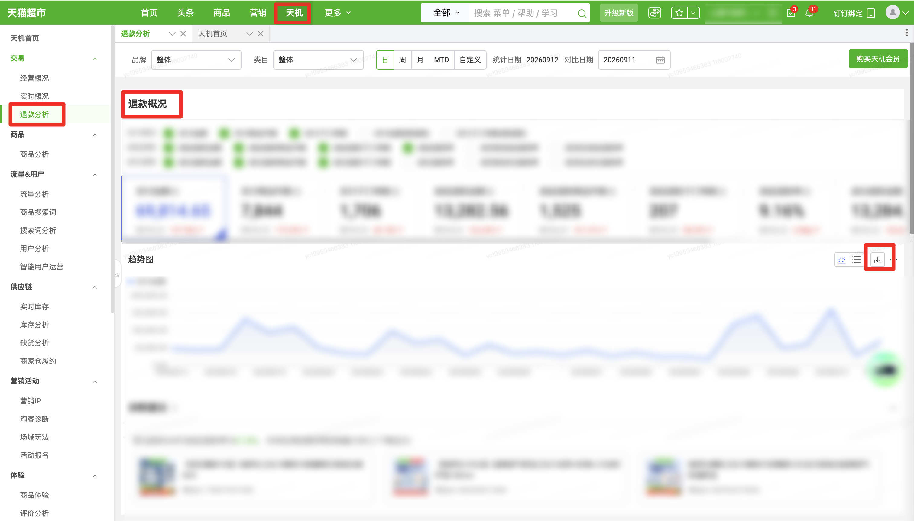

| 属性             | 值                                                         |
| ---------------- | ---------------------------------------------------------- |
| **连接器类型**   | `RPA 连接器`                                               |
| **连接器名称**   | `ODS_交易退款分析退款概况趋势明细报表(天猫超市RPA)`                |
| **连接器代码**   | `rpa.conn.tianmaochaoshi.refund.analysis.report`           |
| **操作类型**     | `文件导出`                                                 |
| **目标网页**     | `https://web.txcs.tmall.com/?frameUrl=https://web.txcs.tmall.com/pages/chaoshi/ai_refund_tmcs` |
| **适用场景**     | 登录天猫超市后进入天机退款分析页，按统计周期与日期条件导出退款概况趋势图明细 |
| **数据表名**     | `ods_rpa_tianmaochaoshi_refund_analysis_report_du`         |
| **业务表名**     | `ODS_交易退款分析退款概况趋势明细报表(天猫超市RPA)`                |

### 目标页面

> **取数路径**：天猫超市—天机—退款分析—退款概况趋势图
>
> **取数链接**：[https://web.txcs.tmall.com/?frameUrl=https://web.txcs.tmall.com/pages/chaoshi/ai_refund_tmcs](https://web.txcs.tmall.com/?frameUrl=https://web.txcs.tmall.com/pages/chaoshi/ai_refund_tmcs)



### 业务入参

| 字段 | 中文释义 | 数据类型 | 必填 | 默认值 | 说明 |
| ---- | -------- | -------- | ---- | ------ | ---- |
| `date_type` | 统计周期 | `String` | 是 | — | 可选值：`DAY`（日）/ `WEEK`（周）/ `MONTH`（月）/ `MTD`（MTD）/ `CUSTOM`（自定义） |
| `biz_date` | 统计日期 | `String` | 条件必填 | — | `date_type` 为 `DAY` / `WEEK` / `MONTH` / `MTD` 时必填。`YYYYMMDD` 或 `YYYY-MM-DD`。`DAY` / `MTD` 不可选今日及以后 |
| `custom_start_date` | 自定义统计开始日 | `String` | 条件必填 | — | 仅 `date_type=CUSTOM` 时必填。格式：`YYYYMMDD` 或 `YYYY-MM-DD`；最早去年 01-01；不得晚于结束日；与结束日跨度（含首尾）不超过 31 天 |
| `custom_end_date` | 自定义统计结束日 | `String` | 条件必填 | — | 仅 `date_type=CUSTOM` 时必填。格式：`YYYYMMDD` 或 `YYYY-MM-DD`；不可选今日及以后；不得早于开始日；与开始日跨度（含首尾）不超过 31 天 |
| `compare_date` | 对比日期 | `String` | 否 | — | 仅 `date_type=DAY` 时可用；不传则沿用页面当前日期。格式：`YYYYMMDD` 或 `YYYY-MM-DD`；不可选今日及以后 |
| `compare_custom_start_date` | 自定义对比开始日 | `String` | 条件必填 | — | 仅 `date_type=CUSTOM` 时可用；须与 `compare_custom_end_date` 成对传入，均未传则沿用页面当前日期。格式：`YYYYMMDD` 或 `YYYY-MM-DD`；最早去年 01-01；不得晚于结束日；与结束日跨度（含首尾）不超过 31 天 |
| `compare_custom_end_date` | 自定义对比结束日 | `String` | 条件必填 | — | 仅 `date_type=CUSTOM` 时可用；须与 `compare_custom_start_date` 成对传入，均未传则沿用页面当前日期。格式：`YYYYMMDD` 或 `YYYY-MM-DD`；不可选今日及以后；不得早于开始日；与开始日跨度（含首尾）不超过 31 天 |
| `brand` | 品牌 | `String` | 否 | — | 不传则沿用页面当前选项 |
| `category` | 类目 | `String` | 否 | — | 不传则沿用页面当前选项 |

### 入参样例

按日统计指定日期与品牌：

```json
{
  "date_type": "DAY",
  "biz_date": "20260910",
  "brand": "Herlab/她研社"
}
```

按日统计并指定对比日期：

```json
{
  "date_type": "DAY",
  "biz_date": "20260910",
  "compare_date": "20260909"
}
```

按周统计（用该日定位所在周）：

```json
{
  "date_type": "WEEK",
  "biz_date": "20260906"
}
```

自定义统计区间：

```json
{
  "date_type": "CUSTOM",
  "custom_start_date": "20260801",
  "custom_end_date": "20260831"
}
```

### 入参校验

```json-schema collapsed
{
  "$schema": "https://json-schema.org/draft/2020-12/schema",
  "title": "天猫超市-退款分析趋势图 - 查询入参",
  "description": "登录天猫超市后进入天机退款分析页，按统计周期与日期条件导出趋势图明细",
  "type": "object",
  "properties": {
    "date_type": {
      "type": "string",
      "enum": ["DAY", "WEEK", "MONTH", "MTD", "CUSTOM"],
      "description": "统计周期。可选值：DAY（日）/ WEEK（周）/ MONTH（月）/ MTD（MTD）/ CUSTOM（自定义）"
    },
    "biz_date": {
      "type": "string",
      "description": "统计日期；date_type 为 DAY/WEEK/MONTH/MTD 时必填，CUSTOM 不使用。支持 YYYYMMDD 或 YYYY-MM-DD。DAY/MTD 不可选今日及以后；WEEK 用该日定位所在周且不可选本周；MONTH 用该日定位所在月且不可选本月",
      "anyOf": [
        { "pattern": "^\\d{8}$" },
        { "pattern": "^\\d{4}-\\d{2}-\\d{2}$" }
      ]
    },
    "custom_start_date": {
      "type": "string",
      "description": "自定义统计开始日，仅 date_type=CUSTOM 时必填；支持 YYYYMMDD 或 YYYY-MM-DD；最早去年 01-01；与结束日跨度（含首尾）不超过 31 天",
      "anyOf": [
        { "pattern": "^\\d{8}$" },
        { "pattern": "^\\d{4}-\\d{2}-\\d{2}$" }
      ]
    },
    "custom_end_date": {
      "type": "string",
      "description": "自定义统计结束日，仅 date_type=CUSTOM 时必填；支持 YYYYMMDD 或 YYYY-MM-DD；不可选今日及以后；与开始日跨度（含首尾）不超过 31 天",
      "anyOf": [
        { "pattern": "^\\d{8}$" },
        { "pattern": "^\\d{4}-\\d{2}-\\d{2}$" }
      ]
    },
    "compare_date": {
      "type": "string",
      "description": "对比日期，仅 date_type=DAY 时可用；不传则沿用页面当前日期。支持 YYYYMMDD 或 YYYY-MM-DD；不可选今日及以后",
      "anyOf": [
        { "pattern": "^\\d{8}$" },
        { "pattern": "^\\d{4}-\\d{2}-\\d{2}$" }
      ]
    },
    "compare_custom_start_date": {
      "type": "string",
      "description": "自定义对比开始日，仅 date_type=CUSTOM 时可用；须与 compare_custom_end_date 成对传入，均未传则沿用页面当前日期。支持 YYYYMMDD 或 YYYY-MM-DD；最早去年 01-01；与结束日跨度（含首尾）不超过 31 天",
      "anyOf": [
        { "pattern": "^\\d{8}$" },
        { "pattern": "^\\d{4}-\\d{2}-\\d{2}$" }
      ]
    },
    "compare_custom_end_date": {
      "type": "string",
      "description": "自定义对比结束日，仅 date_type=CUSTOM 时可用；须与 compare_custom_start_date 成对传入，均未传则沿用页面当前日期。支持 YYYYMMDD 或 YYYY-MM-DD；不可选今日及以后；与开始日跨度（含首尾）不超过 31 天",
      "anyOf": [
        { "pattern": "^\\d{8}$" },
        { "pattern": "^\\d{4}-\\d{2}-\\d{2}$" }
      ]
    },
    "brand": {
      "type": "string",
      "description": "品牌；不传则沿用页面当前选项；填写页面下拉中的选项原文"
    },
    "category": {
      "type": "string",
      "description": "类目；不传则沿用页面当前选项；填写页面下拉中的选项原文"
    }
  },
  "required": ["date_type"],
  "additionalProperties": false,
  "allOf": [
    {
      "if": {
        "properties": { "date_type": { "enum": ["DAY", "WEEK", "MONTH", "MTD"] } },
        "required": ["date_type"]
      },
      "then": {
        "required": ["biz_date"]
      }
    },
    {
      "if": {
        "properties": { "date_type": { "const": "CUSTOM" } },
        "required": ["date_type"]
      },
      "then": {
        "required": ["custom_start_date", "custom_end_date"]
      }
    },
    {
      "if": {
        "properties": {
          "compare_custom_start_date": {
            "type": "string",
            "minLength": 1
          }
        },
        "required": ["compare_custom_start_date"]
      },
      "then": {
        "required": ["compare_custom_end_date"]
      }
    },
    {
      "if": {
        "properties": {
          "compare_custom_end_date": {
            "type": "string",
            "minLength": 1
          }
        },
        "required": ["compare_custom_end_date"]
      },
      "then": {
        "required": ["compare_custom_start_date"]
      }
    }
  ]
}
```

### 数据字段

| 字段 | 中文释义 | 数据类型 | 可为空 | 取数路径 | 示例 |
| ---- | -------- | -------- | ------ | -------- | ---- |
| `statDate` | 统计日期 | `String` | 否 | `XLSX.0.stat_date` | 20260812 |
| `payAmount` | 支付金额 | `Number` | 否 | `XLSX.0.支付金额` | 42748.56 |
| `payItemQty` | 支付商品件数 | `Number` | 否 | `XLSX.0.支付商品件数` | 4266 |
| `paySubOrderQty` | 支付子订单数 | `Number` | 否 | `XLSX.0.支付子订单数` | 1364 |
| `refundApplyAmount` | 发起退款金额 | `Number` | 否 | `XLSX.0.发起退款金额` | 4919.83 |
| `refundApplyItemQty` | 发起退款商品件数 | `Number` | 否 | `XLSX.0.发起退款商品件数` | 504 |
| `refundApplySubOrderQty` | 发起退款子订单数 | `Number` | 否 | `XLSX.0.发起退款子订单数` | 113 |
| `refundApplyRate` | 发起退款率 | `Number` | 否 | `XLSX.0.发起退款率` | 0.0746 |
| `refundApplyRateBeforeShip` | 发货前发起退款率 | `Number` | 否 | `XLSX.0.发货前发起退款率` | 0.0652 |
| `refundApplyRateAfterShip` | 发货后发起退款率 | `Number` | 否 | `XLSX.0.发货后发起退款率` | 0.0094 |
| `payAmountExRefund` | 支付金额(剔退款) | `Number` | 否 | `XLSX.0.支付金额(剔退款)` | 37619.82 |
| `paySubOrderQtyExRefund` | 支付子订单数(剔退款) | `Number` | 否 | `XLSX.0.支付子订单数(剔退款)` | 1252 |
| `refundSuccessRateAfterShip` | 发货后成功退款率 | `Number` | 否 | `XLSX.0.发货后成功退款率` | 0.0093 |
| `refundSuccessRateBeforeShip` | 发货前成功退款率 | `Number` | 否 | `XLSX.0.发货前成功退款率` | 0.0651 |
| `refundSuccessItemQty` | 退款成功商品件数 | `Number` | 否 | `XLSX.0.退款成功商品件数` | 530 |
| `refundSuccessSubOrderQty` | 退款成功子订单数 | `Number` | 否 | `XLSX.0.退款成功子订单数` | 112 |
| `refundSuccessRate` | 成功退款率 | `Number` | 否 | `XLSX.0.成功退款率` | 0.0744 |
| `refundSuccessAmount` | 退款成功金额 | `Number` | 否 | `XLSX.0.退款成功金额` | 5128.74 |
| `brand` | 品牌 | `String` | 否 | 页面筛选项回读 | `****` (已脱敏) |
| `category` | 类目 | `String` | 否 | 页面筛选项回读 | 整体 |
| `dateType` | 统计周期 | `String` | 否 | 页面筛选项回读 | 日 |
| `queryDate` | 统计日期（筛选项） | `String` | 否 | 页面筛选项回读 | 20260910 |
| `compareDate` | 对比日期 | `String` | 是 | 页面筛选项回读 | 20260909 |
| `bizDate` | 业务日期 | `String` | 否 | 附加 | 20260913 |
| `accountId` | 授权 ID | `String` | 否 | 附加 | `1****1` (已脱敏) |

### 数据样例

```json
{
  "statDate": "20260812",
  "payAmount": "42748.56",
  "payItemQty": "4266",
  "paySubOrderQty": "1364",
  "refundApplyAmount": "4919.83",
  "refundApplyItemQty": "504",
  "refundApplySubOrderQty": "113",
  "refundApplyRate": "0.0746",
  "refundApplyRateBeforeShip": "0.0652",
  "refundApplyRateAfterShip": "0.0094",
  "payAmountExRefund": "37619.82",
  "paySubOrderQtyExRefund": "1252",
  "refundSuccessRateAfterShip": "0.0093",
  "refundSuccessRateBeforeShip": "0.0651",
  "refundSuccessItemQty": "530",
  "refundSuccessSubOrderQty": "112",
  "refundSuccessRate": "0.0744",
  "refundSuccessAmount": "5128.74",
  "bizDate": "20260913",
  "accountId": "1****1",
  "brand": "****",
  "category": "整体",
  "dateType": "日",
  "queryDate": "20260910",
  "compareDate": "20260909"
}
```

---
