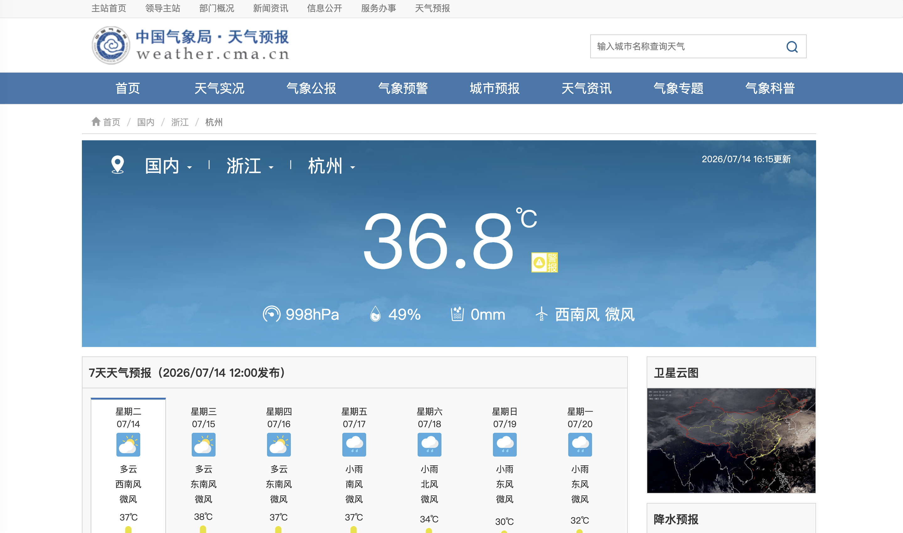

| 属性             | 值                                                                 |
| ---------------- | ------------------------------------------------------------------ |
| **连接器类型**   | `RPA 连接器`                                                       |
| **连接器名称**   | `ODS_中国气象局7天天气预报明细表(通用RPA)`                         |
| **连接器代码**   | `rpa.conn.universal.weather.cma.forecast.detail`                   |
| **操作类型**     | `页面解析`                                                         |
| **目标网页**     | `https://weather.cma.cn/web/weather/58457.html`                    |
| **适用场景**     | 数据源自中国气象局指定城市未来7天天气预报（昼夜天气、气温、风向风力） |
| **数据表名**     | `ods_rpa_universal_weather_cma_forecast_detail_du`                 |
| **业务表名**     | `ODS_中国气象局7天天气预报明细表(通用RPA)`                         |

### 目标页面

> **取数路径**：中国气象局—天气预报—城市预报
>
> **取数链接**：[https://weather.cma.cn/web/weather/58457.html](https://weather.cma.cn/web/weather/58457.html)



### 业务入参

| 字段 | 中文释义 | 数据类型 | 必填 | 默认值 | 说明 |
| ---- | -------- | -------- | ---- | ------ | ---- |
| `province` | 省份 | `String` | 是 | — | 省份中文全称（如 `浙江省`、`内蒙古自治区`，详见下方 `可用省份清单` ） |
| `city` | 城市/区县 | `String` | 是 | — | 城市或区县中文站名；仅支持站名精确匹配（如 `余杭`、`定海`、`杭州`） |

```json collapsed title="可用省份清单"
[
  "北京市",
  "天津市",
  "河北省",
  "山西省",
  "内蒙古自治区",
  "辽宁省",
  "吉林省",
  "黑龙江省",
  "上海市",
  "江苏省",
  "浙江省",
  "安徽省",
  "福建省",
  "江西省",
  "山东省",
  "河南省",
  "湖北省",
  "湖南省",
  "广东省",
  "广西壮族自治区",
  "海南省",
  "重庆市",
  "四川省",
  "贵州省",
  "云南省",
  "西藏自治区",
  "陕西省",
  "甘肃省",
  "青海省",
  "宁夏回族自治区",
  "新疆维吾尔自治区",
  "香港特别行政区",
  "澳门特别行政区",
  "台湾省"
]
```
### 入参样例

浙江省余杭：

```json
{
  "province": "浙江省",
  "city": "余杭"
}
```

江苏省南京：

```json
{
  "province": "江苏省",
  "city": "南京"
}
```

### 入参校验

```json-schema collapsed
{
  "$schema": "https://json-schema.org/draft/2020-12/schema",
  "title": "通用-中国气象局城市7天预报 - 查询入参",
  "description": "采集中国气象局指定城市未来7天天气预报（昼夜天气、气温、风向风力）",
  "type": "object",
  "properties": {
    "province": {
      "type": "string",
      "description": "省份中文全称，须为可用省份清单中的一项",
      "enum": [
        "北京市",
        "天津市",
        "河北省",
        "山西省",
        "内蒙古自治区",
        "辽宁省",
        "吉林省",
        "黑龙江省",
        "上海市",
        "江苏省",
        "浙江省",
        "安徽省",
        "福建省",
        "江西省",
        "山东省",
        "河南省",
        "湖北省",
        "湖南省",
        "广东省",
        "广西壮族自治区",
        "海南省",
        "重庆市",
        "四川省",
        "贵州省",
        "云南省",
        "西藏自治区",
        "陕西省",
        "甘肃省",
        "青海省",
        "宁夏回族自治区",
        "新疆维吾尔自治区",
        "香港特别行政区",
        "澳门特别行政区",
        "台湾省"
      ]
    },
    "city": {
      "type": "string",
      "description": "城市或区县中文站名；仅支持站名精确匹配",
      "minLength": 1
    }
  },
  "required": ["province", "city"],
  "additionalProperties": false
}
```

### 数据字段

每条任务输出该城市 **7 天**预报行（`data[]`）。

| 字段 | 中文释义 | 数据类型 | 可为空 | 取数路径 | 示例 |
| ---- | -------- | -------- | ------ | -------- | ---- |
| `date` | 预报日期 | `String` | 否 | 页面解析 | `2026/07/14` |
| `high` | 最高气温 | `Number` | 否 | 页面解析 | `38.0` |
| `dayText` | 白天天气 | `String` | 否 | 页面解析 | `多云` |
| `dayCode` | 白天天气代码 | `Number` | 否 | 页面解析 | `1` |
| `dayWindDirection` | 白天风向 | `String` | 否 | 页面解析 | `西南风` |
| `dayWindScale` | 白天风力 | `String` | 否 | 页面解析 | `微风` |
| `low` | 最低气温 | `Number` | 否 | 页面解析 | `29.0` |
| `nightText` | 夜间天气 | `String` | 否 | 页面解析 | `多云` |
| `nightCode` | 夜间天气代码 | `Number` | 否 | 页面解析 | `1` |
| `nightWindDirection` | 夜间风向 | `String` | 否 | 页面解析 | `西南风` |
| `nightWindScale` | 夜间风力 | `String` | 否 | 页面解析 | `微风` |
| `province` | 省份 | `String` | 否 | 附加 | `浙江省` |
| `city` | 城市/区县 | `String` | 否 | 附加 | `余杭` |
| `bizDate` | 业务日期 | `String` | 否 | 附加 | `20260714` |
| `accountId` | 授权 ID | `String` | 否 | 附加 | `101` |

### 数据样例

浙江省余杭（`accountId=101`，`bizDate=20260714`）：

```json
[
  {
    "date": "2026/07/14",
    "high": 38.0,
    "dayText": "多云",
    "dayCode": 1,
    "dayWindDirection": "西南风",
    "dayWindScale": "微风",
    "low": 29.0,
    "nightText": "多云",
    "nightCode": 1,
    "nightWindDirection": "西南风",
    "nightWindScale": "微风",
    "province": "浙江省",
    "city": "余杭",
    "bizDate": "20260714",
    "accountId": "101"
  },
  {
    "date": "2026/07/15",
    "high": 38.0,
    "dayText": "多云",
    "dayCode": 1,
    "dayWindDirection": "西南风",
    "dayWindScale": "微风",
    "low": 28.0,
    "nightText": "多云",
    "nightCode": 1,
    "nightWindDirection": "西南风",
    "nightWindScale": "微风",
    "province": "浙江省",
    "city": "余杭",
    "bizDate": "20260714",
    "accountId": "101"
  },
  {
    "date": "2026/07/16",
    "high": 38.0,
    "dayText": "多云",
    "dayCode": 1,
    "dayWindDirection": "西南风",
    "dayWindScale": "微风",
    "low": 28.0,
    "nightText": "多云",
    "nightCode": 1,
    "nightWindDirection": "西南风",
    "nightWindScale": "微风",
    "province": "浙江省",
    "city": "余杭",
    "bizDate": "20260714",
    "accountId": "101"
  },
  {
    "date": "2026/07/17",
    "high": 37.0,
    "dayText": "小雨",
    "dayCode": 7,
    "dayWindDirection": "西南风",
    "dayWindScale": "微风",
    "low": 28.0,
    "nightText": "多云",
    "nightCode": 1,
    "nightWindDirection": "西南风",
    "nightWindScale": "微风",
    "province": "浙江省",
    "city": "余杭",
    "bizDate": "20260714",
    "accountId": "101"
  },
  {
    "date": "2026/07/18",
    "high": 34.0,
    "dayText": "小雨",
    "dayCode": 7,
    "dayWindDirection": "北风",
    "dayWindScale": "微风",
    "low": 24.0,
    "nightText": "中雨",
    "nightCode": 8,
    "nightWindDirection": "西南风",
    "nightWindScale": "微风",
    "province": "浙江省",
    "city": "余杭",
    "bizDate": "20260714",
    "accountId": "101"
  },
  {
    "date": "2026/07/19",
    "high": 31.0,
    "dayText": "小雨",
    "dayCode": 7,
    "dayWindDirection": "东风",
    "dayWindScale": "微风",
    "low": 25.0,
    "nightText": "多云",
    "nightCode": 1,
    "nightWindDirection": "西南风",
    "nightWindScale": "微风",
    "province": "浙江省",
    "city": "余杭",
    "bizDate": "20260714",
    "accountId": "101"
  },
  {
    "date": "2026/07/20",
    "high": 33.0,
    "dayText": "小雨",
    "dayCode": 7,
    "dayWindDirection": "东南风",
    "dayWindScale": "微风",
    "low": 26.0,
    "nightText": "多云",
    "nightCode": 1,
    "nightWindDirection": "西南风",
    "nightWindScale": "微风",
    "province": "浙江省",
    "city": "余杭",
    "bizDate": "20260714",
    "accountId": "101"
  }
]
```

---
