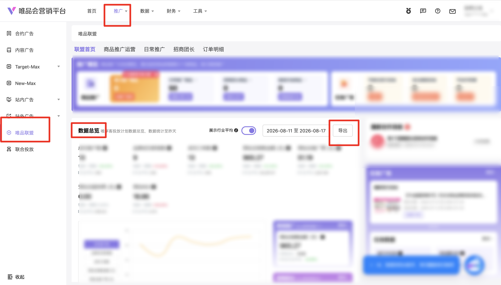

:::references
path: /docs/auth/YUCE_RPA/RPA_WEIPINHUI/YX
mode: summary
badge:
  label: 授权依赖
prompt:
  label: 请提前完成授权配置
  type: warning
:::

| 属性             | 值                                                                                |
| ---------------- | --------------------------------------------------------------------------------- |
| **连接器类型**   | `RPA 连接器`                                                                      |
| **连接器名称**   | `ODS_营销平台唯品联盟数据总览明细表(唯品会RPA)`                                   |
| **连接器代码**   | `rpa.conn.weipinhui.yx.alliance.data.overview`                                     |
| **操作类型**     | `文件导出`                                                                        |
| **目标网页**     | `https://e.vip.com/upgrade.html#/promotion/alliances/wxk`                         |
| **适用场景**     | 导出唯品会营销平台唯品联盟数据总览推广商品报表，支持快捷日期或自定义区间筛选后下载解析 |
| **数据表名**     | `ods_rpa_weipinhui_yx_alliance_data_overview_du`                                  |
| **业务表名**     | `ODS_营销平台唯品联盟数据总览明细表(唯品会RPA)`                                   |

### 目标页面

> **取数路径**：唯品会营销平台—推广—唯品联盟—数据总览
>
> **取数链接**：[https://e.vip.com/upgrade.html#/promotion/alliances/wxk](https://e.vip.com/upgrade.html#/promotion/alliances/wxk)



### 业务入参

| 字段 | 中文释义 | 数据类型 | 必填 | 默认值 | 说明 |
| ---- | -------- | -------- | ---- | ------ | ---- |
| `date_type` | 日期类型 | `String` | 是 | `-` | 允许值：`YESTERDAY`（昨日）/ `LAST_7_DAYS`（近 7 天）/ `LAST_15_DAYS`（近 15 天）/ `LAST_1_MONTH`（近 1 个月）/ `LAST_3_MONTHS`（近 3 个月）/ `CUSTOM`（自定义）。与自定义同时传入时按快捷、忽略自定义 |
| `custom_start_date` | 自定义起始日期 | `String` | 条件必填 | `-` | `date_type` 为 `CUSTOM` 时必填；格式 `YYYYMMDD` 或 `YYYY-MM-DD`；须与 `custom_end_date` 成对；须 ≥ 三年前 1 月 1 日 |
| `custom_end_date` | 自定义结束日期 | `String` | 条件必填 | `-` | `date_type` 为 `CUSTOM` 时必填；格式 `YYYYMMDD` 或 `YYYY-MM-DD`；须与 `custom_start_date` 成对；须 ≤ 昨日；跨度须严格小于三个自然月 |

### 入参样例

```json
{
  "date_type": "LAST_7_DAYS"
}
```

```json
{
  "date_type": "CUSTOM",
  "custom_start_date": "2026-07-01",
  "custom_end_date": "2026-07-31"
}
```

### 入参校验

```json-schema collapsed
{
  "$schema": "https://json-schema.org/draft/2020-12/schema",
  "title": "唯品会-唯品联盟数据总览 - 查询入参",
  "description": "导出唯品会营销平台唯品联盟数据总览推广商品报表，支持快捷日期或自定义区间筛选后下载解析",
  "type": "object",
  "properties": {
    "date_type": {
      "description": "允许值：YESTERDAY（昨日）/ LAST_7_DAYS（近 7 天）/ LAST_15_DAYS（近 15 天）/ LAST_1_MONTH（近 1 个月）/ LAST_3_MONTHS（近 3 个月）/ CUSTOM（自定义）。与自定义同时传入时按快捷、忽略自定义",
      "type": "string",
      "enum": [
        "YESTERDAY",
        "LAST_7_DAYS",
        "LAST_15_DAYS",
        "LAST_1_MONTH",
        "LAST_3_MONTHS",
        "CUSTOM"
      ]
    },
    "custom_start_date": {
      "description": "date_type 为 CUSTOM 时必填。格式 YYYYMMDD 或 YYYY-MM-DD；须与 custom_end_date 成对；须 ≥ 三年前 1 月 1 日",
      "type": "string",
      "pattern": "^(\\d{8}|\\d{4}-\\d{2}-\\d{2})$"
    },
    "custom_end_date": {
      "description": "date_type 为 CUSTOM 时必填。格式 YYYYMMDD 或 YYYY-MM-DD；须与 custom_start_date 成对；须 ≤ 昨日；跨度须严格小于三个自然月",
      "type": "string",
      "pattern": "^(\\d{8}|\\d{4}-\\d{2}-\\d{2})$"
    }
  },
  "required": ["date_type"],
  "additionalProperties": false,
  "allOf": [
    {
      "if": {
        "properties": { "date_type": { "const": "CUSTOM" } },
        "required": ["date_type"]
      },
      "then": {
        "required": ["custom_start_date", "custom_end_date"]
      }
    }
  ]
}
```

### 数据字段

| 字段 | 中文释义 | 数据类型 | 可为空 | 取数路径 | 示例 |
| ---- | -------- | -------- | ------ | -------- | ---- |
| `statDate` | 日期 | `String` | 是 | `XLSX.日期` | `2026-08-10` |
| `leaderName` | 所属团长 | `String` | 是 | `XLSX.所属团长` | `null` |
| `detailUv` | 商详UV数 | `Number` | 是 | `XLSX.商详UV数` | `13` |
| `addCartCount` | 加购数 | `Number` | 是 | `XLSX.加购数` | `4` |
| `dealCustomerCount` | 成交客户数 | `Number` | 是 | `XLSX.成交客户数` | `2` |
| `conversionRate` | 转化率 | `String` | 是 | `XLSX.转化率` | `15.38%` |
| `brandNewCustomerCount` | 品牌成交新客数 | `Number` | 是 | `XLSX.品牌成交新客数` | `1` |
| `dealOrderCount` | 成交订单数 | `Number` | 是 | `XLSX.成交订单数` | `2` |
| `estimatedTotalSalesAmount` | 预估总销售金额（元） | `Number` | 是 | `XLSX.预估总销售金额（元）` | `165.5` |
| `estimatedTotalPromotionFee` | 预估总推广费（元） | `Number` | 是 | `XLSX.预估总推广费（元）` | `11.96` |
| `estimatedTotalServiceFee` | 预估总服务费（元） | `Number` | 是 | `XLSX.预估总服务费（元）` | `0.0` |
| `estimatedRoi` | 预估ROI | `Number` | 是 | `XLSX.预估ROI` | `13.84` |
| `pageStartDate` | 页面开始日期 | `String` | 是 | 页面日期框回读 | `2026-08-10` |
| `pageEndDate` | 页面结束日期 | `String` | 是 | 页面日期框回读 | `2026-08-10` |
| `bizDate` | 业务日期 | `String` | 否 | 附加 | `20260811` |
| `accountId` | 授权 ID | `String` | 否 | 附加 | `1****2` (已脱敏) |

> 导出文件为「唯享客推广商品数据」XLSX（sheet=`推广计划`）。无数据行时仍含完整表头；任务返回 `success=true`、`message=暂无数据`、`data=[]`。

### 数据样例

> 样例来自真实运行（账号窗口实测，`date_type=YESTERDAY`，`message=导出成功，共 1 条`）。

```json
[
  {
    "statDate": "2026-08-10",
    "leaderName": null,
    "detailUv": 13,
    "addCartCount": 4,
    "dealCustomerCount": 2,
    "conversionRate": "15.38%",
    "brandNewCustomerCount": 1,
    "dealOrderCount": 2,
    "estimatedTotalSalesAmount": 165.5,
    "estimatedTotalPromotionFee": 11.96,
    "estimatedTotalServiceFee": 0.0,
    "estimatedRoi": 13.84,
    "pageStartDate": "2026-08-10",
    "pageEndDate": "2026-08-10",
    "bizDate": "20260811",
    "accountId": "1****2"
  }
]
```

---
