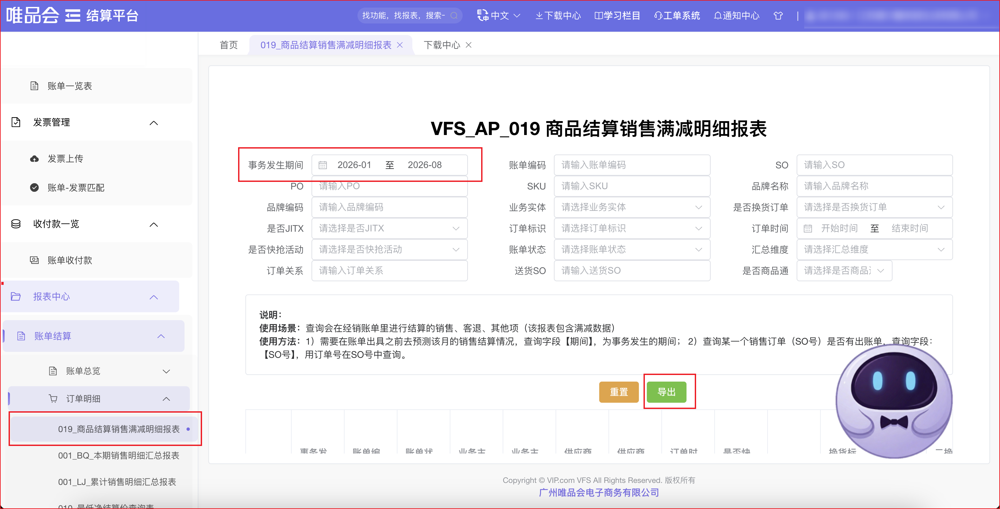

| 属性             | 值                                                                                   |
| ---------------- | ------------------------------------------------------------------------------------ |
| **连接器类型**   | `RPA 连接器`                                                                         |
| **连接器名称**   | `ODS_供应商商品结算销售满减明细表(唯品会RPA)`                                    |
| **连接器代码**   | `rpa.conn.weipinhui.gys.settle.sales`                                                 |
| **操作类型**     | `文件导出`                                                                           |
| **目标网页**     | `https://vfs.vip.com/v3/#/home`                                                      |
| **适用场景**     | 在唯品会供应商结算平台，按事务发生期间导出商品结算销售满减明细报表数据               |
| **数据表名**     | `ods_rpa_weipinhui_gys_settle_sales_du`                                              |
| **业务表名**     | `ODS_供应商商品结算销售满减明细表(唯品会RPA)`                                    |

### 目标页面

> **取数路径**：唯品会供应商结算—报表中心—账单结算—订单明细—019_商品结算销售满减明细报表
>
> **取数链接**：[https://vfs.vip.com/v3/#/home](https://vfs.vip.com/v3/#/home)



### 业务入参

| 字段 | 中文释义 | 数据类型 | 必填 | 默认值 | 说明 |
| ---- | -------- | -------- | ---- | ------ | ---- |
| `custom_start_date` | 事务发生期间开始日 | `String` | 否 | `20260501` | 支持格式：`YYYYMMDD`、`YYYY-MM-DD`；不能晚于 `custom_end_date`；页面按月生效 |
| `custom_end_date` | 事务发生期间结束日 | `String` | 否 | 昨天 | 支持格式：`YYYYMMDD`、`YYYY-MM-DD`；不能早于 `custom_start_date`；页面按月生效 |

### 入参样例

按事务发生期间导出（默认起止可省略）：

```json
{
  "custom_start_date": "20260111",
  "custom_end_date": "20260723"
}
```

仅指定开始日（结束日默认昨天）：

```json
{
  "custom_start_date": "2026-05-01"
}
```

### 入参校验

```json-schema collapsed
{
  "$schema": "https://json-schema.org/draft/2020-12/schema",
  "title": "唯品会-商品结算销售满减明细 - 查询入参",
  "description": "在唯品会供应商结算平台，按事务发生期间导出商品结算销售满减明细报表数据",
  "type": "object",
  "properties": {
    "custom_start_date": {
      "type": "string",
      "description": "事务发生期间开始日。支持 YYYYMMDD 或 YYYY-MM-DD；不能晚于 custom_end_date；页面按月生效",
      "pattern": "^(\\d{4}-\\d{2}-\\d{2}|\\d{8})$",
      "default": "20260501"
    },
    "custom_end_date": {
      "type": "string",
      "description": "事务发生期间结束日。支持 YYYYMMDD 或 YYYY-MM-DD；默认昨天；不能早于 custom_start_date；页面按月生效",
      "pattern": "^(\\d{4}-\\d{2}-\\d{2}|\\d{8})$"
    }
  },
  "required": [],
  "additionalProperties": false
}
```

### 数据字段

每条记录对应导出 XLSX 中的一行商品结算销售满减明细。仅输出映射表字段：Excel 中未映射的列（如空表头）不会出现在结果中；映射表有但 Excel 没有的字段仍会输出，值为空。

| 字段 | 中文释义 | 数据类型 | 可为空 | 取数路径 | 示例 |
| ---- | -------- | -------- | ------ | -------- | ---- |
| `periodName` | 事务发生期间 | `String` | 否 | `XLSX.0.事务发生期间` | `2026-05` |
| `billCode` | 账单编码 | `String` | 否 | `XLSX.0.账单编码` | `VIP****887` (已脱敏) |
| `billStatus` | 账单状态 | `String` | 否 | `XLSX.0.账单状态` | `已出` |
| `bizEntityId` | 业务主体 ID | `Number` | 否 | `XLSX.0.业务主体id` | `8****2` (已脱敏) |
| `bizEntityName` | 业务主体名称 | `String` | 否 | `XLSX.0.业务主体名称` | `唯****机` (已脱敏) |
| `vendorCode` | 供应商编码 | `Number` | 否 | `XLSX.0.供应商编码` | `6****0` (已脱敏) |
| `vendorName` | 供应商名称 | `String` | 否 | `XLSX.0.供应商名称` | `江苏康****公司` (已脱敏) |
| `orderTime` | 订单时间 | `String` | 否 | `XLSX.0.订单时间` | `2026-05-14 13:19:19` |
| `isFlashSale` | 是否快抢活动 | `String` | 否 | `XLSX.0.是否快抢活动` | `是` |
| `orderNo` | 订单号 | `String` | 否 | `XLSX.0.订单号` | `260****624` (已脱敏) |
| `exchangeFlag` | 换货标记 | `String` | 否 | `XLSX.0.换货标记` | `非换货单` |
| `originOrderNo` | 原单号 | `String` | 是 | `XLSX.0.原单号` | — |
| `secondExchangeOriginNo` | 二换原单号 | `String` | 是 | `XLSX.0.二换原单号` | — |
| `poNo` | PO 号 | `Number` | 否 | `XLSX.0.PO号` | `210****625` (已脱敏) |
| `poType` | PO 类型 | `String` | 否 | `XLSX.0.PO类型` | `JIT(分销)` |
| `inventoryAttr` | 库存属性 | `String` | 否 | `XLSX.0.库存属性` | `NORMAL` |
| `brandCode` | 品牌编码 | `Number` | 否 | `XLSX.0.品牌编码` | `100****358` (已脱敏) |
| `brandName` | 品牌名称 | `String` | 否 | `XLSX.0.品牌名称` | `康****馨` (已脱敏) |
| `barcode` | 条码 | `String` | 否 | `XLSX.0.条码` | `A10****711` (已脱敏) |
| `itemNo` | 货号 | `String` | 否 | `XLSX.0.货号` | `A10****201` (已脱敏) |
| `itemName` | 商品名称 | `String` | 否 | `XLSX.0.商品名称` | `五星级****浴巾` (已脱敏) |
| `salesDiscountRate` | 销售折扣比例 | `Number` | 否 | `XLSX.0.销售折扣比例` | `0.3` |
| `priceMode` | 价格模式 | `String` | 否 | `XLSX.0.价格模式` | `销售折扣比例` |
| `otherPriceRefSo` | 其他项取价参考 SO | `String` | 是 | `XLSX.0.其他项取价参考SO` | — |
| `salesQty` | 销售数量 | `Number` | 否 | `XLSX.0.销售数量` | `1` |
| `returnQty` | 客退数量 | `Number` | 否 | `XLSX.0.客退数量` | `0` |
| `taxRate` | 税率 | `Number` | 否 | `XLSX.0.税率` | `0.13` |
| `salesTaxInclUnitPrice` | 销售含税结算单价 | `Number` | 否 | `XLSX.0.销售含税结算单价` | `35.7` |
| `salesTaxInclAmount` | 销售含税结算金额 | `Number` | 否 | `XLSX.0.销售含税结算金额` | `35.7` |
| `returnTaxInclUnitPrice` | 客退含税结算单价 | `Number` | 否 | `XLSX.0.客退含税结算单价` | `0.0` |
| `returnTaxInclAmount` | 客退含税结算金额 | `Number` | 否 | `XLSX.0.客退含税结算金额` | `0.0` |
| `gainQty` | 盘盈数量 | `Number` | 否 | `XLSX.0.盘盈数量` | `0` |
| `gainTaxInclUnitPrice` | 盘盈含税结算单价 | `Number` | 否 | `XLSX.0.盘盈含税结算单价` | `0.0` |
| `gainTaxInclAmount` | 盘盈含税结算金额 | `Number` | 否 | `XLSX.0.盘盈含税结算金额` | `0.0` |
| `lossQty` | 盘亏数量 | `Number` | 否 | `XLSX.0.盘亏数量` | `0` |
| `lossTaxInclUnitPrice` | 盘亏含税结算单价 | `Number` | 否 | `XLSX.0.盘亏含税结算单价` | `0` |
| `lossTaxInclAmount` | 盘亏含税结算金额 | `Number` | 否 | `XLSX.0.盘亏含税结算金额` | `0` |
| `toViQty` | 转 VI 数量 | `Number` | 否 | `XLSX.0.转VI数量` | `0` |
| `toViTaxInclUnitPrice` | 转 VI 含税结算单价 | `Number` | 否 | `XLSX.0.转VI含税结算单价` | `0.0` |
| `toViTaxInclAmount` | 转 VI 含税结算金额 | `Number` | 否 | `XLSX.0.转VI含税结算金额` | `0.0` |
| `otherQtyTotal` | 其他项数量合计 | `Number` | 否 | `XLSX.0.其他项数量合计` | `0` |
| `otherTaxInclAmountTotal` | 其他项含税结算金额合计 | `Number` | 否 | `XLSX.0.其他项含税结算金额合计` | `0` |
| `adjustQtyTotal` | 盘盈亏+转VI+其他调整项数量合计 | `Number` | 否 | `XLSX.0.盘盈亏+转VI+其他调整项数量合计` | `0` |
| `adjustTaxInclAmountTotal` | 盘盈亏+转VI+其他调整项含税金额合计 | `Number` | 否 | `XLSX.0.盘盈亏+转VI+其他调整项含税金额合计` | `0.0` |
| `purchaseSettleQtyTotal` | 采购结算数量合计 | `Number` | 否 | `XLSX.0.采购结算数量合计` | `1` |
| `purchaseTaxInclAmountTotal` | 采购含税结算金额合计 | `Number` | 否 | `XLSX.0.采购含税结算金额合计` | `35.7` |
| `salesFullReduceTotal` | 销售满减总额 | `Number` | 否 | `XLSX.0.销售满减总额` | `0.0` |
| `salesDeductFullReduceAmount` | 销售应扣款满减金额 | `Number` | 否 | `XLSX.0.销售应扣款满减金额` | `0.0` |
| `returnDeductFullReduceAmount` | 客退应扣款满减金额 | `Number` | 否 | `XLSX.0.客退应扣款满减金额` | `0.0` |
| `netDeductFullReduceAmount` | 净扣款满减金额 | `Number` | 否 | `XLSX.0.净扣款满减金额` | `0.0` |
| `salesPriceProtectTotal` | 销售价保总额 | `Number` | 否 | `XLSX.0.销售价保总额` | `0.0` |
| `salesDeductPriceProtectAmount` | 销售应扣款价保金额 | `Number` | 否 | `XLSX.0.销售应扣款价保金额` | `0.0` |
| `returnPriceProtectTotal` | 客退价保总额 | `Number` | 否 | `XLSX.0.客退价保总额` | `0.0` |
| `returnDeductPriceProtectAmount` | 客退应扣款价保金额 | `Number` | 否 | `XLSX.0.客退应扣款价保金额` | `0.0` |
| `netDeductPriceProtectAmount` | 净扣款价保金额 | `Number` | 否 | `XLSX.0.净扣款价保金额` | `0.0` |
| `taxInclSettleAmountTotal` | 含税结算金额总计 | `Number` | 否 | `XLSX.0.含税结算金额总计` | `35.7` |
| `warehouse` | 仓库 | `String` | 否 | `XLSX.0.仓库` | `V****D` (已脱敏) |
| `priceSystemAgreementNo` | 价格系统协议号 | `String` | 否 | `XLSX.0.价格系统协议号` | `TK2****903` (已脱敏) |
| `jitxFlag` | JITX 标识 | `String` | 是 | `XLSX.0.JITX标识` | `JITX` |
| `jitxShipMode` | JITX 发货方式 | `String` | 是 | `XLSX.0.JITX发货方式` | `门店仓发` |
| `orderSpecialCategory` | 订单特殊分类 | `String` | 是 | `XLSX.0.订单特殊分类` | — |
| `specialCategoryPurchaseScheduleId` | 特殊分类对应的采购档期 ID | `String` | 是 | `XLSX.0.特殊分类对应的采购档期ID` | — |
| `specialCategoryRelatedOrderNo` | 特殊分类关联订单号 | `String` | 是 | `XLSX.0.特殊分类关联订单号` | — |
| `orderFlag` | 订单标识 | `String` | 是 | `XLSX.0.订单标识` | — |
| `bizDate` | 业务日期 | `String` | 否 | 附加 | `20260724` |
| `accountId` | 授权 ID | `String` | 否 | 附加 | `1****5` (已脱敏) |

### 数据样例

```json
{
  "periodName": "2026-05",
  "billCode": "VIP****887",
  "billStatus": "已出",
  "bizEntityId": "8****2",
  "bizEntityName": "唯****机",
  "vendorCode": "6****0",
  "vendorName": "江苏康****公司",
  "orderTime": "2026-05-14 13:19:19",
  "isFlashSale": "是",
  "orderNo": "260****624",
  "exchangeFlag": "非换货单",
  "originOrderNo": null,
  "secondExchangeOriginNo": null,
  "poNo": "210****625",
  "poType": "JIT(分销)",
  "inventoryAttr": "NORMAL",
  "brandCode": "100****358",
  "brandName": "康****馨",
  "barcode": "A10****711",
  "itemNo": "A10****201",
  "itemName": "五星级****浴巾",
  "salesDiscountRate": 0.3,
  "priceMode": "销售折扣比例",
  "otherPriceRefSo": null,
  "salesQty": 1,
  "returnQty": 0,
  "taxRate": 0.13,
  "salesTaxInclUnitPrice": 35.7,
  "salesTaxInclAmount": 35.7,
  "returnTaxInclUnitPrice": 0.0,
  "returnTaxInclAmount": 0.0,
  "gainQty": 0,
  "gainTaxInclUnitPrice": 0.0,
  "gainTaxInclAmount": 0.0,
  "lossQty": 0,
  "lossTaxInclUnitPrice": 0,
  "lossTaxInclAmount": 0,
  "toViQty": 0,
  "toViTaxInclUnitPrice": 0.0,
  "toViTaxInclAmount": 0.0,
  "otherQtyTotal": 0,
  "otherTaxInclAmountTotal": 0,
  "adjustQtyTotal": 0,
  "adjustTaxInclAmountTotal": 0.0,
  "purchaseSettleQtyTotal": 1,
  "purchaseTaxInclAmountTotal": 35.7,
  "salesFullReduceTotal": 0.0,
  "salesDeductFullReduceAmount": 0.0,
  "returnDeductFullReduceAmount": 0.0,
  "netDeductFullReduceAmount": 0.0,
  "salesPriceProtectTotal": 0.0,
  "salesDeductPriceProtectAmount": 0.0,
  "returnPriceProtectTotal": 0.0,
  "returnDeductPriceProtectAmount": 0.0,
  "netDeductPriceProtectAmount": 0.0,
  "taxInclSettleAmountTotal": 35.7,
  "warehouse": "V****D",
  "priceSystemAgreementNo": "TK2****903",
  "jitxFlag": "JITX",
  "jitxShipMode": "门店仓发",
  "orderSpecialCategory": null,
  "specialCategoryPurchaseScheduleId": null,
  "specialCategoryRelatedOrderNo": null,
  "orderFlag": null,
  "bizDate": "20260724",
  "accountId": "1****5"
}
```

---
