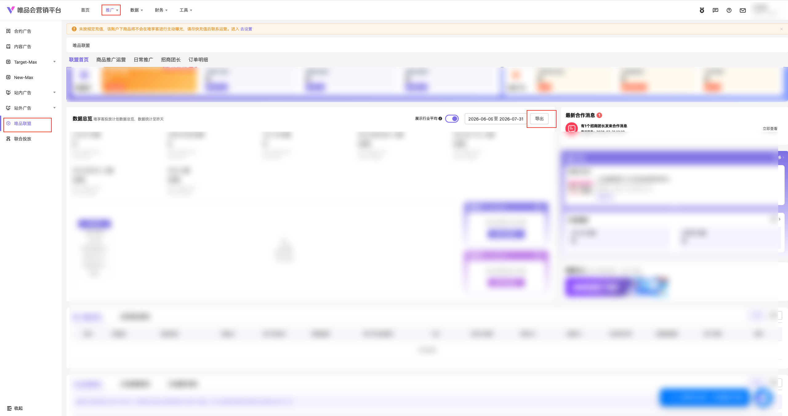

| 属性             | 值                                                                                |
| ---------------- | --------------------------------------------------------------------------------- |
| **连接器类型**   | `RPA 连接器`                                                                      |
| **连接器名称**   | `ODS_营销平台唯品联盟数据总览明细表(唯品会RPA)`                                   |
| **连接器代码**   | `rpa.conn.weipinhui.yx.alliance.data.overview`                                     |
| **操作类型**     | `文件导出`                                                                        |
| **目标网页**     | `https://e.vip.com/upgrade.html#/promotion/alliances/wxk`                         |
| **适用场景**     | 导出唯品会营销平台唯品联盟数据总览推广商品报表，支持快捷日期或自定义区间筛选后下载解析 |
| **数据表名**     | `ods_rpa_weipinhui_yx_alliance_data_overview_du`                                  |
| **业务表名**     | `ODS_营销平台唯品联盟数据总览明细表(唯品会RPA)`                                   |

### 目标页面

> **取数路径**：唯品会营销平台—推广—唯品联盟—数据总览
>
> **取数链接**：[https://e.vip.com/upgrade.html#/promotion/alliances/wxk](https://e.vip.com/upgrade.html#/promotion/alliances/wxk)



### 业务入参

| 字段 | 中文释义 | 数据类型 | 必填 | 默认值 | 说明 |
| ---- | -------- | -------- | ---- | ------ | ---- |
| `date_type` | 日期类型 | `String` | 否 | `—` | 英文 code；与非空自定义起止互斥（同时传入则参数冲突）。可选值：`YESTERDAY`（昨天）/ `LAST_7_DAYS`（最近7天）/ `LAST_15_DAYS`（最近15天）/ `LAST_1_MONTH`（最近1个月）/ `LAST_3_MONTHS`（最近3个月）/ `CUSTOM`（自定义）。不传且起止皆空时，不点选日期，使用页面当前区间 |
| `custom_start_date` | 自定义起始日期 | `String` | 条件必填 | `—` | 仅 `YYYYMMDD` / `YYYY-MM-DD`；须与 `custom_end_date` 成对；`CUSTOM` 或仅传起止时生效；须 ≥ 三年前 1 月 1 日；空串视为未传 |
| `custom_end_date` | 自定义结束日期 | `String` | 条件必填 | `—` | 仅 `YYYYMMDD` / `YYYY-MM-DD`；须与 `custom_start_date` 成对；须 ≤ 昨天；起止跨度须严格小于三个自然月；空串视为未传 |

### 入参样例

快捷「昨天」：

```json
{
  "date_type": "YESTERDAY"
}
```

自定义区间：

```json
{
  "date_type": "CUSTOM",
  "custom_start_date": "2026-07-01",
  "custom_end_date": "2026-07-31"
}
```

仅起止（等价自定义）：

```json
{
  "custom_start_date": "20260701",
  "custom_end_date": "20260731"
}
```

无有效时间（使用页面当前区间）：

```json
{}
```

### 入参校验

```json-schema collapsed
{
  "$schema": "https://json-schema.org/draft/2020-12/schema",
  "title": "唯品会-唯品联盟数据总览 - 查询入参",
  "description": "导出唯品会营销平台唯品联盟数据总览推广商品报表，支持快捷日期或自定义区间筛选后下载解析",
  "type": "object",
  "properties": {
    "date_type": {
      "description": "日期类型英文 code。与非空自定义起止互斥。可选值：YESTERDAY（昨天）/ LAST_7_DAYS（最近7天）/ LAST_15_DAYS（最近15天）/ LAST_1_MONTH（最近1个月）/ LAST_3_MONTHS（最近3个月）/ CUSTOM（自定义）。不传且起止皆空时使用页面当前区间",
      "type": "string",
      "enum": [
        "YESTERDAY",
        "LAST_7_DAYS",
        "LAST_15_DAYS",
        "LAST_1_MONTH",
        "LAST_3_MONTHS",
        "CUSTOM"
      ]
    },
    "custom_start_date": {
      "description": "自定义起始日期，仅 YYYYMMDD 或 YYYY-MM-DD；须与 custom_end_date 成对；CUSTOM 或仅传起止时生效；须 ≥ 三年前1月1日；空串视为未传",
      "type": "string",
      "pattern": "^(\\d{8}|\\d{4}-\\d{2}-\\d{2})$"
    },
    "custom_end_date": {
      "description": "自定义结束日期，仅 YYYYMMDD 或 YYYY-MM-DD；须与 custom_start_date 成对；须 ≤ 昨天；起止跨度须严格小于三个自然月；空串视为未传",
      "type": "string",
      "pattern": "^(\\d{8}|\\d{4}-\\d{2}-\\d{2})$"
    }
  },
  "required": [],
  "additionalProperties": false,
  "allOf": [
    {
      "if": {
        "properties": {
          "date_type": {
            "enum": [
              "YESTERDAY",
              "LAST_7_DAYS",
              "LAST_15_DAYS",
              "LAST_1_MONTH",
              "LAST_3_MONTHS"
            ]
          }
        },
        "required": ["date_type"]
      },
      "then": {
        "not": {
          "anyOf": [
            { "required": ["custom_start_date"] },
            { "required": ["custom_end_date"] }
          ]
        }
      }
    },
    {
      "if": {
        "required": ["custom_start_date"],
        "not": { "required": ["custom_end_date"] }
      },
      "then": {
        "required": ["custom_end_date"]
      }
    },
    {
      "if": {
        "required": ["custom_end_date"],
        "not": { "required": ["custom_start_date"] }
      },
      "then": {
        "required": ["custom_start_date"]
      }
    }
  ]
}
```

### 数据字段

| 字段 | 中文释义 | 数据类型 | 可为空 | 取数路径 | 示例 |
| ---- | -------- | -------- | ------ | -------- | ---- |
| `statDate` | 日期 | `String` | 是 | `XLSX.日期` | `2026-08-10` |
| `leaderName` | 所属团长 | `String` | 是 | `XLSX.所属团长` | — |
| `detailUv` | 商详UV数 | `Number` | 是 | `XLSX.商详UV数` | `0` |
| `addCartCount` | 加购数 | `Number` | 是 | `XLSX.加购数` | `0` |
| `dealCustomerCount` | 成交客户数 | `Number` | 是 | `XLSX.成交客户数` | `0` |
| `conversionRate` | 转化率 | `String` | 是 | `XLSX.转化率` | — |
| `brandNewCustomerCount` | 品牌成交新客数 | `Number` | 是 | `XLSX.品牌成交新客数` | `0` |
| `dealOrderCount` | 成交订单数 | `Number` | 是 | `XLSX.成交订单数` | `0` |
| `estimatedTotalSalesAmount` | 预估总销售金额（元） | `Number` | 是 | `XLSX.预估总销售金额（元）` | `0` |
| `estimatedTotalPromotionFee` | 预估总推广费（元） | `Number` | 是 | `XLSX.预估总推广费（元）` | `0` |
| `estimatedTotalServiceFee` | 预估总服务费（元） | `Number` | 是 | `XLSX.预估总服务费（元）` | `0` |
| `estimatedRoi` | 预估ROI | `Number` | 是 | `XLSX.预估ROI` | `0` |
| `pageStartDate` | 页面开始日期 | `String` | 是 | 页面日期框回读 | `2026-08-10` |
| `pageEndDate` | 页面结束日期 | `String` | 是 | 页面日期框回读 | `2026-08-10` |
| `bizDate` | 业务日期 | `String` | 否 | 附加 | `20260811` |
| `accountId` | 授权 ID | `String` | 否 | 附加 | — |

> 导出文件为「唯享客推广商品数据」XLSX（sheet=`推广计划`）。无数据行时仍含完整表头；任务返回 `success=true`、`message=暂无数据`、`data=[]`。

### 数据样例

```json
[
  {
    "statDate": "2026-08-10",
    "leaderName": "示例团长",
    "detailUv": 100,
    "addCartCount": 10,
    "dealCustomerCount": 5,
    "conversionRate": "5%",
    "brandNewCustomerCount": 2,
    "dealOrderCount": 6,
    "estimatedTotalSalesAmount": 1200.5,
    "estimatedTotalPromotionFee": 36.0,
    "estimatedTotalServiceFee": 12.0,
    "estimatedRoi": 25.0,
    "pageStartDate": "2026-08-10",
    "pageEndDate": "2026-08-10",
    "bizDate": "20260811",
    "accountId": "135"
  }
]
```

> 上表为字段结构样例；当前实测账号区间多为空数据（`data=[]`）。

---
