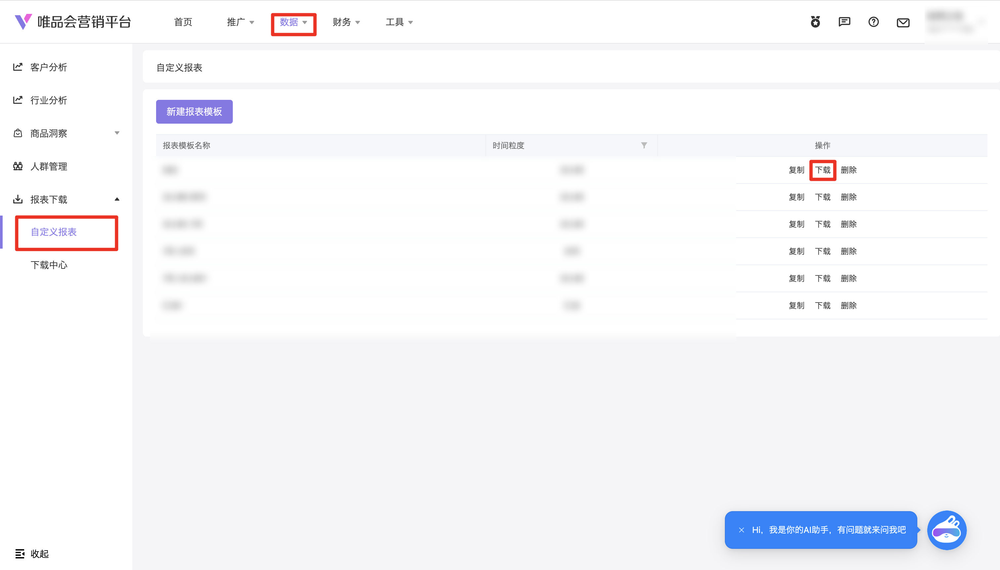

| 属性             | 值                                                                                   |
| ---------------- | ------------------------------------------------------------------------------------ |
| **连接器类型**   | `RPA 连接器`                                                                         |
| **连接器名称**   | `ODS_营销自定义报表下载(唯品会RPA)`                                                  |
| **连接器代码**   | `rpa.conn.weipinhui.yx.custom.report`                                                 |
| **操作类型**     | `文件导出`                                                                           |
| **目标网页**     | `https://e.vip.com/upgrade.html#/data/download/custom-report`                        |
| **适用场景**     | 按报表模板名称与时间粒度匹配唯品会营销平台自定义报表，设置日期后异步导出并解析为行级明细 |
| **数据表名**     | `ods_rpa_weipinhui_yx_custom_report_du`                                               |
| **业务表名**     | `ODS_营销自定义报表下载(唯品会RPA)`                                                  |

### 目标页面

> **取数路径**：唯品会营销平台—数据—下载—自定义报表
>
> **取数链接**：[https://e.vip.com/upgrade.html#/data/download/custom-report](https://e.vip.com/upgrade.html#/data/download/custom-report)



### 业务入参

| 字段 | 中文释义 | 数据类型 | 必填 | 默认值 | 说明 |
| ---- | -------- | -------- | ---- | ------ | ---- |
| `report_template_name` | 报表模板名称 | `String` | 是 | — | 与列表「报表模板名称」列精确匹配；0 条或多条匹配会失败 |
| `time_granularity` | 时间粒度 | `String` | 是 | — | 英文 code。可选值：`HOURLY`（分小时）/ `DAILY`（分天）/ `SUMMARY`（汇总） |
| `date_type` | 日期类型 | `String` | 否 | `YESTERDAY` | 英文 code。快捷优先于自定义：与自定义同时传入时按快捷、忽略自定义。走自定义必须传 `CUSTOM`。不传且起止皆空时默认 `YESTERDAY`。可选值：`YESTERDAY`（昨天）/ `LAST_7_DAYS`（最近7天）/ `LAST_15_DAYS`（最近15天）/ `LAST_1_MONTH`（最近1个月）/ `LAST_3_MONTHS`（最近3个月）/ `CUSTOM`（自定义）。快捷白名单随粒度：`HOURLY` 仅昨天+最近7天；`DAILY`/`SUMMARY` 含全部快捷；三种粒度均可 `CUSTOM` |
| `custom_start_date` | 自定义起始日期 | `String` | 条件必填 | `None` | 仅 `YYYYMMDD` / `YYYY-MM-DD`；须与 `custom_end_date` 成对；**仅** `date_type=CUSTOM` 时生效；须 ≥ 三年前 1 月 1 日；空串视为未传；`HOURLY` 自定义跨度不超过 7 天（含起止） |
| `custom_end_date` | 自定义结束日期 | `String` | 条件必填 | `None` | 仅 `YYYYMMDD` / `YYYY-MM-DD`；须与 `custom_start_date` 成对；**仅** `date_type=CUSTOM` 时生效；须 ≤ 昨天；空串视为未传 |

### 入参样例

分天 + 最近 7 天：

```json
{
  "report_template_name": "投放效果报表",
  "time_granularity": "DAILY",
  "date_type": "LAST_7_DAYS"
}
```

分小时 + 昨天（默认日期）：

```json
{
  "report_template_name": "投放效果报表",
  "time_granularity": "HOURLY"
}
```

自定义区间：

```json
{
  "report_template_name": "投放效果报表",
  "time_granularity": "DAILY",
  "date_type": "CUSTOM",
  "custom_start_date": "2026-07-01",
  "custom_end_date": "2026-07-31"
}
```

快捷优先（同时传自定义会被忽略）：

```json
{
  "report_template_name": "投放效果报表",
  "time_granularity": "SUMMARY",
  "date_type": "LAST_15_DAYS",
  "custom_start_date": "20260701",
  "custom_end_date": "20260731"
}
```

### 入参校验

```json-schema collapsed
{
  "$schema": "https://json-schema.org/draft/2020-12/schema",
  "title": "唯品会-营销自定义报表 - 查询入参",
  "description": "按报表模板名称与时间粒度匹配唯品会营销平台自定义报表，设置日期后异步导出并解析为行级明细",
  "type": "object",
  "properties": {
    "report_template_name": {
      "description": "报表模板名称，与列表「报表模板名称」列精确匹配",
      "type": "string",
      "minLength": 1
    },
    "time_granularity": {
      "description": "时间粒度英文 code。可选值：HOURLY（分小时）/ DAILY（分天）/ SUMMARY（汇总）",
      "type": "string",
      "enum": ["HOURLY", "DAILY", "SUMMARY"]
    },
    "date_type": {
      "description": "日期类型英文 code，默认 YESTERDAY（昨天）。可选值：YESTERDAY（昨天）/ LAST_7_DAYS（最近7天）/ LAST_15_DAYS（最近15天）/ LAST_1_MONTH（最近1个月）/ LAST_3_MONTHS（最近3个月）/ CUSTOM（自定义）。与自定义同时传入时按快捷忽略自定义；走自定义必须传 CUSTOM；不传且起止皆空时按 YESTERDAY。HOURLY 仅允许 YESTERDAY、LAST_7_DAYS、CUSTOM；DAILY/SUMMARY 允许全部快捷与 CUSTOM",
      "type": "string",
      "enum": [
        "YESTERDAY",
        "LAST_7_DAYS",
        "LAST_15_DAYS",
        "LAST_1_MONTH",
        "LAST_3_MONTHS",
        "CUSTOM"
      ]
    },
    "custom_start_date": {
      "description": "自定义起始日期，仅 YYYYMMDD 或 YYYY-MM-DD；须与 custom_end_date 成对；仅 date_type=CUSTOM 时生效；须 ≥ 三年前1月1日；HOURLY 自定义跨度不超过7天；空串视为未传",
      "type": "string",
      "pattern": "^(\\d{8}|\\d{4}-\\d{2}-\\d{2})$"
    },
    "custom_end_date": {
      "description": "自定义结束日期，仅 YYYYMMDD 或 YYYY-MM-DD；须与 custom_start_date 成对；须 ≤ 昨天；空串视为未传",
      "type": "string",
      "pattern": "^(\\d{8}|\\d{4}-\\d{2}-\\d{2})$"
    }
  },
  "required": ["report_template_name", "time_granularity"],
  "additionalProperties": false,
  "allOf": [
    {
      "if": {
        "anyOf": [
          { "required": ["custom_start_date"] },
          { "required": ["custom_end_date"] }
        ],
        "not": { "required": ["date_type"] }
      },
      "then": {
        "required": ["date_type"],
        "properties": {
          "date_type": { "const": "CUSTOM" }
        }
      }
    },
    {
      "if": {
        "properties": { "date_type": { "const": "CUSTOM" } },
        "required": ["date_type"]
      },
      "then": {
        "required": ["custom_start_date", "custom_end_date"]
      }
    },
    {
      "if": {
        "properties": { "time_granularity": { "const": "HOURLY" } },
        "required": ["time_granularity"]
      },
      "then": {
        "properties": {
          "date_type": {
            "enum": ["YESTERDAY", "LAST_7_DAYS", "CUSTOM"]
          }
        }
      }
    }
  ]
}
```

### 数据字段

导出列为模板动态表头：每条 Excel 行对应一条记录，`value` 保留原始中文表头。无数据行时任务返回 `success=true`、`message=暂无数据`、`data=[]`。

| 字段 | 中文释义 | 数据类型 | 可为空 | 取数路径 | 示例 |
| ---- | -------- | -------- | ------ | -------- | ---- |
| `id` | 行序号 | `Number` | 否 | 序号从 1 递增 | `1` |
| `value` | 报表行数据 | `Dict` | 否 | `XLSX` 行记录（原始表头） | 见数据样例 `value` |
| `taskId` | 任务 ID | `String` | 否 | 附加 | `dev****03f` (已脱敏) |
| `bizDate` | 业务日期 | `String` | 否 | 附加 | `20260818` |
| `accountId` | 授权 ID | `String` | 否 | 附加 | `1****3` (已脱敏) |

> 样例模板常见列含：`日期`、`投放资源`、`推广计划名称`、`广告名称`、`出价方式`、`竞价类型`、`花费`、`曝光量`、`点击量`、`点击率`、各类 ROI/UV/成交指标等；实际字段以所选报表模板为准。

### 数据样例

> 样例来自真实运行（`message=下载成功，共 5 条`，分天 + 最近 7 天）。`value` 内推广计划名称等主体名称已脱敏；表头随模板变化，以下为实测首行完整字段。

```json
[
  {
    "id": 1,
    "value": {
      "日期": "2026.08.15",
      "投放资源": "Target-Max",
      "推广计划名称": "****",
      "广告名称": null,
      "出价方式": "OCPA",
      "竞价类型": "RTB",
      "广告形式": null,
      "投放模式": null,
      "投放商品": null,
      "投放站点": null,
      "花费": "0",
      "曝光量": "0",
      "点击量": "0",
      "点击率": "0",
      "千次曝光均价": "0",
      "点击均价": "0",
      "24小时下单ROI": "0",
      "14天下单ROI": "0",
      "唤起UV": "0",
      "唤起UV成本": "0",
      "唤起PV": "0",
      "唤起率": "0",
      "APP端UV": "0",
      "APP端UV成本": "0",
      "小程序UV": "0",
      "小程序UV成本": "0",
      "商品详情页UV": "0",
      "品牌UV": "0",
      "24小时收藏数": "0",
      "24小时加购数": "0",
      "24小时加购成本": "0",
      "24小时下单客户数": "0",
      "24小时下单量": "0",
      "24小时下单成本": "0",
      "24小时订单额": "0",
      "24小时成交客户数": "0",
      "24小时成交新客数": "0",
      "24小时成交单量": "0",
      "24小时销售额": "0",
      "24小时成交ROI": "0",
      "24小时成交成本": "0",
      "14天收藏数": "0",
      "14天加购数": "1",
      "14天下单客户数": "0",
      "14天下单量": "0",
      "14天下单成本": "0",
      "14天订单额": "0",
      "14天成交客户数": "0",
      "14天成交新客数": "0",
      "14天成交单量": "0",
      "14天销售额": "0",
      "14天成交ROI": "0",
      "24小时商品收藏数": "0",
      "24小时商品加购数": "0",
      "24小时商品加购成本": "0",
      "24小时商品下单客户数": "0",
      "24小时商品下单量": "0",
      "24小时商品下单成本": "0",
      "24小时商品订单额": "0",
      "24小时商品下单ROI": "0",
      "24小时商品成交客户数": "0",
      "24小时商品成交新客数": "0",
      "24小时商品成交单量": "0",
      "24小时商品销售额": "0",
      "24小时商品成交ROI": "0",
      "14天商品收藏数": "0",
      "14天商品加购数": "1",
      "14天商品下单客户数": "0",
      "14天商品下单量": "0",
      "14天商品下单成本": "0",
      "14天商品订单额": "0",
      "14天商品下单ROI": "0",
      "14天商品成交客户数": "0",
      "14天商品成交新客数": "0",
      "14天商品成交单量": "0",
      "14天商品销售额": "0",
      "14天商品成交ROI": "0",
      "24小时下单历史未购新客数（商家）": "0",
      "24小时成交历史未购新客数（商家）": "0",
      "24小时下单-历史未购新客成本（商家）": "0",
      "24小时成交-历史未购新客成本（商家）": "0",
      "14天下单历史未购新客数（商家）": "0",
      "14天成交历史未购新客数（商家）": "0",
      "14天下单-历史未购新客成本（商家）": "0",
      "14天成交-历史未购新客成本（商家）": "0",
      "24小时下单历史未购新客数（商品）": "0",
      "24小时成交历史未购新客数（商品）": "0",
      "24小时下单-历史未购新客成本（商品）": "0",
      "24小时成交-历史未购新客成本（商品）": "0",
      "14天下单历史未购新客数（商品）": "0",
      "14天成交历史未购新客数（商品）": "0",
      "14天下单-历史未购新客成本（商品）": "0",
      "14天成交-历史未购新客成本（商品）": "0"
    },
    "taskId": "dev****03f",
    "bizDate": "20260818",
    "accountId": "1****3"
  }
]
```

---
