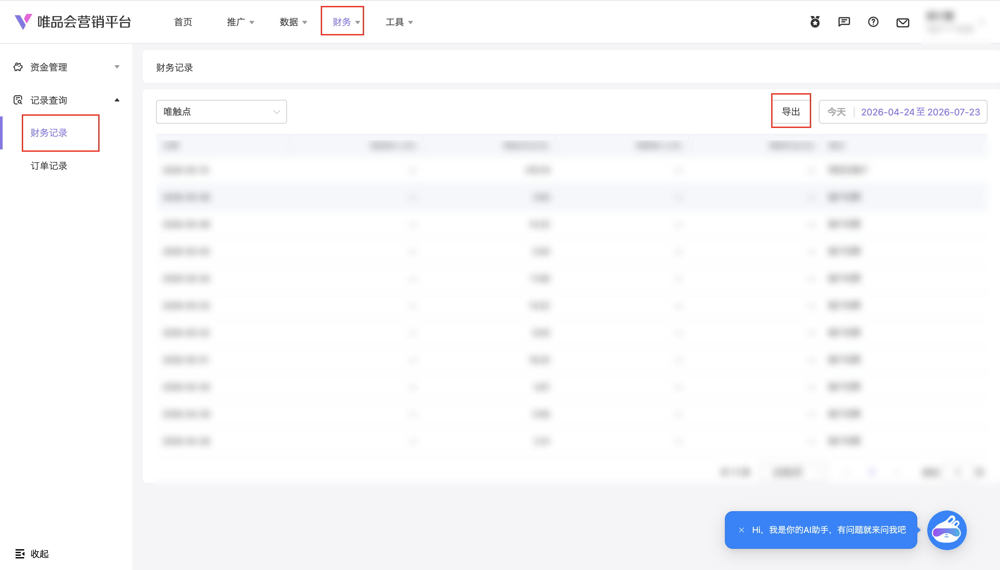

| 属性             | 值                                                                                |
| ---------------- | --------------------------------------------------------------------------------- |
| **连接器类型**   | `RPA 连接器`                                                                      |
| **连接器名称**   | `ODS_营销平台财务记录明细表(唯品会RPA)`                                         |
| **连接器代码**   | `rpa.conn.weipinhui.yx.finance.records`                                            |
| **操作类型**     | `文件导出`                                                                        |
| **目标网页**     | `https://e.vip.com/upgrade.html#/finance/records/records`                         |
| **适用场景**     | 导出唯品会营销平台财务记录流水，支持按账户渠道与日期范围筛选后下载解析             |
| **数据表名**     | `ods_rpa_weipinhui_yx_finance_records_du`                                         |
| **业务表名**     | `ODS_营销平台财务记录明细表(唯品会RPA)`                                         |

### 目标页面

> **取数路径**：唯品会营销平台—财务—记录查询—财务记录
>
> **取数链接**：[https://e.vip.com/upgrade.html#/finance/records/records](https://e.vip.com/upgrade.html#/finance/records/records)



### 业务入参

| 字段 | 中文释义 | 数据类型 | 必填 | 默认值 | 说明 |
| ---- | -------- | -------- | ---- | ------ | ---- |
| `biz_channel` | 账户渠道 | `String` | 否 | `WEI_ZHIDA` | 仅接受英文 code（大小写不敏感，入参会转大写）；不传默认唯直达。可选值：`MAIN_ACCOUNT`（主账户）/ `TARGET_MAX`（Target-Max）/ `NEW_MAX`（New-Max）/ `WEI_ZHIZHAN`（唯智展）/ `WEI_CHUDIAN`（唯触点）/ `WEI_ZHIDA`（唯直达）/ `TENCENT_ADS`（腾讯广告）/ `OCEAN_ENGINE`（巨量引擎）/ `MOBILE_SELECT`（移动精选）/ `WEI_XIANGKE`（唯享客）/ `OFFLINE_DIRECT`（线下直投） |
| `custom_start_date` | 查询起始日期 | `String` | 否 | `2026-05-01` | 仅 `YYYYMMDD` / `YYYY-MM-DD`（月日两位补零，如 `2026-06-02`）；须 ≤ `custom_end_date`；拒绝 `2026-06-2`、`2026/06/02` |
| `custom_end_date` | 查询结束日期 | `String` | 否 | 今天 | 仅 `YYYYMMDD` / `YYYY-MM-DD`（月日须两位补零）；须 ≥ `custom_start_date` 且 ≤ 今天（允许起止同一天） |

### 入参样例

按账户渠道与日期区间导出：

```json
{
  "biz_channel": "WEI_ZHIDA",
  "custom_start_date": "2026-07-01",
  "custom_end_date": "2026-07-27"
}
```

单日查询（主账户）：

```json
{
  "biz_channel": "MAIN_ACCOUNT",
  "custom_start_date": "20260720",
  "custom_end_date": "20260720"
}
```

默认渠道（唯直达）仅改日期：

```json
{
  "custom_start_date": "2026-05-01",
  "custom_end_date": "2026-07-27"
}
```

### 入参校验

```json-schema collapsed
{
  "$schema": "https://json-schema.org/draft/2020-12/schema",
  "title": "唯品会-财务记录 - 查询入参",
  "description": "导出唯品会营销平台财务记录流水，支持按账户渠道与日期范围筛选后下载解析",
  "type": "object",
  "properties": {
    "biz_channel": {
      "description": "账户渠道。仅接受英文 code（大小写不敏感）；不传默认 WEI_ZHIDA（唯直达）。可选值：MAIN_ACCOUNT（主账户）/ TARGET_MAX（Target-Max）/ NEW_MAX（New-Max）/ WEI_ZHIZHAN（唯智展）/ WEI_CHUDIAN（唯触点）/ WEI_ZHIDA（唯直达）/ TENCENT_ADS（腾讯广告）/ OCEAN_ENGINE（巨量引擎）/ MOBILE_SELECT（移动精选）/ WEI_XIANGKE（唯享客）/ OFFLINE_DIRECT（线下直投）",
      "type": "string",
      "enum": [
        "MAIN_ACCOUNT",
        "TARGET_MAX",
        "NEW_MAX",
        "WEI_ZHIZHAN",
        "WEI_CHUDIAN",
        "WEI_ZHIDA",
        "TENCENT_ADS",
        "OCEAN_ENGINE",
        "MOBILE_SELECT",
        "WEI_XIANGKE",
        "OFFLINE_DIRECT"
      ],
      "default": "WEI_ZHIDA"
    },
    "custom_start_date": {
      "description": "查询起始日期，仅 YYYYMMDD 或 YYYY-MM-DD（月日须两位补零）；须 ≤ custom_end_date；默认 2026-05-01；拒绝 2026-06-2、2026/06/02",
      "type": "string",
      "pattern": "^(\\d{8}|\\d{4}-\\d{2}-\\d{2})$",
      "default": "2026-05-01"
    },
    "custom_end_date": {
      "description": "查询结束日期，仅 YYYYMMDD 或 YYYY-MM-DD（月日须两位补零）；须 ≥ custom_start_date 且 ≤ 今天（允许起止同一天）；默认今天",
      "type": "string",
      "pattern": "^(\\d{8}|\\d{4}-\\d{2}-\\d{2})$"
    }
  },
  "required": [],
  "additionalProperties": false
}
```

### 数据字段

| 字段 | 中文释义 | 数据类型 | 可为空 | 取数路径 | 示例 |
| ---- | -------- | -------- | ------ | -------- | ---- |
| `accountName` | 账户 | `String` | 是 | `XLSX.0.账户` | `子账号****直达)` (已脱敏) |
| `recordDate` | 日期 | `String` | 是 | `XLSX.0.日期` | `2026-07-21` |
| `cashIncome` | 现金收入(元) | `Number` | 是 | `XLSX.0.现金收入(元)` | `0` |
| `cashExpense` | 现金支出(元) | `Number` | 是 | `XLSX.0.现金支出(元)` | `310.11` |
| `rewardIncome` | 奖励收入(元) | `Number` | 是 | `XLSX.0.奖励收入(元)` | `0` |
| `rewardExpense` | 奖励支出(元) | `Number` | 是 | `XLSX.0.奖励支出(元)` | `0` |
| `remark` | 备注 | `String` | 是 | `XLSX.0.备注` | `账户扣费` |
| `bizDate` | 业务日期 | `String` | 否 | 附加 | `20260727` |
| `accountId` | 授权 ID | `String` | 否 | 附加 | `1****8` (已脱敏) |

### 数据样例

> 实测样例来自账号 `128`（任务 `dev-0-5a2d610e`）、默认区间至 `2026-07-27`、渠道唯直达，导出成功共 **485** 条；下列为首行脱敏样例。

```json
{
  "accountName": "子账号****直达)",
  "recordDate": "2026-07-21",
  "cashIncome": 0.0,
  "cashExpense": 310.11,
  "rewardIncome": 0.0,
  "rewardExpense": 0.0,
  "remark": "账户扣费",
  "bizDate": "20260727",
  "accountId": "1****8"
}
```

---
