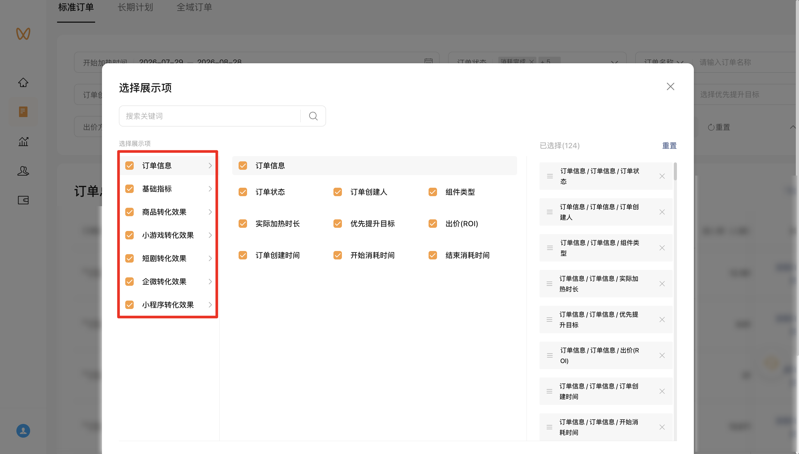

| 属性             | 值                                                                 |
| ---------------- | ------------------------------------------------------------------ |
| **连接器类型**   | `RPA 连接器`                                                       |
| **连接器名称**   | `ODS_视频号加热平台标准订单明细报表(微信视频号RPA)`                 |
| **连接器代码**   | `rpa.conn.weixin.sphjr.standard.order.report`                       |
| **操作类型**     | `文件导出`                                                         |
| **目标网页**     | `https://channels.weixin.qq.com/promote/pages/platform/order-list?tab=standard` |
| **适用场景**     | 导出视频号加热平台「标准订单」明细 CSV，筛选后自动全选展示项再下载 |
| **数据表名**     | `ods_rpa_weixin_sphjr_standard_order_report_du`                     |
| **业务表名**     | `ODS_视频号加热平台标准订单明细报表(微信视频号RPA)`                 |

### 目标页面

> **取数路径**：视频号加热平台—推广订单—标准订单
>
> **取数链接**：[https://channels.weixin.qq.com/promote/pages/platform/order-list?tab=standard](https://channels.weixin.qq.com/promote/pages/platform/order-list?tab=standard)




### 业务入参

| 字段 | 中文释义 | 数据类型 | 必填 | 默认值 | 说明 |
| ---- | -------- | -------- | ---- | ------ | ---- |
| `heat_custom_start_date` | 开始加热时间-起始 | `String` | 否 | — | 支持 `YYYYMMDD` / `YYYY-MM-DD`；须与 `heat_custom_end_date` **成对传入**；**均不传则跳过**该筛选项；不得晚于结束日期 |
| `heat_custom_end_date` | 开始加热时间-结束 | `String` | 否 | — | 支持 `YYYYMMDD` / `YYYY-MM-DD`；须与 `heat_custom_start_date` **成对传入**；**均不传则跳过**该筛选项；不得早于起始日期 |
| `create_custom_start_date` | 订单创建时间-起始 | `String` | 是 | — | 支持 `YYYYMMDD` / `YYYY-MM-DD`；不得晚于 `create_custom_end_date` |
| `create_custom_end_date` | 订单创建时间-结束 | `String` | 是 | — | 支持 `YYYYMMDD` / `YYYY-MM-DD`；不得早于 `create_custom_start_date` |
| `bid_methods` | 出价方式 | `String` / `List[String]` | 否 | — | 不传则不设置该筛选项默认就是全选。支持英文逗号分隔字符串或字符串数组。可选值：`ALL`（全选）、`VOLUME_HEATING`（放量加热）、`COST_CONTROL_HEATING`（控成本加热）。含 `ALL` 时按全选处理，忽略其它值 |
| `heating_types` | 加热类型 | `String` / `List[String]` | 否 | — | 不传则不设置该筛选项默认全选。支持英文逗号分隔字符串或字符串数组。可选值：`ALL`（全选）、`LIVE`（直播）、`SHORT_VIDEO`（短视频）、`PRODUCT`（商品）。含 `ALL` 时按全选处理，忽略其它值 |
| `order_statuses` | 订单状态 | `String` / `List[String]` | 否 | — | 不传则不设置该筛选项默认全选。支持英文逗号分隔字符串或字符串数组。可选值：`PENDING_PAYMENT`（待支付）、`UNDER_REVIEW`（审核中）、`REVIEW_FAILED`（审核未通过）、`PENDING_HEAT`（待加热）、`CANCELLED`（已取消，父级）、`UNPAID_CLOSED`（未支付关单）、`RESERVATION_INVALID`（预约失效）、`RESERVATION_EXPIRED`（预约过期）、`HEATING`（加热中）、`PAUSED`（已暂停）、`REFUNDING`（退款中）、`SETTLING`（结算中）、`ENDED`（已结束，父级）、`CONSUMPTION_COMPLETED`（消耗完成）、`MAX_DURATION_REACHED`（达到最大加热时长）、`LIVE_ENDED`（直播结束）、`ACTIVE_CANCEL`（主动取消）、`ORDER_CIRCUIT_BREAK`（订单熔断）、`OTHER`（其他）。父级 `CANCELLED` / `ENDED` 与子级同传时只勾父级 |

### 入参样例

仅必填订单创建时间（不传开始加热时间，该筛选项跳过）：

```json
{
  "create_custom_start_date": "2026-08-01",
  "create_custom_end_date": "2026-08-28"
}
```

同时指定开始加热时间与订单创建时间：

```json
{
  "heat_custom_start_date": "2026-08-01",
  "heat_custom_end_date": "2026-08-28",
  "create_custom_start_date": "2026-08-01",
  "create_custom_end_date": "2026-08-28"
}
```

全选出价方式与加热类型，并筛选加热中订单（`YYYYMMDD`；多选亦可用英文逗号分隔字符串）：

```json
{
  "heat_custom_start_date": "20260801",
  "heat_custom_end_date": "20260828",
  "create_custom_start_date": "20260801",
  "create_custom_end_date": "20260828",
  "bid_methods": ["ALL"],
  "heating_types": ["ALL"],
  "order_statuses": ["HEATING"]
}
```

### 入参校验

```json-schema collapsed
{
  "$schema": "https://json-schema.org/draft/2020-12/schema",
  "title": "视频号加热-标准订单明细 - 查询入参",
  "description": "导出视频号加热平台「标准订单」明细 CSV；订单创建时间必填，开始加热时间可选；筛选后自动全选展示项再下载",
  "type": "object",
  "properties": {
    "heat_custom_start_date": {
      "description": "开始加热时间-起始。支持 YYYYMMDD 或 YYYY-MM-DD；须与 heat_custom_end_date 成对传入，均不传则跳过该筛选项；不得晚于 heat_custom_end_date",
      "type": "string",
      "pattern": "^(\\d{8}|\\d{4}-\\d{2}-\\d{2})$"
    },
    "heat_custom_end_date": {
      "description": "开始加热时间-结束。支持 YYYYMMDD 或 YYYY-MM-DD；须与 heat_custom_start_date 成对传入，均不传则跳过该筛选项；不得早于 heat_custom_start_date",
      "type": "string",
      "pattern": "^(\\d{8}|\\d{4}-\\d{2}-\\d{2})$"
    },
    "create_custom_start_date": {
      "description": "订单创建时间-起始。支持 YYYYMMDD 或 YYYY-MM-DD；不得晚于 create_custom_end_date",
      "type": "string",
      "pattern": "^(\\d{8}|\\d{4}-\\d{2}-\\d{2})$"
    },
    "create_custom_end_date": {
      "description": "订单创建时间-结束。支持 YYYYMMDD 或 YYYY-MM-DD；不得早于 create_custom_start_date",
      "type": "string",
      "pattern": "^(\\d{8}|\\d{4}-\\d{2}-\\d{2})$"
    },
    "bid_methods": {
      "description": "出价方式多选。支持英文逗号分隔字符串或字符串数组。可选值：ALL（全选）、VOLUME_HEATING（放量加热）、COST_CONTROL_HEATING（控成本加热）；含 ALL 时按全选处理，忽略其它值。不传则不设置该筛选项",
      "oneOf": [
        {
          "type": "string"
        },
        {
          "type": "array",
          "items": {
            "type": "string",
            "enum": ["ALL", "VOLUME_HEATING", "COST_CONTROL_HEATING"]
          },
          "uniqueItems": true
        }
      ]
    },
    "heating_types": {
      "description": "加热类型多选。支持英文逗号分隔字符串或字符串数组。可选值：ALL（全选）、LIVE（直播）、SHORT_VIDEO（短视频）、PRODUCT（商品）；含 ALL 时按全选处理，忽略其它值。不传则不设置该筛选项",
      "oneOf": [
        {
          "type": "string"
        },
        {
          "type": "array",
          "items": {
            "type": "string",
            "enum": ["ALL", "LIVE", "SHORT_VIDEO", "PRODUCT"]
          },
          "uniqueItems": true
        }
      ]
    },
    "order_statuses": {
      "description": "订单状态多选。支持英文逗号分隔字符串或字符串数组。可选值：PENDING_PAYMENT（待支付）、UNDER_REVIEW（审核中）、REVIEW_FAILED（审核未通过）、PENDING_HEAT（待加热）、CANCELLED（已取消，父级）、UNPAID_CLOSED（未支付关单）、RESERVATION_INVALID（预约失效）、RESERVATION_EXPIRED（预约过期）、HEATING（加热中）、PAUSED（已暂停）、REFUNDING（退款中）、SETTLING（结算中）、ENDED（已结束，父级）、CONSUMPTION_COMPLETED（消耗完成）、MAX_DURATION_REACHED（达到最大加热时长）、LIVE_ENDED（直播结束）、ACTIVE_CANCEL（主动取消）、ORDER_CIRCUIT_BREAK（订单熔断）、OTHER（其他）。父级 CANCELLED / ENDED 与子级同传时只勾父级。不传则不设置该筛选项",
      "oneOf": [
        {
          "type": "string"
        },
        {
          "type": "array",
          "items": {
            "type": "string",
            "enum": [
              "PENDING_PAYMENT",
              "UNDER_REVIEW",
              "REVIEW_FAILED",
              "PENDING_HEAT",
              "CANCELLED",
              "UNPAID_CLOSED",
              "RESERVATION_INVALID",
              "RESERVATION_EXPIRED",
              "HEATING",
              "PAUSED",
              "REFUNDING",
              "SETTLING",
              "ENDED",
              "CONSUMPTION_COMPLETED",
              "MAX_DURATION_REACHED",
              "LIVE_ENDED",
              "ACTIVE_CANCEL",
              "ORDER_CIRCUIT_BREAK",
              "OTHER"
            ]
          },
          "uniqueItems": true
        }
      ]
    }
  },
  "required": [
    "create_custom_start_date",
    "create_custom_end_date"
  ],
  "additionalProperties": false
}
```

### 数据字段


| 字段 | 中文释义 | 数据类型 | 可为空 | 取数路径 | 示例 |
| ---- | -------- | -------- | ------ | -------- | ---- |
| `orderStatus` | 订单状态 | `String` | 是 | `CSV.0.订单状态` | 加热中 |
| `orderCreator` | 订单创建人 | `String` | 是 | `CSV.0.订单创建人` | **** (已脱敏) |
| `componentType` | 组件类型 | `String` | 是 | `CSV.0.组件类型` | — |
| `actualHeatDuration` | 实际加热时长 | `String` | 是 | `CSV.0.实际加热时长` | 6小时9分钟 |
| `priorityBoostTarget` | 优先提升目标 | `String` | 是 | `CSV.0.优先提升目标` | — |
| `bidRoi` | 出价(ROI) | `String` | 是 | `CSV.0.出价(ROI)` | ¥60 |
| `orderCreateTime` | 订单创建时间 | `String` | 是 | `CSV.0.订单创建时间` | — |
| `consumeStartTime` | 开始消耗时间 | `String` | 是 | `CSV.0.开始消耗时间` | — |
| `consumeEndTime` | 结束消耗时间 | `String` | 是 | `CSV.0.结束消耗时间` | — |
| `deliveryProgress` | 投放进度 | `String` | 是 | `CSV.0.投放进度` | ¥11.19 / ¥500 |
| `subsidyAmount` | 补贴金额 | `String` | 是 | `CSV.0.补贴金额` | ¥0 |
| `newFollowCount` | 新增关注数 | `String` | 是 | `CSV.0.新增关注数` | 0 |
| `commentCount` | 评论数 | `String` | 是 | `CSV.0.评论数` | — |
| `avgCpm` | 平均千次展示费用 | `String` | 是 | `CSV.0.平均千次展示费用` | ¥414.44 |
| `heartLikeCount` | 爱心赞数 | `String` | 是 | `CSV.0.爱心赞数` | — |
| `thumbLikeCount` | 拇指赞数 | `String` | 是 | `CSV.0.拇指赞数` | — |
| `completionRate` | 完播率 | `String` | 是 | `CSV.0.完播率` | — |
| `shareCount` | 转发数 | `String` | 是 | `CSV.0.转发数` | — |
| `playCount` | 播放数 | `String` | 是 | `CSV.0.播放数` | — |
| `shortVideoAvgCpm` | 短视频平均千次展示费用 | `String` | 是 | `CSV.0.短视频平均千次展示费用` | — |
| `exposureUv` | 曝光人数 | `String` | 是 | `CSV.0.曝光人数` | — |
| `watchUv` | 观看人数 | `String` | 是 | `CSV.0.观看人数` | — |
| `watchPv` | 观看人次 | `String` | 是 | `CSV.0.观看人次` | — |
| `enterRateUv` | 进入率（人数） | `String` | 是 | `CSV.0.进入率（人数）` | — |
| `enterRatePv` | 进入率（人次） | `String` | 是 | `CSV.0.进入率（人次）` | — |
| `watchOver1MinPv` | 超过1分钟观看人次 | `String` | 是 | `CSV.0.超过1分钟观看人次` | — |
| `likeCount` | 点赞数 | `String` | 是 | `CSV.0.点赞数` | — |
| `rewardCount` | 打赏次数 | `String` | 是 | `CSV.0.打赏次数` | — |
| `exposurePv` | 曝光人次 | `String` | 是 | `CSV.0.曝光人次` | — |
| `liveAvgCpm` | 直播间平均千次展示费用 | `String` | 是 | `CSV.0.直播间平均千次展示费用` | — |
| `productExposureCount` | 商品曝光次数 | `String` | 是 | `CSV.0.商品曝光次数` | — |
| `productClickCount` | 商品点击次数 | `String` | 是 | `CSV.0.商品点击次数` | — |
| `productClickRate` | 商品点击率 | `String` | 是 | `CSV.0.商品点击率` | — |
| `productClickCost` | 商品点击成本 | `String` | 是 | `CSV.0.商品点击成本` | — |
| `cpmWatchGmv` | 千次观看成交金额 | `String` | 是 | `CSV.0.千次观看成交金额` | — |
| `directOrderCount` | 直接下单订单数 | `String` | 是 | `CSV.0.直接下单订单数` | — |
| `directOrderAmount` | 直接下单金额 | `String` | 是 | `CSV.0.直接下单金额` | — |
| `directOrderRoi` | 直接下单ROI | `String` | 是 | `CSV.0.直接下单ROI` | — |
| `directDealOrderCount` | 直接成交订单数 | `String` | 是 | `CSV.0.直接成交订单数` | — |
| `directGmv` | 直接成交金额 | `String` | 是 | `CSV.0.直接成交金额` | ¥0 |
| `directRoi` | 直接成交ROI | `String` | 是 | `CSV.0.直接成交ROI` | 0 |
| `sameSessionOrderCount` | 当场下单订单数 | `String` | 是 | `CSV.0.当场下单订单数` | — |
| `sameSessionOrderAmount` | 当场下单金额 | `String` | 是 | `CSV.0.当场下单金额` | — |
| `sameSessionOrderRoi` | 当场下单ROI | `String` | 是 | `CSV.0.当场下单ROI` | — |
| `sameSessionDealCount` | 当场成交订单数 | `String` | 是 | `CSV.0.当场成交订单数` | — |
| `sameSessionGmv` | 当场成交金额 | `String` | 是 | `CSV.0.当场成交金额` | — |
| `sameSessionRoi` | 当场成交ROI | `String` | 是 | `CSV.0.当场成交ROI` | — |
| `day7OrderCount` | 7日下单订单数 | `String` | 是 | `CSV.0.7日下单订单数` | — |
| `day7OrderAmount` | 7日下单金额 | `String` | 是 | `CSV.0.7日下单金额` | — |
| `day7OrderRoi` | 7日下单ROI | `String` | 是 | `CSV.0.7日下单ROI` | — |
| `day7DealCount` | 7日成交订单数 | `String` | 是 | `CSV.0.7日成交订单数` | — |
| `day7Gmv` | 7日成交金额 | `String` | 是 | `CSV.0.7日成交金额` | — |
| `day7Roi` | 7日成交ROI | `String` | 是 | `CSV.0.7日成交ROI` | — |
| `day14OrderCount` | 14日下单订单数 | `String` | 是 | `CSV.0.14日下单订单数` | — |
| `day14OrderAmount` | 14日下单金额 | `String` | 是 | `CSV.0.14日下单金额` | — |
| `day14OrderRoi` | 14日下单ROI | `String` | 是 | `CSV.0.14日下单ROI` | — |
| `day14DealCount` | 14日成交订单数 | `String` | 是 | `CSV.0.14日成交订单数` | — |
| `day14Gmv` | 14日成交金额 | `String` | 是 | `CSV.0.14日成交金额` | — |
| `day14Roi` | 14日成交ROI | `String` | 是 | `CSV.0.14日成交ROI` | — |
| `day30OrderCount` | 30日下单订单数 | `String` | 是 | `CSV.0.30日下单订单数` | — |
| `day30OrderAmount` | 30日下单金额 | `String` | 是 | `CSV.0.30日下单金额` | — |
| `day30OrderRoi` | 30日下单ROI | `String` | 是 | `CSV.0.30日下单ROI` | — |
| `day30DealCount` | 30日成交订单数 | `String` | 是 | `CSV.0.30日成交订单数` | — |
| `day30Gmv` | 30日成交金额 | `String` | 是 | `CSV.0.30日成交金额` | — |
| `day30Roi` | 30日成交ROI | `String` | 是 | `CSV.0.30日成交ROI` | — |
| `netDealCount` | 净成交订单数 | `String` | 是 | `CSV.0.净成交订单数` | — |
| `netGmv` | 净成交金额 | `String` | 是 | `CSV.0.净成交金额` | — |
| `netRoi` | 净成交ROI | `String` | 是 | `CSV.0.净成交ROI` | — |
| `day7IndirectOrderCount` | 7日间接下单订单数 | `String` | 是 | `CSV.0.7日间接下单订单数` | — |
| `day7IndirectOrderAmount` | 7日间接下单金额 | `String` | 是 | `CSV.0.7日间接下单金额` | — |
| `day7IndirectDealCount` | 7日间接成交订单数 | `String` | 是 | `CSV.0.7日间接成交订单数` | — |
| `day7IndirectGmv` | 7日间接成交金额 | `String` | 是 | `CSV.0.7日间接成交金额` | — |
| `day14IndirectOrderCount` | 14日间接下单订单数 | `String` | 是 | `CSV.0.14日间接下单订单数` | — |
| `day14IndirectOrderAmount` | 14日间接下单金额 | `String` | 是 | `CSV.0.14日间接下单金额` | — |
| `day14IndirectDealCount` | 14日间接成交订单数 | `String` | 是 | `CSV.0.14日间接成交订单数` | — |
| `day14IndirectGmv` | 14日间接成交金额 | `String` | 是 | `CSV.0.14日间接成交金额` | — |
| `day30IndirectOrderCount` | 30日间接下单订单数 | `String` | 是 | `CSV.0.30日间接下单订单数` | — |
| `day30IndirectOrderAmount` | 30日间接下单金额 | `String` | 是 | `CSV.0.30日间接下单金额` | — |
| `day30IndirectDealCount` | 30日间接成交订单数 | `String` | 是 | `CSV.0.30日间接成交订单数` | — |
| `day30IndirectGmv` | 30日间接成交金额 | `String` | 是 | `CSV.0.30日间接成交金额` | — |
| `miniGameComponentExposureCount` | 小游戏组件曝光次数 | `String` | 是 | `CSV.0.小游戏组件曝光次数` | — |
| `miniGameComponentClickUv` | 小游戏组件点击人数 | `String` | 是 | `CSV.0.小游戏组件点击人数` | — |
| `miniGameComponentClickCount` | 小游戏组件点击次数 | `String` | 是 | `CSV.0.小游戏组件点击次数` | — |
| `miniGameComponentClickRate` | 小游戏组件点击率 | `String` | 是 | `CSV.0.小游戏组件点击率` | — |
| `miniGameComponentClickCost` | 小游戏组件点击成本 | `String` | 是 | `CSV.0.小游戏组件点击成本` | — |
| `miniGameRegisterUv` | 小游戏注册人数 | `String` | 是 | `CSV.0.小游戏注册人数` | — |
| `miniGameRegisterCost` | 小游戏注册成本 | `String` | 是 | `CSV.0.小游戏注册成本` | — |
| `miniGameIapPayUv` | 小游戏内购付费人数 | `String` | 是 | `CSV.0.小游戏内购付费人数` | — |
| `miniGameIapPayCount` | 小游戏内购付费次数 | `String` | 是 | `CSV.0.小游戏内购付费次数` | — |
| `miniGameIapPayCost` | 小游戏内购付费成本 | `String` | 是 | `CSV.0.小游戏内购付费成本` | — |
| `miniGameIapPayAmount` | 小游戏内购付费金额 | `String` | 是 | `CSV.0.小游戏内购付费金额` | — |
| `miniGameIapPayRoi` | 小游戏内购付费ROI | `String` | 是 | `CSV.0.小游戏内购付费ROI` | — |
| `miniGameAdMonetizeUv` | 小游戏广告变现人数 | `String` | 是 | `CSV.0.小游戏广告变现人数` | — |
| `miniGameAdMonetizeCount` | 小游戏广告变现次数 | `String` | 是 | `CSV.0.小游戏广告变现次数` | — |
| `miniGameAdMonetizeCost` | 小游戏广告变现成本 | `String` | 是 | `CSV.0.小游戏广告变现成本` | — |
| `miniGameAdMonetizeAmount` | 小游戏广告变现金额 | `String` | 是 | `CSV.0.小游戏广告变现金额` | — |
| `miniGameAdMonetizeRoi` | 小游戏广告变现ROI | `String` | 是 | `CSV.0.小游戏广告变现ROI` | — |
| `shortDramaComponentExposureCount` | 短剧组件曝光次数 | `String` | 是 | `CSV.0.短剧组件曝光次数` | — |
| `shortDramaComponentClickUv` | 短剧组件点击人数 | `String` | 是 | `CSV.0.短剧组件点击人数` | — |
| `shortDramaComponentClickCount` | 短剧组件点击次数 | `String` | 是 | `CSV.0.短剧组件点击次数` | — |
| `shortDramaComponentClickRate` | 短剧组件点击率 | `String` | 是 | `CSV.0.短剧组件点击率` | — |
| `shortDramaComponentClickCost` | 短剧组件点击成本 | `String` | 是 | `CSV.0.短剧组件点击成本` | — |
| `shortDramaIapPayCount` | 短剧内购付费次数 | `String` | 是 | `CSV.0.短剧内购付费次数` | — |
| `shortDramaIapPayUv` | 短剧内购付费人数 | `String` | 是 | `CSV.0.短剧内购付费人数` | — |
| `shortDramaIapPayCost` | 短剧内购付费成本 | `String` | 是 | `CSV.0.短剧内购付费成本` | — |
| `shortDramaIapPayAmount` | 短剧内购付费金额 | `String` | 是 | `CSV.0.短剧内购付费金额` | — |
| `shortDramaIapPayRoi` | 短剧内购付费ROI | `String` | 是 | `CSV.0.短剧内购付费ROI` | — |
| `shortDramaAdMonetizeCount` | 短剧广告变现次数 | `String` | 是 | `CSV.0.短剧广告变现次数` | — |
| `shortDramaAdMonetizeUv` | 短剧广告变现人数 | `String` | 是 | `CSV.0.短剧广告变现人数` | — |
| `shortDramaAdMonetizeCost` | 短剧广告变现成本 | `String` | 是 | `CSV.0.短剧广告变现成本` | — |
| `shortDramaAdMonetizeAmount` | 短剧广告变现金额 | `String` | 是 | `CSV.0.短剧广告变现金额` | — |
| `shortDramaAdMonetizeRoi` | 短剧广告变现ROI | `String` | 是 | `CSV.0.短剧广告变现ROI` | — |
| `wecomComponentExposureCount` | 企微组件曝光次数 | `String` | 是 | `CSV.0.企微组件曝光次数` | — |
| `wecomComponentClickUv` | 企微组件点击人数 | `String` | 是 | `CSV.0.企微组件点击人数` | — |
| `wecomComponentClickCount` | 企微组件点击次数 | `String` | 是 | `CSV.0.企微组件点击次数` | — |
| `wecomComponentClickRate` | 企微组件点击率 | `String` | 是 | `CSV.0.企微组件点击率` | — |
| `wecomComponentClickCost` | 企微组件点击成本 | `String` | 是 | `CSV.0.企微组件点击成本` | — |
| `wecomAddSuccessUv` | 添加企微成功人数 | `String` | 是 | `CSV.0.添加企微成功人数` | — |
| `wecomAddCost` | 企微组件添加成本 | `String` | 是 | `CSV.0.企微组件添加成本` | — |
| `miniProgramComponentExposureCount` | 小程序组件曝光次数 | `String` | 是 | `CSV.0.小程序组件曝光次数` | — |
| `miniProgramComponentClickUv` | 小程序组件点击人数 | `String` | 是 | `CSV.0.小程序组件点击人数` | — |
| `miniProgramComponentClickCount` | 小程序组件点击次数 | `String` | 是 | `CSV.0.小程序组件点击次数` | — |
| `miniProgramComponentClickRate` | 小程序组件点击率 | `String` | 是 | `CSV.0.小程序组件点击率` | — |
| `miniProgramComponentClickCost` | 小程序组件点击成本 | `String` | 是 | `CSV.0.小程序组件点击成本` | — |
| `bizDate` | 业务日期 | `String` | 否 | 附加 | `20260828` |
| `accountId` | 授权 ID | `String` | 否 | 附加 | `1****9` (已脱敏) |

### 数据样例


```json
{
  "orderStatus": "加热中",
  "orderCreator": "****",
  "componentType": null,
  "actualHeatDuration": "6小时9分钟",
  "priorityBoostTarget": null,
  "bidRoi": "¥60",
  "orderCreateTime": null,
  "consumeStartTime": null,
  "consumeEndTime": null,
  "deliveryProgress": "¥11.19 / ¥500",
  "subsidyAmount": "¥0",
  "newFollowCount": "0",
  "commentCount": null,
  "avgCpm": "¥414.44",
  "heartLikeCount": null,
  "thumbLikeCount": null,
  "completionRate": null,
  "shareCount": null,
  "playCount": null,
  "shortVideoAvgCpm": null,
  "exposureUv": null,
  "watchUv": null,
  "watchPv": null,
  "enterRateUv": null,
  "enterRatePv": null,
  "watchOver1MinPv": null,
  "likeCount": null,
  "rewardCount": null,
  "exposurePv": null,
  "liveAvgCpm": null,
  "productExposureCount": null,
  "productClickCount": null,
  "productClickRate": null,
  "productClickCost": null,
  "cpmWatchGmv": null,
  "directOrderCount": null,
  "directOrderAmount": null,
  "directOrderRoi": null,
  "directDealOrderCount": null,
  "directGmv": "¥0",
  "directRoi": "0",
  "sameSessionOrderCount": null,
  "sameSessionOrderAmount": null,
  "sameSessionOrderRoi": null,
  "sameSessionDealCount": null,
  "sameSessionGmv": null,
  "sameSessionRoi": null,
  "day7OrderCount": null,
  "day7OrderAmount": null,
  "day7OrderRoi": null,
  "day7DealCount": null,
  "day7Gmv": null,
  "day7Roi": null,
  "day14OrderCount": null,
  "day14OrderAmount": null,
  "day14OrderRoi": null,
  "day14DealCount": null,
  "day14Gmv": null,
  "day14Roi": null,
  "day30OrderCount": null,
  "day30OrderAmount": null,
  "day30OrderRoi": null,
  "day30DealCount": null,
  "day30Gmv": null,
  "day30Roi": null,
  "netDealCount": null,
  "netGmv": null,
  "netRoi": null,
  "day7IndirectOrderCount": null,
  "day7IndirectOrderAmount": null,
  "day7IndirectDealCount": null,
  "day7IndirectGmv": null,
  "day14IndirectOrderCount": null,
  "day14IndirectOrderAmount": null,
  "day14IndirectDealCount": null,
  "day14IndirectGmv": null,
  "day30IndirectOrderCount": null,
  "day30IndirectOrderAmount": null,
  "day30IndirectDealCount": null,
  "day30IndirectGmv": null,
  "miniGameComponentExposureCount": null,
  "miniGameComponentClickUv": null,
  "miniGameComponentClickCount": null,
  "miniGameComponentClickRate": null,
  "miniGameComponentClickCost": null,
  "miniGameRegisterUv": null,
  "miniGameRegisterCost": null,
  "miniGameIapPayUv": null,
  "miniGameIapPayCount": null,
  "miniGameIapPayCost": null,
  "miniGameIapPayAmount": null,
  "miniGameIapPayRoi": null,
  "miniGameAdMonetizeUv": null,
  "miniGameAdMonetizeCount": null,
  "miniGameAdMonetizeCost": null,
  "miniGameAdMonetizeAmount": null,
  "miniGameAdMonetizeRoi": null,
  "shortDramaComponentExposureCount": null,
  "shortDramaComponentClickUv": null,
  "shortDramaComponentClickCount": null,
  "shortDramaComponentClickRate": null,
  "shortDramaComponentClickCost": null,
  "shortDramaIapPayCount": null,
  "shortDramaIapPayUv": null,
  "shortDramaIapPayCost": null,
  "shortDramaIapPayAmount": null,
  "shortDramaIapPayRoi": null,
  "shortDramaAdMonetizeCount": null,
  "shortDramaAdMonetizeUv": null,
  "shortDramaAdMonetizeCost": null,
  "shortDramaAdMonetizeAmount": null,
  "shortDramaAdMonetizeRoi": null,
  "wecomComponentExposureCount": null,
  "wecomComponentClickUv": null,
  "wecomComponentClickCount": null,
  "wecomComponentClickRate": null,
  "wecomComponentClickCost": null,
  "wecomAddSuccessUv": null,
  "wecomAddCost": null,
  "miniProgramComponentExposureCount": null,
  "miniProgramComponentClickUv": null,
  "miniProgramComponentClickCount": null,
  "miniProgramComponentClickRate": null,
  "miniProgramComponentClickCost": null,
  "bizDate": "20260828",
  "accountId": "1****9"
}
```

---
