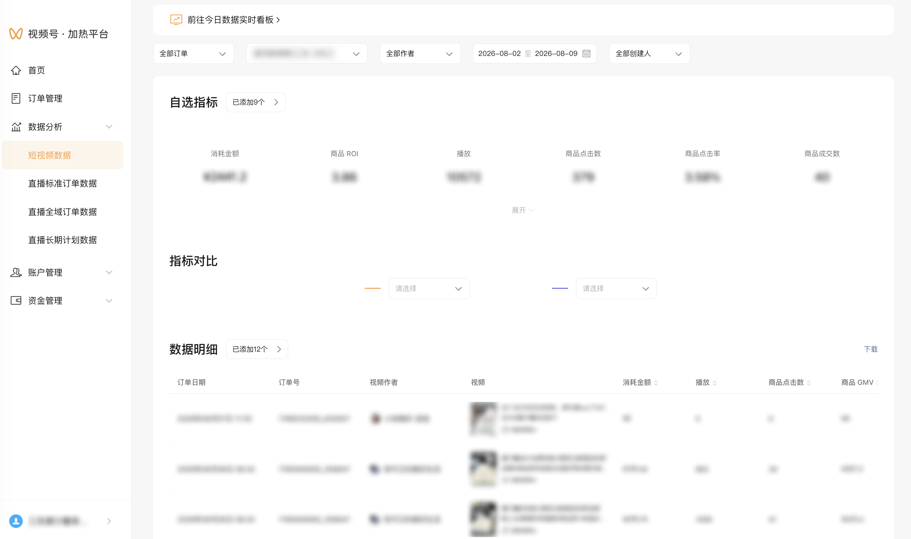

| 属性             | 值                                                                 |
| ---------------- | ------------------------------------------------------------------ |
| **连接器类型**   | `RPA 连接器`                                                       |
| **连接器名称**   | `ODS_视频号加热平台短视频数据明细表(微信视频号RPA)`                 |
| **连接器代码**   | `rpa.conn.weixin.sphjr.short.video.promote.statistic`               |
| **操作类型**     | `文件导出`                                                         |
| **目标网页**     | `https://channels.weixin.qq.com/promote/pages/platform/short-video/promote-statistic` |
| **适用场景**     | 导出视频号加热平台「数据分析-短视频数据」明细 CSV，支持按订单类型、作者、视频、创建人、日期与明细指标筛选 |
| **数据表名**     | `ods_rpa_weixin_sphjr_short_video_promote_statistic_du`             |
| **业务表名**     | `ODS_视频号加热平台短视频数据明细表(微信视频号RPA)`                 |

### 目标页面

> **取数路径**：视频号加热平台—数据分析—短视频数据
>
> **取数链接**：[https://channels.weixin.qq.com/promote/pages/platform/short-video/promote-statistic](https://channels.weixin.qq.com/promote/pages/platform/short-video/promote-statistic)



### 业务入参

| 字段 | 中文释义 | 数据类型 | 必填 | 默认值 | 说明 |
| ---- | -------- | -------- | ---- | ------ | ---- |
| `order_type` | 订单类型 | `String` | 否 | `ALL` | 可选值：`ALL`（全部订单）、`PENDING_PAY`（待支付）、`HEATING`（加热中）、`COMPLETED`（已完成）、`ENDED`（已结束）、`UNDER_REVIEW`（审核中）、`REVIEW_FAILED`（审核未通过）、`REFUNDING`（退款中）、`SETTLING`（结算中）、`PENDING_HEAT`（待加热）、`PAUSED`（已暂停） |
| `author` | 作者昵称 | `String` | 否 | `""`（全部作者） | 空串或 `ALL` 表示全部作者；有值须与页面作者下拉选项完全匹配 |
| `videos` | 视频标题 | `String` / `List[String]` | 否 | `""`（全部视频） | 支持英文逗号分隔字符串或字符串数组；空串 / `ALL` 表示全部视频；建议先指定 `author` 再筛选视频；有值须与页面视频选项标题匹配 |
| `creator` | 创建人昵称 | `String` | 否 | `""`（全部创建人） | 空串或 `ALL` 表示全部创建人；有值须与页面创建人下拉选项完全匹配 |
| `custom_start_date` | 查询起始日期 | `String` | 条件必填 | 昨日往前共 8 天的首日（与结束日期同时省略时） | 支持 `YYYYMMDD` / `YYYY-MM-DD`；与 `custom_end_date` 须同时传入或同时省略；不得晚于昨日；与结束日期组成闭区间，跨度 ≤ 8 天 |
| `custom_end_date` | 查询结束日期 | `String` | 条件必填 | 昨日（与起始日期同时省略时） | 支持 `YYYYMMDD` / `YYYY-MM-DD`；与 `custom_start_date` 须同时传入或同时省略；不得晚于昨日；不得早于起始日期；闭区间跨度 ≤ 8 天 |
| `metric_fields` | 数据明细指标 | `String` / `List[String]` | 否 | 默认 12 项（见说明） | 支持英文逗号分隔或字符串数组；最多 12 项；可选值：`COST`（消耗金额）、`WECOIN_COST`（消耗微信豆金额）、`PLAY`（播放）、`PRODUCT_CLICK`（商品点击数）、`PRODUCT_CTR`（商品点击率）、`PRODUCT_ORDER`（商品成交数）、`PRODUCT_NET_ORDER`（商品净成交数）、`PRODUCT_CVR`（商品成交率）、`PRODUCT_GMV`（商品 GMV）、`PRODUCT_NET_GMV`（商品净成交金额）、`PRODUCT_ROI`（商品 ROI）、`PRODUCT_NET_ROI`（商品净成交ROI）、`HEART_LIKE`（爱心赞数）、`THUMB_LIKE`（拇指赞数）、`COMMENT`（评论数）、`SHARE`（分享）、`FOLLOW`（关注）、`COMPONENT_CLICK`（组件点击）、`PAID_USER`（付费人数）、`LIVE_RESERVE`（直播预约数）。默认：`COST,WECOIN_COST,PLAY,PRODUCT_CLICK,PRODUCT_CTR,PRODUCT_ORDER,PRODUCT_NET_ORDER,PRODUCT_CVR,PRODUCT_GMV,PRODUCT_NET_GMV,PRODUCT_ROI,PRODUCT_NET_ROI` |

### 入参样例

默认最近 8 天（含昨日、不含今日），全部订单 + 默认明细指标：

```json
{}
```

按日期区间与订单类型导出（两端均不得晚于昨日，闭区间跨度 ≤ 8 天）：

```json
{
  "order_type": "COMPLETED",
  "custom_start_date": "2026-08-01",
  "custom_end_date": "2026-08-08"
}
```

指定作者与视频，并自定义明细指标（`YYYYMMDD`）：

```json
{
  "order_type": "ALL",
  "author": "示例作者昵称",
  "videos": ["示例视频标题A", "示例视频标题B"],
  "creator": "ALL",
  "custom_start_date": "20260801",
  "custom_end_date": "20260808",
  "metric_fields": ["COST", "PLAY", "PRODUCT_GMV", "PRODUCT_ROI"]
}
```

### 入参校验

```json-schema collapsed
{
  "$schema": "https://json-schema.org/draft/2020-12/schema",
  "title": "视频号加热-短视频数据 - 查询入参",
  "description": "导出视频号加热平台「数据分析-短视频数据」明细 CSV，支持按订单类型、作者、视频、创建人、日期与明细指标筛选",
  "type": "object",
  "properties": {
    "order_type": {
      "description": "订单类型。可选值：ALL（全部订单）、PENDING_PAY（待支付）、HEATING（加热中）、COMPLETED（已完成）、ENDED（已结束）、UNDER_REVIEW（审核中）、REVIEW_FAILED（审核未通过）、REFUNDING（退款中）、SETTLING（结算中）、PENDING_HEAT（待加热）、PAUSED（已暂停）",
      "type": "string",
      "enum": [
        "ALL",
        "PENDING_PAY",
        "HEATING",
        "COMPLETED",
        "ENDED",
        "UNDER_REVIEW",
        "REVIEW_FAILED",
        "REFUNDING",
        "SETTLING",
        "PENDING_HEAT",
        "PAUSED"
      ],
      "default": "ALL"
    },
    "author": {
      "description": "作者昵称。空串或 ALL 表示全部作者；有值须与页面作者下拉选项完全匹配",
      "type": "string",
      "default": ""
    },
    "videos": {
      "description": "视频标题多选。支持英文逗号分隔字符串或字符串数组；空串/ALL 表示全部视频；建议先指定 author",
      "oneOf": [
        {
          "type": "string"
        },
        {
          "type": "array",
          "items": {
            "type": "string",
            "minLength": 1
          }
        }
      ],
      "default": ""
    },
    "creator": {
      "description": "创建人昵称。空串或 ALL 表示全部创建人；有值须与页面创建人下拉选项完全匹配",
      "type": "string",
      "default": ""
    },
    "custom_start_date": {
      "description": "查询起始日期。支持 YYYYMMDD 或 YYYY-MM-DD；与 custom_end_date 须同时传入或同时省略；不得晚于昨日；闭区间跨度≤8天；同时省略时默认最近8天首日",
      "type": "string",
      "pattern": "^(\\d{8}|\\d{4}-\\d{2}-\\d{2})?$",
      "default": ""
    },
    "custom_end_date": {
      "description": "查询结束日期。支持 YYYYMMDD 或 YYYY-MM-DD；与 custom_start_date 须同时传入或同时省略；不得晚于昨日；不得早于起始日期；闭区间跨度≤8天；同时省略时默认昨日",
      "type": "string",
      "pattern": "^(\\d{8}|\\d{4}-\\d{2}-\\d{2})?$",
      "default": ""
    },
    "metric_fields": {
      "description": "数据明细指标，最多12项。可选值见业务入参表；未传时默认 COST/WECOIN_COST/PLAY/PRODUCT_CLICK/PRODUCT_CTR/PRODUCT_ORDER/PRODUCT_NET_ORDER/PRODUCT_CVR/PRODUCT_GMV/PRODUCT_NET_GMV/PRODUCT_ROI/PRODUCT_NET_ROI",
      "oneOf": [
        {
          "type": "string"
        },
        {
          "type": "array",
          "items": {
            "type": "string",
            "enum": [
              "COST",
              "WECOIN_COST",
              "PLAY",
              "PRODUCT_CLICK",
              "PRODUCT_CTR",
              "PRODUCT_ORDER",
              "PRODUCT_NET_ORDER",
              "PRODUCT_CVR",
              "PRODUCT_GMV",
              "PRODUCT_NET_GMV",
              "PRODUCT_ROI",
              "PRODUCT_NET_ROI",
              "HEART_LIKE",
              "THUMB_LIKE",
              "COMMENT",
              "SHARE",
              "FOLLOW",
              "COMPONENT_CLICK",
              "PAID_USER",
              "LIVE_RESERVE"
            ]
          },
          "maxItems": 12,
          "uniqueItems": true
        }
      ]
    }
  },
  "required": [],
  "additionalProperties": false,
  "allOf": [
    {
      "if": {
        "properties": {
          "custom_start_date": {
            "type": "string",
            "minLength": 1
          }
        },
        "required": ["custom_start_date"]
      },
      "then": {
        "properties": {
          "custom_end_date": {
            "type": "string",
            "minLength": 1,
            "pattern": "^(\\d{8}|\\d{4}-\\d{2}-\\d{2})$"
          }
        },
        "required": ["custom_end_date"]
      }
    },
    {
      "if": {
        "properties": {
          "custom_end_date": {
            "type": "string",
            "minLength": 1
          }
        },
        "required": ["custom_end_date"]
      },
      "then": {
        "properties": {
          "custom_start_date": {
            "type": "string",
            "minLength": 1,
            "pattern": "^(\\d{8}|\\d{4}-\\d{2}-\\d{2})$"
          }
        },
        "required": ["custom_start_date"]
      }
    }
  ]
}
```

### 数据字段

| 字段 | 中文释义 | 数据类型 | 可为空 | 取数路径 | 示例 |
| ---- | -------- | -------- | ------ | -------- | ---- |
| `orderDate` | 订单日期 | `String` | 是 | `CSV.0.订单日期` | `2026年08月04日 14:28` |
| `orderId` | 订单号 | `String` | 是 | `CSV.0.订单号` | `178****5640` (已脱敏) |
| `videoAuthor` | 视频作者 | `String` | 是 | `CSV.0.视频作者` | `安****活` (已脱敏) |
| `videoTitle` | 视频标题 | `String` | 是 | `CSV.0.视频标题` | `康****吸水垫` (已脱敏) |
| `videoId` | 视频 ID | `String` | 是 | `CSV.0.视频id` | `export/Uz****GXJr` (已脱敏) |
| `assistantVideoId` | 助手端视频 ID | `String` | 是 | `CSV.0.助手端视频id` | `export/Uz****_p5Q` (已脱敏) |
| `androidCost` | 安卓消耗 | `String` | 是 | `CSV.0.安卓消耗` | `￥29.57` |
| `cost` | 消耗金额 | `Number` | 是 | `CSV.0.消耗金额` | `83.68` |
| `wecoinCost` | 消耗微信豆金额 | `Number` | 是 | `CSV.0.消耗微信豆金额` | `836.8` |
| `play` | 播放 | `Number` | 是 | `CSV.0.播放` | `388` |
| `productClick` | 商品点击数 | `Number` | 是 | `CSV.0.商品点击数` | `23` |
| `productCtr` | 商品点击率 | `Number` | 是 | `CSV.0.商品点击率` | `0.0593` |
| `productOrder` | 商品成交数 | `Number` | 是 | `CSV.0.商品成交数` | `0` |
| `productNetOrder` | 商品净成交数 | `Number` | 是 | `CSV.0.商品净成交数` | `0` |
| `productCvr` | 商品成交率 | `Number` | 是 | `CSV.0.商品成交率` | `0.0` |
| `productGmv` | 商品 GMV | `Number` | 是 | `CSV.0.商品 GMV` | `0.0` |
| `productNetGmv` | 商品净成交金额 | `Number` | 是 | `CSV.0.商品净成交金额` | `0.0` |
| `productRoi` | 商品 ROI | `Number` | 是 | `CSV.0.商品 ROI` | `0.0` |
| `productNetRoi` | 商品净成交 ROI | `Number` | 是 | `CSV.0.商品净成交ROI` | `0.0` |
| `heartLike` | 爱心赞数 | `Number` | 是 | `CSV.0.爱心赞数` | — |
| `thumbLike` | 拇指赞数 | `Number` | 是 | `CSV.0.拇指赞数` | — |
| `comment` | 评论数 | `Number` | 是 | `CSV.0.评论数` | — |
| `share` | 分享 | `Number` | 是 | `CSV.0.分享` | — |
| `follow` | 关注 | `Number` | 是 | `CSV.0.关注` | — |
| `componentClick` | 组件点击 | `Number` | 是 | `CSV.0.组件点击` | — |
| `paidUser` | 付费人数 | `Number` | 是 | `CSV.0.付费人数` | — |
| `liveReserve` | 直播预约数 | `Number` | 是 | `CSV.0.直播预约数` | — |
| `audienceTargeting` | 人群定向 | `String` | 是 | `CSV.0.人群定向` | `-` |
| `bizDate` | 业务日期 | `String` | 否 | 附加 | `20260809` |
| `accountId` | 授权 ID | `String` | 否 | 附加 | `1****9` (已脱敏) |

> 说明：明细指标列是否出现取决于 `metric_fields` 勾选（最多 12 项）；未勾选的指标不会出现在导出 CSV 中。

### 数据样例

```json
{
  "orderDate": "2026年08月04日 14:28",
  "orderId": "178****5640",
  "videoAuthor": "安****活",
  "videoTitle": "康****吸水垫",
  "videoId": "export/Uz****GXJr",
  "assistantVideoId": "export/Uz****_p5Q",
  "androidCost": "￥29.57",
  "cost": 83.68,
  "play": 388,
  "productClick": 23,
  "productGmv": 0.0,
  "productCtr": 0.0593,
  "productOrder": 0,
  "productRoi": 0.0,
  "wecoinCost": 836.8,
  "productNetOrder": 0,
  "productCvr": 0.0,
  "productNetGmv": 0.0,
  "productNetRoi": 0.0,
  "audienceTargeting": "-",
  "bizDate": "20260809",
  "accountId": "1****9"
}
```

---
