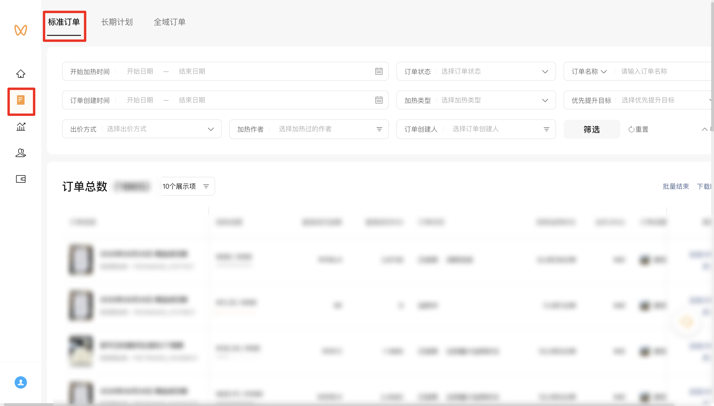
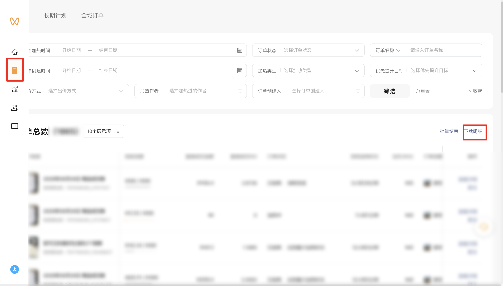

| 属性             | 值                                                                 |
| ---------------- | ------------------------------------------------------------------ |
| **连接器类型**   | `RPA 连接器`                                                       |
| **连接器名称**   | `ODS_视频号加热平台标准订单明细报表(微信视频号RPA)`                 |
| **连接器代码**   | `rpa.conn.weixin.sphjr.standard.order.report`                       |
| **操作类型**     | `文件导出`                                                         |
| **目标网页**     | `https://channels.weixin.qq.com/promote/pages/platform/order-list?tab=standard` |
| **适用场景**     | 导出视频号加热平台「标准订单」明细 CSV，支持按开始加热时间、订单创建时间及出价方式、加热类型、订单状态筛选 |
| **数据表名**     | `ods_rpa_weixin_sphjr_standard_order_report_du`                     |
| **业务表名**     | `ODS_视频号加热平台标准订单明细报表(微信视频号RPA)`                 |

### 目标页面

> **取数路径**：视频号加热平台—推广订单—标准订单
>
> **取数链接**：[https://channels.weixin.qq.com/promote/pages/platform/order-list?tab=standard](https://channels.weixin.qq.com/promote/pages/platform/order-list?tab=standard)





### 业务入参

| 字段 | 中文释义 | 数据类型 | 必填 | 默认值 | 说明 |
| ---- | -------- | -------- | ---- | ------ | ---- |
| `heat_custom_start_date` | 开始加热时间-起始 | `String` | 是 | — | 支持 `YYYYMMDD` / `YYYY-MM-DD`；不得晚于 `heat_custom_end_date` |
| `heat_custom_end_date` | 开始加热时间-结束 | `String` | 是 | — | 支持 `YYYYMMDD` / `YYYY-MM-DD`；不得早于 `heat_custom_start_date` |
| `create_custom_start_date` | 订单创建时间-起始 | `String` | 是 | — | 支持 `YYYYMMDD` / `YYYY-MM-DD`；不得晚于 `create_custom_end_date` |
| `create_custom_end_date` | 订单创建时间-结束 | `String` | 是 | — | 支持 `YYYYMMDD` / `YYYY-MM-DD`；不得早于 `create_custom_start_date` |
| `bid_methods` | 出价方式 | `String` / `List[String]` | 否 | — | 不传则不设置该筛选项默认就是全选。支持英文逗号分隔字符串或字符串数组。可选值：`ALL`（全选）、`VOLUME_HEATING`（放量加热）、`COST_CONTROL_HEATING`（控成本加热）。含 `ALL` 时按全选处理，忽略其它值 |
| `heating_types` | 加热类型 | `String` / `List[String]` | 否 | — | 不传则不设置该筛选项默认全选。支持英文逗号分隔字符串或字符串数组。可选值：`ALL`（全选）、`LIVE`（直播）、`SHORT_VIDEO`（短视频）、`PRODUCT`（商品）。含 `ALL` 时按全选处理，忽略其它值 |
| `order_statuses` | 订单状态 | `String` / `List[String]` | 否 | — | 不传则不设置该筛选项默认全选。支持英文逗号分隔字符串或字符串数组。可选值：`PENDING_PAYMENT`（待支付）、`UNDER_REVIEW`（审核中）、`REVIEW_FAILED`（审核未通过）、`PENDING_HEAT`（待加热）、`CANCELLED`（已取消，父级）、`UNPAID_CLOSED`（未支付关单）、`RESERVATION_INVALID`（预约失效）、`RESERVATION_EXPIRED`（预约过期）、`HEATING`（加热中）、`PAUSED`（已暂停）、`REFUNDING`（退款中）、`SETTLING`（结算中）、`ENDED`（已结束，父级）、`CONSUMPTION_COMPLETED`（消耗完成）、`MAX_DURATION_REACHED`（达到最大加热时长）、`LIVE_ENDED`（直播结束）、`ACTIVE_CANCEL`（主动取消）、`ORDER_CIRCUIT_BREAK`（订单熔断）、`OTHER`（其他）。父级 `CANCELLED` / `ENDED` 与子级同传时只勾父级 |

### 入参样例

仅必填日期（开始加热时间、订单创建时间）：

```json
{
  "heat_custom_start_date": "2026-08-01",
  "heat_custom_end_date": "2026-08-28",
  "create_custom_start_date": "2026-08-01",
  "create_custom_end_date": "2026-08-28"
}
```

全选出价方式与加热类型，并筛选加热中订单（`YYYYMMDD`；多选亦可用英文逗号分隔字符串）：

```json
{
  "heat_custom_start_date": "20260801",
  "heat_custom_end_date": "20260828",
  "create_custom_start_date": "20260801",
  "create_custom_end_date": "20260828",
  "bid_methods": ["ALL"],
  "heating_types": ["ALL"],
  "order_statuses": ["HEATING"]
}
```

### 入参校验

```json-schema collapsed
{
  "$schema": "https://json-schema.org/draft/2020-12/schema",
  "title": "视频号加热-标准订单明细 - 查询入参",
  "description": "导出视频号加热平台「标准订单」明细 CSV，支持按开始加热时间、订单创建时间及出价方式、加热类型、订单状态筛选",
  "type": "object",
  "properties": {
    "heat_custom_start_date": {
      "description": "开始加热时间-起始。支持 YYYYMMDD 或 YYYY-MM-DD；不得晚于 heat_custom_end_date",
      "type": "string",
      "pattern": "^(\\d{8}|\\d{4}-\\d{2}-\\d{2})$"
    },
    "heat_custom_end_date": {
      "description": "开始加热时间-结束。支持 YYYYMMDD 或 YYYY-MM-DD；不得早于 heat_custom_start_date",
      "type": "string",
      "pattern": "^(\\d{8}|\\d{4}-\\d{2}-\\d{2})$"
    },
    "create_custom_start_date": {
      "description": "订单创建时间-起始。支持 YYYYMMDD 或 YYYY-MM-DD；不得晚于 create_custom_end_date",
      "type": "string",
      "pattern": "^(\\d{8}|\\d{4}-\\d{2}-\\d{2})$"
    },
    "create_custom_end_date": {
      "description": "订单创建时间-结束。支持 YYYYMMDD 或 YYYY-MM-DD；不得早于 create_custom_start_date",
      "type": "string",
      "pattern": "^(\\d{8}|\\d{4}-\\d{2}-\\d{2})$"
    },
    "bid_methods": {
      "description": "出价方式多选。支持英文逗号分隔字符串或字符串数组。可选值：ALL（全选）、VOLUME_HEATING（放量加热）、COST_CONTROL_HEATING（控成本加热）；含 ALL 时按全选处理，忽略其它值。不传则不设置该筛选项",
      "oneOf": [
        {
          "type": "string"
        },
        {
          "type": "array",
          "items": {
            "type": "string",
            "enum": ["ALL", "VOLUME_HEATING", "COST_CONTROL_HEATING"]
          },
          "uniqueItems": true
        }
      ]
    },
    "heating_types": {
      "description": "加热类型多选。支持英文逗号分隔字符串或字符串数组。可选值：ALL（全选）、LIVE（直播）、SHORT_VIDEO（短视频）、PRODUCT（商品）；含 ALL 时按全选处理，忽略其它值。不传则不设置该筛选项",
      "oneOf": [
        {
          "type": "string"
        },
        {
          "type": "array",
          "items": {
            "type": "string",
            "enum": ["ALL", "LIVE", "SHORT_VIDEO", "PRODUCT"]
          },
          "uniqueItems": true
        }
      ]
    },
    "order_statuses": {
      "description": "订单状态多选。支持英文逗号分隔字符串或字符串数组。可选值：PENDING_PAYMENT（待支付）、UNDER_REVIEW（审核中）、REVIEW_FAILED（审核未通过）、PENDING_HEAT（待加热）、CANCELLED（已取消，父级）、UNPAID_CLOSED（未支付关单）、RESERVATION_INVALID（预约失效）、RESERVATION_EXPIRED（预约过期）、HEATING（加热中）、PAUSED（已暂停）、REFUNDING（退款中）、SETTLING（结算中）、ENDED（已结束，父级）、CONSUMPTION_COMPLETED（消耗完成）、MAX_DURATION_REACHED（达到最大加热时长）、LIVE_ENDED（直播结束）、ACTIVE_CANCEL（主动取消）、ORDER_CIRCUIT_BREAK（订单熔断）、OTHER（其他）。父级 CANCELLED / ENDED 与子级同传时只勾父级。不传则不设置该筛选项",
      "oneOf": [
        {
          "type": "string"
        },
        {
          "type": "array",
          "items": {
            "type": "string",
            "enum": [
              "PENDING_PAYMENT",
              "UNDER_REVIEW",
              "REVIEW_FAILED",
              "PENDING_HEAT",
              "CANCELLED",
              "UNPAID_CLOSED",
              "RESERVATION_INVALID",
              "RESERVATION_EXPIRED",
              "HEATING",
              "PAUSED",
              "REFUNDING",
              "SETTLING",
              "ENDED",
              "CONSUMPTION_COMPLETED",
              "MAX_DURATION_REACHED",
              "LIVE_ENDED",
              "ACTIVE_CANCEL",
              "ORDER_CIRCUIT_BREAK",
              "OTHER"
            ]
          },
          "uniqueItems": true
        }
      ]
    }
  },
  "required": [
    "heat_custom_start_date",
    "heat_custom_end_date",
    "create_custom_start_date",
    "create_custom_end_date"
  ],
  "additionalProperties": false
}
```

### 数据字段

| 字段 | 中文释义 | 数据类型 | 可为空 | 取数路径 | 示例 |
| ---- | -------- | -------- | ------ | -------- | ---- |
| `orderInfo` | 订单信息 | `String` | 是 | `CSV.0.订单信息` | `2026年08月26日 商品成交数 短视频加热 178****799` (已脱敏) |
| `deliveryProgress` | 投放进度 | `String` | 是 | `CSV.0.投放进度` | `¥11.19 / ¥500` |
| `costDetail` | 消耗详情 | `String` | 是 | `CSV.0.消耗详情` | `-` |
| `directGmv` | 直接成交金额 | `String` | 是 | `CSV.0.直接成交金额` | `¥0` |
| `directRoi` | 直接成交 ROI | `String` | 是 | `CSV.0.直接成交ROI` | `0` |
| `orderStatus` | 订单状态 | `String` | 是 | `CSV.0.订单状态` | `加热中` |
| `actualHeatDuration` | 实际加热时长 | `String` | 是 | `CSV.0.实际加热时长` | `6小时9分钟` |
| `bidRoi` | 出价(ROI) | `String` | 是 | `CSV.0.出价(ROI)` | `¥60` |
| `orderCreator` | 订单创建人 | `String` | 是 | `CSV.0.订单创建人` | `****` (已脱敏) |
| `subsidyAmount` | 补贴金额 | `String` | 是 | `CSV.0.补贴金额` | `¥0` |
| `newFollowCount` | 新增关注数 | `String` | 是 | `CSV.0.新增关注数` | `0` |
| `avgCpm` | 平均千次展示费用 | `String` | 是 | `CSV.0.平均千次展示费用` | `¥414.44` |
| `bizDate` | 业务日期 | `String` | 否 | 附加 | `20260828` |
| `accountId` | 授权 ID | `String` | 否 | 附加 | `1****9` (已脱敏) |

### 数据样例

```json
{
  "orderInfo": "2026年08月26日 商品成交数 短视频加热 178****799",
  "deliveryProgress": "¥11.19 / ¥500",
  "costDetail": "-",
  "directGmv": "¥0",
  "directRoi": "0",
  "orderStatus": "加热中",
  "actualHeatDuration": "6小时9分钟",
  "bidRoi": "¥60",
  "orderCreator": "****",
  "subsidyAmount": "¥0",
  "newFollowCount": "0",
  "avgCpm": "¥414.44",
  "bizDate": "20260828",
  "accountId": "1****9"
}
```

---
