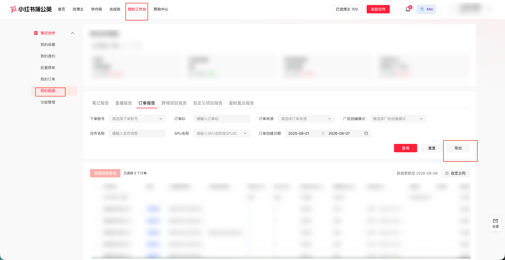

| 属性             | 值                                                                 |
| ---------------- | ------------------------------------------------------------------ |
| **连接器类型**   | `RPA 连接器`                                                       |
| **连接器名称**   | `ODS_蒲公英我的数据订单报告明细表(小红书RPA)`                       |
| **连接器代码**   | `rpa.conn.xiaohongshu.pgy.order.report`                            |
| **操作类型**     | `文件导出`                                                         |
| **目标网页**     | `https://pgy.xiaohongshu.com/solar/post-trade/content-manage/order` |
| **适用场景**     | 导出小红书蒲公英「我的数据-订单报告」xlsx，支持按订单ID与订单创建日期筛选 |
| **数据表名**     | `ods_rpa_xiaohongshu_pgy_order_report_du`                          |
| **业务表名**     | `ODS_蒲公英我的数据订单报告明细表(小红书RPA)`                       |

### 目标页面

> **取数路径**：小红书蒲公英—我的工作台—我的数据—订单报告
>
> **取数链接**：[https://pgy.xiaohongshu.com/solar/post-trade/content-manage/order](https://pgy.xiaohongshu.com/solar/post-trade/content-manage/order)



### 业务入参

| 字段 | 中文释义 | 数据类型 | 必填 | 默认值 | 说明 |
| ---- | -------- | -------- | ---- | ------ | ---- |
| `order_id` | 订单 ID | `String` / `null` | 否 | `null`（不填） | `null` 表示不筛选订单 ID；有值须为字符串且为 15~30 位纯数字（`0-9`），禁止传数字类型|
| `custom_start_date` | 订单创建开始日期 | `String` | 是 | — | 须为字符串；支持 `YYYYMMDD` / `YYYY-MM-DD`；必传，不能为空；须 ≤ `custom_end_date`。未传返回「未输入开始日期」；与结束日期同时未传返回「未输入开始和结束日期」 |
| `custom_end_date` | 订单创建结束日期 | `String` | 是 | — | 须为字符串；支持 `YYYYMMDD` / `YYYY-MM-DD`；必传，不能为空；须 ≥ `custom_start_date`。未传返回「未输入结束日期」；与开始日期同时未传返回「未输入开始和结束日期」 |

### 入参样例

按日期区间导出（`YYYY-MM-DD`，不填订单 ID）：

```json
{
  "order_id": null,
  "custom_start_date": "2026-08-01",
  "custom_end_date": "2026-08-07"
}
```

按订单 ID + 日期筛选（`YYYYMMDD`）：

```json
{
  "order_id": "2084224137567178754",
  "custom_start_date": "20260801",
  "custom_end_date": "20260807"
}
```

### 入参校验

```json-schema collapsed
{
  "$schema": "https://json-schema.org/draft/2020-12/schema",
  "title": "小红书-蒲公英订单报告 - 查询入参",
  "description": "导出小红书蒲公英「我的数据-订单报告」xlsx，支持按订单ID与订单创建日期筛选",
  "type": "object",
  "properties": {
    "order_id": {
      "description": "订单 ID。缺省或 null 表示不筛选；有值须为字符串且为 15~30 位纯数字，禁止数字类型",
      "type": ["string", "null"],
      "pattern": "^\\d{15,30}$",
      "default": null
    },
    "custom_start_date": {
      "description": "订单创建开始日期。须为字符串且必传；仅支持 YYYYMMDD 或 YYYY-MM-DD；不能晚于 custom_end_date。未传返回「未输入开始日期」；与结束日期同时未传返回「未输入开始和结束日期」",
      "type": "string",
      "minLength": 1,
      "pattern": "^(\\d{8}|\\d{4}-\\d{2}-\\d{2})$"
    },
    "custom_end_date": {
      "description": "订单创建结束日期。须为字符串且必传；仅支持 YYYYMMDD 或 YYYY-MM-DD；不能早于 custom_start_date。未传返回「未输入结束日期」；与开始日期同时未传返回「未输入开始和结束日期」",
      "type": "string",
      "minLength": 1,
      "pattern": "^(\\d{8}|\\d{4}-\\d{2}-\\d{2})$"
    }
  },
  "required": ["custom_start_date", "custom_end_date"],
  "additionalProperties": false
}
```

### 数据字段

| 字段 | 中文释义 | 数据类型 | 可为空 | 取数路径 | 示例 |
| ---- | -------- | -------- | ------ | -------- | ---- |
| `dataUpdateDate` | 数据更新日期 | `String` | 是 | `XLSX.数据更新日期` | `2026/08/06` |
| `noteCount` | 笔记数 | `Number` | 是 | `XLSX.笔记数` | `1` |
| `publisherCount` | 发布人数 | `Number` | 是 | `XLSX.发布人数` | `1` |
| `imageNoteRatio` | 图文笔记占比 | `String` | 是 | `XLSX.图文笔记占比` | `100.0%` |
| `videoNoteRatio` | 视频笔记占比 | `String` | 是 | `XLSX.视频笔记占比` | `0.0%` |
| `orderId` | 订单 ID | `String` / `Number` | 是 | `XLSX.订单id` | `208****754` (已脱敏) |
| `coopName` | 合作名称 | `String` | 是 | `XLSX.合作名称` | `gare****8.3` (已脱敏) |
| `reportBrand` | 报备品牌 | `String` | 是 | `XLSX.报备品牌` | `康****馨` (已脱敏) |
| `orderAccount` | 下单账号 | `String` | 是 | `XLSX.下单账号` | `杭州崇****限公司` (已脱敏) |
| `bloggerQuote` | 博主报价 | `Number` | 是 | `XLSX.博主报价` | `50.0` |
| `serviceFeeAmount` | 服务费金额 | `Number` | 是 | `XLSX.服务费金额` | `5.0` |
| `isEfficientMode` | 是否为优效模式 | `String` | 是 | `XLSX.是否为优效模式` | `否` |
| `totalBudget` | 总预算 | `String` / `Number` | 是 | `XLSX.总预算` | `-` |
| `totalCost` | 总消耗 | `String` / `Number` | 是 | `XLSX.总消耗` | `-` |
| `orderSource` | 订单来源 | `String` | 是 | `XLSX.订单来源` | `定制商单` |
| `orderCreateTime` | 订单创建时间 | `String` | 是 | `XLSX.订单创建时间` | `2026/08/03` |
| `orderFinishTime` | 订单完成时间 | `String` | 是 | `XLSX.订单完成时间` | `-` |
| `spuName` | SPU 名称 | `String` | 是 | `XLSX.spu名称` | `gawgr****鹅绒被` (已脱敏) |
| `totalExposure` | 总曝光量 | `Number` | 是 | `XLSX.总曝光量` | `2269` |
| `totalRead` | 总阅读量 | `Number` | 是 | `XLSX.总阅读量` | `248` |
| `totalReadUv` | 总阅读 UV | `Number` | 是 | `XLSX.总阅读UV` | `61` |
| `playRate5s` | 5s 播放率 | `String` | 是 | `XLSX.5s播放率` | `0.0%` |
| `readRate3s` | 3s 阅读率 | `String` | 是 | `XLSX.3s阅读率` | `9.3%` |
| `avgBrowseDuration` | 平均浏览时长 | `Number` | 是 | `XLSX.平均浏览时长` | `1.0` |
| `totalInteraction` | 总互动量 | `Number` | 是 | `XLSX.总互动量` | `2` |
| `totalInteractionRate` | 总互动率 | `String` | 是 | `XLSX.总互动率` | `0.81%` |
| `totalLike` | 总点赞量 | `Number` | 是 | `XLSX.总点赞量` | `1` |
| `totalCollect` | 总收藏量 | `Number` | 是 | `XLSX.总收藏量` | `0` |
| `totalComment` | 总评论量 | `Number` | 是 | `XLSX.总评论量` | `0` |
| `totalShare` | 总分享量 | `Number` | 是 | `XLSX.总分享量` | `1` |
| `totalFollow` | 总关注量 | `Number` | 是 | `XLSX.总关注量` | `0` |
| `naturalExposure` | 总自然曝光量 | `Number` | 是 | `XLSX.总自然曝光量` | `1455` |
| `naturalRead` | 总自然阅读量 | `Number` | 是 | `XLSX.总自然阅读量` | `231` |
| `readAchieveRate` | 阅读量达成率 | `Number` | 是 | `XLSX.阅读量达成率` | `0.0` |
| `promoteExposure` | 总推广曝光量 | `Number` | 是 | `XLSX.总推广曝光量` | `814` |
| `promoteRead` | 总推广阅读量 | `Number` | 是 | `XLSX.总推广阅读量` | `17` |
| `heatExposure` | 总加热曝光量 | `Number` | 是 | `XLSX.总加热曝光量` | `0` |
| `heatRead` | 总加热阅读量 | `Number` | 是 | `XLSX.总加热阅读量` | `0` |
| `readUnitPrice` | 阅读单价 | `Number` | 是 | `XLSX.阅读单价` | `0.22` |
| `interactionUnitPrice` | 互动单价 | `Number` | 是 | `XLSX.互动单价` | `27.5` |
| `bodyComponentType` | 正文组件类型 | `String` | 是 | `XLSX.正文组件类型` | `-` |
| `bodyComponentCopy` | 正文组件文案 | `String` | 是 | `XLSX.正文组件文案` | `-` |
| `bodyComponentExposure` | 正文组件曝光量 | `String` / `Number` | 是 | `XLSX.正文组件曝光量` | `-` |
| `bodyComponentClick` | 正文组件点击量 | `String` / `Number` | 是 | `XLSX.正文组件点击量` | `-` |
| `bodyComponentCtr` | 正文组件 CTR | `String` / `Number` | 是 | `XLSX.正文组件CTR` | `-` |
| `noteBottomComponentType` | 笔记底栏组件类型 | `String` | 是 | `XLSX.笔记底栏组件类型` | `-` |
| `noteBottomComponentCopy` | 笔记底栏组件文案 | `String` | 是 | `XLSX.笔记底栏组件文案` | `-` |
| `noteBottomComponentExposure` | 笔记底栏组件曝光量 | `String` / `Number` | 是 | `XLSX.笔记底栏组件曝光量` | `-` |
| `noteBottomComponentClick` | 笔记底栏组件点击量 | `String` / `Number` | 是 | `XLSX.笔记底栏组件点击量` | `-` |
| `noteBottomComponentCtr` | 笔记底栏组件 CTR | `String` / `Number` | 是 | `XLSX.笔记底栏组件CTR` | `-` |
| `commentComponentType` | 评论区组件类型 | `String` | 是 | `XLSX.评论区组件类型` | `-` |
| `commentComponentCopy` | 评论区组件文案 | `String` | 是 | `XLSX.评论区组件文案` | `-` |
| `commentComponentExposure` | 评论区组件曝光量 | `String` / `Number` | 是 | `XLSX.评论区组件曝光量` | `-` |
| `commentComponentClick` | 评论区组件点击量 | `String` / `Number` | 是 | `XLSX.评论区组件点击量` | `-` |
| `commentComponentCtr` | 评论区组件 CTR | `String` / `Number` | 是 | `XLSX.评论区组件CTR` | `-` |
| `applyCount` | 申请人数 | `Number` | 是 | `XLSX.申请人数` | `0` |
| `brandFollowCount` | 品牌号关注量 | `Number` | 是 | `XLSX.品牌号关注量` | `0` |
| `searchWordClick` | 搜索词点击量 | `Number` | 是 | `XLSX.搜索词点击量` | `0` |
| `boostNoteExposure` | 助推笔记曝光量 | `Number` | 是 | `XLSX.助推笔记曝光量` | `0` |
| `boostNoteRead` | 助推笔记阅读量 | `Number` | 是 | `XLSX.助推笔记阅读量` | `0` |
| `experienceCollectionExposure` | 体验合集组件曝光量 | `Number` | 是 | `XLSX.体验合集组件曝光量` | `0` |
| `experienceCollectionClick` | 体验合集组件点击量 | `Number` | 是 | `XLSX.体验合集组件点击量` | `0` |
| `experienceCollectionClickUv` | 体验合集组件点击人数 | `Number` | 是 | `XLSX.体验合集组件点击人数` | `0` |
| `experienceCollectionClickRate` | 体验合集组件点击率 | `Number` | 是 | `XLSX.体验合集组件点击率` | `0` |
| `custom_start_date` | 订单创建开始日期（入参回写） | `String` | 否 | 附加 | `2025-08-01` |
| `custom_end_date` | 订单创建结束日期（入参回写） | `String` | 否 | 附加 | `2026-08-07` |
| `bizDate` | 业务日期 | `String` | 否 | 附加 | `20260807` |
| `accountId` | 授权 ID | `String` | 否 | 附加 | `1****1` (已脱敏) |

### 数据样例

```json
{
  "dataUpdateDate": "2026/08/06",
  "noteCount": 1,
  "publisherCount": 1,
  "imageNoteRatio": "100.0%",
  "videoNoteRatio": "0.0%",
  "orderId": "208****754",
  "coopName": "gare****8.3",
  "reportBrand": "康****馨",
  "orderAccount": "杭州崇****限公司",
  "bloggerQuote": 50.0,
  "serviceFeeAmount": 5.0,
  "isEfficientMode": "否",
  "totalBudget": "-",
  "totalCost": "-",
  "orderSource": "定制商单",
  "orderCreateTime": "2026/08/03",
  "orderFinishTime": "-",
  "spuName": "gawgr****鹅绒被",
  "totalExposure": 2269,
  "totalRead": 248,
  "totalReadUv": 61,
  "playRate5s": "0.0%",
  "readRate3s": "9.3%",
  "avgBrowseDuration": 1.0,
  "totalInteraction": 2,
  "totalInteractionRate": "0.81%",
  "totalLike": 1,
  "totalCollect": 0,
  "totalComment": 0,
  "totalShare": 1,
  "totalFollow": 0,
  "naturalExposure": 1455,
  "naturalRead": 231,
  "readAchieveRate": 0.0,
  "promoteExposure": 814,
  "promoteRead": 17,
  "heatExposure": 0,
  "heatRead": 0,
  "readUnitPrice": 0.22,
  "interactionUnitPrice": 27.5,
  "bodyComponentType": "-",
  "bodyComponentCopy": "-",
  "bodyComponentExposure": "-",
  "bodyComponentClick": "-",
  "bodyComponentCtr": "-",
  "noteBottomComponentType": "-",
  "noteBottomComponentCopy": "-",
  "noteBottomComponentExposure": "-",
  "noteBottomComponentClick": "-",
  "noteBottomComponentCtr": "-",
  "commentComponentType": "-",
  "commentComponentCopy": "-",
  "commentComponentExposure": "-",
  "commentComponentClick": "-",
  "commentComponentCtr": "-",
  "applyCount": 0,
  "brandFollowCount": 0,
  "searchWordClick": 0,
  "boostNoteExposure": 0,
  "boostNoteRead": 0,
  "experienceCollectionExposure": 0,
  "experienceCollectionClick": 0,
  "experienceCollectionClickUv": 0,
  "experienceCollectionClickRate": 0,
  "custom_start_date": "2025-08-01",
  "custom_end_date": "2026-08-07",
  "bizDate": "20260807",
  "accountId": "1****1"
}
```

---
