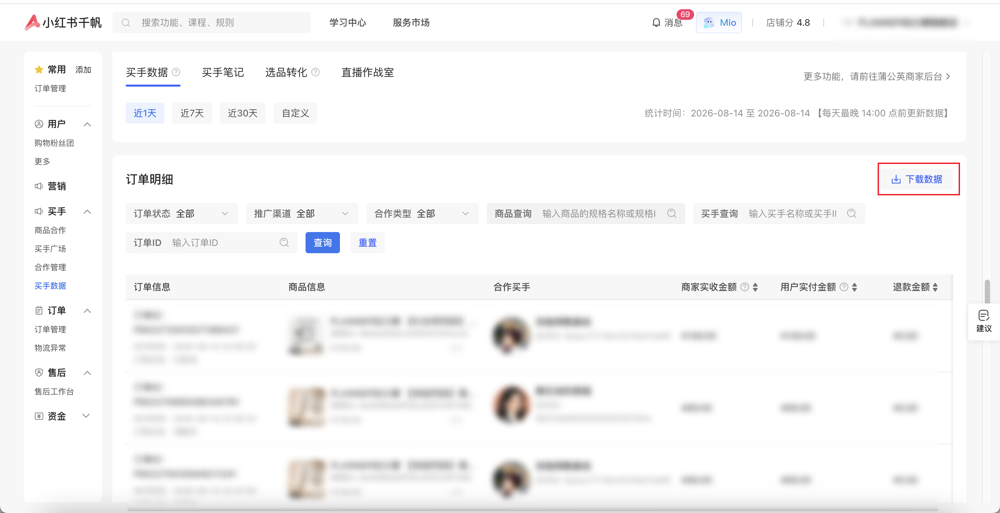

| 属性             | 值                                                         |
| ---------------- | ---------------------------------------------------------- |
| **连接器类型**   | `RPA 连接器`                                               |
| **连接器名称**   | `ODS_千帆买手数据订单明细报表(小红书RPA)`                  |
| **连接器代码**   | `rpa.conn.xiaohongshu.qf.buyer.data.order`                 |
| **操作类型**     | `文件导出`                                                 |
| **目标网页**     | `https://ark.xiaohongshu.com/app-distribution/dataView`    |
| **适用场景**     | 导出小红书千帆买手数据页的订单明细报表，支持下载近 1 年数据 |
| **数据表名**     | `ods_rpa_xiaohongshu_qf_buyer_data_order_du`               |
| **业务表名**     | `ODS_千帆买手数据订单明细报表(小红书RPA)`                  |

### 目标页面

> **取数路径**：小红书千帆—买手数据—订单明细
>
> **取数链接**：[https://ark.xiaohongshu.com/app-distribution/dataView](https://ark.xiaohongshu.com/app-distribution/dataView)



### 业务入参

| 字段 | 中文释义 | 数据类型 | 必填 | 默认值 | 说明 |
| ---- | -------- | -------- | ---- | ------ | ---- |
| `custom_start_date` | 导出开始日期 | `String` | 是 | — | 支持格式：`YYYYMMDD`、`YYYY-MM-DD`；须在近 1 年内；不能晚于 `custom_end_date`。下载时间间隔为近 1 年 |
| `custom_end_date` | 导出结束日期 | `String` | 是 | — | 支持格式：`YYYYMMDD`、`YYYY-MM-DD`；须在近 1 年内且不能早于 `custom_start_date`。下载时间间隔为近 1 年 |

### 入参样例

`YYYY-MM-DD`：

```json
{
  "custom_start_date": "2025-08-20",
  "custom_end_date": "2026-08-11"
}
```

`YYYYMMDD`：

```json
{
  "custom_start_date": "20260801",
  "custom_end_date": "20260810"
}
```

### 入参校验

```json-schema collapsed
{
  "$schema": "https://json-schema.org/draft/2020-12/schema",
  "title": "小红书千帆-买手数据订单明细 - 查询入参",
  "description": "导出小红书千帆买手数据页的订单明细报表，支持下载近 1 年数据",
  "type": "object",
  "properties": {
    "custom_start_date": {
      "type": "string",
      "pattern": "^(\\d{8}|\\d{4}-\\d{2}-\\d{2})$",
      "description": "导出开始日期，YYYYMMDD 或 YYYY-MM-DD；须在近 1 年内，且不能晚于 custom_end_date。下载时间间隔为近 1 年"
    },
    "custom_end_date": {
      "type": "string",
      "pattern": "^(\\d{8}|\\d{4}-\\d{2}-\\d{2})$",
      "description": "导出结束日期，YYYYMMDD 或 YYYY-MM-DD；须在近 1 年内，且不能早于 custom_start_date。下载时间间隔为近 1 年"
    }
  },
  "required": ["custom_start_date", "custom_end_date"],
  "additionalProperties": false
}
```

### 数据字段

| 字段 | 中文释义 | 数据类型 | 可为空 | 取数路径 | 示例 |
| ---- | -------- | -------- | ------ | -------- | ---- |
| `payTime` | 支付时间 | `String` | 是 | `XLSX.0.支付时间` | 2026-08-11 23:59:37 |
| `orderId` | 订单 ID | `String` | 是 | `XLSX.0.订单ID` | `P80****804` (已脱敏) |
| `orderStatus` | 订单状态 | `String` | 是 | `XLSX.0.订单状态` | 已签收 |
| `skuName` | 规格名称 | `String` | 是 | `XLSX.0.规格名称` | 示例规格名称（控油妆前乳 单支装） |
| `skuId` | 规格 ID | `String` | 是 | `XLSX.0.规格ID` | `6a3****36b` (已脱敏) |
| `price` | 价格 | `Number` | 是 | `XLSX.0.价格` | 138 |
| `talentName` | 达人名称 | `String` | 是 | `XLSX.0.达人名称` | 示例达人 |
| `talentId` | 达人 ID | `String` | 是 | `XLSX.0.达人ID` | `5a6****5b9` (已脱敏) |
| `merchantReceivedAmount` | 商家实收金额 | `Number` | 是 | `XLSX.0.商家实收金额` | 69 |
| `userPaidAmount` | 用户实付金额 | `Number` | 是 | `XLSX.0.用户实付金额` | 68.04 |
| `refundAmount` | 退款金额 | `Number` | 是 | `XLSX.0.退款金额` | 0.0 |
| `validSalesAmount` | 有效销售金额（计佣金额） | `Number` | 是 | `XLSX.0.有效销售金额（计佣金额）` | 69.0 |
| `commissionRate` | 佣金率 | `Number` | 是 | `XLSX.0.佣金率` | 0.35 |
| `estimatedCommission` | 预估支出佣金 | `Number` | 是 | `XLSX.0.预估支出佣金` | 24.15 |
| `coopType` | 合作类型 | `String` | 是 | `XLSX.0.合作类型` | 买手合作 |
| `promoteChannel` | 推广渠道 | `String` | 是 | `XLSX.0.推广渠道` | 直播 |
| `custom_start_date` | 导出开始日期 | `String` | 否 | 附加 | 2025-08-20 |
| `custom_end_date` | 导出结束日期 | `String` | 否 | 附加 | 2026-08-11 |
| `bizDate` | 业务日期 | `String` | 否 | 附加 | 20260815 |
| `accountId` | 授权 ID | `String` | 否 | 附加 | `1****7` (已脱敏) |

### 数据样例

```json
[
  {
    "payTime": "2026-08-11 23:59:37",
    "orderId": "P80****804",
    "orderStatus": "已签收",
    "skuName": "示例规格名称（控油妆前乳 单支装）",
    "skuId": "6a3****36b",
    "price": 138,
    "talentName": "示例达人",
    "talentId": "5a6****5b9",
    "merchantReceivedAmount": 69,
    "userPaidAmount": 68.04,
    "refundAmount": 0.0,
    "validSalesAmount": 69.0,
    "commissionRate": 0.35,
    "estimatedCommission": 24.15,
    "coopType": "买手合作",
    "promoteChannel": "直播",
    "bizDate": "20260815",
    "accountId": "1****7",
    "custom_start_date": "2025-08-20",
    "custom_end_date": "2026-08-11"
  }
]
```

---
