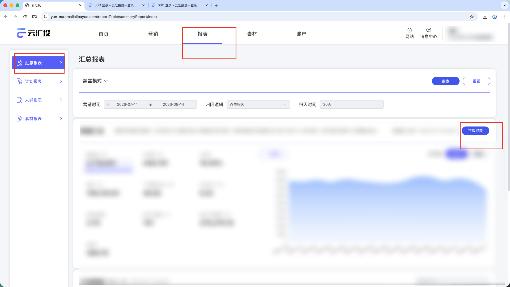

| 属性             | 值                                                         |
| ---------------- | ---------------------------------------------------------- |
| **连接器类型**   | `RPA 连接器`                                               |
| **连接器名称**   | `ODS_汇总数据明细报表(云汇投RPA)`                |
| **连接器代码**   | `rpa.conn.yunhuitou.summary.data.export`                   |
| **操作类型**     | `文件导出`                                                 |
| **目标网页**     | `https://yun-ma.tmallalipayuc.com/reportTable/summaryReport/index` |
| **适用场景**     | 登录云汇投后进入汇总报表页，按可选筛选项下载并解析汇总报表 xlsx |
| **数据表名**     | `ods_rpa_yunhuitou_summary_data_export_du`                 |
| **业务表名**     | `ODS_汇总数据明细报表(云汇投RPA)`                |

### 目标页面

> **取数路径**：云汇投—报表—汇总报表
>
> **取数链接**：[https://yun-ma.tmallalipayuc.com/reportTable/summaryReport/index](https://yun-ma.tmallalipayuc.com/reportTable/summaryReport/index)



### 业务入参

| 字段 | 中文释义 | 数据类型 | 必填 | 默认值 | 说明 |
| ---- | -------- | -------- | ---- | ------ | ---- |
| `report_mode` | 报表模式 | `String` | 否 | — | 不传则跳过，沿用页面当前值。可选值：`BLACK_BOX`（黑盒模式）/ `WHITE_BOX`（白盒模式）/ `TR`（TR模式） |
| `custom_start_date` | 营销开始日期 | `String` | 条件必填 | — | 须与 `custom_end_date` 成对传入，或都不传以使用页面默认。格式：`YYYYMMDD` 或 `YYYY-MM-DD`；开始日不得早于约今天往前 93 天 |
| `custom_end_date` | 营销结束日期 | `String` | 条件必填 | — | 须与 `custom_start_date` 成对传入，或都不传以使用页面默认。格式：`YYYYMMDD` 或 `YYYY-MM-DD`；结束日不得晚于今天；不得早于开始日 |
| `attribution_logic` | 归因逻辑 | `String` | 否 | — | 不传则跳过，沿用页面当前值。可选值：`CLICK`（点击归因）/ `EXPOSURE`（曝光归因） |
| `attribution_time` | 归因时间 | `String` | 否 | — | 不传则跳过，沿用页面当前值。可选值：`DAY_1`（1天）/ `DAY_7`（7天）/ `DAY_15`（15天）/ `DAY_30`（30天） |

### 入参样例

```json
{
  "attribution_time": "DAY_30"
}
```

```json
{
  "report_mode": "BLACK_BOX",
  "custom_start_date": "20260714",
  "custom_end_date": "20260814",
  "attribution_logic": "CLICK",
  "attribution_time": "DAY_30"
}
```

```json
{}
```

### 入参校验

```json-schema collapsed
{
  "$schema": "https://json-schema.org/draft/2020-12/schema",
  "title": "云汇投-汇总报表数据导出 - 查询入参",
  "description": "登录云汇投后进入汇总报表页，按可选筛选项下载并解析汇总报表 xlsx",
  "type": "object",
  "properties": {
    "report_mode": {
      "type": "string",
      "enum": ["BLACK_BOX", "WHITE_BOX", "TR", ""],
      "description": "报表模式；空字符串视为未传。可选值：BLACK_BOX（黑盒模式）/ WHITE_BOX（白盒模式）/ TR（TR模式）"
    },
    "custom_start_date": {
      "type": "string",
      "description": "营销开始日期，YYYYMMDD 或 YYYY-MM-DD；空字符串视为未传。须与 custom_end_date 成对传入，或都不传",
      "anyOf": [
        { "const": "" },
        { "pattern": "^\\d{8}$" },
        { "pattern": "^\\d{4}-\\d{2}-\\d{2}$" }
      ]
    },
    "custom_end_date": {
      "type": "string",
      "description": "营销结束日期，YYYYMMDD 或 YYYY-MM-DD；空字符串视为未传。须与 custom_start_date 成对传入，或都不传",
      "anyOf": [
        { "const": "" },
        { "pattern": "^\\d{8}$" },
        { "pattern": "^\\d{4}-\\d{2}-\\d{2}$" }
      ]
    },
    "attribution_logic": {
      "type": "string",
      "enum": ["CLICK", "EXPOSURE", ""],
      "description": "归因逻辑；空字符串视为未传。可选值：CLICK（点击归因）/ EXPOSURE（曝光归因）"
    },
    "attribution_time": {
      "type": "string",
      "enum": ["DAY_1", "DAY_7", "DAY_15", "DAY_30", ""],
      "description": "归因时间；空字符串视为未传。可选值：DAY_1（1天）/ DAY_7（7天）/ DAY_15（15天）/ DAY_30（30天）"
    }
  },
  "required": [],
  "additionalProperties": false,
  "allOf": [
    {
      "if": {
        "properties": {
          "custom_start_date": {
            "type": "string",
            "minLength": 1
          }
        },
        "required": ["custom_start_date"]
      },
      "then": {
        "required": ["custom_end_date"],
        "properties": {
          "custom_end_date": {
            "type": "string",
            "minLength": 1
          }
        }
      }
    },
    {
      "if": {
        "properties": {
          "custom_end_date": {
            "type": "string",
            "minLength": 1
          }
        },
        "required": ["custom_end_date"]
      },
      "then": {
        "required": ["custom_start_date"],
        "properties": {
          "custom_start_date": {
            "type": "string",
            "minLength": 1
          }
        }
      }
    }
  ]
}
```

### 数据字段

| 字段 | 中文释义 | 数据类型 | 可为空 | 取数路径 | 示例 |
| ---- | -------- | -------- | ------ | -------- | ---- |
| `segment` | 细分 | `String` | 是 | `XLSX.细分` | 总计 |
| `cost` | 消耗 | `Number` | 是 | `XLSX.消耗` | 100125.81 |
| `impression` | 曝光量 | `Number` | 是 | `XLSX.曝光量` | 2719501 |
| `click` | 点击量 | `Number` | 是 | `XLSX.点击量` | 448791 |
| `ctr` | CTR | `Number` | 是 | `XLSX.CTR` | 0.165027 |
| `cpm` | CPM | `Number` | 是 | `XLSX.CPM` | 36.817714 |
| `cpc` | CPC | `Number` | 是 | `XLSX.CPC` | 0.223101 |
| `orderCount` | 成交订单量 | `Number` | 是 | `XLSX.成交订单量` | 741 |
| `orderAmount` | 成交金额 | `Number` | 是 | `XLSX.成交金额` | 370278.1 |
| `aov` | 笔单价 | `Number` | 是 | `XLSX.笔单价` | 499.70054 |
| `roi` | ROI | `Number` | 是 | `XLSX.ROI` | 3.698128 |
| `orderCost` | 订单成本(¥) | `Number` | 是 | `XLSX.订单成本(¥)` | 135.12 |
| `reportMode` | 报表模式 | `String` | 是 | 页面筛选项回读 | BLACK_BOX |
| `customStartDate` | 营销开始日期 | `String` | 是 | 页面筛选项回读 | 2026-07-14 |
| `customEndDate` | 营销结束日期 | `String` | 是 | 页面筛选项回读 | 2026-08-14 |
| `attributionLogic` | 归因逻辑 | `String` | 是 | 页面筛选项回读 | CLICK |
| `attributionTime` | 归因时间 | `String` | 是 | 页面筛选项回读 | DAY_30 |
| `bizDate` | 业务日期 | `String` | 否 | 附加 | 20260814 |
| `accountId` | 授权 ID | `String` | 否 | 附加 | 1****5 (已脱敏) |

### 数据样例

```json
[
  {
    "segment": "总计",
    "cost": 100125.81,
    "impression": 2719501,
    "click": 448791,
    "ctr": 0.165027,
    "cpm": 36.817714,
    "cpc": 0.223101,
    "orderCount": 741,
    "orderAmount": 370278.1,
    "aov": 499.70054,
    "roi": 3.698128,
    "orderCost": 135.12,
    "reportMode": "BL*****OX",
    "customStartDate": "2026-07-14",
    "customEndDate": "2026-08-14",
    "attributionLogic": "CLICK",
    "attributionTime": "DAY_30",
    "bizDate": "20260814",
    "accountId": "1****5"
  }
]
```

---
