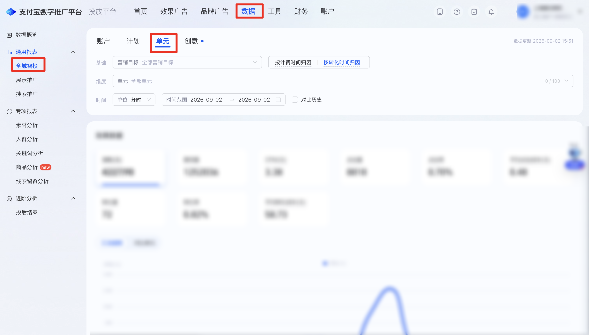
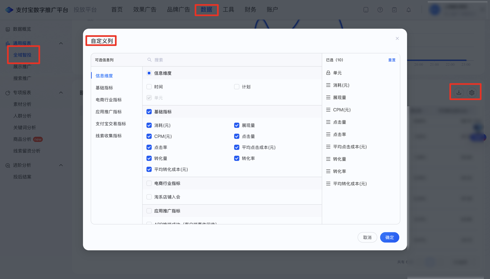

| 属性             | 值                                                         |
| ---------------- | ---------------------------------------------------------- |
| **连接器类型**   | `RPA 连接器`                                               |
| **连接器名称**   | `ODS_全域智投单元明细报表(支付宝RPA)`                      |
| **连接器代码**   | `rpa.conn.zhifubaotg.dls.domain.unit.detail.export`        |
| **操作类型**     | `文件导出`                                                 |
| **目标网页**     | `https://adops.alipay.com/report/intelligent-putin-report` |
| **适用场景**     | 使用代理商账号切换到委托人登录支付宝数字推广平台后进入全域智投报表，切换到单元 Tab 并点击分天，按可选时间范围经任务中心导出单元分天明细 CSV；明细区暂无数据时直接返回空结果 |
| **数据表名**     | `ods_rpa_zhifubaotg_dls_domain_unit_detail_export_du`      |
| **业务表名**     | `ODS_全域智投单元明细报表(支付宝RPA)`                      |

### 目标页面

> **取数路径**：支付宝数字推广平台—数据—通用报表—全域智投—单元（自定义列按页面实际分组全选；设置筛选后若明细区显示「暂无数据」则直接返回空结果，不再进入任务中心；有数据时下载任务中心导出的 CSV）
>
> **取数链接**：[https://adops.alipay.com/report/intelligent-putin-report](https://adops.alipay.com/report/intelligent-putin-report)





### 业务入参

| 字段 | 中文释义 | 数据类型 | 必填 | 默认值 | 说明 |
| ---- | -------- | -------- | ---- | ------ | ---- |
| `custom_date` | 日期类型 | `String` | 否 | — | 不传则跳过点选，读取页面默认起止日。与 `custom_start_date` / `custom_end_date` 同时传入时以本字段为准。可选值：`TODAY`（今日）/ `YESTERDAY`（昨日）/ `LAST_7_DAYS`（近7日）/ `LAST_30_DAYS`（近30日）/ `LAST_90_DAYS`（近90日）/ `CUSTOM`（自定义） |
| `custom_start_date` | 自定义起始日期 | `String` | 条件必填 | — | 仅 `custom_date` 为空或 `CUSTOM` 时生效。须与 `custom_end_date` 成对传入。格式：`YYYYMMDD` 或 `YYYY-MM-DD`；不得晚于结束日 |
| `custom_end_date` | 自定义结束日期 | `String` | 条件必填 | — | 仅 `custom_date` 为空或 `CUSTOM` 时生效。须与 `custom_start_date` 成对传入。格式：`YYYYMMDD` 或 `YYYY-MM-DD`；不得晚于今天；起止跨度不超过 90 天（含起止日） |

### 入参样例

快捷项（近 90 日）：

```json
{
  "custom_date": "LAST_90_DAYS"
}
```

快捷项与自定义日期同时传入（以快捷项为准）：

```json
{
  "custom_date": "LAST_90_DAYS",
  "custom_start_date": "20260516",
  "custom_end_date": "2026-08-13"
}
```

仅自定义日期：

```json
{
  "custom_start_date": "20260827",
  "custom_end_date": "2026-09-02"
}
```

不传日期，使用页面当前区间：

```json
{}
```

### 入参校验

```json-schema collapsed
{
  "$schema": "https://json-schema.org/draft/2020-12/schema",
  "title": "支付宝数字推广平台-全域智投单元分天明细导出 - 查询入参",
  "description": "使用代理商账号登录支付宝数字推广平台后进入全域智投报表，切换到单元 Tab 并按分天粒度，按可选时间范围经任务中心导出单元分天明细 CSV；明细区暂无数据时直接返回空结果",
  "type": "object",
  "properties": {
    "custom_date": {
      "type": "string",
      "enum": ["TODAY", "YESTERDAY", "LAST_7_DAYS", "LAST_30_DAYS", "LAST_90_DAYS", "CUSTOM", ""],
      "description": "日期类型；空字符串视为未传。与自定义日期同时传入时以本字段为准。可选值：TODAY（今日）/ YESTERDAY（昨日）/ LAST_7_DAYS（近7日）/ LAST_30_DAYS（近30日）/ LAST_90_DAYS（近90日）/ CUSTOM（自定义）"
    },
    "custom_start_date": {
      "type": "string",
      "description": "自定义起始日期，YYYYMMDD 或 YYYY-MM-DD；空字符串视为未传。仅 custom_date 为空或 CUSTOM 时生效，须与 custom_end_date 成对",
      "anyOf": [
        { "const": "" },
        { "pattern": "^\\d{8}$" },
        { "pattern": "^\\d{4}-\\d{2}-\\d{2}$" }
      ]
    },
    "custom_end_date": {
      "type": "string",
      "description": "自定义结束日期，YYYYMMDD 或 YYYY-MM-DD；空字符串视为未传。仅 custom_date 为空或 CUSTOM 时生效，须与 custom_start_date 成对；不得晚于今天，跨度不超过 90 天",
      "anyOf": [
        { "const": "" },
        { "pattern": "^\\d{8}$" },
        { "pattern": "^\\d{4}-\\d{2}-\\d{2}$" }
      ]
    }
  },
  "required": [],
  "additionalProperties": false,
  "allOf": [
    {
      "if": {
        "properties": {
          "custom_date": { "const": "CUSTOM" }
        },
        "required": ["custom_date"]
      },
      "then": {
        "required": ["custom_start_date", "custom_end_date"],
        "properties": {
          "custom_start_date": { "type": "string", "minLength": 1 },
          "custom_end_date": { "type": "string", "minLength": 1 }
        }
      }
    },
    {
      "if": {
        "anyOf": [
          { "not": { "required": ["custom_date"] } },
          {
            "properties": {
              "custom_date": { "enum": [""] }
            }
          }
        ]
      },
      "then": {
        "dependentRequired": {
          "custom_start_date": ["custom_end_date"],
          "custom_end_date": ["custom_start_date"]
        }
      }
    }
  ]
}
```

### 数据字段

出参为 `id` / `value` 结构：`value` 为导出 CSV 整行（中文表头），随页面自定义列全选结果变化。

| 字段 | 中文释义 | 数据类型 | 可为空 | 取数路径 | 示例 |
| ---- | -------- | -------- | ------ | -------- | ---- |
| `id` | 行号 | `Number` | 否 | 按导出行顺序编号 | `1` |
| `value` | 导出 CSV 行 | `Dict` | 否 | `CSV.0` | 见数据样例 |
| `taskId` | 任务 ID | `String` | 否 | 附加 | `dev****c93` (已脱敏) |
| `customStartDate` | 页面起始日期 | `String` | 否 | 页面筛选项回读 | 2026-06-05 |
| `customEndDate` | 页面结束日期 | `String` | 否 | 页面筛选项回读 | 2026-09-02 |
| `bizDate` | 业务日期 | `String` | 否 | 附加 | 20260902 |
| `accountId` | 授权 ID | `String` | 否 | 附加 | `1****4` (已脱敏) |

### 数据样例

```json
[
  {
    "id": 1,
    "value": {
      "日期": "2026-09-02",
      "单元": "****",
      "单元ID": "276****006",
      "计划": "****",
      "计划ID": "231****425",
      "消耗(元)": "679.22",
      "展现量": "309193",
      "CPM(元)": "2.20",
      "点击量": "970",
      "点击率": "0.31%",
      "平均点击成本(元)": "0.70",
      "转化量": "6",
      "转化率": "0.62%",
      "平均转化成本(元)": "113.21",
      "淘系店铺入会": "0.0",
      "APP唤端成功（客户端事件回传）": "0.0",
      "交易金额-收款账号PID": "1459.1999999999998",
      "交易金额-收款账号PID(3天)": "1459.1999999999998",
      "交易金额-收款账号PID(7天)": "1459.1999999999998",
      "交易笔数-收款账号PID": "6.0",
      "交易笔数-收款账号PID(3天)": "6.0",
      "交易笔数-收款账号PID(7天)": "6.0",
      "交易金额-收款账号PID(排除低客单)": "486.4",
      "交易金额-收款账号PID(排除低客单)(7天)": "486.4",
      "交易笔数-收款账号PID(排除低客单)": "2.0",
      "交易笔数-收款账号PID(排除低客单)(7 天)": "2.0",
      "留资推广": "0.0"
    },
    "bizDate": "20260902",
    "accountId": "1****4",
    "taskId": "dev****c93",
    "customStartDate": "2026-06-05",
    "customEndDate": "2026-09-02"
  }
]
```

---
