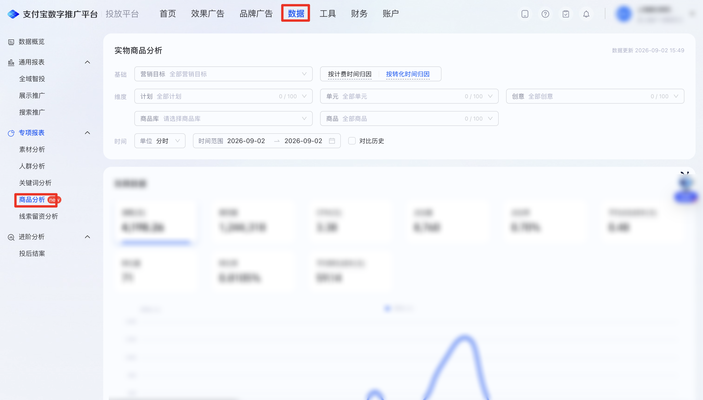
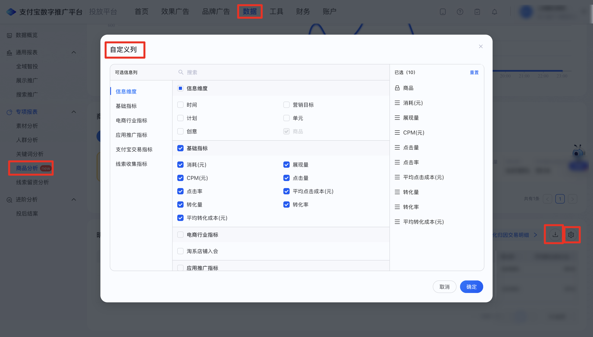

| 属性             | 值                                                                 |
| ---------------- | ------------------------------------------------------------------ |
| **连接器类型**   | `RPA 连接器`                                                       |
| **连接器名称**   | `ODS_商品分析实物明细报表(支付宝RPA)`                              |
| **连接器代码**   | `rpa.conn.zhifubaotg.dls.item.entity.export`                       |
| **操作类型**     | `文件导出`                                                         |
| **目标网页**     | `https://adops.alipay.com/report/commodity-analysis/list/physical` |
| **适用场景**     | 使用代理商账号切换到委托人登录支付宝数字推广平台后进入实物商品分析页，按必选营销目标与时间单位、可选归因与时间范围经任务中心导出实体明细 CSV；筛选后明细区暂无数据时直接返回空结果 |
| **数据表名**     | `ods_rpa_zhifubaotg_dls_item_entity_export_du`                     |
| **业务表名**     | `ODS_商品分析实物明细报表(支付宝RPA)`                              |

### 目标页面

> **取数路径**：支付宝数字推广平台—数据—专项报表—商品分析—实物商品分析—明细数据（自定义列按页面实际分组全选；设置筛选后若明细区显示「暂无数据」则直接返回空结果，不再进入任务中心；有数据时下载任务中心导出的 CSV）
>
> **取数链接**：[https://adops.alipay.com/report/commodity-analysis/list/physical](https://adops.alipay.com/report/commodity-analysis/list/physical)





### 业务入参

| 字段 | 中文释义 | 数据类型 | 必填 | 默认值 | 说明 |
| ---- | -------- | -------- | ---- | ------ | ---- |
| `marketing_goal` | 营销目标 | `String` | 是 | — | 营销目标搜索关键字。 |
| `time_unit` | 时间单位 | `String` | 是 | — | 可选值：`HOUR`（分时）/ `DAY`（分天）。`HOUR` 时不支持 `LAST_30_DAYS` / `LAST_90_DAYS`，自定义跨度不超过 7 天 |
| `attribution_type` | 归因类型 | `String` | 否 | — | 不传则跳过点选，保留页面当前归因。可选值：`BILLING_TIME`（按计费时间归因）/ `CONVERSION_TIME`（按转化时间归因） |
| `custom_date` | 日期类型 | `String` | 否 | — | 不传则跳过点选，读取页面默认起止日。只传自定义日期、未传本字段时视为 `CUSTOM`。与 `custom_start_date` / `custom_end_date` 同时传入时以本字段为准。可选值：`TODAY`（今日）/ `YESTERDAY`（昨日）/ `LAST_7_DAYS`（近7日）/ `LAST_30_DAYS`（近30日）/ `LAST_90_DAYS`（近90日）/ `CUSTOM`（自定义） |
| `custom_start_date` | 自定义起始日期 | `String` | 条件必填 | — | `custom_date`为`CUSTOM` 时生效。须与 `custom_end_date` 成对传入。格式：`YYYYMMDD` 或 `YYYY-MM-DD`；不得晚于结束日 |
| `custom_end_date` | 自定义结束日期 | `String` | 条件必填 | — | `custom_date` 为`CUSTOM` 时生效。须与 `custom_start_date` 成对传入。格式：`YYYYMMDD` 或 `YYYY-MM-DD`；不得晚于今天；`DAY` 跨度不超过 90 天、`HOUR` 跨度不超过 7 天（均含起止日） |

### 入参样例

分天 + 近 7 日 + 按转化时间归因（常用）：

```json
{
  "marketing_goal": "电商",
  "time_unit": "DAY",
  "attribution_type": "CONVERSION_TIME",
  "custom_date": "LAST_7_DAYS"
}
```

快捷项与自定义日期同时传入（以快捷项为准）：

```json
{
  "marketing_goal": "电商",
  "time_unit": "DAY",
  "custom_date": "LAST_7_DAYS",
  "custom_start_date": "20260516",
  "custom_end_date": "2026-08-13"
}
```

分时 + 今日：

```json
{
  "marketing_goal": "电商",
  "time_unit": "HOUR",
  "custom_date": "TODAY"
}
```

自定义日期：

```json
{
  "marketing_goal": "电商",
  "time_unit": "DAY",
  "custom_date": "CUSTOM",
  "custom_start_date": "20260827",
  "custom_end_date": "2026-09-02"
}
```

仅必填项，使用页面当前日期区间与归因：

```json
{
  "marketing_goal": "电商",
  "time_unit": "DAY"
}
```

### 入参校验

```json-schema collapsed
{
  "$schema": "https://json-schema.org/draft/2020-12/schema",
  "title": "支付宝数字推广平台-实物商品分析实体明细导出 - 查询入参",
  "description": "使用代理商账号登录支付宝数字推广平台后进入实物商品分析页，按必选营销目标与时间单位、可选归因与时间范围经任务中心导出实体明细 CSV；明细区暂无数据时直接返回空结果",
  "type": "object",
  "properties": {
    "marketing_goal": {
      "type": "string",
      "minLength": 1,
      "description": "营销目标搜索关键字。页面按名称/ID 搜索，0 条命中报错，≥1 条点选第一项"
    },
    "time_unit": {
      "type": "string",
      "enum": ["HOUR", "DAY"],
      "description": "时间单位。可选值：HOUR（分时）/ DAY（分天）。HOUR 时不支持 LAST_30_DAYS / LAST_90_DAYS，自定义跨度不超过 7 天"
    },
    "attribution_type": {
      "type": "string",
      "enum": ["BILLING_TIME", "CONVERSION_TIME", ""],
      "description": "归因类型；空字符串视为未传，跳过点选。可选值：BILLING_TIME（按计费时间归因）/ CONVERSION_TIME（按转化时间归因）"
    },
    "custom_date": {
      "type": "string",
      "enum": ["TODAY", "YESTERDAY", "LAST_7_DAYS", "LAST_30_DAYS", "LAST_90_DAYS", "CUSTOM", ""],
      "description": "日期类型；空字符串视为未传。与自定义日期同时传入时以本字段为准。可选值：TODAY（今日）/ YESTERDAY（昨日）/ LAST_7_DAYS（近7日）/ LAST_30_DAYS（近30日）/ LAST_90_DAYS（近90日）/ CUSTOM（自定义）"
    },
    "custom_start_date": {
      "type": "string",
      "description": "自定义起始日期，YYYYMMDD 或 YYYY-MM-DD；空字符串视为未传。仅 custom_date 为空或 CUSTOM 时生效，须与 custom_end_date 成对",
      "anyOf": [
        { "const": "" },
        { "pattern": "^\\d{8}$" },
        { "pattern": "^\\d{4}-\\d{2}-\\d{2}$" }
      ]
    },
    "custom_end_date": {
      "type": "string",
      "description": "自定义结束日期，YYYYMMDD 或 YYYY-MM-DD；空字符串视为未传。仅 custom_date 为空或 CUSTOM 时生效，须与 custom_start_date 成对；不得晚于今天；DAY 跨度不超过 90 天、HOUR 跨度不超过 7 天",
      "anyOf": [
        { "const": "" },
        { "pattern": "^\\d{8}$" },
        { "pattern": "^\\d{4}-\\d{2}-\\d{2}$" }
      ]
    }
  },
  "required": ["marketing_goal", "time_unit"],
  "additionalProperties": false,
  "allOf": [
    {
      "if": {
        "properties": {
          "custom_date": { "const": "CUSTOM" }
        },
        "required": ["custom_date"]
      },
      "then": {
        "required": ["custom_start_date", "custom_end_date"],
        "properties": {
          "custom_start_date": { "type": "string", "minLength": 1 },
          "custom_end_date": { "type": "string", "minLength": 1 }
        }
      }
    },
    {
      "if": {
        "anyOf": [
          { "not": { "required": ["custom_date"] } },
          {
            "properties": {
              "custom_date": { "enum": [""] }
            }
          }
        ]
      },
      "then": {
        "dependentRequired": {
          "custom_start_date": ["custom_end_date"],
          "custom_end_date": ["custom_start_date"]
        }
      }
    },
    {
      "if": {
        "properties": {
          "time_unit": { "const": "HOUR" }
        },
        "required": ["time_unit"]
      },
      "then": {
        "properties": {
          "custom_date": {
            "enum": ["TODAY", "YESTERDAY", "LAST_7_DAYS", "CUSTOM", ""]
          }
        }
      }
    }
  ]
}
```

### 数据字段

出参为 `id` / `value` 结构：`value` 为导出 CSV 整行（中文表头），随页面自定义列全选结果变化。

| 字段 | 中文释义 | 数据类型 | 可为空 | 取数路径 | 示例 |
| ---- | -------- | -------- | ------ | -------- | ---- |
| `id` | 行号 | `Number` | 否 | 按导出行顺序编号 | `1` |
| `value` | 导出 CSV 行 | `Dict` | 否 | `CSV.0` | 见数据样例 |
| `taskId` | 任务 ID | `String` | 否 | 附加 | `dev****e18` (已脱敏) |
| `customStartDate` | 页面起始日期 | `String` | 否 | 页面筛选项回读 | 2026-08-27 |
| `customEndDate` | 页面结束日期 | `String` | 否 | 页面筛选项回读 | 2026-09-02 |
| `bizDate` | 业务日期 | `String` | 否 | 附加 | 20260902 |
| `accountId` | 授权 ID | `String` | 否 | 附加 | `1****4` (已脱敏) |

### 数据样例

```json
[
  {
      "id": 1,
      "value": {
          "日期": "2026-09-02",
          "商品No": "619****683",
          "商品名称": "****",
          "营销目标code": "tag901200",
          "营销目标名称": "**店铺商品推广",
          "计划ID": "231****425",
          "计划名称": "****",
          "单元ID": "276****006",
          "单元名称": "****",
          "创意ID": "408****724",
          "创意名称": "****",
          "商品库ID": "APPXP_TMALL_GOODS",
          "商品库名称": "****",
          "消耗(元)": "0.00",
          "展现量": "166",
          "CPM(元)": "0.00",
          "点击量": "0",
          "点击率": "0.00%",
          "平均点击成本(元)": "0.00",
          "转化量": "0",
          "转化率": "0.00%",
          "平均转化成本(元)": "0.00",
          "交易金额-收款账号PID": "0.00",
          "ROI-收款账号PID": "0.00",
          "淘系店铺入会": "0",
          "APP内下单(API回传)(15天)": "0",
          "APP内下单金额(AP回传)(15天)": "0.00",
          "APP内退款(API回传)(15天)": "0",
          "APP内退款金额(API回传)(15天)": "0.00",
          "每日必抢小程序内支付交易ROI": "0",
          "APP内支付(API回传)(15天)": "0",
          "交易ROI-聚合页展位ID": "0.0000",
          "APP唤端成功（客户端事件回传）": "0",
          "交易金额-收款账号PID(3天)": "0.00",
          "交易金额-收款账号PID(7天)": "0.00",
          "交易金额-收款账号PID(15天)": "0.00",
          "交易金额-收款账号PID(30天)": "0.00",
          "交易笔数-收款账号PID": "0",
          "交易笔数-收款账号PID(3天)": "0",
          "交易笔数-收款账号PID(7天)": "0",
          "交易笔数-收款账号PID(15天)": "0",
          "交易笔数-收款账号PID(30天)": "0",
          "ROI(3天)-收款账号PID": "0",
          "ROI(7天)-收款账号PID": "-",
          "ROI(15天)-收款账号PID": "0.0000",
          "交易金额-收款账号PID(排除低客单)": "0.00",
          "交易金额-收款账号PID(排除低客单)(7天)": "0.00",
          "交易金额-收款账号PID(排除低客单)(15天)": "0.00",
          "交易笔数-收款账号PID(排除低客单)": "0",
          "交易笔数-收款账号PID(排除低客单)(7 天)": "0",
          "交易笔数-收款账号PID(排除低客单)(15天)": "0",
          "ROI-收款账号PID(排除低客单)": "0.0000",
          "ROI(7天)-收款账号PID(排除低客单)": "0.0000",
          "ROI(15天)-收款账号PID(排除低客单)": "0.0000",
          "交易金额-收款账号PID(曝光归因)": "0.00",
          "交易金额(3天)-收款账号PID(曝光归因)": "0.00",
          "交易金额(7天)-收款账号PID(曝光归因)": "0.00",
          "交易金额(15天)-收款账号PID(曝光归因)": "0.00",
          "交易笔数-收款账号PID(曝光归因)": "0",
          "交易笔数(3天)-收款账号PID(曝光归因)": "0",
          "交易笔数(7天)-收款账号PID(曝光归因)": "0",
          "交易笔数(15天)-收款账号PID(曝光归因)": "0",
          "ROI-收款账号PID(曝光归因)": "0.00",
          "ROI(3天)-收款账号PID(曝光归因)": "0.00",
          "ROI(7天)-收款账号PID(曝光归因)": "0.00",
          "ROI(15天)-收款账号PID(曝光归因)": "0.00",
          "交易金额(15天)-支付宝账号收款订单": "0.00",
          "支付宝账号收款订单 - 交易笔数(15天)": "0",
          "ROI-支付宝收款订单": "0.00",
          "ROI(3天)-支付宝收款订单": "0.00",
          "ROI(7天)-支付宝收款订单": "0.00",
          "留资推广": "0",
          "交易笔数(API回传)(15天)": "0"
      },
      "bizDate": "20260902",
      "accountId": "1****4",
      "taskId": "dev****e18",
      "customStartDate": "2026-08-27",
      "customEndDate": "2026-09-02"
  }
]
```

---
